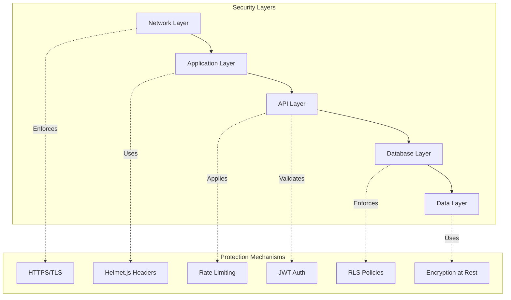
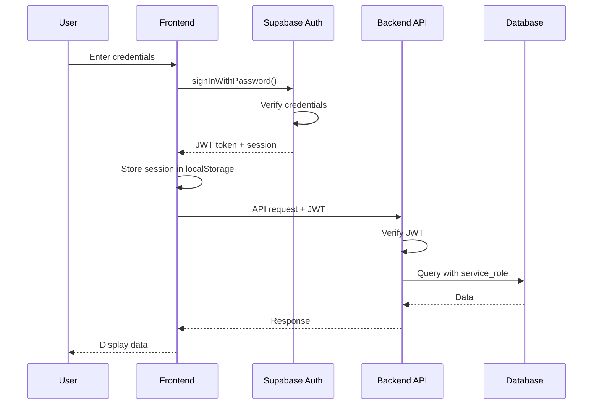
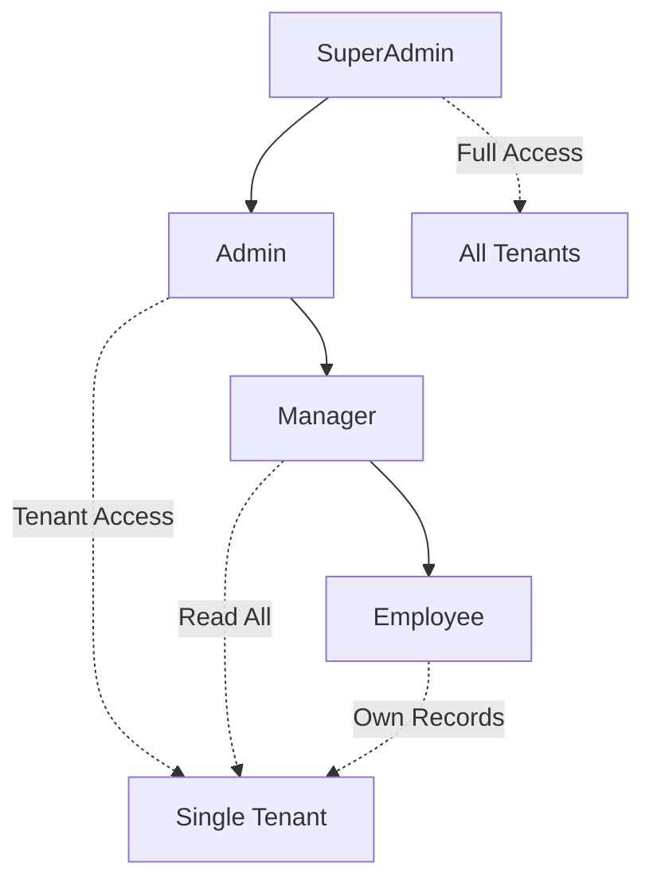
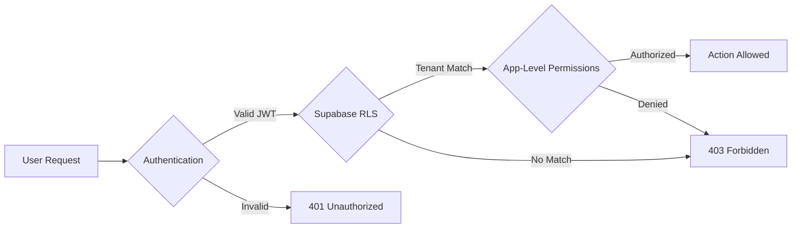

# Aisha CRM Security & Compliance Manual - Part 1

**Version:** 1.0  
**Last Updated:** November 15, 2025  
**Audience:** Security Administrators, DevOps Engineers, System Administrators

---

## Table of Contents

### Part 1: Architecture & Authentication

#### Chapter 1: Security Overview
- [1.1 Security Architecture](#11-security-architecture)
- [1.2 Security Principles](#12-security-principles)
- [1.3 Threat Model](#13-threat-model)
- [1.4 Security Layers](#14-security-layers)

#### Chapter 2: Authentication & Authorization
- [2.1 Authentication Configuration](#21-authentication-configuration)
- [2.2 Supabase Auth Integration](#22-supabase-auth-integration)
- [2.3 JWT & Session Management](#23-jwt--session-management)
- [2.4 Role-Based Access Control (RBAC)](#24-role-based-access-control-rbac)
- [2.5 User Provisioning](#25-user-provisioning)

#### Chapter 3: Row-Level Security (RLS)
- [3.1 RLS Overview](#31-rls-overview)
- [3.2 RLS Implementation](#32-rls-implementation)
- [3.3 RLS Policies](#33-rls-policies)
- [3.4 Tenant Isolation](#34-tenant-isolation)
- [3.5 RLS Testing & Verification](#35-rls-testing--verification)

#### Chapter 4: Permission System
- [4.1 Permission Architecture](#41-permission-architecture)
- [4.2 Role Definitions](#42-role-definitions)
- [4.3 Permission Enforcement](#43-permission-enforcement)
- [4.4 Custom Permissions](#44-custom-permissions)

#### Chapter 5: API Security
- [5.1 API Authentication](#51-api-authentication)
- [5.2 API Key Management](#52-api-key-management)
- [5.3 Rate Limiting](#53-rate-limiting)
- [5.4 CORS Configuration](#54-cors-configuration)

#### Chapter 6: Data Protection
- [6.1 Data Encryption](#61-data-encryption)
- [6.2 Secrets Management](#62-secrets-management)
- [6.3 Email Uniqueness](#63-email-uniqueness)
- [6.4 Immutable Accounts](#64-immutable-accounts)

---

## Chapter 1: Security Overview

### 1.1 Security Architecture

Aisha CRM implements a **defense-in-depth** security model with multiple layers of protection:



**Key Components:**

| Layer | Technology | Purpose |
|-------|-----------|---------|
| **Network** | HTTPS/TLS 1.3 | Encrypted data transmission |
| **Application** | Helmet.js | Security headers (XSS, clickjacking protection) |
| **API** | JWT + Rate Limiting | Authentication, request throttling |
| **Database** | Supabase RLS | Row-level data isolation |
| **Data** | AES-256 | Encryption at rest |

---

### 1.2 Security Principles

#### Defense in Depth
Multiple layers of security ensure that if one layer is compromised, others remain intact.

#### Least Privilege
Users and services have only the minimum permissions necessary to perform their functions.

#### Zero Trust
No implicit trust; every request is authenticated and authorized.

#### Tenant Isolation
Complete data separation between tenants using UUID-based identification.

#### Audit Everything
All security-relevant actions are logged to `audit_log` table.

---

### 1.3 Threat Model

#### Identified Threats:

| Threat | Likelihood | Impact | Mitigation |
|--------|-----------|--------|-----------|
| **SQL Injection** | Low | Critical | Parameterized queries, input validation |
| **Cross-Site Scripting (XSS)** | Medium | High | Helmet.js CSP, input sanitization |
| **Cross-Tenant Data Access** | Medium | Critical | RLS policies, tenant validation |
| **Brute Force Attacks** | High | Medium | Rate limiting, account lockout |
| **API Key Exposure** | Medium | High | Secrets manager, rotation policy |
| **Session Hijacking** | Low | High | Secure cookies, JWT expiration |
| **Insider Threats** | Low | Critical | Audit logging, immutable accounts |

---

### 1.4 Security Layers

#### Network Security
```
Internet → Cloudflare (DDoS) → Load Balancer → Docker Network → Containers
```

- ✅ HTTPS enforced (TLS 1.3)
- ✅ DDoS protection via hosting provider
- ✅ Internal Docker network isolation

#### Application Security
```javascript
// Helmet.js configuration
app.use(helmet({
  contentSecurityPolicy: {
    directives: {
      defaultSrc: ["'self'"],
      styleSrc: ["'self'", "'unsafe-inline'"],
      scriptSrc: ["'self'"],
      imgSrc: ["'self'", "data:", "https:"],
    }
  },
  hsts: {
    maxAge: 31536000,
    includeSubDomains: true,
    preload: true
  }
}));
```

#### API Security
- JWT-based authentication
- Rate limiting: 100 requests/minute per IP
- CORS restricted to allowed origins only

#### Database Security
- PostgreSQL 15+ with Supabase
- Row-Level Security (RLS) enabled on all tables
- Service role key for backend, anon key blocked

---

## Chapter 2: Authentication & Authorization

### 2.1 Authentication Configuration

Aisha CRM uses **Supabase Auth** for authentication with JWT tokens.

#### Environment Variables

**Backend `.env`:**
```bash
# JWT Configuration
JWT_SECRET=<128-character-hex-string>
JWT_EXPIRES_IN=24h

# Supabase Configuration
SUPABASE_URL=https://your-project.supabase.co
SUPABASE_SERVICE_ROLE_KEY=<service-role-key>
SUPABASE_ANON_KEY=<anon-key>
```

**Frontend `.env`:**
```bash
VITE_SUPABASE_URL=https://your-project.supabase.co
VITE_SUPABASE_ANON_KEY=<anon-key>
```

💡 **TIP:** Generate strong JWT secrets:
```powershell
node -e "console.log(require('crypto').randomBytes(64).toString('hex'))"
```

---

### 2.2 Supabase Auth Integration

#### Authentication Flow



#### Frontend Authentication

**`src/api/supabaseClient.js`:**
```javascript
import { createClient } from '@supabase/supabase-js';

const supabaseUrl = import.meta.env.VITE_SUPABASE_URL;
const supabaseAnonKey = import.meta.env.VITE_SUPABASE_ANON_KEY;

export const supabase = createClient(supabaseUrl, supabaseAnonKey, {
  auth: {
    autoRefreshToken: true,
    persistSession: true,
    detectSessionInUrl: true
  }
});
```

#### Sign In
```javascript
const { data, error } = await supabase.auth.signInWithPassword({
  email: 'user@example.com',
  password: 'secure-password'
});

if (error) {
  console.error('Login failed:', error.message);
} else {
  console.log('User logged in:', data.user);
}
```

#### Sign Out
```javascript
const { error } = await supabase.auth.signOut();
```

#### Get Current User
```javascript
const { data: { user } } = await supabase.auth.getUser();
```

---

### 2.3 JWT & Session Management

#### JWT Structure
```json
{
  "sub": "user-uuid",
  "email": "user@example.com",
  "role": "authenticated",
  "iat": 1700000000,
  "exp": 1700086400
}
```

#### Token Validation (Backend)

**`backend/middleware/auth.js`:**
```javascript
import jwt from 'jsonwebtoken';

export function validateJWT(req, res, next) {
  const token = req.headers.authorization?.replace('Bearer ', '');
  
  if (!token) {
    return res.status(401).json({ 
      status: 'error', 
      message: 'Authentication required' 
    });
  }
  
  try {
    const decoded = jwt.verify(token, process.env.JWT_SECRET);
    req.user = decoded;
    next();
  } catch (error) {
    return res.status(401).json({ 
      status: 'error', 
      message: 'Invalid or expired token' 
    });
  }
}
```

#### Session Configuration

| Setting | Value | Purpose |
|---------|-------|---------|
| **Token Expiry** | 24 hours | Balance security and UX |
| **Refresh Token** | 30 days | Auto-refresh sessions |
| **Auto Refresh** | Enabled | Seamless re-authentication |
| **Persist Session** | localStorage | Survive page reloads |

🚨 **SECURITY WARNING:** Never expose `JWT_SECRET` or `SUPABASE_SERVICE_ROLE_KEY` in client-side code.

---

### 2.4 Role-Based Access Control (RBAC)

#### Role Hierarchy



#### Role Definitions

##### 1. SuperAdmin
- **Scope:** Global (all tenants)
- **Permissions:**
  - ✅ Create/edit/delete ANY user
  - ✅ Assign ANY role (including superadmin)
  - ✅ Manage ALL tenants
  - ✅ Access ALL data across tenants
  - ✅ Toggle CRM access for anyone
  - ✅ No tenant restrictions

**Database:** `users` table (no `tenant_id`)

##### 2. Admin
- **Scope:** Single tenant
- **Permissions:**
  - ✅ Create/edit employees in their tenant
  - ✅ Assign roles: Manager, Employee (NOT admin/superadmin)
  - ✅ Toggle CRM access for tenant users
  - ✅ Manage tenant settings
  - ✅ View/edit ALL data in their tenant
  - ❌ Cannot edit other tenants
  - ❌ Cannot assign admin/superadmin roles
  - ❌ Cannot elevate their own privileges

**Database:** `employees` table (with `tenant_id`)

##### 3. Manager
- **Scope:** Single tenant (read-only for users)
- **Permissions:**
  - ✅ View all CRM data for their tenant
  - ✅ View all employees in their tenant
  - ✅ Manage opportunities, contacts, accounts
  - ❌ Cannot create/edit/delete employees
  - ❌ Cannot toggle CRM access
  - ❌ Cannot assign or modify permissions

**Database:** `employees` table (with `tenant_id`)

##### 4. Employee
- **Scope:** Single tenant (own records)
- **Permissions:**
  - ✅ View/edit THEIR OWN records only
  - ✅ Create contacts, leads, opportunities assigned to them
  - ✅ Log activities and update their pipeline
  - ❌ Cannot see other employees' data (unless shared)
  - ❌ Cannot create/edit other employees
  - ❌ Cannot modify permissions

**Database:** `employees` table (with `tenant_id`)

---

### 2.5 User Provisioning

#### Creating Users with CRM Access

**Admin creates employee with CRM access:**

```javascript
async function grantCRMAccess(employee) {
  // 1. Create Supabase auth account
  const { data: authUser, error } = await supabase.auth.admin.createUser({
    email: employee.email,
    email_confirm: true,
    user_metadata: {
      first_name: employee.first_name,
      last_name: employee.last_name,
      role: employee.role
    }
  });
  
  if (error) throw error;
  
  // 2. Update employee record with auth ID
  await pgPool.query(
    `UPDATE employees 
     SET metadata = jsonb_set(
       COALESCE(metadata, '{}'::jsonb),
       '{crm_access}',
       'true'
     ),
     metadata = jsonb_set(
       metadata,
       '{supabase_auth_id}',
       $2
     )
     WHERE id = $1`,
    [employee.id, JSON.stringify(authUser.user.id)]
  );
  
  // 3. Send welcome email
  await sendEmail({
    to: employee.email,
    subject: 'Welcome to Aisha CRM',
    template: 'crm_access_granted',
    data: {
      firstName: employee.first_name,
      loginUrl: process.env.FRONTEND_URL,
      temporaryPassword: '(sent separately via Supabase)'
    }
  });
  
  // 4. Log access grant
  await pgPool.query(
    `INSERT INTO audit_log (action, user_id, target_user_id, details, tenant_id)
     VALUES ($1, $2, $3, $4, $5)`,
    [
      'CRM_ACCESS_GRANTED',
      req.user.id,
      employee.id,
      JSON.stringify({ role: employee.role }),
      employee.tenant_id
    ]
  );
}
```

#### Revoking CRM Access

```javascript
async function revokeCRMAccess(employee) {
  // 1. Ban user in Supabase Auth
  const authId = employee.metadata?.supabase_auth_id;
  if (authId) {
    await supabase.auth.admin.updateUserById(authId, {
      banned: true
    });
  }
  
  // 2. Update employee record
  await pgPool.query(
    `UPDATE employees 
     SET metadata = jsonb_set(
       metadata,
       '{crm_access}',
       'false'
     )
     WHERE id = $1`,
    [employee.id]
  );
  
  // 3. Notify user
  await sendEmail({
    to: employee.email,
    subject: 'CRM Access Revoked',
    template: 'access_revoked'
  });
  
  // 4. Log revocation
  await pgPool.query(
    `INSERT INTO audit_log (action, user_id, target_user_id, tenant_id)
     VALUES ($1, $2, $3, $4)`,
    ['CRM_ACCESS_REVOKED', req.user.id, employee.id, employee.tenant_id]
  );
}
```

---

## Chapter 3: Row-Level Security (RLS)

### 3.1 RLS Overview

**Row-Level Security (RLS)** is PostgreSQL's built-in feature that restricts database rows based on user context. In Aisha CRM, RLS ensures **tenant isolation** and **employee-level data filtering**.

#### Why RLS?

✅ **Defense in Depth:** Even if backend is compromised, RLS prevents unauthorized data access  
✅ **Tenant Isolation:** Users cannot access other tenants' data  
✅ **Employee Filtering:** Employees see only their assigned records  
✅ **Supabase Best Practice:** Required for secure PostgREST API usage

---

### 3.2 RLS Implementation

#### Migration Overview

All RLS policies are defined in `backend/migrations/023_comprehensive_rls_security.sql`.

**Tables with RLS Enabled:** 48+ tables including:
- Core CRM: `accounts`, `contacts`, `leads`, `opportunities`, `activities`
- System: `users`, `employees`, `tenant`, `audit_log`, `system_logs`
- Configuration: `modulesettings`, `api_key`, `field_customization`
- Business: `workflow`, `cash_flow`, `bizdev_sources`, `notifications`

#### RLS Status Check

```sql
-- View RLS status for all tables
SELECT 
  tablename,
  rowsecurity AS rls_enabled
FROM pg_tables
WHERE schemaname = 'public'
ORDER BY tablename;
```

Expected: All tables show `rls_enabled = true`

---

### 3.3 RLS Policies

#### Policy Categories

##### 1. Backend-Only Tables (Locked)
**Tables:** `tenant`, `modulesettings`, `api_key`, `apikey`

```sql
-- Example: api_key table
REVOKE ALL ON public.api_key FROM PUBLIC, anon, authenticated;

-- Only service_role (backend) can access
GRANT SELECT, INSERT, UPDATE, DELETE ON public.api_key TO service_role;
```

**Purpose:** Sensitive configuration accessible only via backend API with service_role key.

##### 2. Write-Only Logging Tables
**Tables:** `performance_logs`, `system_logs`

```sql
-- Authenticated users can INSERT logs
GRANT INSERT ON public.performance_logs TO authenticated;

-- Only service_role can SELECT
GRANT SELECT ON public.performance_logs TO service_role;

CREATE POLICY "authenticated_insert_logs" ON performance_logs
  FOR INSERT TO authenticated
  WITH CHECK (true);
```

**Purpose:** Allow clients to log performance data, but only backend can query logs.

##### 3. Tenant-Scoped Tables
**Tables:** `accounts`, `contacts`, `leads`, `opportunities`, `activities`, `notifications`, etc.

```sql
-- Users see only their tenant's data
CREATE POLICY "tenant_isolation_contacts" ON contacts
  FOR ALL USING (
    tenant_id = current_setting('app.current_tenant_id', true)::text
  );
```

**Purpose:** Complete data isolation between tenants.

##### 4. Employee-Level Filtering
**For Employee role:** See only records where they are the owner.

```sql
CREATE POLICY "employee_own_records" ON contacts
  FOR SELECT USING (
    -- Managers/Admins see everything in their tenant
    EXISTS (
      SELECT 1 FROM employees 
      WHERE id = current_setting('app.current_user_id', true)::uuid
      AND tenant_id = contacts.tenant_id
      AND role IN ('manager', 'admin', 'superadmin')
    )
    OR
    -- Employees see only their records
    owner_id = current_setting('app.current_user_id', true)::uuid
  );
```

---

### 3.4 Tenant Isolation

#### Tenant Identification

🚨 **CRITICAL:** Aisha CRM uses **UUID-based tenant IDs**, NOT slugs.

**Correct:**
```javascript
const tenantId = 'f47ac10b-58cc-4372-a567-0e02b2c3d479'; // UUID
```

**Incorrect:**
```javascript
const tenantId = 'acme-corp'; // ❌ Legacy slug, not supported
```

#### Setting Tenant Context

**Backend Middleware (`backend/middleware/validateTenant.js`):**

```javascript
export async function validateTenantAccess(req, res, next) {
  const tenantId = req.query.tenant_id || req.body.tenant_id;
  
  if (!tenantId) {
    return res.status(400).json({ 
      status: 'error', 
      message: 'tenant_id is required' 
    });
  }
  
  // Validate UUID format
  const uuidRegex = /^[0-9a-f]{8}-[0-9a-f]{4}-[0-9a-f]{4}-[0-9a-f]{4}-[0-9a-f]{12}$/i;
  if (!uuidRegex.test(tenantId)) {
    return res.status(400).json({ 
      status: 'error', 
      message: 'Invalid tenant_id format (must be UUID)' 
    });
  }
  
  // Set tenant context for RLS policies
  await pgPool.query(`SET app.current_tenant_id = $1`, [tenantId]);
  
  req.tenantId = tenantId;
  next();
}
```

#### Tenant Verification Query

```sql
-- Verify tenant exists and is active
SELECT id, name, slug, status
FROM tenant
WHERE id = 'f47ac10b-58cc-4372-a567-0e02b2c3d479'::uuid;
```

---

### 3.5 RLS Testing & Verification

#### Test 1: Verify RLS is Enabled

```sql
-- Should return 0 rows (all tables have RLS)
SELECT tablename
FROM pg_tables
WHERE schemaname = 'public' 
  AND rowsecurity = false;
```

#### Test 2: Count RLS Policies

```sql
-- Should return ~48+ policies
SELECT tablename, COUNT(*) as policy_count
FROM pg_policies
WHERE schemaname = 'public'
GROUP BY tablename
ORDER BY policy_count DESC;
```

#### Test 3: Test Tenant Isolation

**Setup:**
```sql
-- Create test data in two tenants
INSERT INTO contacts (id, tenant_id, email, first_name, last_name)
VALUES 
  (gen_random_uuid(), 'tenant-a-uuid', 'user@tenant-a.com', 'Alice', 'A'),
  (gen_random_uuid(), 'tenant-b-uuid', 'user@tenant-b.com', 'Bob', 'B');
```

**Test with Tenant A context:**
```sql
SET app.current_tenant_id = 'tenant-a-uuid';

-- Should return ONLY Alice (tenant A)
SELECT * FROM contacts;
```

**Test with Tenant B context:**
```sql
SET app.current_tenant_id = 'tenant-b-uuid';

-- Should return ONLY Bob (tenant B)
SELECT * FROM contacts;
```

#### Test 4: Verify Backend Access

**Backend uses `service_role` key, which bypasses RLS:**

```javascript
// Backend API call (uses service_role)
const { data, error } = await pgPool.query(
  'SELECT * FROM contacts WHERE tenant_id = $1',
  [tenantId]
);
// ✅ Should return all contacts for tenant (RLS bypassed)
```

#### Test 5: Verify Anon Key Blocked

**Direct Supabase client with `anon` key should be blocked:**

```javascript
// Frontend direct query (uses anon key - BLOCKED)
const { data, error } = await supabase
  .from('contacts')
  .select('*');
// ❌ Should return empty or error (RLS blocks anon access)
```

---

## Chapter 4: Permission System

### 4.1 Permission Architecture

Aisha CRM uses a **hybrid authorization model**:

1. **Supabase RLS:** Database-level tenant isolation and data filtering
2. **App-Level Checks:** UI/feature access and role-based permissions



#### Why Hybrid?

| Aspect | Supabase RLS | App-Level Checks |
|--------|-------------|------------------|
| **Tenant Data Isolation** | ✅ Perfect | ❌ Requires code |
| **Role-Based UI** | ❌ Clunky | ✅ Flexible |
| **Fine-Grained Permissions** | ❌ Complex SQL | ✅ Simple JS |
| **Audit Logging** | ❌ Limited | ✅ Full control |
| **Defense in Depth** | ✅ Safety net | ✅ Primary control |

**Best Practice:** Use RLS for "what data can you see" and app-level for "what actions can you take."

---

### 4.2 Role Definitions

See **Chapter 2.4** for complete role definitions. Summary:

| Role | Scope | Key Permissions |
|------|-------|----------------|
| **SuperAdmin** | Global | All tenants, all actions |
| **Admin** | Single Tenant | Manage users (not admins), full tenant access |
| **Manager** | Single Tenant | Read-only users, full data access |
| **Employee** | Single Tenant | Own records only |

---

### 4.3 Permission Enforcement

#### Frontend Permission Checks

**`src/utils/permissions.js`:**

```javascript
/**
 * Check if user can assign CRM access
 */
export function canAssignCRMAccess(user) {
  return user?.role === 'superadmin' || user?.role === 'admin';
}

/**
 * Check if user can edit employee
 */
export function canEditEmployee(user, targetEmployee = null) {
  if (user?.role === 'superadmin') return true;
  
  if (user?.role === 'admin') {
    // Admins can edit employees in their tenant
    if (!targetEmployee) return true;
    return user.tenant_id === targetEmployee.tenant_id;
  }
  
  return false;
}

/**
 * Check if user can assign role
 */
export function canAssignRole(user, targetRole) {
  if (user?.role === 'superadmin') {
    return true; // Can assign any role
  }
  
  if (user?.role === 'admin') {
    // Admins cannot assign admin or superadmin roles
    return !['admin', 'superadmin'].includes(targetRole);
  }
  
  return false;
}

/**
 * Validate user permissions before action
 */
export function validateUserPermissions(currentUser, targetUser, action) {
  // SuperAdmin can do anything
  if (currentUser.role === 'superadmin') {
    return { valid: true };
  }
  
  // Admin checks
  if (currentUser.role === 'admin') {
    if (action === 'create' || action === 'update') {
      // Cannot create/modify admins or superadmins
      if (['admin', 'superadmin'].includes(targetUser.role)) {
        return {
          valid: false,
          error: 'Admins cannot create or modify admin/superadmin accounts'
        };
      }
      
      // Can only manage users in their tenant
      if (targetUser.tenant_id !== currentUser.tenant_id) {
        return {
          valid: false,
          error: 'You can only manage users within your tenant'
        };
      }
    }
    
    return { valid: true };
  }
  
  // Managers and Employees cannot manage users
  return {
    valid: false,
    error: 'You do not have permission to manage users'
  };
}
```

#### Using Permissions in UI

**Example: User Management Page**

```jsx
import { canAssignCRMAccess, canEditEmployee, validateUserPermissions } from '@/utils/permissions';

export default function UsersPage() {
  const { user: currentUser } = useUser();
  
  const handleCreateUser = (newUser) => {
    // Validate before submission
    const validation = validateUserPermissions(currentUser, newUser, 'create');
    
    if (!validation.valid) {
      toast.error(validation.error);
      return;
    }
    
    // Proceed with creation
    createUser(newUser);
  };
  
  return (
    <div>
      {/* Show "Add User" only for admins/superadmins */}
      {canEditEmployee(currentUser) && (
        <Button onClick={() => setShowDialog(true)}>Add User</Button>
      )}
      
      {/* User list */}
      {employees.map(employee => (
        <div key={employee.id}>
          <p>{employee.name}</p>
          
          {/* Show CRM Access toggle only for admins/superadmins */}
          {canAssignCRMAccess(currentUser) && (
            <Switch
              checked={employee.metadata?.crm_access}
              onCheckedChange={(value) => toggleCRMAccess(employee, value)}
              disabled={!canEditEmployee(currentUser, employee)}
            />
          )}
        </div>
      ))}
    </div>
  );
}
```

---

### 4.4 Custom Permissions

#### Creating Fine-Grained Permissions

For advanced use cases, create custom permissions in the database:

```sql
-- Create permissions table (if not exists)
CREATE TABLE IF NOT EXISTS permissions (
  id UUID PRIMARY KEY DEFAULT gen_random_uuid(),
  name VARCHAR(255) UNIQUE NOT NULL,
  description TEXT,
  resource VARCHAR(100) NOT NULL, -- e.g., 'contacts', 'leads'
  action VARCHAR(50) NOT NULL,    -- e.g., 'read', 'write', 'delete'
  created_at TIMESTAMPTZ DEFAULT NOW()
);

-- Create role_permissions junction table
CREATE TABLE IF NOT EXISTS role_permissions (
  id UUID PRIMARY KEY DEFAULT gen_random_uuid(),
  role VARCHAR(50) NOT NULL,
  permission_id UUID REFERENCES permissions(id) ON DELETE CASCADE,
  created_at TIMESTAMPTZ DEFAULT NOW(),
  UNIQUE(role, permission_id)
);

-- Example: Create custom permission
INSERT INTO permissions (name, description, resource, action)
VALUES (
  'export_sensitive_data',
  'Can export sensitive contact data including SSN, financial info',
  'contacts',
  'export_sensitive'
);

-- Assign to admin role only
INSERT INTO role_permissions (role, permission_id)
SELECT 'admin', id FROM permissions WHERE name = 'export_sensitive_data';
```

#### Checking Custom Permissions (Backend)

```javascript
async function hasPermission(userId, permissionName) {
  const result = await pgPool.query(
    `SELECT p.name
     FROM permissions p
     JOIN role_permissions rp ON rp.permission_id = p.id
     JOIN employees e ON e.role = rp.role
     WHERE e.id = $1 AND p.name = $2`,
    [userId, permissionName]
  );
  
  return result.rows.length > 0;
}

// Usage in route
app.post('/api/contacts/export-sensitive', async (req, res) => {
  if (!await hasPermission(req.user.id, 'export_sensitive_data')) {
    return res.status(403).json({ 
      status: 'error', 
      message: 'Insufficient permissions for sensitive data export' 
    });
  }
  
  // Proceed with export
});
```

---

## Chapter 5: API Security

### 5.1 API Authentication

All API requests require a valid JWT token in the `Authorization` header.

#### Request Format

```http
GET /api/contacts?tenant_id=<uuid> HTTP/1.1
Host: localhost:4001
Authorization: Bearer <jwt-token>
Content-Type: application/json
```

#### Backend Middleware

**`backend/server.js`:**
```javascript
import { validateJWT } from './middleware/auth.js';

// Apply to all /api routes
app.use('/api', validateJWT);
```

**`backend/middleware/auth.js`:**
```javascript
export function validateJWT(req, res, next) {
  // Skip auth in local dev mode (optional)
  if (process.env.NODE_ENV === 'development' && process.env.SKIP_AUTH === 'true') {
    req.user = { id: 'dev-user', role: 'superadmin' };
    return next();
  }
  
  const token = req.headers.authorization?.replace('Bearer ', '');
  
  if (!token) {
    return res.status(401).json({ 
      status: 'error', 
      message: 'Authentication required',
      code: 'MISSING_TOKEN'
    });
  }
  
  try {
    const decoded = jwt.verify(token, process.env.JWT_SECRET);
    req.user = decoded;
    next();
  } catch (error) {
    return res.status(401).json({ 
      status: 'error', 
      message: 'Invalid or expired token',
      code: 'INVALID_TOKEN'
    });
  }
}
```

---

### 5.2 API Key Management

API keys are stored in the `api_key` table (RLS-protected, backend-only access).

#### API Key Schema

```sql
CREATE TABLE api_key (
  id UUID PRIMARY KEY DEFAULT gen_random_uuid(),
  tenant_id UUID NOT NULL REFERENCES tenant(id) ON DELETE CASCADE,
  name VARCHAR(255) NOT NULL,
  key_hash VARCHAR(255) UNIQUE NOT NULL,
  key_prefix VARCHAR(20),        -- First 8 chars for identification
  permissions JSONB DEFAULT '{}',
  expires_at TIMESTAMPTZ,
  last_used_at TIMESTAMPTZ,
  created_at TIMESTAMPTZ DEFAULT NOW(),
  created_by UUID REFERENCES users(id)
);

CREATE INDEX idx_api_key_tenant ON api_key(tenant_id);
CREATE INDEX idx_api_key_hash ON api_key(key_hash);
```

#### Creating API Keys

```javascript
import crypto from 'crypto';
import bcrypt from 'bcrypt';

async function createAPIKey(tenantId, name, permissions = {}, expiresInDays = 365) {
  // Generate random API key
  const apiKey = `aisha_${crypto.randomBytes(32).toString('hex')}`;
  const prefix = apiKey.substring(0, 13); // "aisha_" + first 8 chars
  
  // Hash the key for storage
  const keyHash = await bcrypt.hash(apiKey, 10);
  
  // Store in database
  const result = await pgPool.query(
    `INSERT INTO api_key (tenant_id, name, key_hash, key_prefix, permissions, expires_at, created_by)
     VALUES ($1, $2, $3, $4, $5, NOW() + INTERVAL '${expiresInDays} days', $6)
     RETURNING id, key_prefix, expires_at`,
    [tenantId, name, keyHash, prefix, JSON.stringify(permissions), req.user.id]
  );
  
  // Return plain-text key ONCE (cannot be retrieved again)
  return {
    id: result.rows[0].id,
    key: apiKey,        // ⚠️ Show this ONCE to user
    prefix: prefix,
    expires_at: result.rows[0].expires_at
  };
}
```

#### Validating API Keys

```javascript
async function validateAPIKey(req, res, next) {
  const apiKey = req.headers['x-api-key'];
  
  if (!apiKey) {
    return res.status(401).json({ 
      status: 'error', 
      message: 'API key required',
      code: 'MISSING_API_KEY'
    });
  }
  
  // Find key by prefix (faster than checking all hashes)
  const prefix = apiKey.substring(0, 13);
  const result = await pgPool.query(
    `SELECT id, key_hash, tenant_id, permissions, expires_at
     FROM api_key
     WHERE key_prefix = $1`,
    [prefix]
  );
  
  if (result.rows.length === 0) {
    return res.status(401).json({ 
      status: 'error', 
      message: 'Invalid API key',
      code: 'INVALID_API_KEY'
    });
  }
  
  const keyData = result.rows[0];
  
  // Verify hash
  const isValid = await bcrypt.compare(apiKey, keyData.key_hash);
  if (!isValid) {
    return res.status(401).json({ 
      status: 'error', 
      message: 'Invalid API key',
      code: 'INVALID_API_KEY'
    });
  }
  
  // Check expiration
  if (keyData.expires_at && new Date() > new Date(keyData.expires_at)) {
    return res.status(401).json({ 
      status: 'error', 
      message: 'API key expired',
      code: 'EXPIRED_API_KEY'
    });
  }
  
  // Update last used timestamp
  await pgPool.query(
    `UPDATE api_key SET last_used_at = NOW() WHERE id = $1`,
    [keyData.id]
  );
  
  // Attach to request
  req.apiKey = keyData;
  req.tenantId = keyData.tenant_id;
  next();
}
```

---

### 5.3 Rate Limiting

#### Configuration

**`backend/server.js`:**
```javascript
import rateLimit from 'express-rate-limit';

// General API rate limiter
const apiLimiter = rateLimit({
  windowMs: process.env.API_RATE_LIMIT_WINDOW_MS || 60000, // 1 minute
  max: process.env.API_RATE_LIMIT_MAX_REQUESTS || 100,     // 100 req/min
  message: {
    status: 'error',
    message: 'Too many requests from this IP, please try again later',
    code: 'RATE_LIMIT_EXCEEDED'
  },
  standardHeaders: true, // Return rate limit info in headers
  legacyHeaders: false
});

// Stricter limit for authentication endpoints
const authLimiter = rateLimit({
  windowMs: 15 * 60 * 1000, // 15 minutes
  max: 5,                   // 5 attempts
  message: {
    status: 'error',
    message: 'Too many login attempts, please try again after 15 minutes',
    code: 'AUTH_RATE_LIMIT_EXCEEDED'
  }
});

// Apply limiters
app.use('/api/', apiLimiter);
app.use('/api/auth/', authLimiter);
```

#### Testing Rate Limits

```powershell
# Send 101 requests rapidly
1..101 | ForEach-Object {
  Invoke-RestMethod -Uri 'http://localhost:4001/api/health' -Method Get
}
# Request 101 should return 429 Too Many Requests
```

---

### 5.4 CORS Configuration

#### Backend CORS Setup

**`backend/server.js`:**
```javascript
import cors from 'cors';

const allowedOrigins = process.env.ALLOWED_ORIGINS?.split(',') || [
  'http://localhost:4000',     // Frontend Docker container
  'http://localhost:5173',     // Vite dev server
];

app.use(cors({
  origin: function (origin, callback) {
    // Allow requests with no origin (mobile apps, Postman, curl)
    if (!origin) return callback(null, true);
    
    if (allowedOrigins.includes(origin)) {
      callback(null, true);
    } else {
      callback(new Error('Not allowed by CORS'));
    }
  },
  credentials: true,           // Allow cookies
  methods: ['GET', 'POST', 'PUT', 'DELETE', 'PATCH'],
  allowedHeaders: ['Content-Type', 'Authorization', 'X-API-Key']
}));
```

#### Production CORS

**Environment Variable:**
```bash
ALLOWED_ORIGINS=https://yourcrm.com,https://www.yourcrm.com,https://app.yourcrm.com
```

🚨 **SECURITY WARNING:** Never use `origin: '*'` in production. Always whitelist specific domains.

---

## Chapter 6: Data Protection

### 6.1 Data Encryption

#### Encryption at Rest
- **Database:** Supabase uses AES-256 encryption for all stored data
- **Backups:** Encrypted with same keys
- **File Storage:** Supabase Storage encrypts files at rest

#### Encryption in Transit
- **HTTPS/TLS 1.3:** All connections encrypted
- **Certificate:** Managed by hosting provider (Railway, Vercel, Supabase)

#### Sensitive Data Fields

For extra protection, encrypt sensitive fields in application code:

```javascript
import crypto from 'crypto';

const ENCRYPTION_KEY = process.env.ENCRYPTION_KEY; // 32-byte key
const IV_LENGTH = 16;

function encrypt(text) {
  const iv = crypto.randomBytes(IV_LENGTH);
  const cipher = crypto.createCipheriv('aes-256-cbc', Buffer.from(ENCRYPTION_KEY, 'hex'), iv);
  let encrypted = cipher.update(text, 'utf8', 'hex');
  encrypted += cipher.final('hex');
  return iv.toString('hex') + ':' + encrypted;
}

function decrypt(text) {
  const [ivHex, encryptedHex] = text.split(':');
  const iv = Buffer.from(ivHex, 'hex');
  const decipher = crypto.createDecipheriv('aes-256-cbc', Buffer.from(ENCRYPTION_KEY, 'hex'), iv);
  let decrypted = decipher.update(encryptedHex, 'hex', 'utf8');
  decrypted += decipher.final('utf8');
  return decrypted;
}

// Usage
const ssn = '123-45-6789';
const encryptedSSN = encrypt(ssn);
// Store encryptedSSN in database

// Retrieve and decrypt
const decryptedSSN = decrypt(encryptedSSN);
```

---

### 6.2 Secrets Management

#### Environment Variables

**Never commit `.env` files to git.** Use `.gitignore`:

```gitignore
.env
.env.local
.env.production
backend/.env
```

#### Generating Secrets

```powershell
# JWT Secret (128 characters)
node -e "console.log(require('crypto').randomBytes(64).toString('hex'))"

# Encryption Key (32 bytes = 64 hex chars)
node -e "console.log(require('crypto').randomBytes(32).toString('hex'))"

# API Key
node -e "console.log('aisha_' + require('crypto').randomBytes(32).toString('hex'))"
```

#### Secret Rotation

**Rotation Schedule:**

| Secret | Frequency | Method |
|--------|-----------|--------|
| JWT_SECRET | 90 days | Generate new → Update platform secrets → Redeploy → Invalidate old tokens |
| SUPABASE_SERVICE_ROLE_KEY | 180 days | Supabase Dashboard → Reset → Update secrets → Redeploy |
| API Keys | Per policy | Regenerate in dashboard → Update integrations |
| ENCRYPTION_KEY | 365 days | Re-encrypt data with new key → Update → Delete old key |

---

### 6.3 Email Uniqueness

Email addresses are **globally unique** across both `users` and `employees` tables.

#### Three-Layer Enforcement

**1. Application Layer (API Validation):**
```javascript
// POST /api/users - Check both tables
const existingInUsers = await pgPool.query(
  "SELECT id FROM users WHERE LOWER(email) = LOWER($1)", [email]
);
const existingInEmployees = await pgPool.query(
  "SELECT id FROM employees WHERE LOWER(email) = LOWER($1)", [email]
);

if (existingInUsers.rows.length || existingInEmployees.rows.length) {
  return res.status(409).json({
    status: 'error',
    message: 'An account with this email already exists',
    code: 'DUPLICATE_EMAIL'
  });
}
```

**2. Database Indexes:**
```sql
CREATE UNIQUE INDEX users_email_unique_idx ON users (LOWER(email));
CREATE UNIQUE INDEX employees_email_unique_idx ON employees (LOWER(email));
```

**3. Database Triggers:**
```sql
CREATE FUNCTION check_email_uniqueness() RETURNS TRIGGER AS $$
BEGIN
  IF EXISTS (SELECT 1 FROM users WHERE LOWER(email) = LOWER(NEW.email)) THEN
    RAISE EXCEPTION 'Email already exists in users table';
  END IF;
  IF EXISTS (SELECT 1 FROM employees WHERE LOWER(email) = LOWER(NEW.email)) THEN
    RAISE EXCEPTION 'Email already exists in employees table';
  END IF;
  RETURN NEW;
END;
$$ LANGUAGE plpgsql;

CREATE TRIGGER users_email_uniqueness_check
  BEFORE INSERT OR UPDATE ON users
  FOR EACH ROW EXECUTE FUNCTION check_email_uniqueness();
```

---

### 6.4 Immutable Accounts

#### Protected Superadmin Accounts

Designated superadmin accounts **cannot be modified or deleted via API**.

**Protected List (`backend/routes/users.js`):**
```javascript
const IMMUTABLE_SUPERADMINS = [
  'abyfield@4vdataconsulting.com',  // Primary system owner
];
```

#### API Protection

**PUT /api/users/:id:**
```javascript
// Check if user is immutable
if (IMMUTABLE_SUPERADMINS.includes(existingUser.email)) {
  return res.status(403).json({
    status: 'error',
    message: 'This superadmin account is immutable and cannot be modified via API',
    code: 'IMMUTABLE_ACCOUNT',
    hint: 'Changes must be made directly in Supabase Auth Dashboard'
  });
}
```

**DELETE /api/users/:id:**
```javascript
if (IMMUTABLE_SUPERADMINS.includes(user.email)) {
  return res.status(403).json({
    status: 'error',
    message: 'This superadmin account is immutable and cannot be deleted',
    code: 'IMMUTABLE_ACCOUNT'
  });
}
```

#### Modifying Protected Accounts

**The ONLY way:**
1. Go to Supabase Dashboard → Auth → Users
2. Find the user by email
3. Edit `user_metadata` or `app_metadata`
4. Update password via dashboard
5. Changes sync to CRM on next login

---

**[Continue to Part 2 for Chapters 7-12 and Appendices](./AISHA_CRM_SECURITY_MANUAL_PART2.md)**

---

*Aisha CRM Security & Compliance Manual - Part 1*  
*Copyright © 2025 4V Data Consulting. All rights reserved.*  
*Version 1.0 - November 15, 2025*
