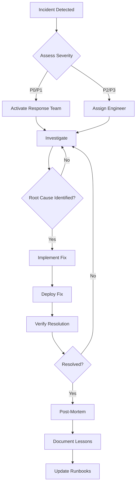

# Aisha CRM Security & Compliance Manual - Part 2

**Version:** 1.0  
**Last Updated:** November 15, 2025  
**Audience:** Security Administrators, DevOps Engineers, System Administrators

---

## Table of Contents

### Part 2: Monitoring, Compliance & Operations

#### Chapter 7: Audit & Compliance
- [7.1 Audit Logging](#71-audit-logging)
- [7.2 Compliance Requirements](#72-compliance-requirements)
- [7.3 Data Retention](#73-data-retention)
- [7.4 Right to Erasure](#74-right-to-erasure)

#### Chapter 8: Security Monitoring
- [8.1 System Monitoring](#81-system-monitoring)
- [8.2 Intrusion Detection](#82-intrusion-detection)
- [8.3 Performance Logging](#83-performance-logging)
- [8.4 Error Tracking](#84-error-tracking)

#### Chapter 9: Incident Response
- [9.1 Incident Response Plan](#91-incident-response-plan)
- [9.2 Security Breach Procedures](#92-security-breach-procedures)
- [9.3 Secret Compromise Response](#93-secret-compromise-response)
- [9.4 Data Breach Notification](#94-data-breach-notification)

#### Chapter 10: Security Testing
- [10.1 Security Testing Strategy](#101-security-testing-strategy)
- [10.2 Penetration Testing](#102-penetration-testing)
- [10.3 Vulnerability Scanning](#103-vulnerability-scanning)
- [10.4 Security Audits](#104-security-audits)

#### Chapter 11: Production Deployment Security
- [11.1 Pre-Deployment Checklist](#111-pre-deployment-checklist)
- [11.2 Deployment Procedures](#112-deployment-procedures)
- [11.3 Post-Deployment Verification](#113-post-deployment-verification)
- [11.4 Rollback Procedures](#114-rollback-procedures)

#### Chapter 12: Security Best Practices
- [12.1 Development Best Practices](#121-development-best-practices)
- [12.2 Operational Best Practices](#122-operational-best-practices)
- [12.3 User Security Guidelines](#123-user-security-guidelines)
- [12.4 Third-Party Integrations](#124-third-party-integrations)

#### Appendices
- [Appendix A: Security Checklist](#appendix-a-security-checklist)
- [Appendix B: Common Vulnerabilities](#appendix-b-common-vulnerabilities)
- [Appendix C: Security Headers Reference](#appendix-c-security-headers-reference)
- [Appendix D: Compliance Mappings](#appendix-d-compliance-mappings)
- [Appendix E: Emergency Contacts](#appendix-e-emergency-contacts)

---

## Chapter 7: Audit & Compliance

### 7.1 Audit Logging

All security-relevant actions are logged to the `audit_log` table.

#### Audit Log Schema

```sql
CREATE TABLE audit_log (
  id UUID PRIMARY KEY DEFAULT gen_random_uuid(),
  tenant_id UUID REFERENCES tenant(id),
  user_id UUID,                    -- Who performed the action
  target_user_id UUID,             -- User affected by action (if applicable)
  action VARCHAR(100) NOT NULL,    -- e.g., 'CRM_ACCESS_GRANTED', 'USER_DELETED'
  resource VARCHAR(100),           -- e.g., 'users', 'contacts'
  resource_id UUID,                -- ID of affected resource
  details JSONB,                   -- Additional context
  ip_address INET,
  user_agent TEXT,
  created_at TIMESTAMPTZ DEFAULT NOW()
);

CREATE INDEX idx_audit_log_tenant ON audit_log(tenant_id);
CREATE INDEX idx_audit_log_user ON audit_log(user_id);
CREATE INDEX idx_audit_log_action ON audit_log(action);
CREATE INDEX idx_audit_log_created ON audit_log(created_at DESC);
```

#### Logged Actions

| Action | Description | Details Included |
|--------|-------------|------------------|
| `USER_LOGIN` | User signed in | IP, user agent, success/failure |
| `USER_LOGOUT` | User signed out | Session duration |
| `CRM_ACCESS_GRANTED` | Admin gave user CRM access | Role assigned |
| `CRM_ACCESS_REVOKED` | Admin removed CRM access | Reason |
| `USER_CREATED` | New user account created | Role, tenant |
| `USER_UPDATED` | User account modified | Changed fields |
| `USER_DELETED` | User account deleted | Deletion reason |
| `ROLE_CHANGED` | User role modified | Old role → New role |
| `TENANT_CREATED` | New tenant created | Tenant name, plan |
| `TENANT_DELETED` | Tenant removed | Deletion reason, data archived |
| `PASSWORD_RESET` | Password reset requested | Email sent |
| `FAILED_LOGIN` | Login attempt failed | IP, reason |
| `API_KEY_CREATED` | New API key generated | Permissions, expiry |
| `API_KEY_REVOKED` | API key deleted | Revocation reason |
| `PERMISSION_DENIED` | Unauthorized action attempted | Requested action, user role |
| `DATA_EXPORT` | Data exported | Resource, record count |
| `DATA_IMPORT` | Data imported | Source, record count |

#### Logging Implementation

**`backend/utils/auditLog.js`:**

```javascript
export async function logAudit({
  tenantId,
  userId,
  targetUserId = null,
  action,
  resource = null,
  resourceId = null,
  details = {},
  ipAddress = null,
  userAgent = null
}) {
  try {
    await pgPool.query(
      `INSERT INTO audit_log 
       (tenant_id, user_id, target_user_id, action, resource, resource_id, details, ip_address, user_agent)
       VALUES ($1, $2, $3, $4, $5, $6, $7, $8, $9)`,
      [
        tenantId,
        userId,
        targetUserId,
        action,
        resource,
        resourceId,
        JSON.stringify(details),
        ipAddress,
        userAgent
      ]
    );
  } catch (error) {
    console.error('Audit logging failed:', error);
    // Don't fail the request if audit logging fails
  }
}
```

**Usage in Routes:**

```javascript
import { logAudit } from '../utils/auditLog.js';

// Example: Log user creation
app.post('/api/users', async (req, res) => {
  const { email, first_name, role, tenant_id } = req.body;
  
  // Create user...
  const newUser = await createUser({ email, first_name, role, tenant_id });
  
  // Log the action
  await logAudit({
    tenantId: tenant_id,
    userId: req.user.id,
    targetUserId: newUser.id,
    action: 'USER_CREATED',
    resource: 'users',
    resourceId: newUser.id,
    details: { role, email },
    ipAddress: req.ip,
    userAgent: req.headers['user-agent']
  });
  
  res.json({ status: 'success', data: newUser });
});
```

#### Querying Audit Logs

**All actions by user:**
```sql
SELECT action, resource, details, created_at
FROM audit_log
WHERE user_id = '<user-uuid>'
ORDER BY created_at DESC
LIMIT 100;
```

**All actions affecting a user:**
```sql
SELECT action, u.email as performed_by, details, created_at
FROM audit_log al
JOIN users u ON u.id = al.user_id
WHERE al.target_user_id = '<user-uuid>'
ORDER BY created_at DESC;
```

**Failed login attempts:**
```sql
SELECT user_id, ip_address, details, created_at
FROM audit_log
WHERE action = 'FAILED_LOGIN'
  AND created_at > NOW() - INTERVAL '24 hours'
ORDER BY created_at DESC;
```

**Actions in last 7 days:**
```sql
SELECT 
  action,
  COUNT(*) as count,
  COUNT(DISTINCT user_id) as unique_users
FROM audit_log
WHERE created_at > NOW() - INTERVAL '7 days'
GROUP BY action
ORDER BY count DESC;
```

---

### 7.2 Compliance Requirements

#### GDPR Compliance (EU)

**Key Requirements:**

| Requirement | Implementation |
|------------|----------------|
| **Data Portability** | Export API: `/api/users/:id/export` |
| **Right to Erasure** | Delete API: `/api/users/:id?gdpr=true` |
| **Consent Tracking** | `user_metadata.gdpr_consent` field |
| **Data Processing Agreement** | Required for all tenants processing EU data |
| **Breach Notification** | 72-hour notification procedure (see 9.4) |
| **Privacy by Design** | RLS, encryption, minimal data collection |
| **Data Minimization** | Only collect necessary fields |

**Data Subject Rights:**
- ✅ Right to access (user data export)
- ✅ Right to rectification (user edit endpoints)
- ✅ Right to erasure (soft delete + anonymization)
- ✅ Right to data portability (JSON export)
- ✅ Right to object (opt-out mechanisms)

#### CCPA Compliance (California)

**Key Requirements:**

| Requirement | Implementation |
|------------|----------------|
| **Notice at Collection** | Privacy policy linked at signup |
| **Access Request** | `/api/users/:id/ccpa-access` |
| **Deletion Request** | `/api/users/:id?ccpa=true` |
| **Do Not Sell** | No data selling; explicit opt-out toggle |
| **Consumer Rights Notice** | Documented in user agreements |

#### SOC 2 Type II (Enterprise)

**Key Controls:**

- ✅ Access control (RBAC, RLS)
- ✅ Audit logging (all security events)
- ✅ Encryption (at rest and in transit)
- ✅ Change management (Git, PR reviews)
- ✅ Incident response (documented procedures)
- ✅ Monitoring & alerting (Sentry, Supabase logs)
- ✅ Backup & recovery (daily automated backups)

#### HIPAA (Healthcare - Optional)

If handling Protected Health Information (PHI):

- ✅ Business Associate Agreement (BAA) with Supabase
- ✅ Encryption at rest (AES-256)
- ✅ Encryption in transit (TLS 1.3)
- ✅ Access controls (role-based)
- ✅ Audit trails (comprehensive logging)
- ✅ Physical safeguards (hosting provider responsibility)

---

### 7.3 Data Retention

#### Retention Policies

| Data Type | Retention Period | Deletion Method |
|-----------|-----------------|----------------|
| **User Data** | Active + 7 years | Soft delete, then anonymize |
| **Audit Logs** | 7 years | Archive to cold storage |
| **Performance Logs** | 90 days | Hard delete |
| **System Logs** | 30 days | Hard delete |
| **Session Tokens** | 30 days (max) | Auto-expire |
| **API Keys** | Until revoked + 1 year | Soft delete |
| **Backups** | 90 days | Rolling window |

#### Automated Cleanup

**`backend/scripts/cleanup-old-logs.js`:**

```javascript
import { pgPool } from '../db.js';

async function cleanupOldLogs() {
  // Delete performance logs older than 90 days
  await pgPool.query(
    `DELETE FROM performance_logs 
     WHERE created_at < NOW() - INTERVAL '90 days'`
  );
  
  // Delete system logs older than 30 days
  await pgPool.query(
    `DELETE FROM system_logs 
     WHERE created_at < NOW() - INTERVAL '30 days'`
  );
  
  // Archive audit logs older than 1 year to cold storage
  const oldAudits = await pgPool.query(
    `SELECT * FROM audit_log 
     WHERE created_at < NOW() - INTERVAL '1 year'`
  );
  
  // Export to S3/archive (implementation depends on storage)
  // await exportToArchive(oldAudits.rows);
  
  // Delete after successful archive
  // await pgPool.query(`DELETE FROM audit_log WHERE created_at < NOW() - INTERVAL '1 year'`);
  
  console.log('Cleanup completed');
}

// Run daily via cron
cleanupOldLogs().catch(console.error);
```

**Cron Schedule:**
```bash
# Run cleanup daily at 2 AM
0 2 * * * node /app/backend/scripts/cleanup-old-logs.js
```

---

### 7.4 Right to Erasure

#### GDPR/CCPA Deletion Request

**Soft Delete + Anonymization:**

```javascript
// DELETE /api/users/:id?gdpr=true
app.delete('/api/users/:id', async (req, res) => {
  const userId = req.params.id;
  const gdprRequest = req.query.gdpr === 'true';
  
  if (gdprRequest) {
    // GDPR-compliant deletion
    await pgPool.query('BEGIN');
    
    try {
      // 1. Anonymize personal data
      await pgPool.query(
        `UPDATE users 
         SET 
           email = 'deleted-' || id || '@anonymized.local',
           first_name = 'Deleted',
           last_name = 'User',
           metadata = jsonb_build_object('deleted_at', NOW(), 'gdpr_request', true),
           updated_at = NOW()
         WHERE id = $1`,
        [userId]
      );
      
      // 2. Remove from Supabase Auth
      const { error } = await supabase.auth.admin.deleteUser(userId);
      if (error) throw error;
      
      // 3. Log deletion
      await logAudit({
        userId: req.user.id,
        targetUserId: userId,
        action: 'USER_DELETED_GDPR',
        details: { reason: 'GDPR right to erasure' }
      });
      
      await pgPool.query('COMMIT');
      
      res.json({ 
        status: 'success', 
        message: 'User data anonymized per GDPR requirements' 
      });
    } catch (error) {
      await pgPool.query('ROLLBACK');
      throw error;
    }
  } else {
    // Regular soft delete
    await pgPool.query(
      `UPDATE users SET status = 'deleted', updated_at = NOW() WHERE id = $1`,
      [userId]
    );
    
    res.json({ status: 'success', message: 'User deleted' });
  }
});
```

#### Data Export (Portability)

```javascript
// GET /api/users/:id/export
app.get('/api/users/:id/export', async (req, res) => {
  const userId = req.params.id;
  
  // Verify user can export their own data
  if (req.user.id !== userId && req.user.role !== 'superadmin') {
    return res.status(403).json({ 
      status: 'error', 
      message: 'You can only export your own data' 
    });
  }
  
  // Gather all user data
  const userData = await pgPool.query(
    'SELECT * FROM users WHERE id = $1',
    [userId]
  );
  
  const contacts = await pgPool.query(
    'SELECT * FROM contacts WHERE owner_id = $1',
    [userId]
  );
  
  const activities = await pgPool.query(
    'SELECT * FROM activities WHERE user_id = $1',
    [userId]
  );
  
  // Build export package
  const exportData = {
    request_date: new Date().toISOString(),
    user: userData.rows[0],
    contacts: contacts.rows,
    activities: activities.rows,
    // Add other user-owned data...
  };
  
  // Log export
  await logAudit({
    userId: req.user.id,
    targetUserId: userId,
    action: 'DATA_EXPORT',
    details: { 
      record_count: {
        contacts: contacts.rows.length,
        activities: activities.rows.length
      }
    }
  });
  
  res.json({
    status: 'success',
    data: exportData
  });
});
```

---

## Chapter 8: Security Monitoring

### 8.1 System Monitoring

#### Health Checks

**`backend/routes/system.js`:**

```javascript
// GET /api/health
app.get('/api/health', async (req, res) => {
  try {
    // Check database connection
    const dbResult = await pgPool.query('SELECT NOW()');
    
    // Check Supabase connection
    const { data: supabaseHealth } = await supabase
      .from('tenant')
      .select('count')
      .limit(1);
    
    res.json({
      status: 'ok',
      timestamp: new Date().toISOString(),
      services: {
        database: 'healthy',
        supabase: supabaseHealth ? 'healthy' : 'degraded',
        api: 'healthy'
      },
      version: process.env.npm_package_version || '1.0.0'
    });
  } catch (error) {
    res.status(503).json({
      status: 'error',
      message: 'Service unavailable',
      error: error.message
    });
  }
});
```

#### Uptime Monitoring

**Recommended Tools:**
- **UptimeRobot** (free tier: 50 monitors, 5-min intervals)
- **Pingdom** (paid: 1-min intervals, global locations)
- **Better Stack** (modern alternative)

**Configuration:**
```yaml
Monitor Name: Aisha CRM API Health
URL: https://your-backend.railway.app/api/health
Method: GET
Interval: 5 minutes
Alert When: Status != 200 OR Response Time > 5s
Alert Contacts: admin@yourcompany.com, sms:+1234567890
```

---

### 8.2 Intrusion Detection

#### Middleware Implementation

**`backend/middleware/intrusionDetection.js`:**

```javascript
const suspiciousPatterns = [
  // SQL Injection attempts
  /(\bUNION\b|\bSELECT\b.*\bFROM\b|\bDROP\b|\bDELETE\b.*\bWHERE\b)/i,
  
  // XSS attempts
  /<script[^>]*>.*<\/script>/i,
  /javascript:/i,
  /onerror=/i,
  
  // Path traversal
  /\.\.[\/\\]/,
  
  // Command injection
  /;.*\b(cat|ls|wget|curl|nc|bash|sh)\b/i
];

export function detectIntrusion(req, res, next) {
  const suspicious = [];
  
  // Check all input sources
  const inputs = [
    ...Object.values(req.query),
    ...Object.values(req.body || {}),
    ...Object.values(req.params)
  ].map(v => String(v));
  
  for (const input of inputs) {
    for (const pattern of suspiciousPatterns) {
      if (pattern.test(input)) {
        suspicious.push({
          pattern: pattern.toString(),
          input: input.substring(0, 100) // Truncate for logging
        });
      }
    }
  }
  
  if (suspicious.length > 0) {
    // Log suspicious activity
    logAudit({
      userId: req.user?.id || 'anonymous',
      action: 'INTRUSION_DETECTED',
      details: {
        patterns: suspicious,
        path: req.path,
        method: req.method
      },
      ipAddress: req.ip,
      userAgent: req.headers['user-agent']
    });
    
    // Rate limit this IP aggressively
    // (Implementation depends on rate limiting strategy)
    
    // Optionally block request
    return res.status(400).json({
      status: 'error',
      message: 'Invalid input detected',
      code: 'SUSPICIOUS_INPUT'
    });
  }
  
  next();
}
```

#### Cross-Tenant Access Detection

**`backend/middleware/intrusionDetection.js` (continued):**

```javascript
export async function detectCrossTenantAccess(req, res, next) {
  const { user, tenantId } = req;
  
  if (!user || !tenantId) return next();
  
  // SuperAdmins can access any tenant
  if (user.role === 'superadmin') return next();
  
  // Check if user belongs to requested tenant
  const userTenant = user.tenant_id || user.tenantId;
  
  if (userTenant !== tenantId) {
    // Log unauthorized cross-tenant attempt
    await logAudit({
      userId: user.id,
      action: 'UNAUTHORIZED_CROSS_TENANT_ACCESS',
      details: {
        user_tenant: userTenant,
        requested_tenant: tenantId,
        path: req.path,
        method: req.method
      },
      ipAddress: req.ip
    });
    
    return res.status(403).json({
      status: 'error',
      message: 'Access denied: unauthorized tenant access',
      code: 'CROSS_TENANT_ACCESS_DENIED'
    });
  }
  
  next();
}
```

---

### 8.3 Performance Logging

#### Performance Log Schema

```sql
CREATE TABLE performance_logs (
  id UUID PRIMARY KEY DEFAULT gen_random_uuid(),
  tenant_id UUID,
  user_id UUID,
  endpoint VARCHAR(255),
  method VARCHAR(10),
  duration_ms INTEGER,
  status_code INTEGER,
  memory_mb DECIMAL(10,2),
  cpu_percent DECIMAL(5,2),
  error TEXT,
  created_at TIMESTAMPTZ DEFAULT NOW()
);

CREATE INDEX idx_perf_endpoint ON performance_logs(endpoint);
CREATE INDEX idx_perf_created ON performance_logs(created_at DESC);
```

#### Middleware Implementation

**`backend/middleware/performanceLogger.js`:**

```javascript
import os from 'os';

export function performanceLogger(req, res, next) {
  const start = Date.now();
  const startMemory = process.memoryUsage().heapUsed / 1024 / 1024;
  
  // Capture original end function
  const originalEnd = res.end;
  
  res.end = function(...args) {
    const duration = Date.now() - start;
    const endMemory = process.memoryUsage().heapUsed / 1024 / 1024;
    const memoryDelta = endMemory - startMemory;
    
    // Log to database (async, don't block response)
    pgPool.query(
      `INSERT INTO performance_logs 
       (tenant_id, user_id, endpoint, method, duration_ms, status_code, memory_mb)
       VALUES ($1, $2, $3, $4, $5, $6, $7)`,
      [
        req.tenantId || null,
        req.user?.id || null,
        req.path,
        req.method,
        duration,
        res.statusCode,
        memoryDelta.toFixed(2)
      ]
    ).catch(err => console.error('Performance logging failed:', err));
    
    // Log slow requests to console
    if (duration > 1000) {
      console.warn(`⚠️ Slow request: ${req.method} ${req.path} - ${duration}ms`);
    }
    
    originalEnd.apply(res, args);
  };
  
  next();
}
```

#### Performance Queries

**Slowest endpoints (last 24 hours):**
```sql
SELECT 
  endpoint,
  method,
  COUNT(*) as request_count,
  AVG(duration_ms) as avg_duration,
  MAX(duration_ms) as max_duration,
  PERCENTILE_CONT(0.95) WITHIN GROUP (ORDER BY duration_ms) as p95_duration
FROM performance_logs
WHERE created_at > NOW() - INTERVAL '24 hours'
GROUP BY endpoint, method
ORDER BY avg_duration DESC
LIMIT 20;
```

---

### 8.4 Error Tracking

#### Sentry Integration

**Install:**
```bash
npm install @sentry/node @sentry/tracing
```

**Backend Configuration:**

```javascript
import * as Sentry from '@sentry/node';
import * as Tracing from '@sentry/tracing';

// Initialize Sentry
Sentry.init({
  dsn: process.env.SENTRY_DSN,
  environment: process.env.NODE_ENV || 'development',
  tracesSampleRate: 0.1, // 10% of transactions
  beforeSend(event, hint) {
    // Don't send 404s or 401s
    if (event.exception?.values?.[0]?.value?.includes('404') ||
        event.exception?.values?.[0]?.value?.includes('401')) {
      return null;
    }
    return event;
  }
});

// Request handler (must be first)
app.use(Sentry.Handlers.requestHandler());
app.use(Sentry.Handlers.tracingHandler());

// ... your routes ...

// Error handler (must be last)
app.use(Sentry.Handlers.errorHandler());
```

**Error Tracking in Code:**

```javascript
try {
  await riskyOperation();
} catch (error) {
  Sentry.captureException(error, {
    tags: {
      section: 'user-management',
      operation: 'create-user'
    },
    user: {
      id: req.user?.id,
      email: req.user?.email
    },
    extra: {
      tenantId: req.tenantId,
      requestBody: req.body
    }
  });
  
  throw error; // Re-throw or handle
}
```

---

## Chapter 9: Incident Response

### 9.1 Incident Response Plan

#### Incident Severity Levels

| Level | Description | Response Time | Examples |
|-------|-------------|---------------|----------|
| **P0 - Critical** | System down, data breach | Immediate (< 15 min) | Database compromised, API down globally |
| **P1 - High** | Major functionality broken | < 1 hour | Authentication broken, data loss |
| **P2 - Medium** | Partial functionality affected | < 4 hours | Single feature broken, performance degraded |
| **P3 - Low** | Minor issue, workaround available | < 24 hours | UI bug, non-critical error |

#### Response Team

| Role | Responsibility | Contact |
|------|---------------|---------|
| **Incident Commander** | Overall coordination | Primary on-call |
| **Technical Lead** | Technical investigation | Backend engineer |
| **Security Lead** | Security assessment | Security specialist |
| **Communications Lead** | Customer/stakeholder updates | Customer success |
| **Executive Sponsor** | Decision authority | CTO/CEO |

#### Incident Response Workflow



---

### 9.2 Security Breach Procedures

#### Immediate Actions (First 15 Minutes)

1. **Contain the Breach**
   - Revoke compromised API keys
   - Rotate exposed secrets
   - Block suspicious IP addresses

2. **Assess Scope**
   - What data was accessed?
   - Which systems are affected?
   - How many users impacted?

3. **Preserve Evidence**
   - Don't delete logs or audit trails
   - Take database snapshots
   - Document all findings

#### Investigation (First Hour)

```sql
-- Identify affected users
SELECT DISTINCT user_id, action, ip_address, created_at
FROM audit_log
WHERE created_at BETWEEN '<breach-start>' AND '<breach-end>'
  AND action IN ('USER_LOGIN', 'DATA_EXPORT', 'PERMISSION_DENIED')
ORDER BY created_at;

-- Check for unauthorized access
SELECT al.*, u.email
FROM audit_log al
JOIN users u ON u.id = al.user_id
WHERE al.action = 'PERMISSION_DENIED'
  AND al.created_at > NOW() - INTERVAL '24 hours';
```

#### Communication Timeline

| Timeframe | Action | Audience |
|-----------|--------|----------|
| **0-1 hour** | Internal notification | Response team, executives |
| **1-4 hours** | Status update | Internal stakeholders |
| **4-24 hours** | Customer notification | Affected customers |
| **72 hours** | Regulatory notification | GDPR authorities (if EU data) |
| **1 week** | Post-mortem | All stakeholders |

---

### 9.3 Secret Compromise Response

#### If Secrets Are Exposed

**Immediate Actions (< 1 hour):**

1. **Rotate JWT Secret**
   ```bash
   # Generate new secret
   NEW_SECRET=$(node -e "console.log(require('crypto').randomBytes(64).toString('hex'))")
   
   # Update environment
   # Railway: Project → Variables → JWT_SECRET
   # Vercel: Project Settings → Environment Variables → JWT_SECRET
   
   # Redeploy backend
   railway up  # or vercel --prod
   ```

2. **Rotate Supabase Service Role Key**
   - Go to Supabase Dashboard → Settings → API
   - Click "Reset service_role key"
   - Update backend `.env` or platform secrets
   - Redeploy immediately

3. **Invalidate All Active Sessions**
   ```javascript
   // Force all users to re-login
   await supabase.auth.admin.signOut('global');
   ```

4. **Rotate API Keys**
   ```sql
   -- Revoke all API keys
   UPDATE api_key 
   SET expires_at = NOW()
   WHERE expires_at IS NULL OR expires_at > NOW();
   
   -- Notify customers to regenerate
   ```

#### Post-Rotation Verification

```powershell
# Test backend with new secrets
curl -X GET https://your-backend.railway.app/api/health

# Test authentication
curl -X POST https://your-backend.railway.app/api/auth/login `
  -H "Content-Type: application/json" `
  -d '{"email":"test@example.com","password":"testpass"}'
```

---

### 9.4 Data Breach Notification

#### GDPR Requirements (EU)

**72-Hour Notification Rule:**

If personal data of EU residents is breached, notify relevant Data Protection Authority (DPA) within **72 hours** of becoming aware.

**Required Information:**
- Nature of the breach
- Categories and approximate number of individuals affected
- Categories and approximate number of records affected
- Contact point for more information
- Likely consequences of the breach
- Measures taken or proposed to address the breach

**Notification Template:**

```
Subject: Personal Data Breach Notification - [Company Name]

To: [Data Protection Authority]

1. BREACH DETAILS
   - Date/time breach discovered: [timestamp]
   - Nature of breach: [unauthorized access / data leak / ransomware / etc.]
   - Systems affected: [database / API / file storage]

2. DATA AFFECTED
   - Categories: [names, emails, addresses, financial data, etc.]
   - Approximate number of individuals: [count]
   - Approximate number of records: [count]
   - Geographic regions: [EU countries affected]

3. CONTACT INFORMATION
   - Data Protection Officer: [name, email, phone]
   - Technical Contact: [name, email, phone]

4. CONSEQUENCES
   - Risk assessment: [low / medium / high]
   - Potential impact: [identity theft, financial loss, privacy violation]

5. REMEDIATION MEASURES
   - Actions taken: [list completed actions]
   - Planned actions: [list planned mitigations]
   - Timeline: [when mitigations will be complete]

6. CUSTOMER NOTIFICATION
   - Notification sent: [yes/no, when]
   - Communication method: [email / portal notification]

Signed: [DPO Name]
Date: [Date]
```

#### CCPA Requirements (California)

**Notice to California Attorney General:**

Required if breach affects **500+ California residents**.

**Notice to Affected Individuals:**

Must include:
- What happened
- What information was involved
- What we're doing about it
- What you can do
- Contact information for questions

**Customer Notification Template:**

```
Subject: Important Security Notice

Dear [Customer Name],

We are writing to inform you of a security incident that may have affected your personal information.

WHAT HAPPENED
On [date], we discovered [description of breach]. We immediately began an investigation and took steps to secure our systems.

WHAT INFORMATION WAS INVOLVED
The affected information may include: [list data types]. 

[If applicable] The following types of information were NOT affected: [list].

WHAT WE'RE DOING
- We have [actions taken]
- We have engaged [cybersecurity firm] to assist
- We are working with law enforcement
- We have notified [regulatory authorities]

WHAT YOU CAN DO
- Monitor your accounts for suspicious activity
- Consider placing a fraud alert on your credit file
- Review your credit reports
- Be alert for phishing attempts

We take the security of your information very seriously and sincerely apologize for any concern this may cause.

For questions, contact: [email/phone]

Sincerely,
[Company Name] Security Team
```

---

## Chapter 10: Security Testing

### 10.1 Security Testing Strategy

#### Testing Layers

| Layer | Testing Method | Frequency | Tools |
|-------|---------------|-----------|-------|
| **Code** | Static analysis (SAST) | Every commit | ESLint, Semgrep, CodeQL |
| **Dependencies** | Vulnerability scanning | Daily | npm audit, Snyk, Dependabot |
| **API** | Dynamic testing (DAST) | Weekly | OWASP ZAP, Burp Suite |
| **Infrastructure** | Configuration audits | Monthly | Scout Suite, Prowler |
| **Application** | Penetration testing | Quarterly | External security firm |

---

### 10.2 Penetration Testing

#### Scope Definition

**In-Scope:**
- External-facing web application (frontend)
- REST API endpoints
- Authentication mechanisms
- Authorization controls
- Database queries (via API)

**Out-of-Scope:**
- Physical security
- Social engineering
- Denial of service attacks
- Third-party services (Supabase, Railway)

#### Test Scenarios

1. **Authentication Bypass**
   - SQL injection in login
   - JWT tampering
   - Session fixation

2. **Authorization Flaws**
   - Horizontal privilege escalation (access other users' data)
   - Vertical privilege escalation (employee → admin)
   - Insecure direct object references (IDOR)

3. **Injection Attacks**
   - SQL injection
   - NoSQL injection
   - Command injection
   - XSS (stored, reflected, DOM-based)

4. **API Security**
   - Rate limiting bypass
   - Mass assignment
   - Excessive data exposure
   - Broken object-level authorization

5. **Business Logic**
   - Price manipulation
   - Workflow bypass
   - Race conditions

#### Penetration Testing Tools

**Free/Open Source:**
- OWASP ZAP (automated + manual testing)
- Burp Suite Community Edition
- sqlmap (SQL injection)
- nikto (web server scanner)

**Commercial:**
- Burp Suite Professional
- Nessus Professional
- Acunetix
- Qualys Web Application Scanning

---

### 10.3 Vulnerability Scanning

#### Dependency Scanning

**npm audit (Built-in):**
```bash
npm audit
npm audit fix  # Auto-fix vulnerabilities
npm audit fix --force  # Aggressive fixes (may break)
```

**Snyk (Recommended):**
```bash
npm install -g snyk
snyk auth
snyk test  # Scan for vulnerabilities
snyk monitor  # Continuous monitoring
```

**GitHub Dependabot:**
- Automatically enabled on GitHub repos
- Creates PRs for vulnerable dependencies
- Configure in `.github/dependabot.yml`

#### Code Scanning

**GitHub CodeQL:**

`.github/workflows/codeql.yml`:
```yaml
name: CodeQL Security Scan

on:
  push:
    branches: [main, develop]
  pull_request:
    branches: [main]
  schedule:
    - cron: '0 6 * * 1'  # Weekly on Mondays

jobs:
  analyze:
    runs-on: ubuntu-latest
    permissions:
      security-events: write
    steps:
      - uses: actions/checkout@v3
      - uses: github/codeql-action/init@v2
        with:
          languages: javascript
      - uses: github/codeql-action/analyze@v2
```

---

### 10.4 Security Audits

#### Quarterly Security Checklist

- [ ] Review audit logs for anomalies
- [ ] Verify RLS policies are active
- [ ] Test tenant isolation
- [ ] Review user permissions
- [ ] Rotate secrets (JWT, API keys)
- [ ] Update dependencies
- [ ] Run penetration tests
- [ ] Review access control lists
- [ ] Test backup restoration
- [ ] Verify monitoring alerts
- [ ] Update security documentation

#### Annual Security Review

- [ ] Third-party penetration test
- [ ] SOC 2 audit (if applicable)
- [ ] Disaster recovery drill
- [ ] Security awareness training
- [ ] Incident response tabletop exercise
- [ ] Architecture security review
- [ ] Compliance audit (GDPR, CCPA)
- [ ] Insurance policy review

---

## Chapter 11: Production Deployment Security

### 11.1 Pre-Deployment Checklist

#### Environment Configuration

- [ ] `JWT_SECRET` generated (128 chars) and set
- [ ] `SUPABASE_SERVICE_ROLE_KEY` configured
- [ ] `ALLOWED_ORIGINS` set to production domains only
- [ ] `NODE_ENV=production`
- [ ] `.env` files NOT committed to git
- [ ] `.gitignore` includes `.env*`

#### Database Security

- [ ] RLS policies applied and verified
- [ ] All migrations run successfully
- [ ] Database backups enabled (daily)
- [ ] Superadmin account created
- [ ] Test email patterns blocked

#### Application Security

- [ ] Rate limiting configured (100 req/min)
- [ ] Helmet.js security headers enabled
- [ ] CORS restricted to allowed origins
- [ ] API authentication required on all routes
- [ ] Audit logging functional
- [ ] Error tracking (Sentry) configured

#### Monitoring & Alerts

- [ ] Health check endpoint monitored (UptimeRobot)
- [ ] Error tracking alerts configured
- [ ] Performance monitoring enabled
- [ ] Audit log review scheduled
- [ ] Backup monitoring enabled

---

### 11.2 Deployment Procedures

#### Backend Deployment (Railway)

```bash
# 1. Verify changes locally
npm test
npm run lint

# 2. Commit and push
git add .
git commit -m "feat: add security feature"
git push origin main

# 3. Deploy to Railway
cd backend
railway login
railway up

# 4. Verify deployment
curl https://your-backend.railway.app/api/health

# 5. Monitor logs
railway logs
```

#### Frontend Deployment (Vercel)

```bash
# 1. Build locally
npm run build

# 2. Test production build
npm run preview

# 3. Deploy
vercel --prod

# 4. Verify deployment
curl https://your-app.vercel.app

# 5. Test authentication flow
# (Manual browser testing)
```

---

### 11.3 Post-Deployment Verification

#### Automated Tests

```bash
# Run smoke tests
npm run test:smoke

# Test critical endpoints
curl -X GET https://api.example.com/api/health
curl -X POST https://api.example.com/api/auth/login \
  -H "Content-Type: application/json" \
  -d '{"email":"test@example.com","password":"testpass"}'
```

#### Manual Verification

- [ ] Login/logout works
- [ ] Dashboard loads
- [ ] Create new record (contact, lead, etc.)
- [ ] Edit existing record
- [ ] Delete record
- [ ] Test permissions (employee can't see admin features)
- [ ] Test tenant isolation (user A can't see user B's data)
- [ ] Verify CORS (no errors in browser console)
- [ ] Test rate limiting (send 101 requests)

---

### 11.4 Rollback Procedures

#### Railway Rollback

```bash
# List recent deployments
railway deployments

# Rollback to previous deployment
railway rollback <deployment-id>

# Verify rollback
curl https://your-backend.railway.app/api/health
```

#### Vercel Rollback

```bash
# List deployments
vercel ls

# Promote previous deployment to production
vercel promote <deployment-url>
```

#### Database Rollback

```sql
-- If migration caused issues, rollback via SQL
BEGIN;

-- Undo migration changes (reverse of UP migration)
-- Example: DROP TABLE new_table;

COMMIT;
```

**Better: Use migration tool with down migrations:**

```javascript
// backend/migrations/037_down_migration.sql
DROP TABLE IF EXISTS new_feature_table;
ALTER TABLE users DROP COLUMN new_field;
```

---

## Chapter 12: Security Best Practices

### 12.1 Development Best Practices

#### Secure Coding Guidelines

**Input Validation:**
```javascript
// ❌ BAD: No validation
app.post('/api/users', (req, res) => {
  const email = req.body.email;
  // Use directly in query
});

// ✅ GOOD: Validate and sanitize
import { z } from 'zod';

const userSchema = z.object({
  email: z.string().email().max(255),
  first_name: z.string().min(1).max(100),
  role: z.enum(['admin', 'manager', 'employee'])
});

app.post('/api/users', (req, res) => {
  const result = userSchema.safeParse(req.body);
  if (!result.success) {
    return res.status(400).json({ errors: result.error.errors });
  }
  // Use validated data: result.data
});
```

**Parameterized Queries:**
```javascript
// ❌ BAD: SQL injection vulnerable
const email = req.query.email;
const query = `SELECT * FROM users WHERE email = '${email}'`;
await pgPool.query(query);

// ✅ GOOD: Parameterized query
const email = req.query.email;
await pgPool.query('SELECT * FROM users WHERE email = $1', [email]);
```

**Secure Password Handling:**
```javascript
import bcrypt from 'bcrypt';

// Hashing
const hashedPassword = await bcrypt.hash(password, 10);

// Verification
const isValid = await bcrypt.compare(inputPassword, hashedPassword);
```

---

### 12.2 Operational Best Practices

#### Secret Management

- ✅ Use environment variables for secrets
- ✅ Never commit secrets to git
- ✅ Use secret management tools (Vault, AWS Secrets Manager)
- ✅ Rotate secrets regularly (90 days for JWT, 180 days for DB)
- ✅ Use different secrets per environment (dev/staging/prod)
- ❌ Never log secrets
- ❌ Never send secrets in error messages

#### Access Control

- ✅ Principle of least privilege
- ✅ Multi-factor authentication for admin accounts
- ✅ Regular access reviews (quarterly)
- ✅ Offboard users immediately (revoke access same day)
- ✅ Audit privileged actions
- ❌ No shared accounts
- ❌ No long-lived API tokens (use expiring tokens)

---

### 12.3 User Security Guidelines

#### For End Users

**Password Requirements:**
- Minimum 12 characters
- Mix of uppercase, lowercase, numbers, symbols
- No common words or patterns
- Use a password manager

**Two-Factor Authentication (2FA):**
- Enable 2FA in Settings → Security
- Use authenticator app (Google Authenticator, Authy)
- Save backup codes securely

**Recognizing Phishing:**
- ⚠️ Verify sender email address
- ⚠️ Check for spelling/grammar errors
- ⚠️ Hover over links before clicking
- ⚠️ Don't trust urgent requests
- ⚠️ Verify requests via alternate channel

---

### 12.4 Third-Party Integrations

#### Security Requirements for Integrations

- [ ] Use OAuth 2.0 (not basic auth)
- [ ] Store tokens encrypted
- [ ] Implement token refresh
- [ ] Set token expiration (max 1 hour)
- [ ] Validate webhook signatures
- [ ] Rate limit external requests
- [ ] Log all external API calls
- [ ] Monitor for anomalies

#### Example: Secure Webhook Handler

```javascript
import crypto from 'crypto';

app.post('/api/webhooks/stripe', (req, res) => {
  // Verify webhook signature
  const signature = req.headers['stripe-signature'];
  const secret = process.env.STRIPE_WEBHOOK_SECRET;
  
  try {
    const event = stripe.webhooks.constructEvent(
      req.body,
      signature,
      secret
    );
    
    // Process webhook
    await handleStripeEvent(event);
    
    res.json({ received: true });
  } catch (error) {
    console.error('Webhook signature verification failed:', error);
    return res.status(400).json({ error: 'Invalid signature' });
  }
});
```

---

## Appendix A: Security Checklist

### Production Deployment Security Checklist

#### Environment & Secrets
- [ ] JWT_SECRET: 128-char random hex
- [ ] SUPABASE_SERVICE_ROLE_KEY: Configured from Supabase dashboard
- [ ] ENCRYPTION_KEY: 64-char random hex (if encrypting sensitive fields)
- [ ] ALLOWED_ORIGINS: Production domains only (no wildcards)
- [ ] NODE_ENV=production
- [ ] All .env files excluded from git (.gitignore)
- [ ] Secrets stored in platform secrets manager (Railway/Vercel)

#### Database Security
- [ ] RLS enabled on all 48+ tables
- [ ] RLS policies tested (tenant isolation verified)
- [ ] All migrations applied in order
- [ ] Superadmin account created and immutable
- [ ] Test email patterns blocked
- [ ] Automated backups enabled (daily minimum)
- [ ] Backup restoration tested

#### API Security
- [ ] JWT authentication required on all /api routes
- [ ] Rate limiting configured (100 req/min general, 5/15min auth)
- [ ] CORS restricted to allowed origins
- [ ] Helmet.js security headers enabled
- [ ] Input validation on all endpoints
- [ ] Parameterized queries (no SQL injection)
- [ ] API key management functional (if used)

#### Monitoring & Logging
- [ ] Audit logging enabled and tested
- [ ] Performance logging configured
- [ ] Error tracking (Sentry) configured
- [ ] Health check endpoint monitored (UptimeRobot/Pingdom)
- [ ] Alert recipients configured
- [ ] Log retention policies set

#### Compliance
- [ ] Privacy policy published
- [ ] Terms of service published
- [ ] Cookie consent banner (if EU traffic)
- [ ] Data export endpoint functional
- [ ] Data deletion endpoint functional (GDPR)
- [ ] Audit log retention: 7 years

#### Testing
- [ ] Penetration test completed (quarterly minimum)
- [ ] Dependency vulnerabilities scanned (npm audit)
- [ ] Code security scan (CodeQL/Semgrep)
- [ ] Manual security testing (OWASP Top 10)
- [ ] Backup restoration tested

---

## Appendix B: Common Vulnerabilities

### OWASP Top 10 (2021) - Mitigation Status

| Vulnerability | Risk | Aisha CRM Mitigation |
|--------------|------|---------------------|
| **A01: Broken Access Control** | Critical | ✅ RLS policies, role-based permissions, tenant validation |
| **A02: Cryptographic Failures** | High | ✅ TLS 1.3, AES-256 at rest, bcrypt for passwords |
| **A03: Injection** | High | ✅ Parameterized queries, input validation, Helmet CSP |
| **A04: Insecure Design** | High | ✅ Threat modeling, security by design, RLS |
| **A05: Security Misconfiguration** | Medium | ✅ Security headers, CORS, no default credentials |
| **A06: Vulnerable Components** | High | ⚠️ npm audit, Dependabot, manual updates |
| **A07: Authentication Failures** | High | ✅ JWT, rate limiting, no weak passwords |
| **A08: Software & Data Integrity** | Medium | ✅ Git signatures, checksums, no CDN tampering |
| **A09: Logging & Monitoring Failures** | Medium | ✅ Audit logs, Sentry, performance logs |
| **A10: Server-Side Request Forgery** | Medium | ✅ Input validation, URL whitelisting |

---

## Appendix C: Security Headers Reference

### Helmet.js Configuration

```javascript
app.use(helmet({
  contentSecurityPolicy: {
    directives: {
      defaultSrc: ["'self'"],
      styleSrc: ["'self'", "'unsafe-inline'", "https://fonts.googleapis.com"],
      scriptSrc: ["'self'"],
      imgSrc: ["'self'", "data:", "https:"],
      fontSrc: ["'self'", "https://fonts.gstatic.com"],
      connectSrc: ["'self'", "https://*.supabase.co"],
      frameSrc: ["'none'"],
      objectSrc: ["'none'"],
      upgradeInsecureRequests: []
    }
  },
  hsts: {
    maxAge: 31536000,      // 1 year
    includeSubDomains: true,
    preload: true
  },
  frameguard: {
    action: 'deny'         // Prevent clickjacking
  },
  noSniff: true,           // X-Content-Type-Options: nosniff
  xssFilter: true,         // X-XSS-Protection: 1; mode=block
  referrerPolicy: {
    policy: 'strict-origin-when-cross-origin'
  }
}));
```

### Expected Response Headers

```http
Content-Security-Policy: default-src 'self'; script-src 'self'
Strict-Transport-Security: max-age=31536000; includeSubDomains; preload
X-Frame-Options: DENY
X-Content-Type-Options: nosniff
X-XSS-Protection: 1; mode=block
Referrer-Policy: strict-origin-when-cross-origin
```

---

## Appendix D: Compliance Mappings

### GDPR Requirements Mapping

| GDPR Article | Requirement | Implementation |
|--------------|-------------|----------------|
| **Art. 5** | Data minimization | Only collect necessary fields |
| **Art. 6** | Lawful basis | Consent tracked in metadata |
| **Art. 15** | Right of access | `/api/users/:id/export` |
| **Art. 16** | Right to rectification | `PUT /api/users/:id` |
| **Art. 17** | Right to erasure | `DELETE /api/users/:id?gdpr=true` |
| **Art. 20** | Right to portability | JSON export API |
| **Art. 25** | Privacy by design | RLS, encryption, minimal data |
| **Art. 30** | Records of processing | Audit logs (7-year retention) |
| **Art. 32** | Security measures | See all of Chapter 1-6 |
| **Art. 33** | Breach notification | 72-hour procedure (9.4) |

### SOC 2 Controls Mapping

| Control | Type | Implementation |
|---------|------|----------------|
| **CC1.1** | Integrity & ethics | Code of conduct, security training |
| **CC6.1** | Logical access | RBAC, MFA, password policies |
| **CC6.6** | Encryption | TLS 1.3, AES-256, bcrypt |
| **CC7.2** | System monitoring | Sentry, performance logs, audit logs |
| **CC7.3** | Intrusion detection | Suspicious pattern detection, alerts |
| **CC8.1** | Change management | Git, PR reviews, rollback procedures |
| **CC9.2** | Vendor management | Third-party security requirements |

---

## Appendix E: Emergency Contacts

### Internal Contacts

| Role | Name | Email | Phone | Availability |
|------|------|-------|-------|--------------|
| **Security Lead** | [Name] | security@yourcompany.com | +1-XXX-XXX-XXXX | 24/7 |
| **CTO** | [Name] | cto@yourcompany.com | +1-XXX-XXX-XXXX | 24/7 |
| **DevOps Lead** | [Name] | devops@yourcompany.com | +1-XXX-XXX-XXXX | 24/7 |
| **DPO (GDPR)** | [Name] | dpo@yourcompany.com | +1-XXX-XXX-XXXX | Business hours |

### External Contacts

| Service | Purpose | Contact |
|---------|---------|---------|
| **Supabase Support** | Database/auth issues | support@supabase.com, Dashboard tickets |
| **Railway Support** | Backend hosting | help@railway.app, Discord |
| **Vercel Support** | Frontend hosting | support@vercel.com, Dashboard |
| **Sentry Support** | Error tracking | support@sentry.io |
| **Security Firm** | Penetration testing | [Your pentesting partner] |

### Regulatory Authorities

| Region | Authority | Website | Notification Process |
|--------|-----------|---------|---------------------|
| **EU (GDPR)** | National DPA | https://edpb.europa.eu/about-edpb/about-edpb/members_en | Online form (varies by country) |
| **California (CCPA)** | CA Attorney General | https://oag.ca.gov/ | Email: privacy@doj.ca.gov |
| **UK** | ICO | https://ico.org.uk/ | Online reporting tool |

---

## Additional Resources

### Documentation
- **Main README:** `../README.md`
- **User Guide:** `./AISHA_CRM_USER_GUIDE.md`
- **Admin Guide:** `./AISHA_CRM_ADMIN_GUIDE.md`
- **Developer Manual:** `./AISHA_CRM_DEVELOPER_MANUAL.md`
- **Database Manual:** `./AISHA_CRM_DATABASE_MANUAL.md` (forthcoming)

### External References
- **OWASP Top 10:** https://owasp.org/www-project-top-ten/
- **Supabase Security:** https://supabase.com/docs/guides/platform/going-into-prod
- **PostgreSQL RLS:** https://www.postgresql.org/docs/current/ddl-rowsecurity.html
- **GDPR Portal:** https://gdpr.eu/
- **NIST Cybersecurity Framework:** https://www.nist.gov/cyberframework

### Training Resources
- **OWASP WebGoat:** https://owasp.org/www-project-webgoat/
- **Security Training:** https://application.security/
- **GDPR Training:** https://gdpr.eu/courses/

---

**[Return to Part 1](./AISHA_CRM_SECURITY_MANUAL_PART1.md)**

---

*Aisha CRM Security & Compliance Manual - Part 2*  
*Copyright © 2025 4V Data Consulting. All rights reserved.*  
*Version 1.0 - November 15, 2025*
