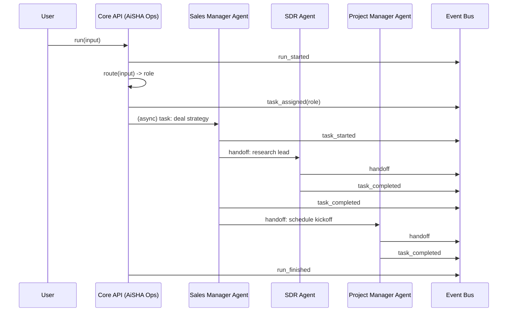
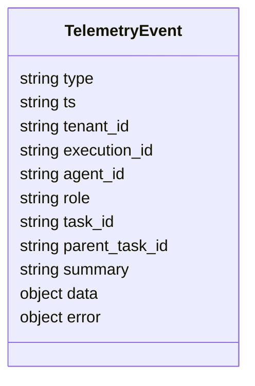

# Agent Office Architecture (Roles-First, Option 2 Sidecar)

Date: 2026-01-15

## Goals

- Keep **core app risk low**: no direct dependency on event bus or viz components.
- Implement **roles-first** AI: AiSHA is **Ops (router/governor)** plus specialist role agents.
- Provide an **office visualization**: “people widgets” that appear to work, hand off folders, and go back-and-forth.
- Provide **developer visibility** into events-in-flight (tap the bus and see payloads).

## Non-goals (for MVP)

- A fully animated office UI (MVP ships a live event tap UI + SSE stream).
- A complete agent execution runtime replacement for your existing workflow engine.
- Long-term immutable audit storage (can be added later via recorder/indexer).

---

## Conceptual Model

### Roles (initial set)

- AiSHA = **Ops Manager** (router/governor)
- Sales Manager
- SDR
- Project Manager
- Marketing Manager
- Customer Service Manager

### Key abstraction separation

- **Entry point**: one API endpoint (stable)
- **Execution**: per-role agent configs (model/prompt/tools/memory namespaces)
- **Observability**: event stream (telemetry) driving the office UI

---

## System Overview

```mermaid
flowchart LR
  U[User / UI] -->|POST /api/agent-office/run| API[Core Backend
(Express)]
  API -->|NDJSON telemetry
(best-effort)| LOG[(telemetry.ndjson
shared volume)]
  LOG -->|tail| SIDE[Telemetry Sidecar]
  SIDE -->|publish events| BUS[(Event Bus
Redpanda/Kafka)]
  BUS -->|consume| VIZ[Office Viz Service
(SSE + UI)]
  VIZ -->|browser| B[Developer / Admin Browser]
```

### Why this is low-risk

- Core app only **writes a line to a log file** (NDJSON). If telemetry fails, it is ignored.
- Sidecar/bus/viz can be stopped or removed without impacting the core app.

---

## Execution & Role Isolation

### Single API, multiple role agents

The API shape can remain a single endpoint, while routing dispatches to role-specific agents.



### Preventing “role bleed” even with the same base model

Role behavior must be separated by:

- distinct **system prompts** per role
- distinct **tool allowlists**
- distinct **memory namespaces**
- short **handoff payloads by reference** (task_id/artifact_ref) rather than dumping full context

---

## Event Schema (minimum)

Events are the contract between core execution and the office UI.



---

## Canonical Telemetry Event Contract (v1.0 - FROZEN)

> **Contract Location:** `addons/agent-office/contracts/telemetry-events.js`
> 
> **Frozen Date:** 2026-01-15
> 
> This contract is IMMUTABLE. New event types may be added, but existing schemas must not change.

### Base Fields (all events)

| Field | Type | Required | Description |
|-------|------|----------|-------------|
| `_telemetry` | `true` | ✅ | Marker for telemetry events |
| `ts` | string | ✅ | ISO 8601 timestamp |
| `type` | string | ✅ | Event type (see below) |
| `execution_id` | UUID | ✅ | Unique run identifier |
| `tenant_id` | UUID | ⚪ | Tenant UUID (optional for system events) |

### Canonical Event Types

#### Execution Lifecycle

| Event | Required Fields | Optional Fields | Description |
|-------|-----------------|-----------------|-------------|
| `run_started` | `execution_id`, `agent_id`, `role` | `tenant_id`, `user_id`, `input_summary`, `data` | A new agent run has started |
| `run_finished` | `execution_id`, `status` | `tenant_id`, `duration_ms`, `output_summary`, `error`, `data` | An agent run has completed. Status: `success`, `failure`, `cancelled` |

#### Agent Lifecycle

| Event | Required Fields | Optional Fields | Description |
|-------|-----------------|-----------------|-------------|
| `agent_spawned` | `execution_id`, `agent_id`, `role` | `tenant_id`, `parent_agent_id`, `model`, `config`, `data` | A new agent has been spawned |

#### Task Lifecycle

| Event | Required Fields | Optional Fields | Description |
|-------|-----------------|-----------------|-------------|
| `task_created` | `execution_id`, `task_id` | `tenant_id`, `parent_task_id`, `description`, `priority`, `data` | A new task has been created |
| `task_assigned` | `execution_id`, `task_id`, `agent_id`, `role` | `tenant_id`, `summary`, `data` | A task has been assigned to an agent |
| `task_started` | `execution_id`, `task_id`, `agent_id` | `tenant_id`, `data` | An agent has started working on a task |
| `task_blocked` | `execution_id`, `task_id`, `reason` | `tenant_id`, `blocked_by`, `data` | A task is blocked and waiting |
| `task_completed` | `execution_id`, `task_id` | `tenant_id`, `agent_id`, `duration_ms`, `output_summary`, `data` | A task has completed successfully |
| `task_failed` | `execution_id`, `task_id`, `error` | `tenant_id`, `agent_id`, `duration_ms`, `retryable`, `data` | A task has failed |

#### Coordination

| Event | Required Fields | Optional Fields | Description |
|-------|-----------------|-----------------|-------------|
| `handoff` | `execution_id`, `from_agent_id`, `to_agent_id` | `tenant_id`, `from_role`, `to_role`, `task_id`, `reason`, `data` | Work is being handed off between agents |

#### Tool Execution

| Event | Required Fields | Optional Fields | Description |
|-------|-----------------|-----------------|-------------|
| `tool_call_started` | `execution_id`, `tool_call_id`, `tool_name`, `agent_id` | `tenant_id`, `task_id`, `input_summary`, `data` | A tool call has started |
| `tool_call_finished` | `execution_id`, `tool_call_id`, `tool_name`, `status` | `tenant_id`, `agent_id`, `task_id`, `duration_ms`, `output_summary`, `error`, `data` | A tool call has finished. Status: `success`, `error` |

### Backend Usage

Import typed emitters from the telemetry module:

```javascript
import { 
  emitRunStarted, 
  emitRunFinished,
  emitAgentSpawned,
  emitTaskCreated,
  emitTaskAssigned,
  emitTaskStarted,
  emitTaskBlocked,
  emitTaskCompleted,
  emitTaskFailed,
  emitHandoff,
  emitToolCallStarted,
  emitToolCallFinished,
  EventTypes 
} from '../lib/telemetry/index.js';

// Example: emit run_started
emitRunStarted({
  execution_id: 'uuid-here',
  agent_id: 'ops_manager',
  role: 'ops_manager',
  tenant_id: 'tenant-uuid',
  input_summary: 'Show me open leads',
});

// Example: emit tool_call_finished
emitToolCallFinished({
  execution_id: 'uuid-here',
  tool_call_id: 'call-uuid',
  tool_name: 'list_leads',
  status: 'success',
  duration_ms: 145,
});
```

### Event Flow Example

```
run_started (ops_manager)
  └─ task_created (primary task)
     └─ task_assigned (sales_manager)
        └─ task_started
           ├─ tool_call_started (list_opportunities)
           ├─ tool_call_finished (success)
           └─ handoff (sales_manager → sdr)
              └─ task_assigned (sdr)
                 ├─ task_started
                 ├─ task_completed
                 └─ handoff (sdr → sales_manager)
        └─ task_completed
run_finished (success)
```

---
## Canonical Agent Identity Contract (v1.0 - FROZEN)

> **Contract Location:** `addons/agent-office/contracts/agents.js` (also `backend/lib/agents/contracts/agents.js`)
> 
> **Frozen Date:** 2026-01-15
> 
> This contract is IMMUTABLE. New agent roles may be added, but existing schemas must not change.

### Agent Schema

| Field | Type | Required | Description |
|-------|------|----------|-------------|
| `id` | string | ✅ | Unique agent ID (format: `role` or `role:tenant_id`) |
| `role` | string | ✅ | Agent role (one of canonical roles) |
| `display_name` | string | ✅ | Human-readable name |
| `model` | string | ✅ | LLM model identifier (e.g., `gpt-4o`) |
| `temperature` | number | ✅ | Model temperature (0.0-1.0) |
| `tool_allowlist` | string[] | ✅ | Tools this agent can invoke |
| `memory_namespace` | string | ✅ | Isolated memory/context namespace |
| `escalation_rules` | EscalationRule[] | ✅ | Rules for escalating to other agents |
| `metadata` | object | ⚪ | Optional: avatar, color, capabilities, limits |

### Canonical Agent Roles

| Role | Display Name | Default Model | Description |
|------|--------------|---------------|-------------|
| `ops_manager` | AiSHA (Ops Manager) | gpt-4o-mini | Router/governor/orchestrator |
| `sales_manager` | Sales Manager | gpt-4o | Deal management, pipeline |
| `sdr` | SDR | gpt-4o-mini | Prospecting, outreach |
| `project_manager` | Project Manager | gpt-4o | Scheduling, milestones |
| `marketing_manager` | Marketing Manager | gpt-4o | Campaigns, copy |
| `customer_service_manager` | Customer Service Manager | gpt-4o-mini | Support, complaints |

### Escalation Rule Schema

| Field | Type | Required | Description |
|-------|------|----------|-------------|
| `trigger` | string | ✅ | Trigger condition (see triggers below) |
| `target_role` | string/null | ✅ | Role to escalate to (`null` = human) |
| `reason_template` | string | ⚪ | Template for escalation reason |
| `requires_approval` | boolean | ⚪ | Whether human approval is needed |
| `priority` | number | ⚪ | Priority (lower = higher priority) |

### Escalation Triggers

| Trigger | Description |
|---------|-------------|
| `confidence_low` | Agent confidence below threshold |
| `tool_blocked` | Required tool not in allowlist |
| `approval_required` | Action requires manager/human approval |
| `rate_limit_hit` | Too many requests |
| `error_threshold` | Too many errors |
| `timeout` | Task taking too long |
| `user_request` | User explicitly requested escalation |
| `scope_exceeded` | Task outside agent's domain |

### Role Hierarchy

```
                    ┌──────────────┐
                    │ ops_manager  │  (top)
                    └──────┬───────┘
           ┌───────────────┼───────────────┬───────────────┐
           ▼               ▼               ▼               ▼
    ┌─────────────┐ ┌─────────────┐ ┌─────────────┐ ┌─────────────┐
    │sales_manager│ │project_mgr  │ │marketing_mgr│ │ cs_manager  │
    └──────┬──────┘ └─────────────┘ └─────────────┘ └─────────────┘
           ▼
    ┌─────────────┐
    │     sdr     │
    └─────────────┘
```

### Backend Usage

```javascript
import { 
  AgentRoles, 
  EscalationTriggers,
  getAgentProfile, 
  getAllAgentProfiles,
  canUseTool,
  getEscalationTarget,
} from '../lib/agents/agentRegistry.js';

// Get agent profile with full identity
const agent = await getAgentProfile({ 
  tenant_id: 'tenant-uuid', 
  role: AgentRoles.SALES_MANAGER 
});

// Check if agent can use a tool
if (!canUseTool(agent, 'delete_opportunity')) {
  const escalation = getEscalationTarget(agent, EscalationTriggers.TOOL_BLOCKED);
  // escalation.target_role -> 'ops_manager'
}

// Get all agents for a tenant
const agents = await getAllAgentProfiles('tenant-uuid');
```

### API Endpoints

| Endpoint | Method | Description |
|----------|--------|-------------|
| `/api/agent-office/roles` | GET | List all role names |
| `/api/agent-office/agents` | GET | List all agent profiles |
| `/api/agent-office/agents/:role` | GET | Get specific agent profile |
| `/api/agent-office/run` | POST | Route input and return full agent identity |

---
## Office UI Mapping (“people widgets”)

The UI is driven by event types; the bus enables “seeing different people doing stuff.”

| Event | UI behavior |
|------|-------------|
| run_started | office lights on, spawn desks |
| task_assigned(role) | folder appears on that worker’s desk |
| task_started | worker animates “working” |
| handoff(from->to) | worker carries folder to another desk |
| task_blocked | worker shows waiting icon |
| task_completed | worker stamps folder “done” |
| run_finished | office lights dim; run archived |

---

## Deployment

### Core app (existing container)

- Enable telemetry:
  - `TELEMETRY_ENABLED=true`
  - `TELEMETRY_LOG_PATH=/var/log/aisha/telemetry.ndjson`
- Mount a shared volume at `/var/log/aisha`

### Add-on services (new containers)

Located in `addons/agent-office/`:

- `redpanda` (Kafka-compatible bus)
- `telemetry-sidecar` (tails NDJSON and publishes to bus)
- `office-viz` (consumes bus and provides SSE + basic UI)

---

## Files added in this implementation

### Core backend

- `backend/lib/telemetry/index.js` — best-effort NDJSON writer + typed event emitters
- `backend/lib/agents/agentRegistry.js` — role definitions, agent profiles with full identity
- `backend/lib/agents/agentRouter.js` — MVP rule-based router (force_role supported)
- `backend/lib/agents/contracts/agents.js` — **FROZEN v1.0 agent identity contract**
- `backend/routes/agentOffice.js` — `/api/agent-office` endpoints
- `.env.example` — telemetry and per-role model override env vars
- `docs/AGENT_OFFICE_ARCHITECTURE.md` — this document

### Add-on services

- `addons/agent-office/docker-compose.agent-office.yml`
- `addons/agent-office/contracts/telemetry-events.js` — **FROZEN v1.0 telemetry event contract**
- `addons/agent-office/contracts/agents.js` — **FROZEN v1.0 agent identity contract**
- `addons/agent-office/services/telemetry-sidecar/*`
- `addons/agent-office/services/office-viz/*`

---

## Next Implementation Steps

1. Emit richer events from the **real execution points**:
   - workflow execution start/end
   - node start/end/fail
   - tool call start/end
   - agent handoffs
2. Add a recorder/indexer for long-lived replay:
   - Postgres or object storage for run archives
3. Replace MVP event tap UI with a full “office workers” animation layer (PixiJS).

