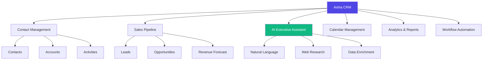
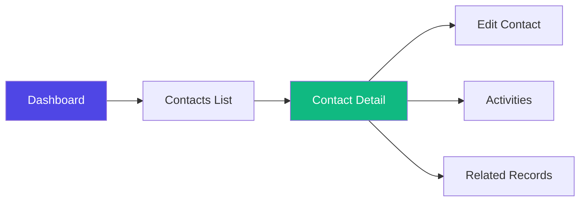
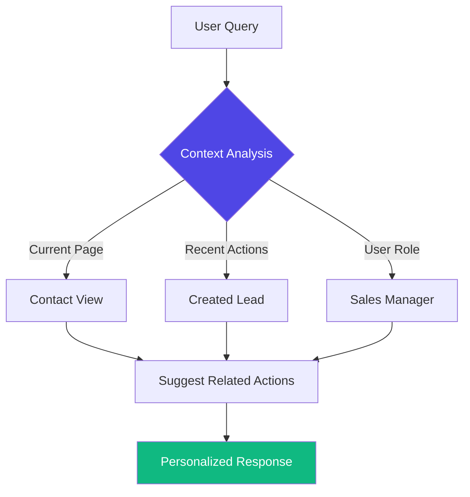
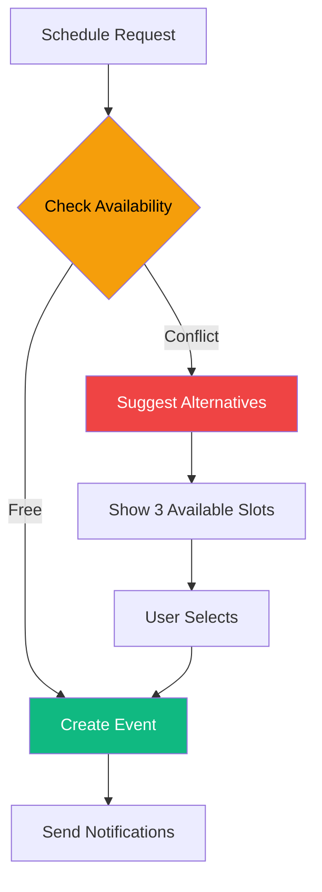

# Aisha CRM User Guide

**Version 2.0** | **Updated: November 2025**

---

## 📖 Table of Contents

### Chapter 1: Introduction
- [1.1 About Aisha CRM](#11-about-aisha-crm)
- [1.2 What Makes AI-SHA Special](#12-what-makes-ai-sha-special)
- [1.3 System Requirements](#13-system-requirements)
- [1.4 Document Conventions](#14-document-conventions)

### Chapter 2: Getting Started
- [2.1 First Login](#21-first-login)
- [2.2 Understanding the Interface](#22-understanding-the-interface)
- [2.3 Navigation Basics](#23-navigation-basics)
- [2.4 Your User Profile](#24-your-user-profile)

### Chapter 3: Core Features
- [3.1 Dashboard Overview](#31-dashboard-overview)
- [3.2 AI Executive Assistant](#32-ai-executive-assistant)
- [3.3 Calendar Management](#33-calendar-management)
- [3.4 Search and Filters](#34-search-and-filters)

### Chapter 4: Contact Management
- [4.1 Creating Contacts](#41-creating-contacts)
- [4.2 Managing Contact Information](#42-managing-contact-information)
- [4.3 Contact Activities](#43-contact-activities)
- [4.4 Bulk Operations](#44-bulk-operations)

### Chapter 5: Account Management
- [5.1 Creating Accounts](#51-creating-accounts)
- [5.2 Account Hierarchy](#52-account-hierarchy)
- [5.3 Account Dashboard](#53-account-dashboard)
- [5.4 Account Relationships](#54-account-relationships)

### Chapter 6: Lead Management
- [6.1 Creating Leads](#61-creating-leads)
- [6.2 Lead Qualification](#62-lead-qualification)
- [6.3 Converting Leads](#63-converting-leads)
- [6.4 Lead Source Tracking](#64-lead-source-tracking)

### Chapter 7: Opportunity Management
- [7.1 Creating Opportunities](#71-creating-opportunities)
- [7.2 Pipeline Stages](#72-pipeline-stages)
- [7.3 Revenue Forecasting](#73-revenue-forecasting)
- [7.4 Opportunity Tracking](#74-opportunity-tracking)

### Chapter 8: Activities and Tasks
- [8.1 Activity Types](#81-activity-types)
- [8.2 Creating Activities](#82-creating-activities)
- [8.3 Activity Management](#83-activity-management)
- [8.4 Activity Reports](#84-activity-reports)

### Chapter 9: Reports and Analytics
- [9.1 Dashboard Reports](#91-dashboard-reports)
- [9.2 Custom Reports](#92-custom-reports)
- [9.3 Exporting Data](#93-exporting-data)
- [9.4 Data Visualization](#94-data-visualization)

### Chapter 10: Workflows and Automation
- [10.1 Understanding Workflows](#101-understanding-workflows)
- [10.2 Creating Workflows](#102-creating-workflows)
- [10.3 Workflow Triggers](#103-workflow-triggers)
- [10.4 Workflow Management](#104-workflow-management)

### Chapter 11: Advanced Features
- [11.1 Document Processing](#111-document-processing)
- [11.2 Email Integration](#112-email-integration)
- [11.3 Business Card Scanner](#113-business-card-scanner)
- [11.4 Duplicate Detection](#114-duplicate-detection)

### Chapter 12: Troubleshooting
- [12.1 Common Issues](#121-common-issues)
- [12.2 Error Messages](#122-error-messages)
- [12.3 Getting Help](#123-getting-help)

### Appendices
- [Appendix A: Keyboard Shortcuts](#appendix-a-keyboard-shortcuts)
- [Appendix B: Glossary](#appendix-b-glossary)
- [Appendix C: FAQ](#appendix-c-faq)

---

# Chapter 1: Introduction

## 1.1 About Aisha CRM

**Aisha CRM** (AI Super Hi-performing Assistant) is a comprehensive customer relationship management system powered by advanced AI technology. Unlike traditional CRMs with bolted-on AI features, Aisha CRM is built from the ground up as an **Executive Assistant** that manages your entire business workflow.

### Key Capabilities



## 1.2 What Makes AI-SHA Special

### 🤖 Executive Assistant, Not Just CRM

Aisha CRM goes beyond traditional CRM functionality:

| Feature | Traditional CRM | Aisha CRM |
|---------|----------------|-----------|
| **Data Entry** | Manual forms | Natural language + AI |
| **Task Management** | Static lists | AI-powered suggestions |
| **Calendar** | Basic scheduling | Conflict detection, smart suggestions |
| **Search** | Keyword only | Semantic search + context |
| **Insights** | Manual reports | Real-time AI analysis |
| **Learning Curve** | Steep | Conversational interface |

### 🚀 Powered by Braid SDK

```
┌─────────────────────────────────────────┐
│         Braid AI Framework              │
│  ┌───────────────────────────────────┐  │
│  │  Type-Safe Tool Calls             │  │
│  │  No Parameter Hallucination       │  │
│  └───────────────────────────────────┘  │
│  ┌───────────────────────────────────┐  │
│  │  Capability Enforcement           │  │
│  │  !net, !clock, !fs                │  │
│  └───────────────────────────────────┘  │
│  ┌───────────────────────────────────┐  │
│  │  Automatic Tenant Isolation       │  │
│  │  Data Security Built-in           │  │
│  └───────────────────────────────────┘  │
└─────────────────────────────────────────┘
```

**27 Production-Ready AI Tools** across 7 domains:
- **CRM Operations**: Create, update, search records
- **Calendar Management**: Schedule, detect conflicts
- **Note Taking**: Capture, search, organize
- **Sales Pipeline**: Track opportunities, forecast
- **Web Research**: Company lookup, data enrichment
- **Analytics**: Generate insights, reports
- **Automation**: Workflows, triggers

### ✨ Key Benefits

> **💡 HIGHLIGHT**
> 
> Aisha CRM reduces data entry time by up to 70% through natural language processing and intelligent defaults.

- **Natural Language Interface**: Talk to your CRM like you would to an assistant
- **Intelligent Automation**: Let AI handle routine tasks
- **Context-Aware**: System understands relationships between records
- **Secure by Default**: Enterprise-grade security and tenant isolation
- **Zero Vendor Lock-in**: Your data, your infrastructure

## 1.3 System Requirements

### Supported Browsers

| Browser | Minimum Version | Recommended |
|---------|----------------|-------------|
| Google Chrome | 90+ | Latest |
| Mozilla Firefox | 88+ | Latest |
| Microsoft Edge | 90+ | Latest |
| Safari | 14+ | Latest |

> **⚠️ WARNING**
> 
> Internet Explorer is **not supported**. Please use a modern browser for the best experience.

### Network Requirements

- **Bandwidth**: Minimum 1 Mbps, recommended 5+ Mbps
- **Latency**: Under 200ms for optimal performance
- **Ports**: HTTPS (443) must be accessible

### Screen Resolution

- **Minimum**: 1280 x 720 pixels
- **Recommended**: 1920 x 1080 pixels or higher
- **Mobile**: Responsive design supports tablets (768px+)

## 1.4 Document Conventions

Throughout this guide, we use the following conventions:

| Symbol | Meaning |
|--------|---------|
| 💡 | Helpful tip or best practice |
| ⚠️ | Important warning or caution |
| 🚨 | Critical information - must read |
| ✅ | Success indicator or completion step |
| ❌ | Error or incorrect action |
| 📝 | Note or additional information |
| 🔒 | Security-related information |

**Text Formatting:**
- `Code or commands` - Monospace text
- **Bold** - Important terms or UI elements
- *Italic* - Emphasis or field names
- [Links](#) - Clickable references

---

# Chapter 2: Getting Started

## 2.1 First Login

### Accessing the System

1. **Open your browser** and navigate to your Aisha CRM URL
2. **Enter your credentials**:
   - Email address
   - Password

```
┌───────────────────────────────┐
│    Welcome to Aisha CRM       │
│                               │
│  Email: ________________      │
│                               │
│  Password: ____________       │
│                               │
│  [X] Remember me              │
│                               │
│       [ Login ]               │
│                               │
│  Forgot password?             │
└───────────────────────────────┘
```

> **💡 TIP**
> 
> Enable "Remember me" on trusted devices to stay logged in for 30 days.

### First-Time Setup Wizard

Upon first login, you'll be guided through a setup wizard:

1. **Welcome Screen**
   - Brief introduction to Aisha CRM
   - Click "Get Started"

2. **Profile Setup**
   - Upload profile photo (optional)
   - Set display name
   - Choose time zone

3. **Tenant Configuration**
   - Company name
   - Industry
   - Company size

4. **Quick Tour**
   - Interactive walkthrough of main features
   - Skip anytime or complete for best experience

> **📝 NOTE**
> 
> The setup wizard only appears once. You can access these settings later from your profile.

## 2.2 Understanding the Interface

### Main Layout

```
┌─────────────────────────────────────────────────────────┐
│  [Logo] Dashboard  Contacts  Leads  Accounts  Reports   │  ← Top Navigation
├─────┬───────────────────────────────────────────────────┤
│     │                                                     │
│  S  │              Main Content Area                     │  
│  i  │                                                     │
│  d  │  ┌──────────────────────────────────────────┐     │
│  e  │  │                                           │     │
│  b  │  │         Dashboard Widgets                 │     │
│  a  │  │                                           │     │
│  r  │  │  [Quick Stats]  [Charts]  [Activities]   │     │
│     │  │                                           │     │
│     │  └──────────────────────────────────────────┘     │
│     │                                                     │
└─────┴───────────────────────────────────────────────────┘
         ↑
      Collapsible Sidebar
```

### Top Navigation Bar

| Element | Description |
|---------|-------------|
| **Logo** | Click to return to dashboard |
| **Dashboard** | Main overview page |
| **Contacts** | Contact management |
| **Leads** | Lead tracking |
| **Accounts** | Account management |
| **Opportunities** | Sales pipeline |
| **Reports** | Analytics and reporting |
| **More ▼** | Additional modules dropdown |

### Right Corner Menu

- **🔔 Notifications**: View system notifications and alerts
- **🤖 AI Assistant**: Open AI chat interface
- **👤 Profile**: Access user settings and logout

### Sidebar Features

The collapsible left sidebar provides quick access to:

- **Recent Items**: Last 5 viewed records
- **Favorites**: Starred contacts/accounts
- **Quick Create**: Fast entry forms
- **Saved Searches**: Frequently used filters

> **💡 TIP**
> 
> Click the hamburger menu (☰) to collapse/expand the sidebar for more screen space.

## 2.3 Navigation Basics

### Primary Navigation Methods

1. **Top Menu Navigation**
   - Click main menu items for primary modules
   - Hover for dropdown submenus

2. **Global Search** (Ctrl/Cmd + K)
   - Type keywords to find any record
   - Use filters: `type:contact john` or `account:acme`
   - Recent searches saved automatically

3. **Breadcrumb Trail**
   ```
   Dashboard > Contacts > John Doe > Activities
   ```
   Click any breadcrumb to navigate back

4. **Quick Actions**
   - Floating action button (bottom right)
   - Press `+` key for keyboard shortcut
   - Access: Create Contact, Create Lead, Create Account

### Navigation Patterns



## 2.4 Your User Profile

### Accessing Profile Settings

1. Click your profile icon (top right)
2. Select **Profile Settings**

### Profile Sections

#### Personal Information
- Full name
- Email address (read-only)
- Phone number
- Profile photo
- Time zone

#### Preferences
- **Language**: System display language
- **Date Format**: MM/DD/YYYY or DD/MM/YYYY
- **Time Format**: 12-hour or 24-hour
- **Currency**: Default currency symbol
- **Theme**: Light or Dark mode

#### Notifications
- Email notifications: On/Off
- Browser notifications: Enable/Disable
- Notification frequency: Real-time, Daily digest, Weekly summary

#### Security
- Change password
- Enable two-factor authentication (2FA)
- View active sessions
- Review login history

> **🔒 SECURITY TIP**
> 
> Enable two-factor authentication (2FA) to add an extra layer of security to your account.

---

# Chapter 3: Core Features

## 3.1 Dashboard Overview

The Dashboard is your command center, providing real-time insights and quick access to critical information.

### Dashboard Widgets

```
┌──────────────────┐  ┌──────────────────┐  ┌──────────────────┐
│  Quick Stats     │  │  Sales Pipeline  │  │  Recent Activity │
│                  │  │                  │  │                  │
│  Leads: 45       │  │  [Pipeline Chart]│  │  • Meeting with  │
│  Contacts: 234   │  │                  │  │    John at 2pm   │
│  Accounts: 67    │  │  $456K in play   │  │  • Call logged   │
│  Opps: 23        │  │                  │  │  • Email sent    │
└──────────────────┘  └──────────────────┘  └──────────────────┘

┌──────────────────────────────────────┐  ┌──────────────────┐
│  Revenue Forecast                    │  │  Top Accounts    │
│                                      │  │                  │
│  [Line Chart: Monthly Trend]         │  │  1. Acme Corp    │
│                                      │  │  2. TechStart    │
│  This Month: $125K                   │  │  3. Global Inc   │
│  Forecast: $180K                     │  │  4. Local LLC    │
└──────────────────────────────────────┘  └──────────────────┘
```

### Customizing Your Dashboard

1. Click **Customize** button (top right of dashboard)
2. **Add Widget**:
   - Drag from widget library
   - Drop in desired position
3. **Remove Widget**:
   - Click X on widget corner
   - Confirm removal
4. **Resize Widget**:
   - Drag corner handles
   - Snap to grid
5. **Rearrange**:
   - Drag widget header
   - Drop in new position

> **💡 TIP**
> 
> Create multiple dashboard layouts for different roles. Switch between them using the layout dropdown.

### Available Widgets

| Widget | Description | Size Options |
|--------|-------------|--------------|
| **Quick Stats** | Count of records by type | Small, Medium |
| **Sales Pipeline** | Opportunity funnel chart | Medium, Large |
| **Revenue Forecast** | Trend analysis | Large |
| **Recent Activities** | Latest actions | Small, Medium |
| **Top Accounts** | Ranked by revenue | Small, Medium |
| **Lead Sources** | Pie chart breakdown | Medium |
| **Team Performance** | Agent metrics | Medium, Large |
| **Calendar** | Upcoming events | Medium |

## 3.2 AI Executive Assistant

The AI Assistant is the heart of Aisha CRM, providing intelligent automation and natural language interaction.

### Opening the AI Assistant

**Methods to Access:**
1. Click the 🤖 icon (top right)
2. Press `Ctrl/Cmd + Shift + A`
3. Click "Ask AI" from any page

### AI Assistant Interface

```
┌─────────────────────────────────────────┐
│  AI Executive Assistant          [X]    │
├─────────────────────────────────────────┤
│                                         │
│  AI: Hello! How can I help you today?  │
│                                         │
│  You: Show me leads from last week     │
│                                         │
│  AI: I found 12 leads from last week.  │
│      [View Leads Button]                │
│                                         │
│  ┌─────────────────────────────────┐   │
│  │ Type your message...            │   │
│  └─────────────────────────────────┘   │
│                             [Send]      │
└─────────────────────────────────────────┘
```

### Capabilities

#### Natural Language Commands

**Examples:**
- "Create a new contact named Sarah Johnson"
- "Show me all opportunities closing this month"
- "Schedule a meeting with John tomorrow at 2pm"
- "Find duplicate contacts"
- "Generate a sales report for Q4"

#### Smart Suggestions

The AI learns from your patterns and suggests:
- Next best actions
- Missing information
- Follow-up tasks
- Related records

#### Context Awareness



The AI understands:
- What page you're on
- What record you're viewing
- Your recent actions
- Your role and permissions

### AI Tool Categories

| Category | Tools | Example Use |
|----------|-------|-------------|
| **CRM Ops** | Create, Update, Search | "Add John as a contact" |
| **Calendar** | Schedule, Find conflicts | "When can I meet Sarah?" |
| **Notes** | Capture, Search | "Note: discussed pricing" |
| **Sales** | Track, Forecast | "Revenue forecast for Q1" |
| **Research** | Company lookup | "Tell me about Acme Corp" |
| **Analytics** | Reports, Insights | "Show team performance" |
| **Automation** | Workflows | "Automate lead follow-up" |

> **💡 TIP**
> 
> Be conversational! The AI understands natural language better than rigid commands.

### AI Best Practices

✅ **DO:**
- Use natural language
- Provide context ("for account Acme")
- Ask follow-up questions
- Request clarification

❌ **DON'T:**
- Use overly technical syntax
- Expect perfect responses every time
- Share sensitive data in examples
- Rely solely on AI for critical decisions

> **⚠️ CAUTION**
> 
> While the AI is powerful, always review its suggestions before executing important actions like bulk updates or deletions.

## 3.3 Calendar Management

Aisha CRM includes an integrated calendar for managing meetings, tasks, and events.

### Calendar Views

**Available Views:**
- **Month**: Overview of entire month
- **Week**: Detailed weekly schedule
- **Day**: Hour-by-hour breakdown
- **Agenda**: List of upcoming events

```
┌─────────────────────────────────────────────────────┐
│  Calendar                    [Month ▼] [Today]      │
├─────────────────────────────────────────────────────┤
│  November 2025                                      │
│  ┌────┬────┬────┬────┬────┬────┬────┐             │
│  │ Su │ Mo │ Tu │ We │ Th │ Fr │ Sa │             │
│  ├────┼────┼────┼────┼────┼────┼────┤             │
│  │    │    │    │    │    │ 1  │ 2  │             │
│  ├────┼────┼────┼────┼────┼────┼────┤             │
│  │ 3  │ 4  │ 5• │ 6  │ 7  │ 8• │ 9  │  • = Event  │
│  └────┴────┴────┴────┴────┴────┴────┘             │
└─────────────────────────────────────────────────────┘
```

### Creating Calendar Events

**Quick Create:**
1. Click time slot on calendar
2. Enter event details:
   - Title
   - Start/end time
   - Location (optional)
   - Attendees (optional)
   - Related record (contact/account)
3. Click **Save**

**AI-Assisted Scheduling:**
- "Schedule a meeting with Sarah next Tuesday"
- AI suggests available times
- Checks for conflicts
- Sends invitations

### Conflict Detection



> **💡 TIP**
> 
> Enable calendar sync with Google Calendar or Outlook for unified scheduling.

### Event Types

| Type | Icon | Purpose |
|------|------|---------|
| **Meeting** | 👥 | Client/team meetings |
| **Call** | 📞 | Phone conversations |
| **Task** | ✓ | To-do items |
| **Deadline** | ⏰ | Important dates |
| **Follow-up** | 🔄 | Post-meeting actions |

## 3.4 Search and Filters

### Global Search

**Access:** Press `Ctrl/Cmd + K` or click search icon

```
┌──────────────────────────────────────────┐
│  🔍 Search everything...                 │
├──────────────────────────────────────────┤
│  Recent                                  │
│  • John Doe (Contact)                    │
│  • Acme Corporation (Account)            │
│  • Q4 Report                             │
│                                          │
│  Suggestions                             │
│  • type:lead status:new                  │
│  • account:acme                          │
└──────────────────────────────────────────┘
```

### Search Operators

| Operator | Example | Description |
|----------|---------|-------------|
| `type:` | `type:contact` | Filter by record type |
| `status:` | `status:active` | Filter by status |
| `owner:` | `owner:me` | Filter by owner |
| `created:` | `created:today` | Filter by date |
| `tag:` | `tag:vip` | Filter by tags |
| `account:` | `account:acme` | Related to account |

### Advanced Filters

**Creating Filter Sets:**
1. Navigate to any list view (Contacts, Leads, etc.)
2. Click **Filters** button
3. Add filter criteria:
   - Field
   - Operator (equals, contains, greater than, etc.)
   - Value
4. Click **Apply**
5. Save filter set for reuse

**Saved Filters:**
- Save frequently used filters
- Share with team members
- Set as default view

> **💡 TIP**
> 
> Combine multiple filters for precise results. Example: "Active contacts in California created this month"

---

# Chapter 4: Contact Management

## 4.1 Creating Contacts

### Manual Contact Creation

1. Click **+ New** or press `+` key
2. Select **Contact** from dropdown
3. Fill required fields:
   - **First Name*** (required)
   - **Last Name*** (required)
   - Email
   - Phone
   - Company/Account
   - Title/Position
4. Click **Save** or **Save & New**

### Contact Form Fields

```
┌─────────────────────────────────────┐
│  New Contact                   [X]  │
├─────────────────────────────────────┤
│                                     │
│  First Name: _______________  *     │
│  Last Name:  _______________  *     │
│                                     │
│  Email:      _______________        │
│  Phone:      _______________        │
│                                     │
│  Account:    [Search Accounts]      │
│  Title:      _______________        │
│                                     │
│  [Advanced Fields ▼]                │
│                                     │
│  [ Cancel ]  [ Save & New ] [Save]  │
└─────────────────────────────────────┘
```

### AI-Assisted Creation

Simply tell the AI:
- "Create a contact for Sarah Johnson at Acme Corp"
- "Add John Smith, email john@example.com"
- AI auto-fills fields based on context
- Suggests related accounts
- Checks for duplicates

> **⚠️ WARNING**
> 
> Always check for duplicate contacts before saving. The system will warn you if similar contacts exist.

### Bulk Import

**Import from CSV:**
1. Navigate to **Contacts**
2. Click **Import** button
3. Download template CSV
4. Fill template with your data
5. Upload completed file
6. Map columns to fields
7. Review and confirm

**Supported Import Sources:**
- CSV files
- Excel spreadsheets (.xlsx)
- Google Contacts export
- Outlook contacts export
- Business cards (via scanner)

> **📝 NOTE**
> 
> Import supports up to 10,000 contacts per file. For larger imports, split into multiple files.

## 4.2 Managing Contact Information

### Contact Detail View

```
┌──────────────────────────────────────────────────────┐
│  Sarah Johnson                         [Edit] [More] │
│  VP of Sales @ Acme Corporation              [⭐]    │
├──────────────────────────────────────────────────────┤
│  📧 sarah.j@acme.com    📞 555-0123                  │
│  🏢 Acme Corporation    📍 San Francisco, CA         │
├──────────────────────────────────────────────────────┤
│  [Activities] [Notes] [Opportunities] [Documents]    │
├──────────────────────────────────────────────────────┤
│  Recent Activities                                   │
│  • Meeting scheduled - Nov 15, 2pm                   │
│  • Email sent - Nov 10                               │
│  • Call logged - Nov 5                               │
└──────────────────────────────────────────────────────┘
```

### Contact Information Sections

#### Basic Information
- Name and title
- Contact details (email, phone, mobile)
- Social media profiles
- Preferred contact method

#### Company Information
- Associated account
- Department
- Job function
- Reports to (hierarchy)

#### Address Information
- Mailing address
- Billing address
- Shipping address

#### Additional Details
- Birthday/Anniversary
- Lead source
- Tags/Categories
- Custom fields

### Editing Contacts

**Quick Edit:**
- Click any field value inline
- Type new value
- Press Enter to save

**Full Edit Mode:**
- Click **Edit** button
- Modify multiple fields
- Click **Save Changes**

> **💡 TIP**
> 
> Use keyboard shortcut `E` while viewing a contact to enter edit mode quickly.

## 4.3 Contact Activities

### Activity Timeline

The activity timeline shows all interactions with a contact:

```
Timeline
│
├─ Today
│  └─ 📞 Call logged (15 min) - Discussed pricing
│
├─ Yesterday  
│  └─ 📧 Email sent - Follow-up proposal
│
├─ Nov 10
│  ├─ 👥 Meeting - Product demo (1 hour)
│  └─ 📝 Note added - Very interested in premium plan
│
└─ Nov 5
   └─ 📞 Call logged (30 min) - Initial outreach
```

### Logging Activities

**Quick Log:**
1. Click **Log Activity** button
2. Select activity type:
   - Call
   - Email
   - Meeting
   - Task
   - Note
3. Enter details
4. Click **Save**

**Activity Types:**

| Type | Use Case | Required Fields |
|------|----------|----------------|
| **Call** | Phone conversations | Duration, outcome |
| **Email** | Email correspondence | Subject, direction |
| **Meeting** | In-person/virtual meetings | Date/time, attendees |
| **Task** | To-do items | Due date, priority |
| **Note** | General observations | Description |

### Automated Activity Logging

The system automatically logs:
- ✅ Emails sent/received (with email integration)
- ✅ Meetings from calendar
- ✅ Form submissions
- ✅ Website visits (with tracking)
- ✅ Document downloads

## 4.4 Bulk Operations

### Selecting Multiple Contacts

**Methods:**
1. **Checkbox Selection**:
   - Check boxes next to contacts
   - Shift+Click for range selection
2. **Filter Selection**:
   - Apply filters
   - Click "Select all X contacts"
3. **Search Selection**:
   - Search for criteria
   - Select results

### Available Bulk Actions

```
┌────────────────────────────────────┐
│  15 contacts selected              │
├────────────────────────────────────┤
│  Bulk Actions:                     │
│  • Update field                    │
│  • Add tags                        │
│  • Assign owner                    │
│  • Delete                          │
│  • Export                          │
│  • Send email                      │
└────────────────────────────────────┘
```

> **🚨 CRITICAL**
> 
> **Bulk delete operations are permanent and cannot be undone!** Always double-check your selection before deleting.

### Bulk Update Examples

**Update Contact Owner:**
1. Select contacts
2. Click **Bulk Actions** > **Assign Owner**
3. Choose new owner
4. Click **Apply**

**Add Tags:**
1. Select contacts
2. Click **Bulk Actions** > **Add Tags**
3. Enter tags (comma-separated)
4. Click **Apply**

**Export to CSV:**
1. Select contacts (or use "Select All")
2. Click **Bulk Actions** > **Export**
3. Choose fields to include
4. Click **Download CSV**

---

*[Continue with Chapters 5-12...]*

---

# Chapter 12: Troubleshooting

## 12.1 Common Issues

### Login Problems

**Issue: Can't log in**

✅ **Solutions:**
1. Check email address is correct
2. Verify Caps Lock is off
3. Try password reset
4. Clear browser cache and cookies
5. Try different browser

**Issue: "Session expired" message**

✅ **Solution:**
- Simply log in again
- Enable "Remember me" for longer sessions

### Page Loading Issues

**Issue: Page won't load or shows spinner indefinitely**

✅ **Solutions:**
1. Refresh page (F5 or Ctrl+R)
2. Check internet connection
3. Clear browser cache
4. Check if system is under maintenance
5. Contact support if persists

### Data Not Saving

**Issue: Changes aren't being saved**

✅ **Solutions:**
1. Check for validation errors (red highlighted fields)
2. Ensure all required fields (*) are filled
3. Verify you have permission to edit
4. Check internet connection
5. Try saving again

> **💡 TIP**
> 
> If you see unsaved changes, the system will warn you before navigating away.

## 12.2 Error Messages

### Common Error Messages

| Error | Meaning | Solution |
|-------|---------|----------|
| **"Access Denied"** | No permission | Contact your administrator |
| **"Record Not Found"** | Deleted or moved | Refresh and try again |
| **"Duplicate Found"** | Similar record exists | Review duplicate, merge if needed |
| **"Connection Lost"** | Network issue | Check internet, retry |
| **"Session Timeout"** | Inactive too long | Log in again |

### System Status Indicators

```
🟢 All Systems Operational
🟡 Performance Degraded  
🔴 System Maintenance
```

Check current status at: [System Status Page]

## 12.3 Getting Help

### Help Resources

1. **In-App Help** (Press `F1`)
   - Contextual help for current page
   - Quick tips
   - Video tutorials

2. **Knowledge Base**
   - Searchable articles
   - How-to guides
   - Best practices

3. **AI Assistant**
   - Ask questions naturally
   - Get instant answers
   - Context-aware suggestions

4. **Support Team**
   - Email: support@aishacrm.com
   - Live chat (Mon-Fri, 9am-5pm)
   - Phone: +1-555-AISHA-1

### Reporting Issues

**When reporting an issue, include:**
- What you were trying to do
- Steps to reproduce
- Error message (screenshot if possible)
- Your browser and version
- Time the issue occurred

---

# Appendix A: Keyboard Shortcuts

## Global Shortcuts

| Shortcut | Action |
|----------|--------|
| `Ctrl/Cmd + K` | Global search |
| `Ctrl/Cmd + Shift + A` | Open AI assistant |
| `+` | Quick create |
| `F1` | Help |
| `Esc` | Close dialog/modal |

## Navigation Shortcuts

| Shortcut | Action |
|----------|--------|
| `G` then `D` | Go to Dashboard |
| `G` then `C` | Go to Contacts |
| `G` then `L` | Go to Leads |
| `G` then `A` | Go to Accounts |
| `G` then `O` | Go to Opportunities |

## Record Actions

| Shortcut | Action |
|----------|--------|
| `E` | Edit current record |
| `Delete` | Delete current record |
| `S` | Star/favorite |
| `N` | Add note |

## List View Shortcuts

| Shortcut | Action |
|----------|--------|
| `↑` / `↓` | Navigate records |
| `Enter` | Open selected record |
| `Ctrl/Cmd + A` | Select all |
| `Ctrl/Cmd + Click` | Multi-select |

---

# Appendix B: Glossary

**Account**: An organization or company you do business with

**Activity**: Any interaction or task related to a record (call, email, meeting, etc.)

**AI Assistant**: The intelligent chat interface powered by Braid SDK

**Braid SDK**: The AI framework powering Aisha CRM's intelligent features

**Contact**: An individual person in your CRM

**Dashboard**: The main overview page showing key metrics and activities

**Lead**: A potential customer or opportunity not yet qualified

**Opportunity**: A qualified potential sale in your sales pipeline

**Pipeline**: The sales process from lead to closed deal

**Tenant**: Your organization's isolated instance of the CRM

**Workflow**: An automated process that executes based on triggers and conditions

---

# Appendix C: FAQ

## General Questions

**Q: How do I reset my password?**
A: Click "Forgot password?" on the login page and follow the email instructions.

**Q: Can I access Aisha CRM on mobile?**
A: Yes! The interface is responsive and works on tablets (768px+). A native mobile app is coming soon.

**Q: How often is data backed up?**
A: Data is backed up continuously in real-time. Point-in-time recovery is available.

## Feature Questions

**Q: Can I customize fields?**
A: Yes! Administrators can add custom fields. Contact your admin for access.

**Q: How accurate is duplicate detection?**
A: The AI-powered duplicate detection is 95%+ accurate, checking names, emails, phones, and company info.

**Q: Can I integrate with other tools?**
A: Yes! Aisha CRM supports integrations with email, calendar, and other business tools.

## Data Questions

**Q: Who owns my data?**
A: You do! Your data is stored in your own infrastructure with zero vendor lock-in.

**Q: Is my data secure?**
A: Absolutely. Enterprise-grade security with encryption, tenant isolation, and audit logging.

**Q: Can I export my data?**
A: Yes, anytime. Export to CSV, Excel, or via API.

---

**End of User Guide**

For technical administration and development guides, see:
- [System Administrator Guide](AISHA_CRM_ADMIN_GUIDE.md)
- [Developer Technical Manual](AISHA_CRM_DEVELOPER_MANUAL.md)

---

*Document Version: 2.0*  
*Last Updated: November 15, 2025*  
*© 2025 Aisha CRM. All rights reserved.*
