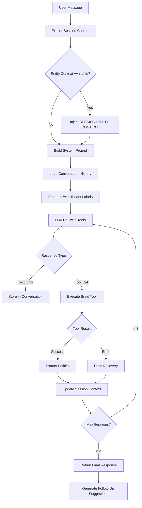

# AiSHA AI Architecture

**Version:** 1.0  
**Last Updated:** December 25, 2025  
**Status:** Production  
**Purpose:** Customer-facing AI Executive Assistant for Aisha CRM

---

## Overview

AiSHA (AI Sales & Help Assistant) is the primary user-facing AI agent for Aisha CRM, designed to assist users with CRM operations through natural language conversation.

**Key Characteristics:**
- **Access Level:** All authenticated users (tenant-scoped)
- **Model:** Multi-provider with failover (OpenAI GPT-4o → Anthropic Claude → Groq Llama)
- **Execution Environment:** Backend API with Braid SDK integration
- **Capabilities:** 27+ tools for CRM operations, RAG memory, autonomous actions
- **Interface:** Chat sidebar, realtime voice, API endpoints

---

## Conversation Flow Architecture

### 1. **Entry Points**

| Endpoint | Purpose | Model Used |
|----------|---------|------------|
| `POST /api/ai/chat` | Primary chat interface | `chat_tools` capability (GPT-4o default) |
| `POST /api/ai/flow-chat` | Multi-step workflows | `chat_tools` with flow routing |
| `GET /api/ai/realtime` | Voice/streaming chat | `realtime_voice` capability |
| `POST /api/ai/suggest` | Contextual suggestions | `chat_light` (faster responses) |

### 2. **Conversation Lifecycle**



### 3. **Session Entity Context Flow** (CRITICAL)

**Problem Solved:** Users shouldn't need to repeat entity IDs (e.g., "Jack Russel") in every message.

**Architecture:**
```javascript
// Frontend (useAiSidebarState.jsx)
1. Tool returns entity data → extractAndStoreEntities(data, type)
   - Stores: { "jack russel": { id: "uuid", type: "lead", name: "Jack Russel", data: {...} } }

2. User sends follow-up → buildSessionContextSummary()
   - Creates: [{ id: "uuid", type: "lead", name: "Jack Russel", aliases: ["jack", "jack russel"] }]

3. Sent in request:
   req.body = {
     messages: [...],
     sessionEntities: [{ id, type, name, aliases }]
   }

// Backend (backend/routes/ai.js)
4. Extract sessionEntities from req.body (line 1730)
   const { messages, model, temperature, sessionEntities = null } = req.body;

5. Inject into system prompt (lines 1851-1860):
   "**SESSION ENTITY CONTEXT (Background):**
   The user is currently discussing:
   - "Jack Russel" (lead, ID: abc-123) [also: jack, jack russel]
   
   When user asks 'what should I do next?', use suggest_next_actions with entity_id from this context."

6. AI now has entity_id → calls suggest_next_actions({ entity_type: "lead", entity_id: "abc-123" })
```

**Critical Files:**
- Frontend: `src/components/ai/useAiSidebarState.jsx` (lines 106-304)
- Backend: `backend/routes/ai.js` (lines 1730, 1851-1860)

### 4. **Tool Calling Flow**

**Braid SDK Integration:**
```
User: "Create an activity for Jack Russel"
↓
AiSHA AI:
1. Recognizes intent → Tool: create_activity
2. Resolves entity from session context → entity_id: "abc-123"
3. Calls: executeBraidTool("create_activity", { 
     entity_type: "lead", 
     entity_id: "abc-123",
     title: "Follow-up call",
     activity_type: "call"
   })
4. Tool executes → Creates activity record in DB
5. Returns result → "Activity created successfully"
6. AiSHA responds: "I've scheduled a follow-up call for Jack Russel."
7. Extracts entity → Adds to sessionEntityContext
```

**Tool Chain Example:**
```
User: "Show me warm leads and create activities for the top 3"
↓
Tool Chain:
1. search_leads({ status: "warm" }) → Returns 5 leads
2. For each of top 3:
   - create_activity({ entity_id, title: "Follow-up", type: "call" })
3. Final response with summary
```

### 5. **Follow-Up Suggestions Architecture** (CRITICAL)

**After Every Response, AiSHA MUST Provide Contextual Suggestions:**

| User Action | AiSHA Suggestions |
|-------------|-------------------|
| **Views lead** | "Create activity", "Send email", "What should I do next?", "Show similar leads" |
| **Creates account** | "Add contact", "Create opportunity", "Set up follow-up", "Link to lead" |
| **Asks about entity** | "Show full details", "View activities", "What's the next step?", "Create note" |
| **Completes action** | "What else can I help with?", "Create follow-up", "Mark as complete", "View related" |
| **Gets suggestions** | "Create activity", "Send email now", "Schedule for later", "Show more options" |

**Implementation:**
1. **Proactive Tool** - `suggest_next_actions` (v3.3.5+)
   - Triggered when user asks "what should I do next?" or similar
   - Analyzes entity state (notes, activities, stage, last contact)
   - Uses RAG memory for similar scenarios
   - Returns 2-3 specific actionable suggestions

2. **Context-Based Buttons** (Frontend)
   ```jsx
   // After AiSHA response
   <FollowUpSuggestions>
     {suggestions.map(s => (
       <Button onClick={() => sendMessage(s.text)}>
         {s.icon} {s.text}
       </Button>
     ))}
   </FollowUpSuggestions>
   ```

3. **System Prompt Guidance** (backend/lib/braidIntegration-v2.js, lines 620+)
   ```
   **PROACTIVE NEXT ACTIONS (CRITICAL):**
   When users ask "what should I do next?", "what do you think?", "how should I proceed?":
   - NEVER respond with "I'm not sure what action you want to take"
   - ALWAYS use suggest_next_actions tool to analyze entity and provide intelligent recommendations
   - Include specific reasoning based on entity state (e.g., "callback pending from 3 days ago")
   ```

---

## System Prompt Structure

**Location:** `backend/lib/braidIntegration-v2.js` → `BRAID_SYSTEM_PROMPT`

**Enhancement:** `backend/lib/entityLabelInjector.js` → `enhanceSystemPromptWithFullContext()`

**Sections:**
1. **Core Identity** - "You are AI-SHA, an executive assistant for Aisha CRM..."
2. **Capabilities Overview** - 27+ tools, autonomous actions, proactive suggestions
3. **Conversation Continuity & Context Awareness** - ⚠️ NEW: Handle implicit references, track discussion topics
4. **Tool Guidelines** - When to use each tool, parameter requirements
5. **Conversation Style** - Professional, concise, action-oriented
6. **Proactive Next Actions** - CRITICAL directive to suggest next steps
7. **Entity Labels** - Custom terminology per tenant (dynamically injected)
8. **Session Entity Context** - Currently discussed entities (injected per request)
9. **Recent Conversation Summary** - ⚠️ NEW: Last 3 message exchanges for context
10. **Safety Rules** - Never expose IDs in chat, validate before actions

**Key Directives:**
```
- ⚠️ NEW: Maintain conversation continuity - track implicit references like "I think I only have 1"
- ⚠️ NEW: Refer to recent messages (last 3-5) to understand context
- ⚠️ NEW: NEVER respond "I'm not sure what action you want to take" - use conversation history
- Use session entity context for follow-up questions
- Call suggest_next_actions when user asks for guidance (mandatory for "next steps" questions)
- Provide 2-4 follow-up suggestions after every response
- Extract entities from tool results and track in session
- Confirm destructive actions before executing
- Use natural language, avoid technical jargon
```

**⚠️ v3.3.7+ RAG Improvements:**
- **Conversation History Awareness:** Last 6 messages (3 exchanges) injected into system prompt with 100-char preview
- **Implicit Reference Handling:** Examples added to system prompt showing how to interpret "I think I only have 1" in context
- **Strengthened suggest_next_actions Trigger:** Explicit mandate to call tool for ANY "next steps" question variation
- **"I'm Not Sure" Prevention:** System prompt explicitly forbids generic "I'm not sure" responses

---

## Available Tools (Braid SDK)

### **Search & Retrieval**
| Tool | Purpose | Example |
|------|---------|---------|
| `search_leads` | Find leads by criteria | `{ status: "warm", limit: 10 }` |
| `search_contacts` | Find contacts | `{ company: "ABC Corp" }` |
| `search_accounts` | Find accounts | `{ industry: "Construction" }` |
| `search_opportunities` | Find deals | `{ stage: "proposal", min_value: 10000 }` |
| `get_lead` | Get full lead details | `{ lead_id: "uuid" }` |
| `get_contact` | Get contact details | `{ contact_id: "uuid" }` |

### **Create & Update**
| Tool | Purpose | Example |
|------|---------|---------|
| `create_lead` | New lead | `{ first_name, last_name, email, company }` |
| `create_contact` | New contact | `{ name, email, account_id }` |
| `create_account` | New account | `{ company_name, industry }` |
| `create_activity` | Schedule task | `{ entity_type, entity_id, title, due_date }` |
| `create_note` | Add note | `{ entity_type, entity_id, content }` |
| `update_lead` | Modify lead | `{ lead_id, status: "converted" }` |

### **Analysis & Intelligence**
| Tool | Purpose | Example |
|------|---------|---------|
| `suggest_next_actions` | Recommend next steps | `{ entity_type: "lead", entity_id: "uuid" }` |
| `analyze_sentiment` | Email/note sentiment | `{ text: "..." }` |
| `get_ai_memory` | RAG memory search | `{ query: "similar deals", limit: 5 }` |

### **Workflows**
| Tool | Purpose | Example |
|------|---------|---------|
| `send_email` | Send via integration | `{ to, subject, body }` |
| `schedule_meeting` | Calendar integration | `{ attendees, date, duration }` |
| `convert_lead` | Lead → Account/Contact | `{ lead_id }` |

---

## Conversation Patterns

### **Pattern 1: Entity Inquiry**
```
User: "Tell me about Jack Russel"
↓
AiSHA:
1. search_leads({ name_contains: "Jack Russel" }) → Returns lead
2. Response: "Jack Russel is a warm lead from ABC Corp. Last contact: 3 days ago."
   Stores in sessionEntityContext: { "jack russel": { id, type: "lead", ... } }
   
Follow-Up Suggestions:
- "What should I do next?" [triggers suggest_next_actions]
- "Show activities for Jack"
- "Create a follow-up activity"
- "Send email to Jack"
```

### **Pattern 2: Proactive Next Actions** (v3.3.5+)
```
User: "What should I do next?" [about Jack Russel - in session context]
↓
AiSHA:
1. Detects "next step" intent
2. Reads SESSION ENTITY CONTEXT → Jack Russel (lead, ID: abc-123)
3. Calls suggest_next_actions({ entity_type: "lead", entity_id: "abc-123" })
4. Tool analyzes:
   - Notes: "Awaiting callback" (priority: 9)
   - Last contact: 3 days ago (priority: 7)
   - Stage: Warm (priority: 10)
5. Returns suggestions:
   [
     { action: "Follow-up call", reasoning: "Callback pending from conversation 3 days ago", priority: "Urgent" },
     { action: "Send email recap", reasoning: "Provide written summary of proposal", priority: "Normal" },
     { action: "Schedule discovery meeting", reasoning: "Warm lead ready to advance", priority: "High" }
   ]
6. Response: "Based on Jack's current state, I recommend:\n1. **Follow-up call (Urgent)** - Callback pending...\n2. ..."

Follow-Up Suggestions:
- "Create the follow-up activity now"
- "Draft the email recap"
- "Schedule the meeting"
- "Show Jack's full history"
```

### **Pattern 3: Bulk Operations**
```
User: "Show all warm leads and create activities for the top 3"
↓
AiSHA:
1. search_leads({ status: "warm", limit: 10 }) → 10 leads
2. For top 3:
   - create_activity({ entity_id: lead1.id, title: "Follow-up", type: "call", due_date: "tomorrow" })
   - create_activity({ entity_id: lead2.id, ... })
   - create_activity({ entity_id: lead3.id, ... })
3. Response: "Created follow-up activities for:\n- Lead 1\n- Lead 2\n- Lead 3"

Follow-Up Suggestions:
- "Show all pending activities"
- "What should I prioritize today?"
- "Create activities for remaining leads"
- "View activity calendar"
```

### **Pattern 4: Error Recovery**
```
User: "Create an activity for John" [no John in session context]
↓
AiSHA:
1. Attempts tool call → Needs entity_id
2. search_contacts({ name_contains: "John" }) → Multiple results
3. Response: "I found 3 contacts named John:\n1. John Doe (ABC Corp)\n2. John Smith (XYZ Inc)\n3. John Brown (Freelance)\n\nWhich one?"

Follow-Up Suggestions:
- "John Doe from ABC Corp"
- "John Smith from XYZ"
- "Show all Johns"
- "Never mind"
```

---

## RAG Memory Integration (Phase 7)

**Purpose:** Learn from past conversations and suggest actions based on similar scenarios

**Architecture:**
```sql
-- ai_memory_chunks table (pgvector)
id, tenant_id, chunk_text, embedding, metadata, entity_type, entity_id, created_at
```

**Flow:**
```
1. User action generates memory chunk:
   "User asked about next steps for warm lead 'Jack Russel' (awaiting callback). 
    AiSHA suggested: follow-up call, send email, schedule meeting."

2. Embedding generated (OpenAI text-embedding-3-small)

3. Stored with metadata:
   { entity_type: "lead", entity_id: "abc-123", action: "suggest_next_actions", outcome: "activity_created" }

4. Future similar query:
   "What should I do next?" [warm lead, awaiting callback]
   
5. RAG search (75%+ similarity):
   SELECT * FROM ai_memory_chunks 
   WHERE tenant_id = ? AND entity_type = ?
   ORDER BY embedding <=> query_embedding
   LIMIT 5

6. Relevant memories used by suggest_next_actions:
   "In similar scenarios (3 matches), users typically: call back, send recap email, schedule meeting."
```

**Integration Point:**
- `backend/lib/suggestNextActions.js` → `queryMemory()`
- Fallback to rule-based if RAG unavailable

---

## Multi-Provider LLM Failover

**Configuration:** `backend/lib/aiEngine/`

**Capabilities:**
| Capability | Primary | Fallback 1 | Fallback 2 |
|------------|---------|------------|------------|
| `chat_tools` | OpenAI gpt-4o | Anthropic claude-3-5-sonnet | Groq llama-3.3-70b |
| `chat_light` | OpenAI gpt-4o-mini | Anthropic claude-3-5-haiku | Groq llama-3.1-8b |
| `json_strict` | OpenAI gpt-4o (JSON mode) | - | - |
| `realtime_voice` | OpenAI gpt-4o-realtime | - | - |

**Automatic Failover:**
```javascript
// If OpenAI fails
try {
  response = await openai.chat.completions.create(...)
} catch (error) {
  console.warn('[AI Engine] OpenAI failed, trying Anthropic...')
  response = await anthropic.messages.create(...)
}
```

**Per-Tenant Override:**
```bash
# Force tenant to use Anthropic
LLM_PROVIDER__TENANT_abc123=anthropic
```

---

## Security & Privacy

### **Tenant Isolation**
- All queries filtered by `tenant_id` (UUID)
- RLS policies enforce data access
- Session context scoped to tenant

### **Data Redaction**
```javascript
// Before sending to LLM
const sanitized = filterSensitiveFields(data, [
  'password', 'api_key', 'ssn', 'credit_card'
]);
```

### **Audit Logging**
```sql
-- All tool calls logged
INSERT INTO audit_logs (user_id, action, details, severity)
VALUES (?, 'aisha.create_activity', '{"entity_id": "..."}', 'normal');
```

### **Rate Limiting**
- 100 requests/minute per user
- 500 requests/hour per tenant
- Enforced by `backend/lib/rateLimiter.js`

---

## Error Handling

### **Tool Execution Failure**
```javascript
{
  error: "Tool execution failed",
  tool: "create_activity",
  reason: "Missing required field: due_date",
  suggestion: "Please provide a due date for the activity"
}
```

**AiSHA Response:**
> "I need a due date to create the activity. When should it be scheduled?"

### **Entity Not Found**
```javascript
{
  error: "Entity not found",
  entity_type: "lead",
  entity_id: "invalid-uuid"
}
```

**AiSHA Response:**
> "I couldn't find that lead. Let me search for you..." [Fallback to search]

### **Permission Denied**
```javascript
{
  error: "Permission denied",
  reason: "User lacks module access: opportunities"
}
```

**AiSHA Response:**
> "You don't have access to opportunities. Contact your admin to enable this module."

---

## Performance Optimization

### **Caching Strategy**
- Tool results cached for 5 minutes (Redis)
- Entity lookups cached by ID
- Search queries NOT cached (data changes frequently)

### **Response Streaming**
```javascript
// For long responses
res.setHeader('Content-Type', 'text/event-stream');
for await (const chunk of llmStream) {
  res.write(`data: ${JSON.stringify(chunk)}\n\n`);
}
```

### **Batch Operations**
```javascript
// Instead of N tool calls
create_activity(lead1); create_activity(lead2); ...

// Single batch call
bulk_create_activities([lead1, lead2, ...]);
```

---

## Testing AiSHA

### **Developer AI Integration**
```
Developer AI → test_aisha({ message: "What should I do next about Jack Russel?" })
↓
Observes:
- Tool calls: [suggest_next_actions]
- Parameters: { entity_type: "lead", entity_id: "abc-123" }
- Response quality
- Follow-up suggestions
```

### **Unit Tests**
```javascript
// backend/__tests__/ai/aisha.test.js
test('suggests next actions with session context', async () => {
  const response = await aiChat({
    message: "What should I do next?",
    sessionEntities: [{ id: "abc-123", type: "lead", name: "Jack Russel" }]
  });
  
  expect(response.tool_calls).toContainEqual({
    function: { name: "suggest_next_actions" }
  });
});
```

---

## Deployment & Versioning

**Version Tagging:**
- Features: v3.3.x (e.g., v3.3.5 - suggest_next_actions)
- Bugfixes: v3.3.x (e.g., v3.3.6 - sessionEntities fix)
- Breaking changes: v3.4.0+

**Deployment Flow:**
```
1. Git tag pushed → v3.3.6
2. GitHub Actions builds Docker image
3. VPS pulls new image
4. Container restarts with new code
5. AiSHA automatically uses new features
```

**NO AUTOMATED DEPLOYMENTS - REQUIRE EXPLICIT PERMISSION**

---

## Best Practices for Developers

### **When Adding New Tools**
1. **Define in Braid SDK** - `braid-llm-kit/tools/`
2. **Register in TOOL_DESCRIPTIONS** - `backend/lib/braidIntegration-v2.js`
3. **Update System Prompt** - Add usage guidance
4. **Test with Developer AI** - `test_aisha` tool
5. **Document in this file** - Add to Available Tools section
6. **Add Follow-Up Suggestions** - What should user do after using this tool?

### **When Debugging Conversation Flow**
1. **Check Session Context** - Is entity in `sessionEntityContext`?
2. **Verify Tool Registration** - Is tool in OpenAI function schema?
3. **Review Logs** - `docker logs aishacrm-backend | grep tool_calls`
4. **Test with Developer AI** - `test_aisha` shows exact tool sequences
5. **Validate System Prompt** - Is directive clear and specific?

### **When Modifying Follow-Up Logic**
1. **Update System Prompt** - `BRAID_SYSTEM_PROMPT` in braidIntegration-v2.js
2. **Enhance Tool Schemas** - Add "typical_followups" metadata
3. **Frontend Integration** - Update `useAiSidebarState.jsx`
4. **Test Conversation Flows** - Ensure suggestions remain relevant
5. **Document Patterns** - Add to this file

---

## RAG & Context Improvements (v3.3.7+)

### Problem Addressed
AiSHA AI was failing to maintain conversation continuity, resulting in poor user experience:
- **Issue 1:** Responding "I'm not sure what action you want to take" to vague statements like "I think I only have 1"
- **Issue 2:** Not calling `suggest_next_actions` when users asked "What should be my next steps?"
- **Issue 3:** Losing context of recently discussed entities

### Solution Components

#### 1. **Conversation History Injection**
**File:** `backend/routes/ai.js` (lines 1854-1879)

Added automatic injection of recent conversation context into system prompt:
```javascript
// Last 6 messages (3 exchanges) with 100-char preview
const recentMessages = messages.slice(-6);
const summaryItems = recentMessages
  .filter(m => m.role === 'user' || m.role === 'assistant')
  .map(m => {
    const preview = m.content?.slice(0, 100) || '';
    return `${m.role === 'user' ? 'User' : 'AiSHA'}: ${preview}`;
  })
  .join('\n');
```

**Effect:** AiSHA can now refer to what was just discussed to understand implicit references.

#### 2. **Enhanced System Prompt**
**File:** `backend/lib/braidIntegration-v2.js` (lines 618-665)

Added new section: **CONVERSATION CONTINUITY & CONTEXT AWARENESS**

Key improvements:
- Explicit examples of implicit references: "I think I only have 1" → understand from context
- Instruction to track recent discussion topics (last 3-5 messages)
- Mandate to use conversation history instead of responding "I'm not sure"
- Specific patterns for handling follow-up questions about entities

#### 3. **Strengthened suggest_next_actions Trigger**
**File:** `backend/lib/braidIntegration-v2.js` (lines 636-665)

- Added comprehensive list of trigger patterns
- Explicit **MANDATORY BEHAVIOR** directive
- Forbids "I'm not sure" responses for next steps questions
- Examples showing correct tool usage with session context

#### 4. **Improved Session Context Formatting**
**File:** `backend/routes/ai.js` (lines 1870-1880)

Enhanced session entity context injection:
```javascript
systemPrompt += `${conversationSummary}\n\n**SESSION ENTITY CONTEXT (Background - CRITICAL FOR NEXT ACTIONS):**
The user is currently discussing these entities:
${entityContext}

**MANDATORY TOOL USAGE:**
When user asks ANY of these questions:
- "What should I do next?"
- "What do you think?"
...
You MUST call suggest_next_actions tool with entity_id from the context above.
DO NOT respond with "I'm not sure what action you want to take" - ALWAYS use the tool to analyze and suggest intelligent actions based on entity state.`;
```

### Testing & Validation

**Test Suite:** `backend/__tests__/ai/conversationContext.test.js`

Coverage:
- ✅ System prompt includes conversation continuity section
- ✅ All suggest_next_actions trigger patterns present
- ✅ Implicit reference handling examples included
- ✅ Session entity format validation
- ✅ Conversation summary format validation
- ✅ "I'm not sure" prevention directives
- ✅ Mandatory suggest_next_actions usage

**Run tests:**
```bash
cd backend
CI_BACKEND_TESTS=true node --test __tests__/ai/conversationContext.test.js
```

### Expected Behavior After Fix

**Scenario from Problem Statement:**

| Before (v3.3.6) | After (v3.3.7+) |
|-----------------|-----------------|
| User: "I think i only have 1"<br>AiSHA: "I'm not sure what action you want to take" | User: "I think i only have 1"<br>AiSHA: "Yes, you have 1 warm lead: Jack Russel. Would you like to see the details?" |
| User: "What should be my next steps?"<br>AiSHA: "I'm not sure what action you want to take" | User: "What should be my next steps?"<br>AiSHA: [Calls suggest_next_actions]<br>"Based on Jack's current state, I recommend: 1. Follow-up call (Urgent)..." |

### Performance Impact

- **Minimal:** +100-200 bytes to system prompt per request
- **Conversation summary:** ~600 bytes for 6 messages
- **No additional API calls:** Context built from existing message history
- **Latency:** <1ms overhead for context formatting

### Rollback Plan

If issues arise, revert commits:
- `5f260c3` - Enhanced system prompt
- Previous behavior: Session entities tracked but not referenced in conversation history

---

## Version History

| Version | Date | Changes |
|---------|------|---------|
| 1.1 | 2025-12-25 | RAG & context improvements: conversation history, implicit references, suggest_next_actions mandate |
| 1.0 | 2025-12-25 | Initial architecture documentation |

---

## References

- **Core Code:** `backend/routes/ai.js`
- **Braid Integration:** `backend/lib/braidIntegration-v2.js`
- **Session Context:** `src/components/ai/useAiSidebarState.jsx`
- **Next Actions:** `backend/lib/suggestNextActions.js`
- **AI Engine:** `backend/lib/aiEngine/`
- **Tool Schemas:** `braid-llm-kit/tools/`
- **Related:** [AI Architecture - Developer AI](./AI_ARCHITECTURE_DEVELOPER_AI.md)
