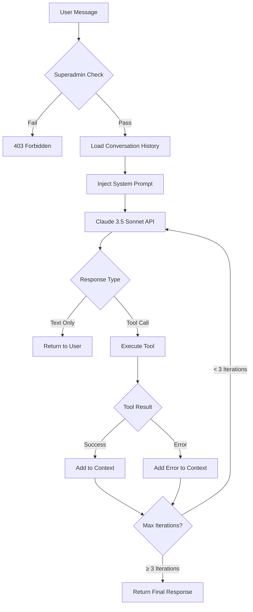

# Developer AI Architecture

**Version:** 1.0  
**Last Updated:** December 25, 2025  
**Status:** Production  
**Purpose:** Superadmin-only AI assistant for code development and system maintenance

---

## Overview

Developer AI is an autonomous coding assistant built on **Claude 3.5 Sonnet** (Anthropic), designed exclusively for superadmin users to perform advanced development tasks within the Aisha CRM codebase.

**Key Characteristics:**
- **Access Level:** Superadmin only (verified via `isSuperadmin()`)
- **Model:** Claude 3.5 Sonnet (claude-3-5-sonnet-20241022)
- **Execution Environment:** Docker container (`aishacrm-backend`)
- **Security:** Sandboxed, approval workflow required for destructive operations
- **Scope:** Backend development, debugging, testing, system diagnostics

---

## Conversation Flow Architecture

### 1. **Entry Point**
```
User → POST /api/ai/developer-chat → developerChat(message, userId, tenantId)
```

**Prerequisites:**
- User must have `is_superadmin = true` in `users` table
- Valid JWT token in request headers
- Request routed through `backend/routes/ai.js`

### 2. **Conversation Lifecycle**



### 3. **Tool Calling Flow**

**Standard Path:**
1. Claude proposes tool use (e.g., `read_file`, `search_code`)
2. Developer AI validates tool against whitelist
3. Execute tool with security checks
4. Return result to Claude in next message
5. Claude synthesizes and continues or returns final answer

**Critical Tools Flow:**
```
Destructive Tool (write_file, run_command) 
  → Require Explicit User Approval
  → Log to audit_logs table
  → Execute if approved
  → Return result with safety metadata
```

### 4. **Follow-Up Suggestions Architecture**

**After Every Response:**
Developer AI MUST provide 2-4 contextual follow-up suggestions based on:

| Scenario | Suggested Follow-Ups |
|----------|---------------------|
| **Code Read** | "Explain this function", "Show tests for this", "Find similar code", "Check for bugs" |
| **Bug Found** | "Suggest a fix", "Show related code", "Check git history", "Run tests" |
| **File Modified** | "Review changes", "Run tests", "Check syntax", "Compare with original" |
| **Test Run** | "Show failing test", "Explain error", "Fix test", "Run specific test" |
| **Search Complete** | "Read file", "Show usages", "Explain context", "Find related" |

**Implementation:**
```javascript
// In developerChat() response
{
  response: "...",
  suggestions: [
    { text: "Show tests for this module", action: "read_tests" },
    { text: "Find similar implementations", action: "search_similar" },
    { text: "Explain the algorithm", action: "explain" }
  ]
}
```

---

## System Prompt Structure

**Location:** `backend/lib/developerAI.js` → `buildDeveloperPrompt()`

**Sections:**
1. **Role Definition** - "You are Developer AI, a senior software engineer..."
2. **Codebase Context** - Architecture overview, key directories
3. **Tool Guidelines** - When to use each tool, security boundaries
4. **Safety Rules** - Never modify .env, require approval for destructive ops
5. **Response Format** - Concise, code-focused, include follow-ups
6. **Current Context** - File structure snapshot (refreshed per session)

**Key Directives:**
```
- Always read files before modifying
- Use search_code to understand dependencies
- Prefer incremental changes over rewrites
- Test after every modification
- Document changes in code comments
- NEVER expose secrets or credentials
- Suggest follow-up actions after every response
```

---

## Available Tools

### **Read Operations** (Low Risk)
| Tool | Purpose | Example |
|------|---------|---------|
| `read_file` | Read source code | `{ file_path: "backend/routes/ai.js" }` |
| `list_directory` | Explore structure | `{ dir_path: "backend/lib", recursive: true }` |
| `search_code` | Find patterns | `{ query: "suggest_next_actions", file_pattern: "*.js" }` |
| `view_logs` | Debug issues | `{ filter: "error", max_lines: 50 }` |
| `run_tests` | Validate code | `{ test_path: "backend/__tests__/ai" }` |

### **Write Operations** (High Risk - Require Approval)
| Tool | Purpose | Approval Required |
|------|---------|-------------------|
| `write_file` | Modify code | ✅ Yes (unless test file) |
| `run_command` | Execute shell | ✅ Yes (unless read-only) |
| `create_migration` | DB schema change | ✅ Yes (always) |

### **AI Testing Tools**
| Tool | Purpose | Use Case |
|------|---------|----------|
| `test_aisha` | Test AiSHA AI | Send message, observe tool calls, verify response |
| `analyze_conversation` | Debug chat flow | Review tool sequences, identify failures |

---

## Conversation Patterns

### **Pattern 1: Code Investigation**
```
User: "Why isn't suggest_next_actions being called?"
↓
Developer AI:
1. read_file(backend/routes/ai.js) [check tool registration]
2. search_code("suggest_next_actions") [find implementations]
3. view_logs(filter="suggest_next") [check runtime logs]
4. Response: "sessionEntities not extracted from req.body..."
   Suggestions: ["Show the fix", "Review frontend code", "Test the endpoint"]
```

### **Pattern 2: Bug Fix**
```
User: "Fix the sessionEntities bug"
↓
Developer AI:
1. read_file(backend/routes/ai.js, lines 1720-1750)
2. Propose fix (show diff)
3. Request approval → User confirms
4. write_file(backend/routes/ai.js, modified_content)
5. Response: "Fixed. Added sessionEntities extraction."
   Suggestions: ["Run tests", "Review changes", "Deploy to dev"]
```

### **Pattern 3: Testing AiSHA**
```
User: "Test if AiSHA can suggest next actions"
↓
Developer AI:
1. test_aisha({ message: "What should I do next about Jack Russel?" })
2. Observe tool_calls: [suggest_next_actions called with entity_id]
3. Response: "AiSHA correctly called suggest_next_actions with lead ID..."
   Suggestions: ["Test with different entity", "Check RAG results", "Review logs"]
```

---

## Security Boundaries

### **Allowed Paths**
- `/app/backend/**`
- `/app/braid-llm-kit/**`
- `/app/src/**` (frontend)

### **Forbidden Operations**
- Read/write `.env` files
- Modify `doppler.yaml`
- Access `/opt/` outside container
- Execute arbitrary network requests
- Modify production database directly

### **Command Safety**
```javascript
// Safe commands (auto-approved)
[ "ls", "cat", "grep", "find", "tail", "head", "wc", "pwd" ]

// Requires approval
[ "rm", "mv", "cp", "npm install", "git push", "docker", "psql" ]

// Forbidden
[ "curl", "wget", "ssh", "scp", "nc", "chmod +x" ]
```

---

## Error Handling

### **Tool Execution Failure**
```javascript
{
  error: "Tool execution failed",
  tool: "read_file",
  reason: "File not found: backend/routes/missing.js",
  suggestion: "Use list_directory to find available files"
}
```

**Developer AI Response:**
> "The file doesn't exist. Let me check the available routes..."  
> [Automatically calls list_directory]  
> Suggestions: ["Show all route files", "Search for similar routes"]

### **Permission Denied**
```javascript
{
  error: "Permission denied",
  tool: "write_file",
  reason: "Superadmin approval required",
  approval_request_id: "abc-123"
}
```

**Developer AI Response:**
> "This change requires your approval. I'll wait for confirmation before proceeding."

---

## Integration Points

### **With AiSHA AI**
- `test_aisha` tool sends messages to AiSHA endpoint
- Observes tool calls, response format, error handling
- Validates AiSHA's conversation flow

### **With Braid SDK**
- Can read Braid tool schemas
- Test Braid tools via `test_aisha`
- Debug Braid integration issues

### **With Database**
- Read-only queries via `run_command("psql -c ...")`
- Migration creation via `create_migration`
- Never direct writes (use backend APIs)

---

## Logging & Audit

**All Actions Logged:**
```sql
INSERT INTO audit_logs (
  user_id, 
  action, 
  details, 
  ip_address, 
  user_agent,
  severity
) VALUES (
  'superadmin-uuid',
  'developer_ai.write_file',
  '{"file": "backend/routes/ai.js", "approved": true}',
  '192.168.1.100',
  'Developer AI v1.0',
  'high'
);
```

**Metrics Tracked:**
- Tool calls per session
- Approval requests
- Failed operations
- Average response time

---

## Best Practices for Developers

### **When Using Developer AI**
1. **Be Specific** - "Fix sessionEntities bug in /chat endpoint" vs. "Fix AI"
2. **Provide Context** - Include error messages, file paths, line numbers
3. **Review Changes** - Always inspect code before approving writes
4. **Test Incrementally** - Run tests after each modification
5. **Use Follow-Ups** - Suggestions guide you through debugging workflow

### **When Modifying Developer AI**
1. **Update System Prompt** - If changing behavior, update `buildDeveloperPrompt()`
2. **Add Tools Carefully** - New tools need security review
3. **Test Tool Chains** - Ensure multi-step workflows complete
4. **Document Patterns** - Add new conversation patterns to this doc
5. **Log Everything** - Audit trail is critical for security

---

## Version History

| Version | Date | Changes |
|---------|------|---------|
| 1.0 | 2025-12-25 | Initial architecture documentation |

---

## References

- **Code:** `backend/lib/developerAI.js`
- **Routes:** `backend/routes/ai.js` → `/api/ai/developer-chat`
- **Security:** `backend/lib/devaiSecurity.js`, `backend/lib/commandSafety.js`
- **Tests:** `backend/__tests__/ai/developerAI.test.js` (if exists)
- **Related:** [AI Architecture - AiSHA AI](./AI_ARCHITECTURE_AISHA_AI.md)
