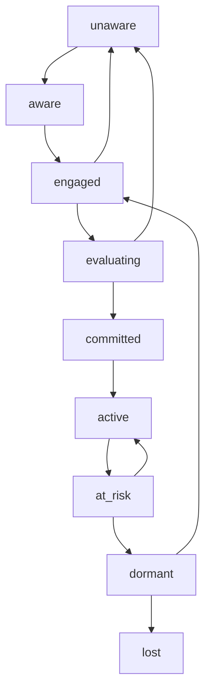

# C.A.R.E. - Customer Adaptive Response Engine

**Version:** 3.0.x  
**Last Updated:** January 25, 2026  
**Status:** Production  
**Purpose:** Intelligent decision layer for autonomous customer relationship management

---

## Overview

**C.A.R.E. (Customer Adaptive Response Engine)** is AiSHA's decision layer that continuously evaluates customer signals, determines relationship state, detects risk or opportunity, and decides _when action is required_—before any automation or agent execution occurs.

C.A.R.E. operates as a cognitive layer that:
- **Monitors** customer behavior patterns and engagement signals
- **Analyzes** relationship health and progression state  
- **Detects** escalation scenarios requiring immediate attention
- **Proposes** state transitions and action candidates
- **Audits** all decisions for transparency and learning
- **Triggers** external workflows when intervention is needed

### Key Principles

1. **Signal-Driven**: All decisions based on observable customer signals
2. **State-Aware**: Maintains relationship context and progression
3. **Escalation-Focused**: Prioritizes scenarios requiring human attention  
4. **Audit-First**: Every decision is logged for analysis and improvement
5. **Workflow-Ready**: Integrates seamlessly with external automation systems

---

## Architecture

```
Customer Signals → C.A.R.E. Engine → Decision Output → Workflow Integration
     ↓                    ↓                ↓              ↓
- Lead Activity      State Engine    Audit Logs    Webhook Triggers
- Deal Progress      Escalation      Suggestions   External CRMs
- Email Engagement   Transition      Alerts        Marketing Tools
- Meeting Outcomes   Proposals       Reports       Sales Platforms
```

### Core Components

| Component | Purpose | Location |
|-----------|---------|----------|
| **Trigger Detector** | Identifies conditions requiring attention | `aiTriggersWorker.js` |
| **State Engine** | Manages relationship progression states | `careStateEngine.js` |
| **Escalation Detector** | Identifies high-priority scenarios | `careEscalationDetector.js` |
| **Audit Emitter** | Logs all decisions and rationale | `careAuditEmitter.js` |
| **Signal Adapter** | Converts triggers to C.A.R.E. signals | `careTriggerSignalAdapter.js` |
| **Workflow Client** | Sends webhook notifications | `careWorkflowTriggerClient.js` |
| **State Store** | Persists relationship states | `careStateStore.js` |

---

## Customer Relationship States

C.A.R.E. tracks customers through a standardized relationship progression:

| State | Description | Typical Signals |
|-------|-------------|----------------|
| `unaware` | No awareness of offering | No engagement, cold outreach |
| `aware` | Knows we exist, no interaction | Website visits, content views |
| `engaged` | Active conversation, exploring fit | Email replies, meeting attendance |
| `evaluating` | Considering specific proposal | Proposal requests, technical discussions |
| `committed` | Made commitment (verbal/written) | Contract discussions, verbal agreement |
| `active` | Ongoing relationship (customer) | Regular usage, payments, expansion talks |
| `at_risk` | Showing signs of disengagement | Reduced usage, support complaints |
| `dormant` | Inactive for extended period | No activity for 30+ days |
| `lost` | Relationship terminated | Churn, cancellation, competitor choice |

### State Transitions



---

## Trigger Types

C.A.R.E. continuously monitors for these trigger conditions:

### 1. Lead Management Triggers

| Trigger | Condition | Default Threshold | Action Candidates |
|---------|-----------|------------------|-------------------|
| `lead_stagnant` | Lead inactive for extended period | 7+ days | Follow-up task, re-engagement campaign |
| `lead_hot` | High engagement, quick response | Multiple touchpoints in 24h | Priority routing, immediate assignment |
| `lead_regression` | Engagement decreasing | Response time increasing | Intervention call, value re-alignment |

### 2. Opportunity Management Triggers

| Trigger | Condition | Default Threshold | Action Candidates |
|---------|-----------|------------------|-------------------|
| `deal_decay` | Opportunity with no activity | 14+ days | Check-in call, proposal refresh |
| `opportunity_hot` | High probability, closing soon | 70%+ probability, <14 days | Closing meeting, contract preparation |
| `deal_regression` | Stage movement backwards | Stage downgrade | Recovery call, objection handling |

### 3. Activity Management Triggers

| Trigger | Condition | Default Threshold | Action Candidates |
|---------|-----------|------------------|-------------------|
| `activity_overdue` | Past due date, incomplete | 1+ days overdue | Reschedule task, completion reminder |
| `meeting_no_show` | Scheduled meeting not attended | No attendance logged | Follow-up message, reschedule offer |

### 4. Account Health Triggers

| Trigger | Condition | Default Threshold | Action Candidates |
|---------|-----------|------------------|-------------------|
| `account_risk` | Multiple negative signals | Low engagement + complaints | Account review, relationship audit |
| `contact_inactive` | Key contact not responding | 21+ days silence | Alternative contact, escalation path |
| `expansion_opportunity` | Usage patterns suggest growth | High activity, feature requests | Upgrade proposal, expansion meeting |

### 5. Behavioral Pattern Triggers

| Trigger | Condition | Default Threshold | Action Candidates |
|---------|-----------|------------------|-------------------|
| `engagement_spike` | Unusual increase in activity | 3x normal engagement | Strike while hot, accelerate process |
| `sentiment_decline` | Negative communication tone | Sentiment score <0.3 | Relationship repair, feedback session |
| `competitor_mention` | References to alternatives | Competitor names detected | Competitive positioning, value demonstration |

---

## Escalation Detection

C.A.R.E. automatically identifies scenarios requiring immediate human intervention:

### Escalation Criteria

1. **High-Value Risk** - Large deals showing decay signals
2. **Relationship Crisis** - Multiple negative signals simultaneously  
3. **Time-Critical** - Opportunities with imminent close dates
4. **Strategic Importance** - Key accounts showing concerning patterns
5. **Repeated Failures** - Multiple failed intervention attempts

### Escalation Severity Levels

| Level | Description | Response Time | Notification Method |
|-------|-------------|---------------|-------------------|
| `low` | Minor issue, standard process | 24-48 hours | Email notification |
| `medium` | Notable concern, expedited handling | 4-8 hours | Slack + email |
| `high` | Significant risk, urgent intervention | 1-2 hours | SMS + Slack + email |
| `critical` | Immediate crisis, executive involvement | <30 minutes | Phone + all channels |

---

## Audit & Telemetry

Every C.A.R.E. decision is logged for analysis and improvement:

### Audit Event Types

| Event Type | Description | When Triggered |
|------------|-------------|----------------|
| `trigger_detected` | Condition requiring attention identified | Trigger threshold met |
| `escalation_detected` | High-priority scenario flagged | Escalation criteria met |
| `state_proposed` | Relationship state transition suggested | State engine analysis |
| `state_applied` | Relationship state actually changed | State write enabled |
| `action_candidate` | Specific action recommended | Action proposal generated |
| `action_skipped` | Potential action not taken | Policy gate blocked |
| `workflow_triggered` | External system notified | Webhook sent |

### Audit Log Schema

```json
{
  "tenant_id": "uuid",
  "entity_type": "lead|contact|account|opportunity|activity",
  "entity_id": "uuid", 
  "event_type": "trigger_detected",
  "action_origin": "care_autonomous|user_directed",
  "reason": "Detailed explanation of why this decision was made",
  "policy_gate_result": "allowed|blocked|escalated",
  "meta": {
    "trigger_type": "lead_stagnant",
    "confidence": 0.85,
    "signals": {...},
    "context": {...}
  },
  "ts": "2026-01-25T12:00:00.000Z"
}
```

---

## Workflow Integration

C.A.R.E. can trigger external workflows through webhooks for seamless automation.

### Configuration (UI-Driven via Workflow Builder)

**C.A.R.E. configuration is 100% UI-driven** through the Workflow Builder:

1. **Open Workflow Builder**: Navigate to Workflows → Create New Workflow
2. **Add CARE Start Node**: Drag "CARE Start" node from node library onto canvas
3. **Configure Node**: Click node to open configuration panel:
   - **Tenant ID** (required): UUID of tenant (e.g., `a11dfb63-4b18-4eb8-872e-747af2e37c46`)
   - **Enabled**: Toggle on/off (default: enabled)
   - **Shadow Mode**: Observation-only mode (default: enabled for safety)
   - **State Write**: Allow state persistence (default: disabled)
   - **Webhook Timeout**: Request timeout in milliseconds (default: 3000)
   - **Max Retries**: Webhook retry attempts (default: 2)
4. **Save Workflow**: Click "Save" - backend automatically:
   - Creates/updates `care_workflow_config` table entry
   - Links workflow to C.A.R.E. system
   - Generates webhook URL: `http://backend:3001/api/workflows/{workflow_id}/webhook`
   - **No manual API calls required!**

**Important: One Config Per Tenant**
- Each tenant can have MULTIPLE workflows with CARE Start nodes
- Only the MOST RECENTLY SAVED workflow becomes active for that tenant
- Saving a new CARE workflow updates the tenant's configuration
- Removing the CARE Start node and saving deletes the configuration

### Environment Variables (System-Wide Control Only)

Environment variables control **system-wide behavior**, NOT per-tenant configuration:

```bash
# Production settings (via Doppler)
AI_TRIGGERS_WORKER_ENABLED=true              # Enable automatic trigger polling
AI_TRIGGERS_WORKER_INTERVAL_MS=15000         # Poll every 15 seconds
CARE_STATE_WRITE_ENABLED=true                # Allow state persistence globally
CARE_WORKFLOW_TRIGGERS_ENABLED=true          # Allow webhook triggers globally

# Development settings (via Doppler)
AI_TRIGGERS_WORKER_ENABLED=false             # Disable automatic polling (manual only)
AI_TRIGGERS_WORKER_INTERVAL_MS=15000         # Interval if enabled
CARE_STATE_WRITE_ENABLED=true                # Allow state persistence
CARE_WORKFLOW_TRIGGERS_ENABLED=true          # Allow webhook triggers
```

**Note**: Per-tenant settings (workflow_id, is_enabled, shadow_mode, webhook_timeout_ms, webhook_max_retries) come from the `care_workflow_config` database table, populated automatically when you save a workflow with a CARE Start node.

### Webhook Payload Schema

```json
{
  "event_id": "trigger-1769363338197-3tim3dqhp",
  "type": "care.trigger_detected",
  "ts": "2026-01-25T17:48:58.197Z",
  "tenant_id": "a11dfb63-4b18-4eb8-872e-747af2e37c46",
  "entity_type": "lead",
  "entity_id": "92d02dd6-ce91-472d-8d20-4f1631ef03f2",
  "action_origin": "care_autonomous",
  "trigger_type": "lead_stagnant", 
  "policy_gate_result": "allowed",
  "reason": "Lead stagnant 8 days (status=new)",
  "care_state": "unaware",
  "escalation_status": null,
  "deep_link": "/app/leads/92d02dd6-ce91-472d-8d20-4f1631ef03f2",
  "intent": "triage_trigger",
  "meta": {
    "days_stagnant": 8,
    "lead_name": "John Smith",
    "status": "new"
  }
}
```

### Supported Webhook Events

| Event Type | Description | When Sent |
|------------|-------------|-----------|
| `care.trigger_detected` | Standard trigger condition met | All trigger types |
| `care.escalation_detected` | High-priority scenario identified | Escalation criteria met |
| `care.state_changed` | Customer relationship state updated | State transitions |
| `care.action_recommended` | Specific action proposed | Action candidates generated |

---

## CRM Integration Guide

### Step 1: Enable C.A.R.E. System (One-Time Setup)

Configure system-wide C.A.R.E. behavior via environment variables (Doppler for production):

```bash
# Production Environment (via Doppler prd_prd config)
AI_TRIGGERS_WORKER_ENABLED=true              # Enable automatic trigger detection
AI_TRIGGERS_WORKER_INTERVAL_MS=15000         # Poll every 15 seconds
CARE_STATE_WRITE_ENABLED=true                # Allow state persistence
CARE_WORKFLOW_TRIGGERS_ENABLED=true          # Allow workflow webhooks

# Development Environment (via Doppler dev_personal config)
AI_TRIGGERS_WORKER_ENABLED=false             # Disable automatic polling
AI_TRIGGERS_WORKER_INTERVAL_MS=15000         # Interval if enabled
CARE_STATE_WRITE_ENABLED=true                # Allow state persistence
CARE_WORKFLOW_TRIGGERS_ENABLED=true          # Allow workflow webhooks
```

**Note**: This is a one-time system configuration. Per-tenant settings are configured via the Workflow Builder UI (see Step 2).

### Step 2: Configure C.A.R.E. Workflow (Per-Tenant, UI-Driven)

1. **Open Workflow Builder**: Navigate to Workflows in AiSHA CRM
2. **Create New Workflow**: Click "Create New Workflow"
3. **Add CARE Start Node**: Drag "CARE Start" trigger node onto canvas
4. **Configure CARE Start Node**:
   - **Tenant ID**: Enter tenant UUID (required)
   - **Enabled**: Toggle to enable C.A.R.E. for this tenant (default: on)
   - **Shadow Mode**: Observation-only mode (default: on for safety)
   - **State Write**: Allow state persistence (default: off)
   - **Webhook Timeout**: Request timeout in ms (default: 3000)
   - **Max Retries**: Retry attempts (default: 2)
5. **Add Workflow Steps**: Design your response workflow (tasks, notifications, etc.)
6. **Save Workflow**: Backend automatically syncs configuration to `care_workflow_config` table

**No manual API calls or SQL inserts required!** The Workflow Builder handles everything.

### Step 3: Implement Webhook Receiver (If Using External System)

```javascript
// Example webhook receiver for your CRM
app.post('/aishacare/webhook', (req, res) => {
  const signature = req.headers['x-care-signature'];
  const payload = req.body;
  
  // Verify webhook authenticity
  if (!verifyWebhookSignature(payload, signature)) {
    return res.status(401).send('Unauthorized');
  }
  
  // Process C.A.R.E. event
  switch (payload.type) {
    case 'care.trigger_detected':
      handleTriggerDetected(payload);
      break;
    case 'care.escalation_detected':  
      handleEscalationDetected(payload);
      break;
    case 'care.state_changed':
      handleStateChanged(payload);
      break;
  }
  
  res.status(200).send('OK');
});

function handleTriggerDetected(payload) {
  // Create task in your CRM
  createTask({
    title: `C.A.R.E. Alert: ${payload.trigger_type}`,
    description: payload.reason,
    assignee: getAccountOwner(payload.entity_id),
    priority: payload.escalation_status ? 'high' : 'normal',
    due_date: calculateDueDate(payload.trigger_type),
    crm_link: `https://aishacrm.com${payload.deep_link}`
  });
}

function handleEscalationDetected(payload) {
  // Send urgent notification
  sendSlackAlert({
    channel: '#sales-alerts',
    message: `🚨 C.A.R.E. Escalation: ${payload.reason}`,
    entity_link: payload.deep_link,
    severity: payload.escalation_status
  });
  
  // Create high-priority task
  createUrgentTask(payload);
}
```

### Step 4: Map Entity Types to CRM Objects

```javascript
// Entity type mapping for your CRM
const ENTITY_TYPE_MAPPING = {
  'lead': 'Lead',
  'contact': 'Contact', 
  'account': 'Account',
  'opportunity': 'Opportunity',
  'activity': 'Task'
};

function getCRMRecord(entityType, entityId) {
  const crmType = ENTITY_TYPE_MAPPING[entityType];
  return fetchFromCRM(crmType, entityId);
}
```

### Step 5: Configure Trigger Thresholds (Optional)

```bash
# Customize trigger sensitivity in .env
CARE_LEAD_STAGNANT_DAYS=5          # Default: 7
CARE_DEAL_DECAY_DAYS=10            # Default: 14
CARE_ACTIVITY_OVERDUE_HOURS=8      # Default: 24
CARE_ESCALATION_THRESHOLD=0.7      # Default: 0.5
```

---

## API Reference

### Manual Trigger Testing

```bash
# Trigger C.A.R.E. analysis for specific tenant
POST /api/internal/ai/triggers/run
{
  "tenant_id": "uuid",
  "trigger_types": ["lead_stagnant", "deal_decay"]  # optional filter
}
```

### State Management

```bash
# Get current C.A.R.E. state for entity
GET /api/internal/care/state/:entityType/:entityId

# Update C.A.R.E. state (admin only)
PUT /api/internal/care/state/:entityType/:entityId
{
  "care_state": "engaged",
  "reason": "Customer replied to proposal email",
  "action_origin": "user_directed"
}
```

### Audit Queries

```bash
# Get C.A.R.E. audit logs for entity
GET /api/internal/care/audit/:entityType/:entityId?limit=50

# Get escalation history for tenant
GET /api/internal/care/escalations?tenant_id=uuid&days=7
```

---

## Feature Flags & Configuration

### Environment Variables

| Variable | Description | Default | Required |
|----------|-------------|---------|----------|
| `AI_TRIGGERS_WORKER_ENABLED` | Enable C.A.R.E. trigger detection | `false` | Yes |
| `CARE_STATE_WRITE_ENABLED` | Allow state persistence | `false` | No |
| `CARE_WORKFLOW_TRIGGERS_ENABLED` | Enable webhook notifications | `false` | No |
| `CARE_ESCALATION_ENABLED` | Enable escalation detection | `true` | No |
| `CARE_AUDIT_ENABLED` | Enable decision logging | `true` | No |

### Runtime Configuration

```javascript
// Dynamically adjust trigger sensitivity
await updateTriggerConfig({
  lead_stagnant_days: 5,        // Faster lead follow-up
  deal_decay_days: 7,           // More aggressive deal monitoring  
  escalation_threshold: 0.8     // Higher escalation bar
});
```

---

## Monitoring & Analytics

### Key Metrics

- **Trigger Detection Rate** - Triggers per hour/day
- **Escalation Accuracy** - % of escalations requiring action  
- **State Transition Velocity** - Time between state changes
- **Workflow Response Time** - Webhook processing latency
- **Action Success Rate** - % of suggested actions taken

### Dashboard Queries

```sql
-- C.A.R.E. trigger volume by type (last 7 days)
SELECT 
  trigger_type,
  COUNT(*) as trigger_count,
  AVG(CASE WHEN escalation_status IS NOT NULL THEN 1 ELSE 0 END) as escalation_rate
FROM care_audit_logs 
WHERE event_type = 'trigger_detected'
  AND ts >= NOW() - INTERVAL '7 days'
GROUP BY trigger_type;

-- Relationship state distribution by tenant
SELECT 
  tenant_id,
  care_state,
  COUNT(*) as entity_count
FROM care_states 
GROUP BY tenant_id, care_state;
```

---

## Troubleshooting

### Common Issues

**Triggers not firing:**
- Check `AI_TRIGGERS_WORKER_ENABLED=true`
- Verify cron job is running in monitor
- Review trigger thresholds in configuration

**Webhook failures:**
- Validate webhook URL accessibility
- Check webhook secret configuration  
- Review timeout settings
- Monitor webhook retry attempts

**State inconsistencies:**
- Enable audit logging for full decision trail
- Check entity type validation in C.A.R.E. engine
- Verify tenant isolation in database queries

### Debug Commands

```bash
# Check C.A.R.E. worker status
docker exec aishacrm-backend npm run care:status

# Manual trigger test
docker exec aishacrm-backend npm run care:trigger -- --tenant-id=uuid

# View recent audit logs
docker exec aishacrm-backend npm run care:logs -- --lines=100

# Validate webhook configuration
docker exec aishacrm-backend npm run care:webhook-test
```

---

## Development & Extension

### Adding Custom Triggers

1. **Define trigger in `aiTriggersWorker.js`:**
```javascript
const TRIGGER_TYPES = {
  // ... existing triggers
  CUSTOM_PATTERN: 'custom_pattern'
};
```

2. **Implement detection logic:**
```javascript
async function detectCustomPattern(tenantUuid) {
  // Your detection logic here
  return candidateEntities;
}
```

3. **Add to processing loop:**
```javascript
// In processTriggersForTenant()
const customPatterns = await detectCustomPattern(tenantUuid);
for (const entity of customPatterns) {
  await createSuggestionIfNew(tenantUuid, {
    triggerId: TRIGGER_TYPES.CUSTOM_PATTERN,
    recordType: 'lead', // or other type
    recordId: entity.id,
    context: entity.customContext
  });
}
```

### Custom Signal Types

1. **Define in `careSignals.js`:**
```javascript
export const CUSTOM_SIGNALS = {
  ENGAGEMENT_VELOCITY: 'engagement_velocity',
  CONTENT_AFFINITY: 'content_affinity'
};
```

2. **Implement signal extraction:**
```javascript
export function extractCustomSignals(triggerData) {
  return {
    engagement_velocity: calculateVelocity(triggerData),
    content_affinity: analyzeContentInteraction(triggerData)
  };
}
```

### Custom Escalation Rules

1. **Extend escalation detector:**
```javascript
// In careEscalationDetector.js
export function detectCustomEscalation(signals) {
  if (signals.engagement_velocity < -0.5 && signals.value > 100000) {
    return {
      is_escalation: true,
      severity: 'high',
      reason: 'High-value prospect showing rapid disengagement'
    };
  }
  return { is_escalation: false };
}
```

---

## Version History

| Version | Date | Changes |
|---------|------|---------|
| 1.0 | 2024-Q4 | Initial C.A.R.E. implementation |
| 2.0 | 2025-Q1 | State persistence, webhook integration |  
| 3.0 | 2025-Q4 | Enhanced escalation detection, audit logging |

---

## References

- **Implementation:** `backend/lib/care/` directory
- **Configuration:** `backend/lib/aiTriggersWorker.js`  
- **API Routes:** `backend/routes/ai.js` → `/api/ai/*`
- **Database Schema:** `backend/migrations/116_customer_care_state.sql`
- **Webhook Client:** `backend/lib/care/careWorkflowTriggerClient.js`
- **Related Docs:** 
  - [AI Architecture - AiSHA AI](./AI_ARCHITECTURE_AISHA_AI.md)
  - [Database Guide](./DATABASE_GUIDE.md)
  - [Developer Manual](./DEVELOPER_MANUAL.md)

---

**For technical support:** Contact the AiSHA development team  
**For configuration assistance:** See the Admin Guide  
**For integration help:** Review the API documentation and webhook examples above