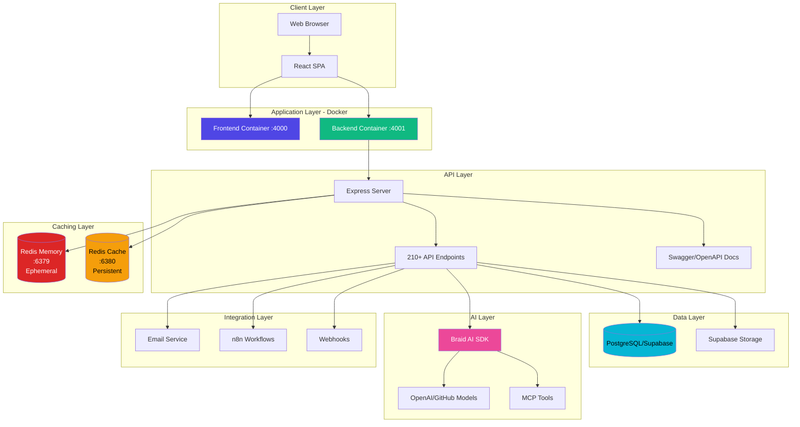
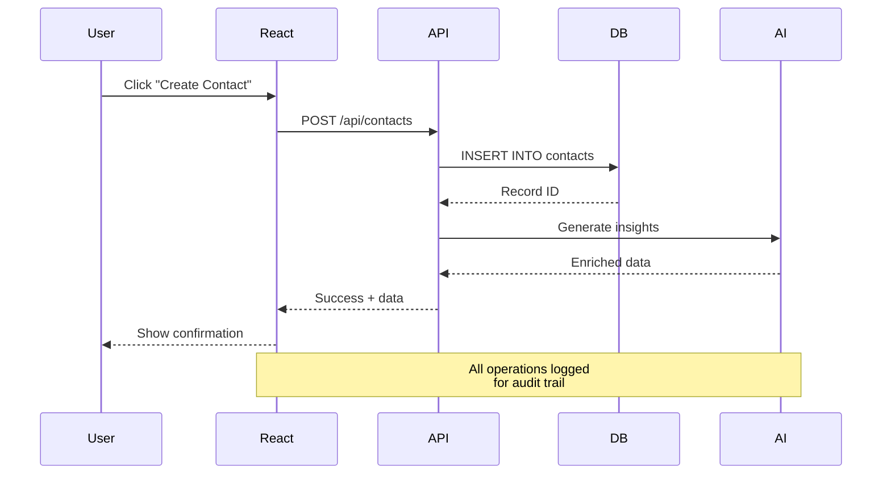
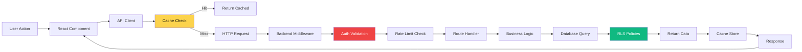

# Aisha CRM Developer Technical Manual

**Version 2.0** | **Updated: November 2025**

---

## 📖 Table of Contents

### Chapter 1: Development Environment Setup
- [1.1 Prerequisites](#11-prerequisites)
- [1.2 Repository Setup](#12-repository-setup)
- [1.3 IDE Configuration](#13-ide-configuration)
- [1.4 Development Workflow](#14-development-workflow)

### Chapter 2: Architecture Overview
- [2.1 System Architecture](#21-system-architecture)
- [2.2 Technology Stack](#22-technology-stack)
- [2.3 Project Structure](#23-project-structure)
- [2.4 Data Flow](#24-data-flow)
- [2.5 Design Patterns](#25-design-patterns)

### Chapter 3: Frontend Development
- [3.1 React Application Structure](#31-react-application-structure)
- [3.2 Component Architecture](#32-component-architecture)
- [3.3 State Management](#33-state-management)
- [3.4 Routing](#34-routing)
- [3.5 API Integration](#35-api-integration)
- [3.6 UI Components](#36-ui-components)
- [3.7 Styling](#37-styling)

### Chapter 4: Backend Development
- [4.1 Express Server Architecture](#41-express-server-architecture)
- [4.2 API Routes](#42-api-routes)
- [4.3 Database Integration](#43-database-integration)
- [4.4 Middleware](#44-middleware)
- [4.5 Error Handling](#45-error-handling)

### Chapter 5: Database Development
- [5.1 Schema Design](#51-schema-design)
- [5.2 Migrations](#52-migrations)
- [5.3 Supabase Integration](#53-supabase-integration)
- [5.4 Query Optimization](#54-query-optimization)

### Chapter 6: AI & Braid SDK Integration
- [6.1 Braid SDK Overview](#61-braid-sdk-overview)
- [6.2 Agent Development](#62-agent-development)
- [6.3 AI Conversations](#63-ai-conversations)
- [6.4 Tool Integration](#64-tool-integration)

### Chapter 7: API Development
- [7.1 REST API Design](#71-rest-api-design)
- [7.2 API Documentation](#72-api-documentation)
- [7.3 Authentication & Authorization](#73-authentication--authorization)
- [7.4 Rate Limiting](#74-rate-limiting)
- [7.5 Versioning](#75-versioning)
- [7.6 API v2 (AI-Enhanced)](#76-api-v2-ai-enhanced)
- [7.7 Deprecation Headers](#77-deprecation-headers)

### Chapter 8: Testing
- [8.1 Testing Strategy](#81-testing-strategy)
- [8.2 Unit Testing](#82-unit-testing)
- [8.3 Integration Testing](#83-integration-testing)
- [8.4 E2E Testing](#84-e2e-testing)
- [8.5 Test Coverage](#85-test-coverage)

### Chapter 9: Docker & Deployment
- [9.1 Docker Configuration](#91-docker-configuration)
- [9.2 Multi-Container Setup](#92-multi-container-setup)
- [9.3 Environment Configuration](#93-environment-configuration)
- [9.4 Production Build](#94-production-build)

### Chapter 10: Troubleshooting & Debugging
- [10.1 Common Development Issues](#101-common-development-issues)
- [10.2 Debugging Tools](#102-debugging-tools)
- [10.3 Performance Profiling](#103-performance-profiling)
- [10.4 Error Tracking](#104-error-tracking)

### Chapter 11: Code Standards & Best Practices
- [11.1 Coding Conventions](#111-coding-conventions)
- [11.2 Git Workflow](#112-git-workflow)
- [11.3 Code Review Process](#113-code-review-process)
- [11.4 Documentation Standards](#114-documentation-standards)

### Chapter 12: Contributing
- [12.1 Getting Started](#121-getting-started)
- [12.2 Feature Development](#122-feature-development)
- [12.3 Bug Fixes](#123-bug-fixes)
- [12.4 Pull Request Guidelines](#124-pull-request-guidelines)

### Chapter 13: Developing for Customer C.A.R.E.
- [13.1 C.A.R.E. Architecture for Developers](#131-care-architecture-for-developers)
- [13.2 Adding Custom Escalation Detectors](#132-adding-custom-escalation-detectors)
- [13.3 Extending Policy Gates](#133-extending-policy-gates)
- [13.4 Creating Custom C.A.R.E. Triggers](#134-creating-custom-care-triggers)
- [13.5 Testing C.A.R.E. Components](#135-testing-care-components)
- [13.6 Debugging C.A.R.E. Operations](#136-debugging-care-operations)

### Appendices
- [Appendix A: API Reference](#appendix-a-api-reference)
- [Appendix B: Component Library](#appendix-b-component-library)
- [Appendix C: Database Schema](#appendix-c-database-schema)
- [Appendix D: Environment Variables](#appendix-d-environment-variables)
- [Appendix E: Build Scripts](#appendix-e-build-scripts)

---

# Chapter 1: Development Environment Setup

## 1.1 Prerequisites

### Required Software

| Software | Version | Purpose |
|----------|---------|---------|
| **Node.js** | 22.x LTS | Runtime environment |
| **npm** | 10.x+ | Package manager |
| **Docker Desktop** | 24.x+ | Containerization |
| **Git** | 2.40+ | Version control |
| **VS Code** | Latest | IDE (recommended) |
| **PostgreSQL** | 15+ | Database (optional for local dev) |

### Hardware Requirements

**Minimum:**
- CPU: 4 cores
- RAM: 8GB
- Disk: 20GB free space
- Network: Stable internet connection

**Recommended:**
- CPU: 8+ cores
- RAM: 16GB+
- Disk: 50GB+ SSD
- Network: 25+ Mbps

### VS Code Extensions (Recommended)

```json
{
  "recommendations": [
    "dbaeumer.vscode-eslint",
    "esbenp.prettier-vscode",
    "bradlc.vscode-tailwindcss",
    "ms-azuretools.vscode-docker",
    "GitHub.copilot",
    "ms-vscode.vscode-typescript-next",
    "dsznajder.es7-react-js-snippets"
  ]
}
```

## 1.2 Repository Setup

### Clone Repository

```bash
# Clone the repository
git clone https://github.com/your-org/aishacrm-2.git
cd aishacrm-2

# Checkout develop branch
git checkout develop

# Install dependencies
npm install

# Install backend dependencies
cd backend
npm install
cd ..
```

### Environment Configuration

> **🚨 CRITICAL: Always verify your location before running commands!**

```powershell
# STEP 1: Verify location (MANDATORY)
Get-Location

# STEP 2: Copy environment templates
cp .env.example .env
cp backend/.env.example backend/.env

# STEP 3: Edit environment files
# Update with your actual credentials
```

**Root `.env` Configuration:**

```ini
# Frontend Backend URL (Docker port)
VITE_AISHACRM_BACKEND_URL=http://localhost:4001

# Feature Flags
VITE_ENABLE_AI=true
VITE_ENABLE_DOCS=true
VITE_ENABLE_ANALYTICS=true

# Environment
NODE_ENV=development
```

**Backend `.env` Configuration:**

```ini
# Server
PORT=3001
FRONTEND_URL=http://localhost:4000
ALLOWED_ORIGINS=http://localhost:4000,http://localhost:5173

# Database (Supabase)
USE_SUPABASE_PROD=true
SUPABASE_URL=https://your-project.supabase.co
SUPABASE_SERVICE_ROLE_KEY=your-service-role-key

# Security
JWT_SECRET=your-secure-random-string
RATE_LIMIT_WINDOW_MS=60000
RATE_LIMIT_MAX=120

# Logging
LOG_LEVEL=debug
ENABLE_PERFORMANCE_LOGGING=true
```

### Database Setup

```sql
-- Create database (if self-hosting PostgreSQL)
CREATE DATABASE aishacrm;

-- Run migrations (in Supabase SQL Editor or via script)
-- See backend/migrations/001_init.sql
```

## 1.3 IDE Configuration

### VS Code Settings

Create `.vscode/settings.json`:

```json
{
  "editor.formatOnSave": true,
  "editor.defaultFormatter": "esbenp.prettier-vscode",
  "editor.codeActionsOnSave": {
    "source.fixAll.eslint": true
  },
  "eslint.validate": [
    "javascript",
    "javascriptreact"
  ],
  "tailwindCSS.experimental.classRegex": [
    ["cva\\(([^)]*)\\)", "[\"'`]([^\"'`]*).*?[\"'`]"],
    ["cn\\(([^)]*)\\)", "(?:'|\"|`)([^']*)(?:'|\"|`)"]
  ],
  "files.exclude": {
    "**/node_modules": true,
    "**/.git": true,
    "**/dist": true
  }
}
```

### ESLint Configuration

The project uses `eslint.config.js` (flat config):

```javascript
import js from '@eslint/js';
import globals from 'globals';
import react from 'eslint-plugin-react';
import reactHooks from 'eslint-plugin-react-hooks';
import reactRefresh from 'eslint-plugin-react-refresh';

export default [
  { ignores: ['dist', 'node_modules'] },
  {
    files: ['**/*.{js,jsx}'],
    languageOptions: {
      ecmaVersion: 2020,
      globals: globals.browser,
      parserOptions: {
        ecmaVersion: 'latest',
        ecmaFeatures: { jsx: true },
        sourceType: 'module',
      },
    },
    settings: { react: { version: '18.3' } },
    plugins: {
      react,
      'react-hooks': reactHooks,
      'react-refresh': reactRefresh,
    },
    rules: {
      ...js.configs.recommended.rules,
      ...react.configs.recommended.rules,
      ...react.configs['jsx-runtime'].rules,
      ...reactHooks.configs.recommended.rules,
      'react/jsx-no-target-blank': 'off',
      'react-refresh/only-export-components': [
        'warn',
        { allowConstantExport: true },
      ],
    },
  },
];
```

## 1.4 Development Workflow

### Starting Development Servers

> **🐳 DOCKER-BASED DEVELOPMENT (RECOMMENDED)**

```powershell
# Verify location first
Get-Location

# Start all containers
docker compose up -d --build

# View logs
docker logs -f aishacrm-frontend
docker logs -f aishacrm-backend

# Stop containers
docker compose down
```

**Access Points:**
- Frontend: http://localhost:4000
- Backend: http://localhost:4001
- API Docs: http://localhost:4001/api-docs

> **💡 TIP: Alternative Non-Docker Development**
>
> For faster iteration without Docker (not recommended for production-like testing):

```powershell
# Terminal 1: Frontend
npm run dev
# Access at http://localhost:5173

# Terminal 2: Backend (new terminal)
cd backend
npm run dev
# API at http://localhost:3001
```

### Auto-Restart Features

**Backend Auto-Restart Policy:**
- ✅ Changes to `.js` files trigger automatic restart
- ✅ **10 restarts per minute limit** (prevents crash loops)
- ✅ **2-second cooldown** between restarts
- ✅ Auto-exits if limit exceeded

```bash
# Safe mode (default)
npm run dev

# Unlimited mode (use with caution)
npm run dev:unlimited
```

### Hot Module Replacement (HMR)

Frontend uses Vite HMR:
- Changes to React components update instantly
- State preserved where possible
- Full reload on certain file types

---

# Chapter 2: Architecture Overview

## 2.1 System Architecture

### High-Level Architecture



### Redis Dual-Layer Architecture (v1.0.3+)

The application uses **two separate Redis instances** for different purposes:

#### 1. Memory Layer (Ephemeral - Port 6379)
- **Purpose:** Temporary operational data
- **Container:** `aishacrm-redis`
- **Use Cases:**
  - User presence tracking (live_status)
  - Session data
  - Real-time event coordination
- **Persistence:** None (data lost on restart)
- **Configuration:** `REDIS_MEMORY_URL=redis://aishacrm-redis:6379`

#### 2. Cache Layer (Persistent - Port 6380)
- **Purpose:** Performance optimization via caching
- **Container:** `aishacrm-redis-cache`
- **Use Cases:**
  - Activities stats caching (versioned invalidation)
  - API response caching
  - Computed aggregations
- **Persistence:** RDB snapshots (survives restarts)
- **TTL:** Varies by cache type (e.g., 30s for activities stats)
- **Configuration:** `REDIS_CACHE_URL=redis://aishacrm-redis-cache:6380`

**Monitoring:** Check cache performance at `/api/activities/monitor/stats` and `/api/system/cache-stats`

### Component Interaction Flow



## 2.2 Technology Stack

### Frontend Stack

| Technology | Version | Purpose |
|------------|---------|---------|
| **React** | 18.3+ | UI framework |
| **Vite** | 5.x | Build tool & dev server |
| **React Router** | 6.x | Client-side routing |
| **Tailwind CSS** | 3.x | Utility-first styling |
| **shadcn/ui** | Latest | Component library |
| **Lucide React** | Latest | Icon library |
| **TanStack Query** | 5.x | Server state management |
| **Sonner** | Latest | Toast notifications |

### Backend Stack

| Technology | Version | Purpose |
|------------|---------|---------|
| **Node.js** | 22.x | Runtime environment |
| **Express** | 4.x | Web framework |
| **PostgreSQL** | 15+ | Primary database |
| **Supabase** | Latest | Database + Auth + Storage |
| **Redis** (Memory) | 7.x | Ephemeral session/presence data |
| **Redis** (Cache) | 7.x | Persistent performance caching |
| **Swagger/OpenAPI** | 3.0 | API documentation |
| **Helmet.js** | Latest | Security middleware |
| **Express Rate Limit** | Latest | Rate limiting |

### AI & Integration Stack

| Technology | Purpose |
|------------|---------|
| **Braid SDK** | AI agent framework |
| **OpenAI API** | LLM capabilities |
| **GitHub Models** | Alternative LLM provider |
| **MCP (Model Context Protocol)** | Tool integration |
| **n8n** | Workflow automation |

### DevOps Stack

| Technology | Purpose |
|------------|---------|
| **Docker** | Containerization |
| **Docker Compose** | Multi-container orchestration |
| **Git** | Version control |
| **GitHub Actions** | CI/CD (optional) |
| **ESLint** | Code linting |
| **Prettier** | Code formatting |

## 2.3 Project Structure

### Root Directory Structure

```
aishacrm-2/
├── src/                          # Frontend source code
│   ├── api/                     # API client layer
│   │   ├── entities.js          # Entity CRUD operations
│   │   ├── functions.js         # Business logic functions
│   │   └── fallbackFunctions.js # Base44 failover logic
│   ├── components/              # React components
│   │   ├── ui/                  # shadcn/ui components
│   │   ├── shared/              # Shared utilities
│   │   ├── ai/                  # AI-specific components
│   │   ├── settings/            # Settings components
│   │   └── [domain]/            # Domain-specific components
│   ├── pages/                   # Route components
│   ├── utils/                   # Utility functions
│   ├── entities/                # Entity schemas
│   └── functions/               # Local functions
├── backend/                      # Backend server
│   ├── server.js                # Express app entry
│   ├── routes/                  # API route handlers (26 files)
│   ├── lib/                     # Shared backend utilities
│   ├── migrations/              # Database migrations
│   └── package.json
├── braid-llm-kit/               # Braid SDK integration
├── docs/                         # Documentation
├── public/                       # Static assets
├── tests/                        # Test files
├── docker-compose.yml           # Docker orchestration
├── Dockerfile                   # Frontend container
├── vite.config.js              # Vite configuration
├── tailwind.config.js          # Tailwind configuration
├── eslint.config.js            # ESLint configuration
└── package.json                 # Frontend dependencies
```

### Frontend Component Organization

```
src/components/
├── ui/                          # Base UI components (shadcn/ui)
│   ├── button.jsx
│   ├── card.jsx
│   ├── dialog.jsx
│   └── ... (40+ components)
├── shared/                      # Shared utilities & contexts
│   ├── ApiManager.jsx          # API caching & optimization
│   ├── ModuleManager.jsx       # Module settings
│   ├── TenantContext.jsx       # Multi-tenant context
│   ├── useUser.js              # User hook
│   └── ...
├── ai/                          # AI-specific components
│   ├── AiSidebar.jsx           # Main AI sidebar with voice/chat
│   ├── AiSidebar.css           # Sidebar styles
│   ├── AvatarWidget.jsx        # Floating AI avatar button
│   ├── useSpeechInput.js       # STT hook (microphone → transcript)
│   ├── useSpeechOutput.js      # TTS hook (text → audio playback)
│   ├── useRealtimeAiSHA.js     # WebRTC Realtime API connection
│   ├── usePushToTalkKeybinding.js  # Spacebar PTT keybinding
│   ├── useVoiceInteraction.js  # Unified voice state management
│   ├── realtimeTelemetry.js    # Voice telemetry events
│   └── agentSdkGuard.js        # SDK initialization
├── settings/                    # Settings page components
│   ├── ProfileSettings.jsx
│   ├── TenantSettings.jsx
│   └── ...
├── accounts/                    # Account domain
│   ├── AccountsTable.jsx
│   ├── AccountDetail.jsx
│   └── ...
├── contacts/                    # Contact domain
├── leads/                       # Lead domain
├── opportunities/               # Opportunity domain
└── ... (more domains)
```

#### AiSidebar overview for Phase 4 workstreams

- **Executive hero card:** `AiSidebar.jsx` renders the AiSHA avatar, tenant badge, and assistant status chips at the top of the drawer. The avatar lives at `public/assets/aisha-executive-portrait.jpg`; keep replacements the same dimensions (1:1 ratio) to preserve the glow ring.
- **Stacked interaction blocks:** Quick Actions, Guided Creations, suggestions, conversational forms, and transcript history are organized as separate `<section>` elements. When adding new widgets, keep them inside this stack so padding, scrollbar, and focus management remain consistent.
- **Voice + realtime controls:** The composer footer owns all realtime voice toggles, push-to-talk buttons, and legacy STT states. Route new behavior through `useRealtimeAiSHA`, `useSpeechInput`, and `useSpeechOutput` hooks instead of touching DOM APIs directly.
- **Preview workflow:** Use the dev servers for UI work—`npm run dev` (frontend) and `cd backend && npm run dev`—so Vite hot reloads the sidebar at `http://localhost:5173`. Docker builds (`docker compose up -d --build frontend`) bake whatever was in `src/` at build time and should be reserved for final verification.
- **Documentation handshake:** Every sidebar or voice UX change must be mirrored in `docs/AISHA_ASSISTANT_USER_GUIDE.md` so Phase 4 launch, support, and training materials stay synchronized.

### Backend Route Organization

```
backend/routes/
├── system.js          # Health, status, diagnostics
├── reports.js         # Dashboard stats, exports
├── validation.js      # Duplicate detection
├── database.js        # Sync, archive, cleanup
├── accounts.js        # Account CRUD
├── contacts.js        # Contact CRUD
├── leads.js           # Lead CRUD
├── opportunities.js   # Opportunity CRUD
├── activities.js      # Activity CRUD
├── employees.js       # Employee management
├── users.js           # User management
├── tenants.js         # Tenant management
├── ai.js              # AI conversations
├── documents.js       # Document processing
├── bizdevsources.js   # BizDev data sources
├── cashflow.js        # Cash flow tracking
├── integrations.js    # Third-party integrations
├── webhooks.js        # Webhook handling
├── workflows.js       # Workflow automation (experimental)
├── billing.js         # Billing & subscriptions
├── apikeys.js         # API key management
├── modulesettings.js  # Module configuration
├── notifications.js   # Notification system
├── permissions.js     # Permission management
├── telephony.js       # Phone integration
└── utils.js           # Utility endpoints
```

## 2.4 Data Flow

### Request/Response Lifecycle



### State Management Flow

```
User Input → Component State → API Call → Backend → Database
                ↓                                        ↓
         Local State Update                    Row-Level Security
                ↓                                        ↓
         Optimistic UI                         Filtered Results
                ↓                                        ↓
         Cache Update ← ← ← ← ← ← ← ← ← Server Response
                ↓
         Re-render Component
```

## 2.5 Design Patterns

### Frontend Patterns

#### 1. **Container/Presentational Pattern**

```jsx
// Container (smart component)
function ContactsContainer() {
  const [contacts, setContacts] = useState([]);
  const [loading, setLoading] = useState(true);

  useEffect(() => {
    loadContacts();
  }, []);

  const loadContacts = async () => {
    const data = await Contact.list();
    setContacts(data);
    setLoading(false);
  };

  return <ContactsPresentation contacts={contacts} loading={loading} />;
}

// Presentation (dumb component)
function ContactsPresentation({ contacts, loading }) {
  if (loading) return <Loader />;
  return <ContactsTable data={contacts} />;
}
```

#### 2. **Custom Hooks Pattern**

```jsx
// useUser.js - Reusable user logic
export function useUser() {
  const [user, setUser] = useState(null);
  const [loading, setLoading] = useState(true);

  useEffect(() => {
    User.me().then(setUser).finally(() => setLoading(false));
  }, []);

  return { user, loading };
}

// Usage in component
function ProfilePage() {
  const { user, loading } = useUser();
  // ... component logic
}
```

#### 3. **Render Props Pattern**

```jsx
function DataFetcher({ endpoint, render }) {
  const [data, setData] = useState(null);
  const [loading, setLoading] = useState(true);

  useEffect(() => {
    fetch(endpoint)
      .then(r => r.json())
      .then(setData)
      .finally(() => setLoading(false));
  }, [endpoint]);

  return render({ data, loading });
}

// Usage
<DataFetcher 
  endpoint="/api/contacts"
  render={({ data, loading }) => (
    loading ? <Loader /> : <Table data={data} />
  )}
/>
```

#### 4. **Higher-Order Component (HOC) Pattern**

```jsx
// withAuth.jsx - Authentication HOC
function withAuth(Component) {
  return function AuthenticatedComponent(props) {
    const { user, loading } = useUser();

    if (loading) return <Loader />;
    if (!user) return <Navigate to="/login" />;

    return <Component {...props} user={user} />;
  };
}

// Usage
export default withAuth(DashboardPage);
```

### Backend Patterns

#### 1. **Middleware Chain Pattern**

```javascript
// server.js
app.use(helmet());                    // Security headers
app.use(cors(corsOptions));           // CORS
app.use(express.json());              // Body parsing
app.use(rateLimiter);                 // Rate limiting
app.use(authenticateUser);            // Auth (optional)
app.use('/api', routes);              // Route handlers
app.use(errorHandler);                // Error handling
```

#### 2. **Repository Pattern**

```javascript
// Abstraction over data access
class ContactRepository {
  async findAll(tenantId) {
    return await supabase
      .from('contacts')
      .select('*')
      .eq('tenant_id', tenantId);
  }

  async findById(id) {
    return await supabase
      .from('contacts')
      .select('*')
      .eq('id', id)
      .single();
  }

  async create(data) {
    return await supabase
      .from('contacts')
      .insert(data)
      .select()
      .single();
  }
}
```

#### 3. **Service Layer Pattern**

```javascript
// Business logic separated from routes
class ContactService {
  constructor(repo) {
    this.repo = repo;
  }

  async createContact(data, user) {
    // Validation
    if (!data.email) throw new Error('Email required');

    // Business logic
    const enrichedData = await this.enrichContact(data);

    // Audit
    await this.createAuditLog(user, 'contact_created');

    // Persist
    return await this.repo.create(enrichedData);
  }

  async enrichContact(data) {
    // AI enrichment, validation, etc.
    return { ...data, score: calculateScore(data) };
  }
}
```

#### 4. **Factory Pattern**

```javascript
// Dynamic route creation
function createCrudRoutes(entityName, pool) {
  const router = express.Router();

  router.get('/', async (req, res) => {
    const { tenant_id } = req.query;
    const result = await pool.query(
      `SELECT * FROM ${entityName} WHERE tenant_id = $1`,
      [tenant_id]
    );
    res.json({ status: 'success', data: result.rows });
  });

  router.post('/', async (req, res) => {
    // ... create logic
  });

  return router;
}

// Usage
app.use('/api/contacts', createCrudRoutes('contacts', pool));
app.use('/api/accounts', createCrudRoutes('accounts', pool));
```

---

# Chapter 3: Frontend Development

## 3.1 React Application Structure

### Entry Point

**File: `src/main.jsx`**

```jsx
import React from 'react';
import ReactDOM from 'react-dom/client';
import { BrowserRouter } from 'react-router-dom';
import App from './App';
import './index.css';

ReactDOM.createRoot(document.getElementById('root')).render(
  <React.StrictMode>
    <BrowserRouter>
      <App />
    </BrowserRouter>
  </React.StrictMode>
);
```

### App Component

**File: `src/App.jsx`**

```jsx
import { Routes, Route } from 'react-router-dom';
import Layout from './pages/Layout';
import Dashboard from './pages/Dashboard';
import Contacts from './pages/Contacts';
// ... other imports

function App() {
  return (
    <Routes>
      <Route path="/" element={<Layout />}>
        <Route index element={<Dashboard />} />
        <Route path="contacts" element={<Contacts />} />
        <Route path="accounts" element={<Accounts />} />
        {/* ... other routes */}
      </Route>
    </Routes>
  );
}

export default App;
```

## 3.2 Component Architecture

### Component Hierarchy

```
Layout (Root)
├── ApiProvider
├── TenantProvider
├── TimezoneProvider
├── EmployeeScopeProvider
├── ErrorLogProvider
└── Content
    ├── Header
    │   ├── Logo
    │   ├── TenantSwitcher
    │   ├── SystemStatusIndicator
    │   ├── Clock
    │   └── UserMenu
    ├── Sidebar (Desktop)
    │   └── NavItems
    ├── MobileMenu
    │   └── NavItems
    ├── Main Content
    │   └── <Outlet /> (Page Component)
    └── GlobalComponents
        ├── NotificationPanel
        ├── GlobalDetailViewer
        ├── MCPManager
        └── ModalHost
```

### Component Categories

#### 1. **Page Components** (`src/pages/`)
Top-level route components that compose features.

```jsx
// pages/Contacts.jsx
function ContactsPage() {
  return (
    <div className="container">
      <ContactsHeader />
      <ContactsFilters />
      <ContactsTable />
      <ContactsPagination />
    </div>
  );
}
```

#### 2. **Feature Components** (`src/components/[domain]/`)
Domain-specific components with business logic.

```jsx
// components/contacts/ContactsTable.jsx
function ContactsTable() {
  const [contacts, setContacts] = useState([]);
  const [loading, setLoading] = useState(true);

  useEffect(() => {
    loadContacts();
  }, []);

  // ... table rendering logic
}
```

#### 3. **UI Components** (`src/components/ui/`)
Reusable, presentational components (shadcn/ui).

```jsx
// components/ui/button.jsx
export function Button({ className, variant, size, ...props }) {
  return (
    <button
      className={cn(buttonVariants({ variant, size, className }))}
      {...props}
    />
  );
}
```

#### 4. **Shared Components** (`src/components/shared/`)
Cross-cutting concerns: contexts, utilities, hooks.

```jsx
// components/shared/useUser.js
export function useUser() {
  const [user, setUser] = useState(null);
  const [loading, setLoading] = useState(true);

  useEffect(() => {
    User.me()
      .then(setUser)
      .catch(console.error)
      .finally(() => setLoading(false));
  }, []);

  return { user, loading, setUser };
}
```

## 3.3 State Management

### State Management Strategies

#### 1. **Local Component State**
For UI-only state (dropdowns, modals, forms).

```jsx
function ContactForm() {
  const [formData, setFormData] = useState({
    first_name: '',
    last_name: '',
    email: ''
  });

  const handleChange = (e) => {
    setFormData(prev => ({
      ...prev,
      [e.target.name]: e.target.value
    }));
  };

  // ... form logic
}
```

#### 2. **Context API**
For shared state across components.

```jsx
// TenantContext.jsx
const TenantContext = createContext();

export function TenantProvider({ children }) {
  const [selectedTenantId, setSelectedTenantId] = useState(null);

  return (
    <TenantContext.Provider value={{ selectedTenantId, setSelectedTenantId }}>
      {children}
    </TenantContext.Provider>
  );
}

export function useTenant() {
  return useContext(TenantContext);
}

// Usage in component
function SomeComponent() {
  const { selectedTenantId, setSelectedTenantId } = useTenant();
  // ...
}
```

#### 3. **API Manager (Caching)**
For server state with caching.

```jsx
// ApiManager.jsx
export function ApiProvider({ children }) {
  const cache = useRef(new Map());

  const cachedRequest = useCallback(async (entity, method, params, fallback) => {
    const key = `${entity}_${method}_${JSON.stringify(params)}`;

    if (cache.current.has(key)) {
      return cache.current.get(key);
    }

    const result = await fallback();
    cache.current.set(key, result);
    return result;
  }, []);

  const clearCache = useCallback((entity) => {
    if (entity) {
      for (const key of cache.current.keys()) {
        if (key.startsWith(entity)) {
          cache.current.delete(key);
        }
      }
    } else {
      cache.current.clear();
    }
  }, []);

  return (
    <ApiContext.Provider value={{ cachedRequest, clearCache }}>
      {children}
    </ApiContext.Provider>
  );
}
```

#### 4. **TanStack Query (Optional)**
For advanced server state management.

```jsx
import { useQuery, useMutation, useQueryClient } from '@tanstack/react-query';

function ContactsList() {
  const queryClient = useQueryClient();

  // Fetch contacts
  const { data: contacts, isLoading } = useQuery({
    queryKey: ['contacts'],
    queryFn: () => Contact.list()
  });

  // Create contact mutation
  const createMutation = useMutation({
    mutationFn: (newContact) => Contact.create(newContact),
    onSuccess: () => {
      queryClient.invalidateQueries(['contacts']);
    }
  });

  // ... component logic
}
```

### State Lifting Pattern

```jsx
// Parent manages shared state
function ContactsPage() {
  const [selectedContact, setSelectedContact] = useState(null);

  return (
    <>
      <ContactsTable onSelectContact={setSelectedContact} />
      <ContactDetails contact={selectedContact} />
    </>
  );
}
```

## 3.4 Routing

### Route Configuration

```jsx
// App.jsx or routes.jsx
<Routes>
  <Route path="/" element={<Layout />}>
    {/* Public routes */}
    <Route index element={<Dashboard />} />
    
    {/* CRM routes */}
    <Route path="contacts" element={<Contacts />} />
    <Route path="contacts/:id" element={<ContactDetail />} />
    <Route path="accounts" element={<Accounts />} />
    <Route path="leads" element={<Leads />} />
    <Route path="opportunities" element={<Opportunities />} />
    
    {/* Admin routes */}
    <Route path="settings" element={<Settings />} />
    <Route path="users" element={<Users />} />
    
    {/* AI routes */}
    <Route path="agent" element={<Agent />} />
    
    {/* Catch-all */}
    <Route path="*" element={<NotFound />} />
  </Route>
</Routes>
```

### Protected Routes

```jsx
// RouteGuard.jsx
function RouteGuard({ children, requiredRole }) {
  const { user, loading } = useUser();

  if (loading) return <Loader />;
  if (!user) return <Navigate to="/login" />;
  if (requiredRole && user.role !== requiredRole) {
    return <Navigate to="/unauthorized" />;
  }

  return children;
}

// Usage
<Route 
  path="admin" 
  element={
    <RouteGuard requiredRole="admin">
      <AdminPanel />
    </RouteGuard>
  } 
/>
```

### Navigation

```jsx
import { useNavigate, Link } from 'react-router-dom';

function ContactRow({ contact }) {
  const navigate = useNavigate();

  const handleClick = () => {
    navigate(`/contacts/${contact.id}`);
  };

  return (
    <tr onClick={handleClick}>
      <td>{contact.name}</td>
      <td>
        <Link to={`/contacts/${contact.id}`}>View</Link>
      </td>
    </tr>
  );
}
```

## 3.5 API Integration

### Entity API Client

**File: `src/api/entities.js`**

```javascript
const BACKEND_URL = import.meta.env.VITE_AISHACRM_BACKEND_URL;

class EntityAPI {
  constructor(entityName) {
    this.entityName = entityName;
    this.baseUrl = `${BACKEND_URL}/api/${entityName.toLowerCase()}`;
  }

  async list(params = {}) {
    const query = new URLSearchParams(params).toString();
    const url = query ? `${this.baseUrl}?${query}` : this.baseUrl;
    const response = await fetch(url);
    const result = await response.json();
    return result.data[this.entityName.toLowerCase()] || [];
  }

  async get(id) {
    const response = await fetch(`${this.baseUrl}/${id}`);
    const result = await response.json();
    return result.data;
  }

  async create(data) {
    const response = await fetch(this.baseUrl, {
      method: 'POST',
      headers: { 'Content-Type': 'application/json' },
      body: JSON.stringify(data)
    });
    return await response.json();
  }

  async update(id, data) {
    const response = await fetch(`${this.baseUrl}/${id}`, {
      method: 'PUT',
      headers: { 'Content-Type': 'application/json' },
      body: JSON.stringify(data)
    });
    return await response.json();
  }

  async delete(id) {
    const response = await fetch(`${this.baseUrl}/${id}`, {
      method: 'DELETE'
    });
    return await response.json();
  }

  async bulkCreate(items) {
    const response = await fetch(`${this.baseUrl}/bulk`, {
      method: 'POST',
      headers: { 'Content-Type': 'application/json' },
      body: JSON.stringify({ items })
    });
    return await response.json();
  }
}

// Export entity instances
export const Contact = new EntityAPI('Contact');
export const Account = new EntityAPI('Account');
export const Lead = new EntityAPI('Lead');
export const Opportunity = new EntityAPI('Opportunity');
export const User = new EntityAPI('User');
// ... more entities
```

### Function API Client

**File: `src/api/functions.js`**

```javascript
const BACKEND_URL = import.meta.env.VITE_AISHACRM_BACKEND_URL;

export async function createAuditLog(logData) {
  const response = await fetch(`${BACKEND_URL}/api/system/audit-log`, {
    method: 'POST',
    headers: { 'Content-Type': 'application/json' },
    body: JSON.stringify(logData)
  });
  return await response.json();
}

export async function findDuplicates(entity, tenantId) {
  const response = await fetch(`${BACKEND_URL}/api/validation/find-duplicates`, {
    method: 'POST',
    headers: { 'Content-Type': 'application/json' },
    body: JSON.stringify({ entity, tenant_id: tenantId })
  });
  return await response.json();
}

export async function getDashboardStats(tenantId) {
  const response = await fetch(
    `${BACKEND_URL}/api/reports/dashboard-stats?tenant_id=${tenantId}`
  );
  return await response.json();
}

// ... 197 functions total
```

### Error Handling

```javascript
// api/apiClient.js
class ApiError extends Error {
  constructor(message, status, data) {
    super(message);
    this.status = status;
    this.data = data;
  }
}

async function handleResponse(response) {
  if (!response.ok) {
    const error = await response.json().catch(() => ({}));
    throw new ApiError(
      error.message || 'Request failed',
      response.status,
      error
    );
  }
  return response.json();
}

// Usage in component
async function loadContacts() {
  try {
    const data = await Contact.list();
    setContacts(data);
  } catch (error) {
    if (error instanceof ApiError) {
      if (error.status === 401) {
        // Redirect to login
        navigate('/login');
      } else if (error.status === 403) {
        toast.error('You do not have permission');
      } else {
        toast.error(error.message);
      }
    } else {
      toast.error('An unexpected error occurred');
    }
  }
}
```

## 3.6 UI Components

### shadcn/ui Components

The project uses shadcn/ui for consistent, accessible components.

**Available Components:**

```
├── Accordion       ├── AspectRatio    ├── Avatar
├── Badge           ├── Button         ├── Calendar
├── Card            ├── Checkbox       ├── Collapsible
├── Command         ├── ContextMenu    ├── Dialog
├── Dropdown Menu   ├── Form           ├── HoverCard
├── Input           ├── Label          ├── Menubar
├── NavigationMenu  ├── Popover        ├── Progress
├── Radio Group     ├── ScrollArea     ├── Select
├── Separator       ├── Sheet          ├── Skeleton
├── Slider          ├── Switch         ├── Table
├── Tabs            ├── Textarea       ├── Toast
├── Toggle          ├── Tooltip        └── ...
```

### Component Usage Examples

#### Button

```jsx
import { Button } from '@/components/ui/button';

<Button variant="default">Default</Button>
<Button variant="destructive">Delete</Button>
<Button variant="outline">Cancel</Button>
<Button variant="ghost">Ghost</Button>
<Button size="sm">Small</Button>
<Button size="lg">Large</Button>
<Button disabled>Disabled</Button>
```

#### Card

```jsx
import { Card, CardHeader, CardTitle, CardDescription, CardContent, CardFooter } from '@/components/ui/card';

<Card>
  <CardHeader>
    <CardTitle>Contact Details</CardTitle>
    <CardDescription>View and edit contact information</CardDescription>
  </CardHeader>
  <CardContent>
    {/* Content here */}
  </CardContent>
  <CardFooter>
    <Button>Save Changes</Button>
  </CardFooter>
</Card>
```

#### Dialog

```jsx
import { Dialog, DialogTrigger, DialogContent, DialogHeader, DialogTitle, DialogDescription } from '@/components/ui/dialog';

<Dialog>
  <DialogTrigger asChild>
    <Button>Open Dialog</Button>
  </DialogTrigger>
  <DialogContent>
    <DialogHeader>
      <DialogTitle>Confirm Action</DialogTitle>
      <DialogDescription>Are you sure you want to proceed?</DialogDescription>
    </DialogHeader>
    {/* Dialog content */}
  </DialogContent>
</Dialog>
```

#### Table

```jsx
import { Table, TableHeader, TableBody, TableRow, TableHead, TableCell } from '@/components/ui/table';

<Table>
  <TableHeader>
    <TableRow>
      <TableHead>Name</TableHead>
      <TableHead>Email</TableHead>
      <TableHead>Actions</TableHead>
    </TableRow>
  </TableHeader>
  <TableBody>
    {contacts.map(contact => (
      <TableRow key={contact.id}>
        <TableCell>{contact.name}</TableCell>
        <TableCell>{contact.email}</TableCell>
        <TableCell>
          <Button size="sm">Edit</Button>
        </TableCell>
      </TableRow>
    ))}
  </TableBody>
</Table>
```

## 3.7 Styling

### Tailwind CSS

The project uses Tailwind CSS for styling with custom configuration.

**Configuration: `tailwind.config.js`**

```javascript
export default {
  darkMode: ["class"],
  content: [
    './index.html',
    './src/**/*.{js,jsx,ts,tsx}',
  ],
  theme: {
    extend: {
      colors: {
        border: "hsl(var(--border))",
        background: "hsl(var(--background))",
        foreground: "hsl(var(--foreground))",
        primary: {
          DEFAULT: "hsl(var(--primary))",
          foreground: "hsl(var(--primary-foreground))",
        },
        // ... more colors
      },
      borderRadius: {
        lg: "var(--radius)",
        md: "calc(var(--radius) - 2px)",
        sm: "calc(var(--radius) - 4px)",
      },
    },
  },
  plugins: [require("tailwindcss-animate")],
}
```

### Styling Conventions

```jsx
// Responsive classes
<div className="p-4 md:p-6 lg:p-8">

// Dark mode (project uses dark theme)
<div className="bg-slate-900 text-slate-100">

// Hover states
<button className="hover:bg-blue-600 hover:text-white">

// Conditional classes
<div className={cn(
  "base-classes",
  isActive && "active-classes",
  isDisabled && "disabled-classes"
)}>

// Grid layouts
<div className="grid grid-cols-1 md:grid-cols-2 lg:grid-cols-3 gap-4">

// Flexbox
<div className="flex items-center justify-between gap-2">
```

### Custom CSS

**File: `src/index.css`**

```css
@tailwind base;
@tailwind components;
@tailwind utilities;

@layer base {
  :root {
    --background: 222.2 84% 4.9%;
    --foreground: 210 40% 98%;
    --primary: 217.2 91.2% 59.8%;
    /* ... more CSS variables */
  }
}

@layer components {
  .btn-primary {
    @apply bg-blue-600 text-white hover:bg-blue-700 px-4 py-2 rounded;
  }
}
```

---

*[Continue with Chapters 4-5...]*

---

# Chapter 6: AI & Braid SDK Integration

## 6.1 Braid SDK Overview

### What is Braid?

**Braid** is a custom domain-specific language (DSL) created specifically for AiSHA to enable secure AI-database interactions. It was designed to solve the fundamental challenge of giving AI assistants safe, structured access to production databases.

### Why Braid Exists

Traditional approaches fall short:
- **Raw SQL is dangerous**: LLMs can hallucinate destructive queries
- **ORM wrappers are leaky**: No tenant isolation guarantees  
- **JSON schemas are verbose**: Tool definitions become unwieldy at scale

Braid provides:
- ✅ **Type-safe database operations** with automatic tenant isolation
- ✅ **Compile-time validation** of tool definitions
- ✅ **Read-only by default** with explicit write permissions
- ✅ **Built-in audit logging** for all AI operations

### Braid Tool Locations

```
braid-llm-kit/examples/assistant/
├── accounts.braid                 # Account CRUD
├── activities.braid               # Calendar/tasks
├── bizdev-sources.braid           # BizDev sources
├── contacts.braid                 # Contact CRUD
├── leads.braid                    # Lead management
├── lifecycle.braid                # v3.0.0 promotion/conversion
├── navigation.braid               # CRM page navigation
├── notes.braid                    # Note management
├── opportunities.braid            # Sales pipeline
├── snapshot.braid                 # Tenant data overview
├── suggestions.braid              # AI suggestions
├── telephony.braid                # AI calling
├── web-research.braid             # External research
└── workflows.braid                # Workflow automation
```

## 6.2 Braid Tool Development

### Tool Definition Syntax

Braid tools are defined in `.braid` files with TypeScript-like syntax:

```typescript
// Example: leads.braid
tool searchLeads(
  tenant_id: UUID,
  search?: string,
  status?: string,
  limit?: number = 20
): Lead[] {
  // Braid automatically:
  // 1. Validates tenant_id is UUID
  // 2. Adds tenant isolation to query
  // 3. Logs execution
  // 4. Returns type-safe results
  
  SELECT id, name, email, status, value, created_at
  FROM leads
  WHERE tenant_id = $tenant_id
  AND ($search IS NULL OR name ILIKE '%' || $search || '%')
  AND ($status IS NULL OR status = $status)
  ORDER BY created_at DESC
  LIMIT $limit
}
```

### Tool Registration

After creating/modifying `.braid` files, sync the registry:

```bash
# Verify Braid tool registry is in sync
npm run braid:check

# Sync registry with .braid files
npm run braid:sync

# Generate fresh registry
npm run braid:generate
```

### Dual Execution Modes

**1. In-Process (Primary)**
```javascript
// backend/lib/braidIntegration-v2.js
const result = await executeToolInProcess('searchLeads', {
  tenant_id: 'uuid',
  search: 'John',
  status: 'qualified'
});
```

**2. Distributed MCP**
```bash
# Start Braid MCP server (distributed mode)
npm run serve:braid
# OR manually:
docker compose -f ./braid-mcp-node-server/docker-compose.yml up --build
```

## 6.3 AI Agent Development

### System Prompt Integration

Dynamic system prompts load tenant context and Braid tools:

```javascript
// backend/lib/braidIntegration-v2.js
function getBraidSystemPrompt(tenantId) {
  const tenantContext = getTenantContextDictionary(tenantId);
  const entityLabels = getEntityLabelInjector(tenantId);
  const toolDescriptions = getAllToolDescriptions();
  
  return `
You are AiSHA, an AI-native CRM assistant.

Tenant: ${tenantContext.name}
Entity Labels: ${JSON.stringify(entityLabels)}

Available Tools:
${toolDescriptions.map(t => `- ${t.name}: ${t.description}`).join('\n')}

Rules:
- ALWAYS use tenant_id: "${tenantId}"
- NO delete operations allowed
- Respect read_only vs propose_actions modes
`;
}
```

### Conversation Flow

```javascript
// backend/routes/ai.js (lines 491, 1706)
router.post('/chat', async (req, res) => {
  const { tenant_id, user_id, message, mode } = req.body;
  
  // 1. Load tenant context
  const tenantContext = getTenantContextDictionary(tenant_id);
  const systemPrompt = getBraidSystemPrompt(tenant_id);
  
  // 2. Build conversation history
  const messages = [
    { role: 'system', content: systemPrompt },
    ...conversationHistory,
    { role: 'user', content: message }
  ];
  
  // 3. Call LLM with tools
  const response = await generateChatCompletion(messages, braidTools, {
    provider: 'openai',
    model: 'gpt-4o',
    temperature: 0.7
  });
  
  // 4. Execute tool calls if present
  for (const toolCall of response.tool_calls) {
    const result = await executeToolInProcess(toolCall.name, toolCall.arguments);
    // ... handle result
  }
});
```

## 6.4 Custom Tool Integration

### Adding a New Braid Tool

**Step 1: Create `.braid` file**

```typescript
// braid-llm-kit/examples/assistant/custom-reports.braid
tool getMonthlyRevenue(
  tenant_id: UUID,
  year: number,
  month: number
): RevenueReport {
  SELECT 
    DATE_TRUNC('month', created_at) as month,
    SUM(amount) as total_revenue,
    COUNT(*) as deal_count
  FROM opportunities
  WHERE tenant_id = $tenant_id
  AND status = 'won'
  AND EXTRACT(YEAR FROM created_at) = $year
  AND EXTRACT(MONTH FROM created_at) = $month
  GROUP BY DATE_TRUNC('month', created_at)
}
```

**Step 2: Sync registry**

```bash
npm run braid:sync
```

**Step 3: Test in AI chat**

```
User: "What was our revenue in January 2026?"

AiSHA: [calls getMonthlyRevenue(tenant_id, 2026, 1)]
"Your revenue in January 2026 was $45,230 from 12 deals."
```

### Tool Safety Patterns

```typescript
// ❌ UNSAFE: Allows arbitrary deletion
tool deleteEntity(tenant_id: UUID, entity_id: UUID) {
  DELETE FROM entities WHERE id = $entity_id
}

// ✅ SAFE: Read-only with tenant isolation
tool getEntity(tenant_id: UUID, entity_id: UUID): Entity {
  SELECT * FROM entities 
  WHERE tenant_id = $tenant_id 
  AND id = $entity_id
}

// ✅ SAFE: Update with validation
tool updateEntityStatus(
  tenant_id: UUID, 
  entity_id: UUID,
  status: string
): Entity {
  UPDATE entities 
  SET status = $status, updated_at = NOW()
  WHERE tenant_id = $tenant_id 
  AND id = $entity_id
  RETURNING *
}
```

---

# Chapter 7: API Development (Excerpt)

## 7.6 API v2 (AI-Enhanced)

As of December 2025, AiSHA CRM provides AI-enhanced v2 API endpoints that return intelligent context alongside standard data.

### Available v2 Endpoints

| Endpoint | Description |
|----------|-------------|
| `/api/v2/opportunities` | Deal management with win probability, health scoring |
| `/api/v2/activities` | Activity tracking with sentiment, urgency detection |
| `/api/v2/contacts` | Contact management with engagement scoring |
| `/api/v2/accounts` | Account management with health and churn prediction |
| `/api/v2/leads` | Lead management with AI scoring and qualification |
| `/api/v2/reports` | Dashboard stats with trend analysis |
| `/api/v2/workflows` | Workflow management with health analysis |
| `/api/v2/documents` | Document management with AI classification |

### Response Structure

All v2 endpoints return an `aiContext` object:

```javascript
{
  "status": "success",
  "data": { /* entity data */ },
  "aiContext": {
    "confidence": 0.85,           // AI confidence level
    "suggestions": [...],          // Recommended actions
    "predictions": {...},          // Predicted outcomes
    "insights": [...]              // AI-generated insights
  },
  "meta": {
    "api_version": "v2",
    "processingTime": 45
  }
}
```

### Creating v2 Routes

v2 route files follow the pattern `backend/routes/{entity}.v2.js`:

```javascript
// backend/routes/opportunities.v2.js
import express from 'express';
import { getSupabaseClient } from '../lib/supabase-db.js';
import { buildEntityAiContext } from '../lib/aiContextEnricher.js';

export default function createOpportunityV2Routes() {
  const router = express.Router();

  router.get('/', async (req, res) => {
    const supabase = getSupabaseClient();
    const { data, error } = await supabase
      .from('opportunities')
      .select('*');

    // Add AI context enrichment
    const aiContext = await buildEntityAiContext('opportunity', data);

    res.json({
      status: 'success',
      data,
      aiContext,
      meta: { api_version: 'v2' }
    });
  });

  return router;
}
```

### Route Registration

Register v2 routes in `backend/server.js`:

```javascript
import createOpportunityV2Routes from './routes/opportunities.v2.js';

// Mount v2 routes
app.use('/api/v2/opportunities', createOpportunityV2Routes());
```

For full v2 migration details, see [API v2 Migration Guide](./API_V2_MIGRATION_GUIDE.md).

---

## 7.6.1 MCP Workflow Tools

The AI Brain exposes workflow management capabilities through MCP tools. These allow the AI assistant to automate workflow creation and management on behalf of users.

### Available Tools

| Tool | Purpose | Requires tenant_id |
|------|---------|-------------------|
| `crm.list_workflow_templates` | List all available templates | ❌ No |
| `crm.get_workflow_template` | Get template details with nodes/connections | ❌ No |
| `crm.instantiate_workflow_template` | Create workflow from template | ✅ Yes |
| `crm.update_workflow` | Update workflow config (name, nodes, connections) | ✅ Yes |
| `crm.toggle_workflow_status` | Activate/deactivate workflow | ✅ Yes |

### Architecture

```
┌─────────────────────────────────────────────────────────┐
│                  WORKFLOW_TEMPLATE                       │
│  (System-wide, read-only for AI)                        │
│  ├── is_system=true → Cannot be modified               │
│  └── Used as blueprints for creating workflows         │
└───────────────────────────┬─────────────────────────────┘
                            │ instantiate
                            ▼
┌─────────────────────────────────────────────────────────┐
│                     WORKFLOW                             │
│  (Tenant-scoped, fully manageable by AI)                │
│  ├── tenant_id = required                              │
│  ├── AI can: create, update, activate, deactivate      │
│  └── AI can NOT: delete templates                      │
└─────────────────────────────────────────────────────────┘
```

### Example: Instantiate a Template

```bash
curl -X POST http://localhost:4001/api/mcp/execute-tool \
  -H "Content-Type: application/json" \
  -d '{
    "server_id": "crm",
    "tool_name": "crm.instantiate_workflow_template",
    "parameters": {
      "tenant_id": "a11dfb63-4b18-4eb8-872e-747af2e37c46",
      "template_id": "f5f68326-47d4-4069-b014-2a37ca75916a",
      "name": "My Custom Lead Workflow",
      "parameters": {
        "email_subject": "Welcome!",
        "email_body": "Thank you for your interest."
      }
    }
  }'
```

### Permissions Model

- **Templates** are read-only references (system templates cannot be modified or deleted)
- **Workflows** are tenant-specific instances that can be configured
- AI can create workflows FROM templates with custom parameters
- AI can update workflow configurations but cannot delete templates

---

## 7.7 Deprecation Headers

All v1 endpoints with v2 alternatives now return deprecation headers.

### Headers Returned

```http
X-API-Version: v1
X-API-Deprecation-Date: 2027-02-01
X-API-Sunset-Date: 2027-08-01
X-Migration-Guide: https://docs.aishacrm.com/api/v2/migration
Link: </api/v2/opportunities>; rel="alternate"
Warning: 299 - "API v1 is deprecated. Migrate to v2 by 2027-08-01"
```

### Deprecation Middleware

The middleware is located at `backend/middleware/deprecation.js`:

```javascript
// Usage in server.js
import { addDeprecationHeaders } from './middleware/deprecation.js';

// Apply to all API routes
app.use('/api', addDeprecationHeaders);
```

### Timeline

| Date | Milestone |
|------|-----------|
| December 2025 | v2 available, deprecation headers active |
| February 2027 | Official deprecation date |
| August 2027 | v1 sunset - endpoints return 410 Gone |

For full deprecation details, see [Deprecation Headers](./DEPRECATION_HEADERS.md).

---

# Chapter 10: Troubleshooting & Debugging

## 10.1 Common Development Issues

### Docker Container Issues

#### Frontend Container Won't Start

**Symptom:** Container exits immediately or shows build errors

**Solutions:**

```powershell
# 1. Check logs
docker logs aishacrm-frontend

# 2. Verify .env file exists
Test-Path .env

# 3. Rebuild with no cache
docker compose build --no-cache frontend
docker compose up -d frontend

# 4. Check for port conflicts
Get-NetTCPConnection -LocalPort 4000

# 5. Verify dependencies installed correctly
docker exec aishacrm-frontend npm list
```

#### Backend Container Keeps Restarting

**Symptom:** Backend container restarts in a loop

**Solutions:**

```powershell
# 1. Check recent logs
docker logs --tail 100 aishacrm-backend

# 2. Common causes:
#    - Database connection failed
#    - Missing environment variables
#    - Syntax errors in code

# 3. Test database connection
docker exec aishacrm-backend node test-db-connection.js

# 4. Check environment variables
docker exec aishacrm-backend printenv | grep -i database
```

### React Component Errors

#### "Cannot access before initialization"

**Cause:** Hoisting issue - trying to use a function before it's defined

**Solution:**

```jsx
// ❌ WRONG - useEffect before function definition
function MyComponent() {
  useEffect(() => {
    loadData(); // Error: can't access loadData
  }, [loadData]);

  const loadData = useCallback(async () => {
    // ...
  }, []);
}

// ✅ CORRECT - Define function before useEffect
function MyComponent() {
  const loadData = useCallback(async () => {
    // ...
  }, []);

  useEffect(() => {
    loadData(); // Now it works
  }, [loadData]);
}
```

#### "Too many re-renders"

**Cause:** Infinite loop in useEffect or setState

**Solution:**

```jsx
// ❌ WRONG - Causes infinite loop
function MyComponent() {
  const [data, setData] = useState([]);

  useEffect(() => {
    setData([1, 2, 3]); // Triggers re-render
  }); // No dependency array = runs every render
}

// ✅ CORRECT - Empty dependency array
function MyComponent() {
  const [data, setData] = useState([]);

  useEffect(() => {
    setData([1, 2, 3]); // Runs once on mount
  }, []); // Empty array = run once
}
```

### API Integration Issues

#### CORS Errors

**Symptom:** "Access-Control-Allow-Origin" error in browser console

**Solutions:**

```javascript
// backend/.env - Check ALLOWED_ORIGINS
ALLOWED_ORIGINS=http://localhost:4000,http://localhost:5173

// backend/server.js - Verify CORS config
const corsOptions = {
  origin: process.env.ALLOWED_ORIGINS.split(','),
  credentials: true
};
app.use(cors(corsOptions));
```

#### 404 on API Calls

**Symptom:** "GET http://localhost:4001/api/contacts 404"

**Solutions:**

```javascript
// 1. Verify backend URL in .env
console.log(import.meta.env.VITE_AISHACRM_BACKEND_URL);
// Should be: http://localhost:4001

// 2. Check route is registered in backend
// backend/server.js
app.use('/api/contacts', contactRoutes);

// 3. Test endpoint directly
curl http://localhost:4001/api/contacts
```

## 10.2 Debugging Tools

### Browser DevTools

#### React DevTools

Install React DevTools extension for Chrome/Firefox.

**Features:**
- Component tree inspection
- Props and state viewing
- Performance profiling
- Hook debugging

**Usage:**

```
1. Open DevTools (F12)
2. Go to "Components" tab
3. Select component to inspect
4. View props, state, hooks in sidebar
5. Edit values to test behavior
```

#### Network Tab

Monitor API requests and responses.

```
1. Open DevTools → Network tab
2. Filter by "Fetch/XHR"
3. Click request to view:
   - Headers (request/response)
   - Payload (request body)
   - Response data
   - Timing information
```

### VS Code Debugging

**Configuration: `.vscode/launch.json`**

```json
{
  "version": "0.2.0",
  "configurations": [
    {
      "name": "Debug Frontend",
      "type": "chrome",
      "request": "launch",
      "url": "http://localhost:4000",
      "webRoot": "${workspaceFolder}/src"
    },
    {
      "name": "Debug Backend",
      "type": "node",
      "request": "attach",
      "port": 9229,
      "restart": true,
      "skipFiles": ["<node_internals>/**"]
    }
  ]
}
```

**Start Backend in Debug Mode:**

```powershell
# Add to backend/package.json scripts
"dev:debug": "node --inspect=0.0.0.0:9229 dev-server.js"

# Run
npm run dev:debug

# Attach VS Code debugger (F5)
```

### Console Logging Best Practices

```javascript
// ❌ Avoid plain console.log in production
console.log('User data:', user);

// ✅ Use debug flag
if (import.meta.env.DEV) {
  console.log('[Debug] User data:', user);
}

// ✅ Structured logging
console.group('API Call');
console.log('Endpoint:', '/api/contacts');
console.log('Method:', 'POST');
console.log('Payload:', data);
console.groupEnd();

// ✅ Error logging with stack trace
try {
  // ... code
} catch (error) {
  console.error('Error in loadContacts:', error);
  console.error('Stack:', error.stack);
}
```

## 10.3 Performance Profiling

### React Profiler

**Usage:**

```jsx
import { Profiler } from 'react';

function onRenderCallback(
  id,
  phase,
  actualDuration,
  baseDuration,
  startTime,
  commitTime
) {
  console.log(`${id} (${phase}) took ${actualDuration}ms`);
}

function App() {
  return (
    <Profiler id="App" onRender={onRenderCallback}>
      <Dashboard />
    </Profiler>
  );
}
```

### Performance Monitoring

```javascript
// Measure API call duration
const start = performance.now();
const data = await Contact.list();
const duration = performance.now() - start;
console.log(`API call took ${duration}ms`);

// Mark and measure
performance.mark('contacts-load-start');
await loadContacts();
performance.mark('contacts-load-end');
performance.measure('contacts-load', 'contacts-load-start', 'contacts-load-end');
console.log(performance.getEntriesByName('contacts-load'));
```

## 10.4 Error Tracking

### Error Boundaries

```jsx
// components/shared/ErrorBoundary.jsx
class ErrorBoundary extends React.Component {
  constructor(props) {
    super(props);
    this.state = { hasError: false, error: null };
  }

  static getDerivedStateFromError(error) {
    return { hasError: true, error };
  }

  componentDidCatch(error, errorInfo) {
    console.error('Error caught by boundary:', error, errorInfo);
    // Send to error tracking service
    // logErrorToService(error, errorInfo);
  }

  render() {
    if (this.state.hasError) {
      return (
        <div className="error-container">
          <h1>Something went wrong</h1>
          <pre>{this.state.error?.message}</pre>
          <Button onClick={() => window.location.reload()}>
            Reload Page
          </Button>
        </div>
      );
    }

    return this.props.children;
  }
}

// Usage
<ErrorBoundary>
  <App />
</ErrorBoundary>
```

### Global Error Handling

```javascript
// Catch unhandled promise rejections
window.addEventListener('unhandledrejection', (event) => {
  console.error('Unhandled promise rejection:', event.reason);
  // Log to service
});

// Catch global errors
window.addEventListener('error', (event) => {
  console.error('Global error:', event.error);
  // Log to service
});
```

---

# Appendix A: API Reference

## Complete Backend API Endpoints

### System Endpoints

| Method | Endpoint | Description |
|--------|----------|-------------|
| GET | `/health` | Basic health check |
| GET | `/api/status` | Detailed system status |
| POST | `/api/system/diagnostics` | Run system diagnostics |
| GET | `/api/system/metrics` | Performance metrics |
| POST | `/api/system/audit-log` | Create audit log entry |

### Reports Endpoints

| Method | Endpoint | Description |
|--------|----------|-------------|
| GET | `/api/reports/dashboard-stats` | Dashboard statistics |
| GET | `/api/reports/lead-sources` | Lead source analysis |
| GET | `/api/reports/activity-summary` | Activity summary |
| POST | `/api/reports/export` | Export data to CSV/Excel |

### Validation Endpoints

| Method | Endpoint | Description |
|--------|----------|-------------|
| POST | `/api/validation/find-duplicates` | Find duplicate records |
| POST | `/api/validation/merge-duplicates` | Merge duplicate records |
| GET | `/api/validation/data-quality` | Data quality report |

### Database Endpoints

| Method | Endpoint | Description |
|--------|----------|-------------|
| POST | `/api/database/sync` | Sync from Base44 |
| POST | `/api/database/archive` | Archive old records |
| POST | `/api/database/cleanup` | Clean up orphaned data |
| GET | `/api/database/test-connection` | Test database connection |

### Contact Endpoints

| Method | Endpoint | Description |
|--------|----------|-------------|
| GET | `/api/contacts` | List all contacts |
| GET | `/api/contacts/:id` | Get single contact |
| POST | `/api/contacts` | Create contact |
| PUT | `/api/contacts/:id` | Update contact |
| DELETE | `/api/contacts/:id` | Delete contact |
| POST | `/api/contacts/bulk` | Bulk create contacts |
| POST | `/api/contacts/bulk-delete` | Bulk delete contacts |

### Account Endpoints

| Method | Endpoint | Description |
|--------|----------|-------------|
| GET | `/api/accounts` | List all accounts |
| GET | `/api/accounts/:id` | Get single account |
| POST | `/api/accounts` | Create account |
| PUT | `/api/accounts/:id` | Update account |
| DELETE | `/api/accounts/:id` | Delete account |

### Lead Endpoints

| Method | Endpoint | Description |
|--------|----------|-------------|
| GET | `/api/leads` | List all leads |
| GET | `/api/leads/:id` | Get single lead |
| POST | `/api/leads` | Create lead |
| PUT | `/api/leads/:id` | Update lead |
| DELETE | `/api/leads/:id` | Delete lead |
| POST | `/api/leads/:id/convert` | Convert lead to opportunity |

### Opportunity Endpoints

| Method | Endpoint | Description |
|--------|----------|-------------|
| GET | `/api/opportunities` | List all opportunities |
| GET | `/api/opportunities/:id` | Get single opportunity |
| POST | `/api/opportunities` | Create opportunity |
| PUT | `/api/opportunities/:id` | Update opportunity |
| DELETE | `/api/opportunities/:id` | Delete opportunity |

### User Endpoints

| Method | Endpoint | Description |
|--------|----------|-------------|
| GET | `/api/users` | List all users |
| GET | `/api/users/me` | Get current user |
| POST | `/api/users` | Create user |
| PUT | `/api/users/:id` | Update user |
| DELETE | `/api/users/:id` | Delete user |
| POST | `/api/users/sync-from-auth` | Sync from auth system |

### AI Endpoints

| Method | Endpoint | Description |
|--------|----------|-------------|
| POST | `/api/ai/chat` | Send chat message |
| GET | `/api/ai/conversations` | List conversations |
| POST | `/api/ai/conversations` | Create conversation |
| PUT | `/api/ai/conversations/:id` | Update conversation |
| DELETE | `/api/ai/conversations/:id` | Delete conversation |

*[More endpoints - 197 total across 26 categories]*

---

# Chapter 13: Developing for Customer C.A.R.E.

## 13.1 C.A.R.E. Architecture for Developers

### Component Overview

Customer C.A.R.E. is built as a modular autonomous system with clear boundaries:

```
┌─────────────────────────────────────────────────┐
│          C.A.R.E. Architecture                  │
├─────────────────────────────────────────────────┤
│  Kill Switch (isCareEnabled.js)                 │
│  ├─ Environment-based ON/OFF switch             │
│  └─ Emergency stop for all autonomous ops       │
├─────────────────────────────────────────────────┤
│  Escalation Detectors                           │
│  ├─ backend/lib/care/escalationDetector.js      │
│  ├─ Analyzes text, sentiment, timing            │
│  └─ Returns: {is_escalation, reason, type}      │
├─────────────────────────────────────────────────┤
│  Action Origin Classifier                       │
│  ├─ backend/lib/care/actionOriginClassifier.js  │
│  └─ Determines: human | care_autonomous         │
├─────────────────────────────────────────────────┤
│  Policy Gate                                    │
│  ├─ backend/lib/care/carePolicyGate.js          │
│  ├─ Evaluates: action_type + origin + state     │
│  └─ Returns: ALLOWED | BLOCKED | WARN | DEFER   │
├─────────────────────────────────────────────────┤
│  State Engine                                   │
│  ├─ backend/lib/care/careStateEngine.js         │
│  ├─ Manages: cold/warm/hot/won/lost/etc.        │
│  └─ Logs all transitions                        │
├─────────────────────────────────────────────────┤
│  State Persistence                              │
│  ├─ Database: care_states table                 │
│  └─ Tracks: current_state, previous_state       │
├─────────────────────────────────────────────────┤
│  Workflow Trigger Client                        │
│  ├─ backend/lib/care/careWorkflowTriggerClient.js│
│  ├─ HTTP POST with HMAC-SHA256 signature        │
│  └─ Non-blocking, graceful failure              │
├─────────────────────────────────────────────────┤
│  Audit Logger                                   │
│  ├─ Database: care_audit_log table              │
│  └─ All decisions + actions logged              │
└─────────────────────────────────────────────────┘
```

### Integration Points

**1. Call Flow Handler** (`backend/lib/callFlowHandler.js`)
- Processes inbound/outbound calls
- Detects sentiment escalations
- 2 integration points for C.A.R.E. triggers

**2. AI Triggers Worker** (`backend/lib/aiTriggersWorker.js`)
- Scheduled checks for stagnant data
- 4 integration points:
  - Lead stagnant
  - Deal decay
  - Activity overdue
  - Opportunity hot

## 13.2 Adding Custom Escalation Detectors

### Escalation Detector Interface

```javascript
// backend/lib/care/escalationDetector.js
export function detectEscalation({
  text,           // Communication text to analyze
  sentiment,      // Sentiment score (0.0-1.0, optional)
  entity_type,    // 'lead', 'contact', 'account', 'opportunity'
  last_contact,   // Date of last interaction
  metadata        // Additional context (optional)
}) {
  return {
    is_escalation: boolean,      // Is this an escalation?
    reason: string,               // Human-readable explanation
    trigger_type: string,         // Categorization slug
    confidence: number,           // 0.0-1.0 confidence score
    recommended_action: string    // Suggested next step (optional)
  };
}
```

### Example: Custom Domain-Specific Detector

```javascript
// backend/lib/care/customEscalationDetectors.js

/**
 * SaaS-specific escalation detector
 * Detects when trial users mention specific issues
 */
export function detectTrialCancellationRisk({
  text,
  entity_type,
  metadata = {}
}) {
  // Trial-specific keywords
  const cancellationKeywords = [
    'cancel', 'too expensive', 'not worth it',
    'don\'t need', 'going with competitor',
    'too complicated', 'doesn\'t work'
  ];
  
  const textLower = text.toLowerCase();
  const hasCancellationIntent = cancellationKeywords.some(
    keyword => textLower.includes(keyword)
  );
  
  // Only escalate for trial accounts
  const isTrial = metadata.account_status === 'trial';
  
  if (hasCancellationIntent && isTrial) {
    return {
      is_escalation: true,
      reason: `Trial user expressing cancellation intent: "${text.substring(0, 50)}..."`,
      trigger_type: 'trial_cancellation_risk',
      confidence: 0.85,
      recommended_action: 'urgent_call_from_success_team'
    };
  }
  
  return {
    is_escalation: false,
    reason: 'No cancellation risk detected',
    trigger_type: null,
    confidence: 0.0
  };
}
```

### Integrating Custom Detector

```javascript
// backend/lib/callFlowHandler.js (or aiTriggersWorker.js)
import { detectEscalation } from './care/escalationDetector.js';
import { detectTrialCancellationRisk } from './care/customEscalationDetectors.js';

// In your call processing logic:
const text = callTranscript;
const metadata = { account_status: account.status };

// Run both detectors
const standardEscalation = detectEscalation({ text, entity_type: 'account' });
const trialRiskEscalation = detectTrialCancellationRisk({ 
  text, 
  entity_type: 'account',
  metadata 
});

// Escalate if either detector triggers
if (standardEscalation.is_escalation || trialRiskEscalation.is_escalation) {
  const escalation = trialRiskEscalation.is_escalation 
    ? trialRiskEscalation 
    : standardEscalation;
  
  // Log and handle escalation...
}
```

## 13.3 Extending Policy Gates

### Policy Gate Interface

```javascript
// backend/lib/care/carePolicyGate.js
export const CarePolicyGateResult = {
  ALLOWED: 'allowed',
  BLOCKED: 'blocked',
  WARN: 'warn',
  DEFER: 'defer'
};

export function evaluatePolicy({
  action_type,      // 'send_message', 'update_state', 'create_task', etc.
  action_origin,    // 'human' | 'care_autonomous'
  current_state,    // C.A.R.E. state: 'cold', 'warm', 'hot', etc.
  entity_type,      // 'lead', 'contact', 'account', 'opportunity'
  entity_id,        // UUID of the entity
  tenant_id,        // UUID of the tenant
  metadata          // Additional context
}) {
  // Return one of: ALLOWED, BLOCKED, WARN, DEFER
}
```

### Example: Time-Based Policy

```javascript
// backend/lib/care/customPolicyGates.js

/**
 * Only allow autonomous messaging during business hours
 */
export function evaluateBusinessHoursPolicy({
  action_type,
  action_origin,
  tenant_id,
  metadata = {}
}) {
  // Only restrict autonomous messaging
  if (action_origin !== 'care_autonomous') {
    return CarePolicyGateResult.ALLOWED;
  }
  
  if (action_type !== 'send_message') {
    return CarePolicyGateResult.ALLOWED;
  }
  
  // Get tenant timezone (default: UTC)
  const timezone = metadata.tenant_timezone || 'UTC';
  const now = new Date();
  const hour = now.getHours(); // 0-23
  
  // Business hours: 9 AM - 5 PM
  if (hour >= 9 && hour < 17) {
    return CarePolicyGateResult.ALLOWED;
  }
  
  // Outside business hours: defer until tomorrow
  return CarePolicyGateResult.DEFER;
}
```

### Example: Value-Based Policy

```javascript
/**
 * Require human approval for high-value deals
 */
export function evaluateHighValuePolicy({
  action_type,
  action_origin,
  entity_type,
  metadata = {}
}) {
  if (action_origin !== 'care_autonomous') {
    return CarePolicyGateResult.ALLOWED;
  }
  
  // Check if this is a high-value opportunity
  if (entity_type === 'opportunity') {
    const dealValue = metadata.value || 0;
    
    if (dealValue > 50000) {
      // High-value deals require human approval
      return CarePolicyGateResult.DEFER;
    }
  }
  
  return CarePolicyGateResult.ALLOWED;
}
```

### Composing Multiple Policies

```javascript
// backend/lib/care/carePolicyGate.js

export function evaluatePolicy(params) {
  // Run all policy checks
  const businessHours = evaluateBusinessHoursPolicy(params);
  const highValue = evaluateHighValuePolicy(params);
  const standard = evaluateStandardPolicy(params);
  
  // Most restrictive policy wins
  const results = [businessHours, highValue, standard];
  
  if (results.includes(CarePolicyGateResult.BLOCKED)) {
    return CarePolicyGateResult.BLOCKED;
  }
  
  if (results.includes(CarePolicyGateResult.DEFER)) {
    return CarePolicyGateResult.DEFER;
  }
  
  if (results.includes(CarePolicyGateResult.WARN)) {
    return CarePolicyGateResult.WARN;
  }
  
  return CarePolicyGateResult.ALLOWED;
}
```

## 13.4 Creating Custom C.A.R.E. Triggers

### Trigger Worker Pattern

```javascript
// backend/lib/care/customCareWorkers.js

/**
 * Custom trigger: Detect abandoned carts
 * Runs every hour to check for carts abandoned >24 hours
 */
export async function checkAbandonedCarts({ tenantId, pgPool }) {
  const escalations = [];
  
  // Query abandoned carts
  const query = `
    SELECT cart_id, user_id, total_value, created_at
    FROM shopping_carts
    WHERE tenant_id = $1
    AND status = 'abandoned'
    AND created_at < NOW() - INTERVAL '24 hours'
    AND created_at > NOW() - INTERVAL '48 hours'
  `;
  
  const result = await pgPool.query(query, [tenantId]);
  
  for (const cart of result.rows) {
    // Build escalation
    const escalation = {
      is_escalation: true,
      trigger_type: 'abandoned_cart',
      reason: `Cart abandoned for ${getHoursSince(cart.created_at)} hours`,
      entity_type: 'lead', // or 'contact'
      entity_id: cart.user_id,
      meta: {
        cart_id: cart.cart_id,
        cart_value: cart.total_value,
        hours_abandoned: getHoursSince(cart.created_at)
      }
    };
    
    escalations.push(escalation);
  }
  
  return escalations;
}

function getHoursSince(date) {
  return Math.floor((Date.now() - new Date(date).getTime()) / (1000 * 60 * 60));
}
```

### Registering Custom Trigger

```javascript
// backend/lib/aiTriggersWorker.js

import { checkAbandonedCarts } from './care/customCareWorkers.js';

// In the main worker loop:
async function runAllTriggers(tenantId) {
  const escalations = [];
  
  // Standard triggers
  escalations.push(...await checkLeadStagnant(tenantId));
  escalations.push(...await checkDealDecay(tenantId));
  escalations.push(...await checkActivityOverdue(tenantId));
  escalations.push(...await checkOpportunityHot(tenantId));
  
  // Custom triggers
  escalations.push(...await checkAbandonedCarts({ tenantId, pgPool }));
  
  // Process all escalations
  for (const escalation of escalations) {
    await handleEscalation(escalation);
  }
}
```

## 13.5 Testing C.A.R.E. Components

### Unit Testing Escalation Detectors

```javascript
// backend/lib/care/__tests__/escalationDetector.test.js
import { strict as assert } from 'node:assert';
import { test } from 'node:test';
import { detectEscalation } from '../escalationDetector.js';

test('detectEscalation - negative sentiment', () => {
  const result = detectEscalation({
    text: 'This product is terrible and I want a refund',
    sentiment: 0.2,
    entity_type: 'lead'
  });
  
  assert.equal(result.is_escalation, true);
  assert.equal(result.trigger_type, 'negative_sentiment');
  assert.ok(result.confidence > 0.7);
});

test('detectEscalation - neutral sentiment', () => {
  const result = detectEscalation({
    text: 'Thank you for the information',
    sentiment: 0.7,
    entity_type: 'lead'
  });
  
  assert.equal(result.is_escalation, false);
});
```

### Unit Testing Policy Gates

```javascript
// backend/lib/care/__tests__/carePolicyGate.test.js
import { test } from 'node:test';
import { strict as assert } from 'node:assert';
import { evaluatePolicy, CarePolicyGateResult } from '../carePolicyGate.js';

test('policy gate - allow human actions', () => {
  const result = evaluatePolicy({
    action_type: 'send_message',
    action_origin: 'human',
    current_state: 'cold'
  });
  
  assert.equal(result, CarePolicyGateResult.ALLOWED);
});

test('policy gate - block autonomous on cold leads', () => {
  const result = evaluatePolicy({
    action_type: 'send_message',
    action_origin: 'care_autonomous',
    current_state: 'cold'
  });
  
  assert.equal(result, CarePolicyGateResult.BLOCKED);
});
```

### Integration Testing Full Flow

```javascript
// backend/__tests__/care/integration.test.js
import { test } from 'node:test';
import { strict as assert } from 'node:assert';

test('C.A.R.E. full flow - stagnant lead escalation', async () => {
  // 1. Create a stagnant lead (no activity for 7+ days)
  const lead = await createTestLead({
    status: 'qualified',
    last_contact: new Date(Date.now() - 8 * 24 * 60 * 60 * 1000) // 8 days ago
  });
  
  // 2. Run escalation detection
  const escalation = await detectLeadStagnant(lead);
  assert.equal(escalation.is_escalation, true);
  
  // 3. Evaluate policy
  const policyResult = evaluatePolicy({
    action_type: 'workflow_trigger',
    action_origin: 'care_autonomous',
    current_state: 'warm',
    entity_type: 'lead'
  });
  assert.equal(policyResult, CarePolicyGateResult.ALLOWED);
  
  // 4. Verify audit log entry created
  const auditLog = await pgPool.query(
    `SELECT * FROM care_audit_log WHERE entity_id = $1 ORDER BY created_at DESC LIMIT 1`,
    [lead.id]
  );
  assert.equal(auditLog.rows[0].event_type, 'ESCALATION_DETECTED');
});
```

## 13.6 Debugging C.A.R.E. Operations

### Enable Debug Logging

```javascript
// backend/lib/care/escalationDetector.js
const DEBUG = process.env.CARE_DEBUG === 'true';

export function detectEscalation(params) {
  if (DEBUG) {
    console.log('[CARE_DEBUG] Escalation detection input:', params);
  }
  
  const result = /* ... detection logic ... */;
  
  if (DEBUG) {
    console.log('[CARE_DEBUG] Escalation detection result:', result);
  }
  
  return result;
}
```

### Audit Log Queries

```sql
-- View escalations for a specific entity
SELECT 
  event_type,
  reason,
  metadata->>'trigger_type' as trigger,
  created_at
FROM care_audit_log
WHERE entity_id = 'YOUR_ENTITY_UUID'
ORDER BY created_at DESC;

-- View policy gate decisions
SELECT 
  metadata->>'action_type' as action,
  metadata->>'policy_gate_result' as decision,
  reason,
  COUNT(*) as count
FROM care_audit_log
WHERE event_type IN ('ACTION_ALLOWED', 'ACTION_BLOCKED')
AND created_at > NOW() - INTERVAL '24 hours'
GROUP BY action, decision, reason
ORDER BY count DESC;
```

### Kill Switch Quick Reference

```bash
# Disable C.A.R.E. (emergency stop)
CARE_ENABLED=false

# Enable C.A.R.E.
CARE_ENABLED=true

# Check current status
docker logs aishacrm-backend --tail=20 | grep CARE_ENABLED
```

---

# Appendix E: Build Scripts

## Package.json Scripts

### Root Package.json

```json
{
  "scripts": {
    "dev": "vite",
    "build": "vite build",
    "preview": "vite preview",
    "lint": "eslint . --ext js,jsx --report-unused-disable-directives --max-warnings 0",
    "lint:fix": "eslint . --ext js,jsx --fix"
  }
}
```

### Backend Package.json

```json
{
  "scripts": {
    "start": "node server.js",
    "dev": "node dev-server.js",
    "dev:unlimited": "node dev-server.js --unlimited",
    "dev:debug": "node --inspect=0.0.0.0:9229 dev-server.js",
    "test": "node --test",
    "test:watch": "node --test --watch"
  }
}
```

### Docker Commands

```powershell
# Build and start all containers
docker compose up -d --build

# Build specific container
docker compose build frontend
docker compose build backend

# Start containers
docker compose up -d

# Stop containers
docker compose down

# View logs
docker logs aishacrm-frontend
docker logs aishacrm-backend

# Follow logs
docker logs -f aishacrm-frontend

# Rebuild frontend only
docker compose up -d --build frontend

# Rebuild backend only
docker compose up -d --build backend

# Clean everything
docker compose down -v
docker system prune -a
```

---

**End of Developer Technical Manual**

For additional documentation, see:
- [User Guide](AISHA_CRM_USER_GUIDE.md)
- [System Administrator Guide](AISHA_CRM_ADMIN_GUIDE.md)
- [Security & Compliance Manual](AISHA_CRM_SECURITY_MANUAL.md) *(coming soon)*
- [Database Administration Manual](AISHA_CRM_DATABASE_MANUAL.md) *(coming soon)*

---

*Document Version: 2.0*  
*Last Updated: November 15, 2025*  
*© 2025 Aisha CRM. All rights reserved.*
