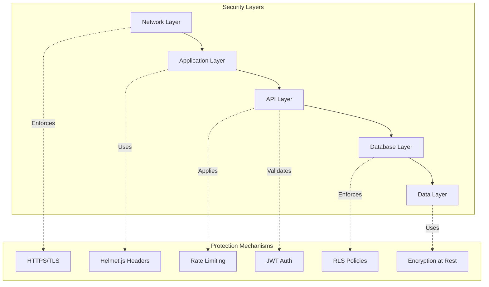
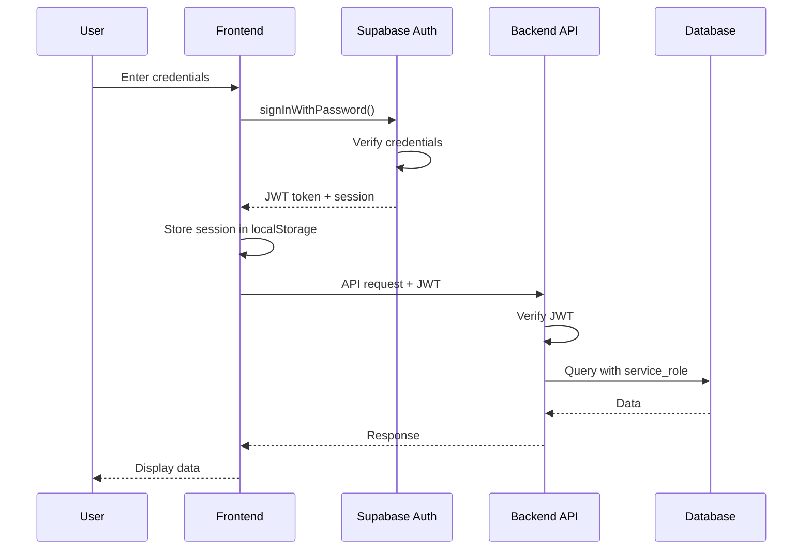
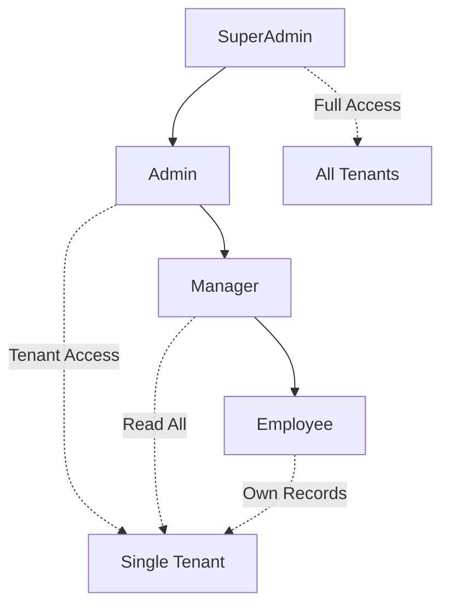
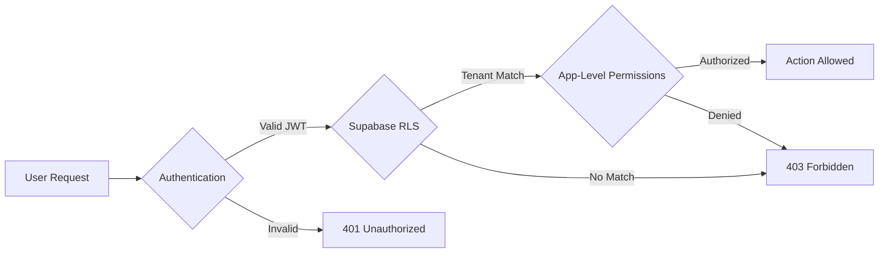
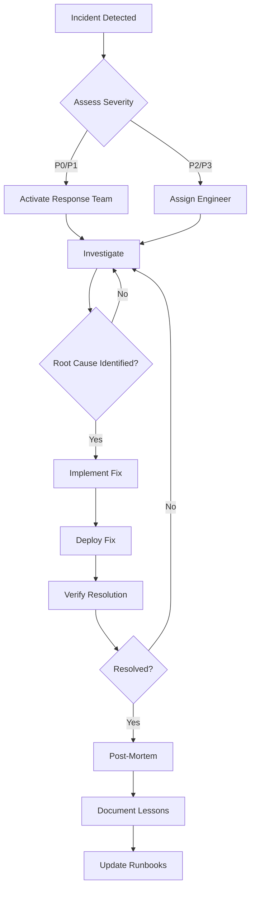

# Aisha CRM Security & Compliance Manual - Part 1

**Version:** 1.0  
**Last Updated:** November 15, 2025  
**Audience:** Security Administrators, DevOps Engineers, System Administrators

---

## Table of Contents

### Part 1: Architecture & Authentication

#### Chapter 1: Security Overview

- [1.1 Security Architecture](#11-security-architecture)
- [1.2 Security Principles](#12-security-principles)
- [1.3 Threat Model](#13-threat-model)
- [1.4 Security Layers](#14-security-layers)

#### Chapter 2: Authentication & Authorization

- [2.1 Authentication Configuration](#21-authentication-configuration)
- [2.2 Supabase Auth Integration](#22-supabase-auth-integration)
- [2.3 JWT & Session Management](#23-jwt--session-management)
- [2.4 Role-Based Access Control (RBAC)](#24-role-based-access-control-rbac)
- [2.5 User Provisioning](#25-user-provisioning)

#### Chapter 3: Row-Level Security (RLS)

- [3.1 RLS Overview](#31-rls-overview)
- [3.2 RLS Implementation](#32-rls-implementation)
- [3.3 RLS Policies](#33-rls-policies)
- [3.4 Tenant Isolation](#34-tenant-isolation)
- [3.5 RLS Testing & Verification](#35-rls-testing--verification)

#### Chapter 4: Permission System

- [4.1 Permission Architecture](#41-permission-architecture)
- [4.2 Role Definitions](#42-role-definitions)
- [4.3 Permission Enforcement](#43-permission-enforcement)
- [4.4 Custom Permissions](#44-custom-permissions)

#### Chapter 5: API Security

- [5.1 API Authentication](#51-api-authentication)
- [5.2 API Key Management](#52-api-key-management)
- [5.3 Rate Limiting](#53-rate-limiting)
- [5.4 CORS Configuration](#54-cors-configuration)

#### Chapter 6: Data Protection

- [6.1 Data Encryption](#61-data-encryption)
- [6.2 Secrets Management](#62-secrets-management)
- [6.3 Email Uniqueness](#63-email-uniqueness)
- [6.4 Immutable Accounts](#64-immutable-accounts)

---

## Chapter 1: Security Overview

### 1.1 Security Architecture

Aisha CRM implements a **defense-in-depth** security model with multiple layers of protection:



**Key Components:**

| Layer           | Technology          | Purpose                                         |
| --------------- | ------------------- | ----------------------------------------------- |
| **Network**     | HTTPS/TLS 1.3       | Encrypted data transmission                     |
| **Application** | Helmet.js           | Security headers (XSS, clickjacking protection) |
| **API**         | JWT + Rate Limiting | Authentication, request throttling              |
| **Database**    | Supabase RLS        | Row-level data isolation                        |
| **Data**        | AES-256             | Encryption at rest                              |

---

### 1.2 Security Principles

#### Defense in Depth

Multiple layers of security ensure that if one layer is compromised, others remain intact.

#### Least Privilege

Users and services have only the minimum permissions necessary to perform their functions.

#### Zero Trust

No implicit trust; every request is authenticated and authorized.

#### Tenant Isolation

Complete data separation between tenants using UUID-based identification.

#### Audit Everything

All security-relevant actions are logged to `audit_log` table.

---

### 1.3 Threat Model

#### Identified Threats:

| Threat                         | Likelihood | Impact   | Mitigation                              |
| ------------------------------ | ---------- | -------- | --------------------------------------- |
| **SQL Injection**              | Low        | Critical | Parameterized queries, input validation |
| **Cross-Site Scripting (XSS)** | Medium     | High     | Helmet.js CSP, input sanitization       |
| **Cross-Tenant Data Access**   | Medium     | Critical | RLS policies, tenant validation         |
| **Brute Force Attacks**        | High       | Medium   | Rate limiting, account lockout          |
| **API Key Exposure**           | Medium     | High     | Secrets manager, rotation policy        |
| **Session Hijacking**          | Low        | High     | Secure cookies, JWT expiration          |
| **Insider Threats**            | Low        | Critical | Audit logging, immutable accounts       |

---

### 1.4 Security Layers

#### Network Security

```
Internet → Cloudflare (DDoS) → Load Balancer → Docker Network → Containers
```

- ✅ HTTPS enforced (TLS 1.3)
- ✅ DDoS protection via hosting provider
- ✅ Internal Docker network isolation

#### Application Security

```javascript
// Helmet.js configuration
app.use(
  helmet({
    contentSecurityPolicy: {
      directives: {
        defaultSrc: ["'self'"],
        styleSrc: ["'self'", "'unsafe-inline'"],
        scriptSrc: ["'self'"],
        imgSrc: ["'self'", 'data:', 'https:'],
      },
    },
    hsts: {
      maxAge: 31536000,
      includeSubDomains: true,
      preload: true,
    },
  }),
);
```

#### API Security

- JWT-based authentication
- Rate limiting: 100 requests/minute per IP
- CORS restricted to allowed origins only

#### Database Security

- PostgreSQL 15+ with Supabase
- Row-Level Security (RLS) enabled on all tables
- Service role key for backend, anon key blocked

---

## Chapter 2: Authentication & Authorization

### 2.1 Authentication Configuration

Aisha CRM uses **Supabase Auth** for authentication with JWT tokens.

#### Environment Variables

**Backend `.env`:**

```bash
# JWT Configuration
JWT_SECRET=<128-character-hex-string>
JWT_EXPIRES_IN=24h

# Supabase Configuration
SUPABASE_URL=https://your-project.supabase.co
SUPABASE_SERVICE_ROLE_KEY=<service-role-key>
SUPABASE_ANON_KEY=<anon-key>
```

**Frontend `.env`:**

```bash
VITE_SUPABASE_URL=https://your-project.supabase.co
VITE_SUPABASE_ANON_KEY=<anon-key>
```

💡 **TIP:** Generate strong JWT secrets:

```powershell
node -e "console.log(require('crypto').randomBytes(64).toString('hex'))"
```

---

### 2.2 Supabase Auth Integration

#### Authentication Flow



#### Frontend Authentication

**`src/api/supabaseClient.js`:**

```javascript
import { createClient } from '@supabase/supabase-js';

const supabaseUrl = import.meta.env.VITE_SUPABASE_URL;
const supabaseAnonKey = import.meta.env.VITE_SUPABASE_ANON_KEY;

export const supabase = createClient(supabaseUrl, supabaseAnonKey, {
  auth: {
    autoRefreshToken: true,
    persistSession: true,
    detectSessionInUrl: true,
  },
});
```

#### Sign In

```javascript
const { data, error } = await supabase.auth.signInWithPassword({
  email: 'user@example.com',
  password: 'secure-password',
});

if (error) {
  console.error('Login failed:', error.message);
} else {
  console.log('User logged in:', data.user);
}
```

#### Sign Out

```javascript
const { error } = await supabase.auth.signOut();
```

#### Get Current User

```javascript
const {
  data: { user },
} = await supabase.auth.getUser();
```

---

### 2.3 JWT & Session Management

#### JWT Structure

```json
{
  "sub": "user-uuid",
  "email": "user@example.com",
  "role": "authenticated",
  "iat": 1700000000,
  "exp": 1700086400
}
```

#### Token Validation (Backend)

**`backend/middleware/auth.js`:**

```javascript
import jwt from 'jsonwebtoken';

export function validateJWT(req, res, next) {
  const token = req.headers.authorization?.replace('Bearer ', '');

  if (!token) {
    return res.status(401).json({
      status: 'error',
      message: 'Authentication required',
    });
  }

  try {
    const decoded = jwt.verify(token, process.env.JWT_SECRET);
    req.user = decoded;
    next();
  } catch (error) {
    return res.status(401).json({
      status: 'error',
      message: 'Invalid or expired token',
    });
  }
}
```

#### Session Configuration

| Setting             | Value        | Purpose                    |
| ------------------- | ------------ | -------------------------- |
| **Token Expiry**    | 24 hours     | Balance security and UX    |
| **Refresh Token**   | 30 days      | Auto-refresh sessions      |
| **Auto Refresh**    | Enabled      | Seamless re-authentication |
| **Persist Session** | localStorage | Survive page reloads       |

🚨 **SECURITY WARNING:** Never expose `JWT_SECRET` or `SUPABASE_SERVICE_ROLE_KEY` in client-side code.

---

### 2.4 Role-Based Access Control (RBAC)

#### Role Hierarchy



#### Role Definitions

##### 1. SuperAdmin

- **Scope:** Global (all tenants)
- **Permissions:**
  - ✅ Create/edit/delete ANY user
  - ✅ Assign ANY role (including superadmin)
  - ✅ Manage ALL tenants
  - ✅ Access ALL data across tenants
  - ✅ Toggle CRM access for anyone
  - ✅ No tenant restrictions

**Database:** `users` table (no `tenant_id`)

##### 2. Admin

- **Scope:** Single tenant
- **Permissions:**
  - ✅ Create/edit employees in their tenant
  - ✅ Assign roles: Manager, Employee (NOT admin/superadmin)
  - ✅ Toggle CRM access for tenant users
  - ✅ Manage tenant settings
  - ✅ View/edit ALL data in their tenant
  - ❌ Cannot edit other tenants
  - ❌ Cannot assign admin/superadmin roles
  - ❌ Cannot elevate their own privileges

**Database:** `employees` table (with `tenant_id`)

##### 3. Manager

- **Scope:** Single tenant (read-only for users)
- **Permissions:**
  - ✅ View all CRM data for their tenant
  - ✅ View all employees in their tenant
  - ✅ Manage opportunities, contacts, accounts
  - ❌ Cannot create/edit/delete employees
  - ❌ Cannot toggle CRM access
  - ❌ Cannot assign or modify permissions

**Database:** `employees` table (with `tenant_id`)

##### 4. Employee

- **Scope:** Single tenant (own records)
- **Permissions:**
  - ✅ View/edit THEIR OWN records only
  - ✅ Create contacts, leads, opportunities assigned to them
  - ✅ Log activities and update their pipeline
  - ❌ Cannot see other employees' data (unless shared)
  - ❌ Cannot create/edit other employees
  - ❌ Cannot modify permissions

**Database:** `employees` table (with `tenant_id`)

---

### 2.5 User Provisioning

#### Creating Users with CRM Access

**Admin creates employee with CRM access:**

```javascript
async function grantCRMAccess(employee) {
  // 1. Create Supabase auth account
  const { data: authUser, error } = await supabase.auth.admin.createUser({
    email: employee.email,
    email_confirm: true,
    user_metadata: {
      first_name: employee.first_name,
      last_name: employee.last_name,
      role: employee.role,
    },
  });

  if (error) throw error;

  // 2. Update employee record with auth ID
  await pgPool.query(
    `UPDATE employees 
     SET metadata = jsonb_set(
       COALESCE(metadata, '{}'::jsonb),
       '{crm_access}',
       'true'
     ),
     metadata = jsonb_set(
       metadata,
       '{supabase_auth_id}',
       $2
     )
     WHERE id = $1`,
    [employee.id, JSON.stringify(authUser.user.id)],
  );

  // 3. Send welcome email
  await sendEmail({
    to: employee.email,
    subject: 'Welcome to Aisha CRM',
    template: 'crm_access_granted',
    data: {
      firstName: employee.first_name,
      loginUrl: process.env.FRONTEND_URL,
      temporaryPassword: '(sent separately via Supabase)',
    },
  });

  // 4. Log access grant
  await pgPool.query(
    `INSERT INTO audit_log (action, user_id, target_user_id, details, tenant_id)
     VALUES ($1, $2, $3, $4, $5)`,
    [
      'CRM_ACCESS_GRANTED',
      req.user.id,
      employee.id,
      JSON.stringify({ role: employee.role }),
      employee.tenant_id,
    ],
  );
}
```

#### Revoking CRM Access

```javascript
async function revokeCRMAccess(employee) {
  // 1. Ban user in Supabase Auth
  const authId = employee.metadata?.supabase_auth_id;
  if (authId) {
    await supabase.auth.admin.updateUserById(authId, {
      banned: true,
    });
  }

  // 2. Update employee record
  await pgPool.query(
    `UPDATE employees 
     SET metadata = jsonb_set(
       metadata,
       '{crm_access}',
       'false'
     )
     WHERE id = $1`,
    [employee.id],
  );

  // 3. Notify user
  await sendEmail({
    to: employee.email,
    subject: 'CRM Access Revoked',
    template: 'access_revoked',
  });

  // 4. Log revocation
  await pgPool.query(
    `INSERT INTO audit_log (action, user_id, target_user_id, tenant_id)
     VALUES ($1, $2, $3, $4)`,
    ['CRM_ACCESS_REVOKED', req.user.id, employee.id, employee.tenant_id],
  );
}
```

---

## Chapter 3: Row-Level Security (RLS)

### 3.1 RLS Overview

**Row-Level Security (RLS)** is PostgreSQL's built-in feature that restricts database rows based on user context. In Aisha CRM, RLS ensures **tenant isolation** and **employee-level data filtering**.

#### Why RLS?

✅ **Defense in Depth:** Even if backend is compromised, RLS prevents unauthorized data access  
✅ **Tenant Isolation:** Users cannot access other tenants' data  
✅ **Employee Filtering:** Employees see only their assigned records  
✅ **Supabase Best Practice:** Required for secure PostgREST API usage

---

### 3.2 RLS Implementation

#### Migration Overview

All RLS policies are defined in `backend/migrations/023_comprehensive_rls_security.sql`.

**Tables with RLS Enabled:** 48+ tables including:

- Core CRM: `accounts`, `contacts`, `leads`, `opportunities`, `activities`
- System: `users`, `employees`, `tenant`, `audit_log`, `system_logs`
- Configuration: `modulesettings`, `api_key`, `field_customization`
- Business: `workflow`, `cash_flow`, `bizdev_sources`, `notifications`

#### RLS Status Check

```sql
-- View RLS status for all tables
SELECT
  tablename,
  rowsecurity AS rls_enabled
FROM pg_tables
WHERE schemaname = 'public'
ORDER BY tablename;
```

Expected: All tables show `rls_enabled = true`

---

### 3.3 RLS Policies

#### Policy Categories

##### 1. Backend-Only Tables (Locked)

**Tables:** `tenant`, `modulesettings`, `api_key`, `apikey`

```sql
-- Example: api_key table
REVOKE ALL ON public.api_key FROM PUBLIC, anon, authenticated;

-- Only service_role (backend) can access
GRANT SELECT, INSERT, UPDATE, DELETE ON public.api_key TO service_role;
```

**Purpose:** Sensitive configuration accessible only via backend API with service_role key.

##### 2. Write-Only Logging Tables

**Tables:** `performance_logs`, `system_logs`

```sql
-- Authenticated users can INSERT logs
GRANT INSERT ON public.performance_logs TO authenticated;

-- Only service_role can SELECT
GRANT SELECT ON public.performance_logs TO service_role;

CREATE POLICY "authenticated_insert_logs" ON performance_logs
  FOR INSERT TO authenticated
  WITH CHECK (true);
```

**Purpose:** Allow clients to log performance data, but only backend can query logs.

##### 3. Tenant-Scoped Tables

**Tables:** `accounts`, `contacts`, `leads`, `opportunities`, `activities`, `notifications`, etc.

```sql
-- Users see only their tenant's data
CREATE POLICY "tenant_isolation_contacts" ON contacts
  FOR ALL USING (
    tenant_id = current_setting('app.current_tenant_id', true)::text
  );
```

**Purpose:** Complete data isolation between tenants.

##### 4. Employee-Level Filtering

**For Employee role:** See only records where they are the owner.

```sql
CREATE POLICY "employee_own_records" ON contacts
  FOR SELECT USING (
    -- Managers/Admins see everything in their tenant
    EXISTS (
      SELECT 1 FROM employees
      WHERE id = current_setting('app.current_user_id', true)::uuid
      AND tenant_id = contacts.tenant_id
      AND role IN ('manager', 'admin', 'superadmin')
    )
    OR
    -- Employees see only their records
    owner_id = current_setting('app.current_user_id', true)::uuid
  );
```

---

### 3.4 Tenant Isolation

#### Tenant Identification

🚨 **CRITICAL:** Aisha CRM uses **UUID-based tenant IDs**, NOT slugs.

**Correct:**

```javascript
const tenantId = 'f47ac10b-58cc-4372-a567-0e02b2c3d479'; // UUID
```

**Incorrect:**

```javascript
const tenantId = 'acme-corp'; // ❌ Legacy slug, not supported
```

#### Setting Tenant Context

**Backend Middleware (`backend/middleware/validateTenant.js`):**

```javascript
export async function validateTenantAccess(req, res, next) {
  const tenantId = req.query.tenant_id || req.body.tenant_id;

  if (!tenantId) {
    return res.status(400).json({
      status: 'error',
      message: 'tenant_id is required',
    });
  }

  // Validate UUID format
  const uuidRegex = /^[0-9a-f]{8}-[0-9a-f]{4}-[0-9a-f]{4}-[0-9a-f]{4}-[0-9a-f]{12}$/i;
  if (!uuidRegex.test(tenantId)) {
    return res.status(400).json({
      status: 'error',
      message: 'Invalid tenant_id format (must be UUID)',
    });
  }

  // Set tenant context for RLS policies
  await pgPool.query(`SET app.current_tenant_id = $1`, [tenantId]);

  req.tenantId = tenantId;
  next();
}
```

#### Tenant Verification Query

```sql
-- Verify tenant exists and is active
SELECT id, name, slug, status
FROM tenant
WHERE id = 'f47ac10b-58cc-4372-a567-0e02b2c3d479'::uuid;
```

---

### 3.5 RLS Testing & Verification

#### Test 1: Verify RLS is Enabled

```sql
-- Should return 0 rows (all tables have RLS)
SELECT tablename
FROM pg_tables
WHERE schemaname = 'public'
  AND rowsecurity = false;
```

#### Test 2: Count RLS Policies

```sql
-- Should return ~48+ policies
SELECT tablename, COUNT(*) as policy_count
FROM pg_policies
WHERE schemaname = 'public'
GROUP BY tablename
ORDER BY policy_count DESC;
```

#### Test 3: Test Tenant Isolation

**Setup:**

```sql
-- Create test data in two tenants
INSERT INTO contacts (id, tenant_id, email, first_name, last_name)
VALUES
  (gen_random_uuid(), 'tenant-a-uuid', 'user@tenant-a.com', 'Alice', 'A'),
  (gen_random_uuid(), 'tenant-b-uuid', 'user@tenant-b.com', 'Bob', 'B');
```

**Test with Tenant A context:**

```sql
SET app.current_tenant_id = 'tenant-a-uuid';

-- Should return ONLY Alice (tenant A)
SELECT * FROM contacts;
```

**Test with Tenant B context:**

```sql
SET app.current_tenant_id = 'tenant-b-uuid';

-- Should return ONLY Bob (tenant B)
SELECT * FROM contacts;
```

#### Test 4: Verify Backend Access

**Backend uses `service_role` key, which bypasses RLS:**

```javascript
// Backend API call (uses service_role)
const { data, error } = await pgPool.query('SELECT * FROM contacts WHERE tenant_id = $1', [
  tenantId,
]);
// ✅ Should return all contacts for tenant (RLS bypassed)
```

#### Test 5: Verify Anon Key Blocked

**Direct Supabase client with `anon` key should be blocked:**

```javascript
// Frontend direct query (uses anon key - BLOCKED)
const { data, error } = await supabase.from('contacts').select('*');
// ❌ Should return empty or error (RLS blocks anon access)
```

---

## Chapter 4: Permission System

### 4.1 Permission Architecture

Aisha CRM uses a **hybrid authorization model**:

1. **Supabase RLS:** Database-level tenant isolation and data filtering
2. **App-Level Checks:** UI/feature access and role-based permissions



#### Why Hybrid?

| Aspect                       | Supabase RLS   | App-Level Checks   |
| ---------------------------- | -------------- | ------------------ |
| **Tenant Data Isolation**    | ✅ Perfect     | ❌ Requires code   |
| **Role-Based UI**            | ❌ Clunky      | ✅ Flexible        |
| **Fine-Grained Permissions** | ❌ Complex SQL | ✅ Simple JS       |
| **Audit Logging**            | ❌ Limited     | ✅ Full control    |
| **Defense in Depth**         | ✅ Safety net  | ✅ Primary control |

**Best Practice:** Use RLS for "what data can you see" and app-level for "what actions can you take."

---

### 4.2 Role Definitions

See **Chapter 2.4** for complete role definitions. Summary:

| Role           | Scope         | Key Permissions                               |
| -------------- | ------------- | --------------------------------------------- |
| **SuperAdmin** | Global        | All tenants, all actions                      |
| **Admin**      | Single Tenant | Manage users (not admins), full tenant access |
| **Manager**    | Single Tenant | Read-only users, full data access             |
| **Employee**   | Single Tenant | Own records only                              |

---

### 4.3 Permission Enforcement

#### Frontend Permission Checks

**`src/utils/permissions.js`:**

```javascript
/**
 * Check if user can assign CRM access
 */
export function canAssignCRMAccess(user) {
  return user?.role === 'superadmin' || user?.role === 'admin';
}

/**
 * Check if user can edit employee
 */
export function canEditEmployee(user, targetEmployee = null) {
  if (user?.role === 'superadmin') return true;

  if (user?.role === 'admin') {
    // Admins can edit employees in their tenant
    if (!targetEmployee) return true;
    return user.tenant_id === targetEmployee.tenant_id;
  }

  return false;
}

/**
 * Check if user can assign role
 */
export function canAssignRole(user, targetRole) {
  if (user?.role === 'superadmin') {
    return true; // Can assign any role
  }

  if (user?.role === 'admin') {
    // Admins cannot assign admin or superadmin roles
    return !['admin', 'superadmin'].includes(targetRole);
  }

  return false;
}

/**
 * Validate user permissions before action
 */
export function validateUserPermissions(currentUser, targetUser, action) {
  // SuperAdmin can do anything
  if (currentUser.role === 'superadmin') {
    return { valid: true };
  }

  // Admin checks
  if (currentUser.role === 'admin') {
    if (action === 'create' || action === 'update') {
      // Cannot create/modify admins or superadmins
      if (['admin', 'superadmin'].includes(targetUser.role)) {
        return {
          valid: false,
          error: 'Admins cannot create or modify admin/superadmin accounts',
        };
      }

      // Can only manage users in their tenant
      if (targetUser.tenant_id !== currentUser.tenant_id) {
        return {
          valid: false,
          error: 'You can only manage users within your tenant',
        };
      }
    }

    return { valid: true };
  }

  // Managers and Employees cannot manage users
  return {
    valid: false,
    error: 'You do not have permission to manage users',
  };
}
```

#### Using Permissions in UI

**Example: User Management Page**

```jsx
import { canAssignCRMAccess, canEditEmployee, validateUserPermissions } from '@/utils/permissions';

export default function UsersPage() {
  const { user: currentUser } = useUser();

  const handleCreateUser = (newUser) => {
    // Validate before submission
    const validation = validateUserPermissions(currentUser, newUser, 'create');

    if (!validation.valid) {
      toast.error(validation.error);
      return;
    }

    // Proceed with creation
    createUser(newUser);
  };

  return (
    <div>
      {/* Show "Add User" only for admins/superadmins */}
      {canEditEmployee(currentUser) && (
        <Button onClick={() => setShowDialog(true)}>Add User</Button>
      )}

      {/* User list */}
      {employees.map((employee) => (
        <div key={employee.id}>
          <p>{employee.name}</p>

          {/* Show CRM Access toggle only for admins/superadmins */}
          {canAssignCRMAccess(currentUser) && (
            <Switch
              checked={employee.metadata?.crm_access}
              onCheckedChange={(value) => toggleCRMAccess(employee, value)}
              disabled={!canEditEmployee(currentUser, employee)}
            />
          )}
        </div>
      ))}
    </div>
  );
}
```

---

### 4.4 Custom Permissions

#### Creating Fine-Grained Permissions

For advanced use cases, create custom permissions in the database:

```sql
-- Create permissions table (if not exists)
CREATE TABLE IF NOT EXISTS permissions (
  id UUID PRIMARY KEY DEFAULT gen_random_uuid(),
  name VARCHAR(255) UNIQUE NOT NULL,
  description TEXT,
  resource VARCHAR(100) NOT NULL, -- e.g., 'contacts', 'leads'
  action VARCHAR(50) NOT NULL,    -- e.g., 'read', 'write', 'delete'
  created_at TIMESTAMPTZ DEFAULT NOW()
);

-- Create role_permissions junction table
CREATE TABLE IF NOT EXISTS role_permissions (
  id UUID PRIMARY KEY DEFAULT gen_random_uuid(),
  role VARCHAR(50) NOT NULL,
  permission_id UUID REFERENCES permissions(id) ON DELETE CASCADE,
  created_at TIMESTAMPTZ DEFAULT NOW(),
  UNIQUE(role, permission_id)
);

-- Example: Create custom permission
INSERT INTO permissions (name, description, resource, action)
VALUES (
  'export_sensitive_data',
  'Can export sensitive contact data including SSN, financial info',
  'contacts',
  'export_sensitive'
);

-- Assign to admin role only
INSERT INTO role_permissions (role, permission_id)
SELECT 'admin', id FROM permissions WHERE name = 'export_sensitive_data';
```

#### Checking Custom Permissions (Backend)

```javascript
async function hasPermission(userId, permissionName) {
  const result = await pgPool.query(
    `SELECT p.name
     FROM permissions p
     JOIN role_permissions rp ON rp.permission_id = p.id
     JOIN employees e ON e.role = rp.role
     WHERE e.id = $1 AND p.name = $2`,
    [userId, permissionName],
  );

  return result.rows.length > 0;
}

// Usage in route
app.post('/api/contacts/export-sensitive', async (req, res) => {
  if (!(await hasPermission(req.user.id, 'export_sensitive_data'))) {
    return res.status(403).json({
      status: 'error',
      message: 'Insufficient permissions for sensitive data export',
    });
  }

  // Proceed with export
});
```

---

## Chapter 5: API Security

### 5.1 API Authentication

All API requests require a valid JWT token in the `Authorization` header.

#### Request Format

```http
GET /api/contacts?tenant_id=<uuid> HTTP/1.1
Host: localhost:4001
Authorization: Bearer <jwt-token>
Content-Type: application/json
```

#### Backend Middleware

**`backend/server.js`:**

```javascript
import { validateJWT } from './middleware/auth.js';

// Apply to all /api routes
app.use('/api', validateJWT);
```

**`backend/middleware/auth.js`:**

```javascript
export function validateJWT(req, res, next) {
  // Skip auth in local dev mode (optional)
  if (process.env.NODE_ENV === 'development' && process.env.SKIP_AUTH === 'true') {
    req.user = { id: 'dev-user', role: 'superadmin' };
    return next();
  }

  const token = req.headers.authorization?.replace('Bearer ', '');

  if (!token) {
    return res.status(401).json({
      status: 'error',
      message: 'Authentication required',
      code: 'MISSING_TOKEN',
    });
  }

  try {
    const decoded = jwt.verify(token, process.env.JWT_SECRET);
    req.user = decoded;
    next();
  } catch (error) {
    return res.status(401).json({
      status: 'error',
      message: 'Invalid or expired token',
      code: 'INVALID_TOKEN',
    });
  }
}
```

---

### 5.2 API Key Management

API keys are stored in the `api_key` table (RLS-protected, backend-only access).

#### API Key Schema

```sql
CREATE TABLE api_key (
  id UUID PRIMARY KEY DEFAULT gen_random_uuid(),
  tenant_id UUID NOT NULL REFERENCES tenant(id) ON DELETE CASCADE,
  name VARCHAR(255) NOT NULL,
  key_hash VARCHAR(255) UNIQUE NOT NULL,
  key_prefix VARCHAR(20),        -- First 8 chars for identification
  permissions JSONB DEFAULT '{}',
  expires_at TIMESTAMPTZ,
  last_used_at TIMESTAMPTZ,
  created_at TIMESTAMPTZ DEFAULT NOW(),
  created_by UUID REFERENCES users(id)
);

CREATE INDEX idx_api_key_tenant ON api_key(tenant_id);
CREATE INDEX idx_api_key_hash ON api_key(key_hash);
```

#### Creating API Keys

```javascript
import crypto from 'crypto';
import bcrypt from 'bcrypt';

async function createAPIKey(tenantId, name, permissions = {}, expiresInDays = 365) {
  // Generate random API key
  const apiKey = `aisha_${crypto.randomBytes(32).toString('hex')}`;
  const prefix = apiKey.substring(0, 13); // "aisha_" + first 8 chars

  // Hash the key for storage
  const keyHash = await bcrypt.hash(apiKey, 10);

  // Store in database
  const result = await pgPool.query(
    `INSERT INTO api_key (tenant_id, name, key_hash, key_prefix, permissions, expires_at, created_by)
     VALUES ($1, $2, $3, $4, $5, NOW() + INTERVAL '${expiresInDays} days', $6)
     RETURNING id, key_prefix, expires_at`,
    [tenantId, name, keyHash, prefix, JSON.stringify(permissions), req.user.id],
  );

  // Return plain-text key ONCE (cannot be retrieved again)
  return {
    id: result.rows[0].id,
    key: apiKey, // ⚠️ Show this ONCE to user
    prefix: prefix,
    expires_at: result.rows[0].expires_at,
  };
}
```

#### Validating API Keys

```javascript
async function validateAPIKey(req, res, next) {
  const apiKey = req.headers['x-api-key'];

  if (!apiKey) {
    return res.status(401).json({
      status: 'error',
      message: 'API key required',
      code: 'MISSING_API_KEY',
    });
  }

  // Find key by prefix (faster than checking all hashes)
  const prefix = apiKey.substring(0, 13);
  const result = await pgPool.query(
    `SELECT id, key_hash, tenant_id, permissions, expires_at
     FROM api_key
     WHERE key_prefix = $1`,
    [prefix],
  );

  if (result.rows.length === 0) {
    return res.status(401).json({
      status: 'error',
      message: 'Invalid API key',
      code: 'INVALID_API_KEY',
    });
  }

  const keyData = result.rows[0];

  // Verify hash
  const isValid = await bcrypt.compare(apiKey, keyData.key_hash);
  if (!isValid) {
    return res.status(401).json({
      status: 'error',
      message: 'Invalid API key',
      code: 'INVALID_API_KEY',
    });
  }

  // Check expiration
  if (keyData.expires_at && new Date() > new Date(keyData.expires_at)) {
    return res.status(401).json({
      status: 'error',
      message: 'API key expired',
      code: 'EXPIRED_API_KEY',
    });
  }

  // Update last used timestamp
  await pgPool.query(`UPDATE api_key SET last_used_at = NOW() WHERE id = $1`, [keyData.id]);

  // Attach to request
  req.apiKey = keyData;
  req.tenantId = keyData.tenant_id;
  next();
}
```

---

### 5.3 Rate Limiting

#### Configuration

**`backend/server.js`:**

```javascript
import rateLimit from 'express-rate-limit';

// General API rate limiter
const apiLimiter = rateLimit({
  windowMs: process.env.API_RATE_LIMIT_WINDOW_MS || 60000, // 1 minute
  max: process.env.API_RATE_LIMIT_MAX_REQUESTS || 100, // 100 req/min
  message: {
    status: 'error',
    message: 'Too many requests from this IP, please try again later',
    code: 'RATE_LIMIT_EXCEEDED',
  },
  standardHeaders: true, // Return rate limit info in headers
  legacyHeaders: false,
});

// Stricter limit for authentication endpoints
const authLimiter = rateLimit({
  windowMs: 15 * 60 * 1000, // 15 minutes
  max: 5, // 5 attempts
  message: {
    status: 'error',
    message: 'Too many login attempts, please try again after 15 minutes',
    code: 'AUTH_RATE_LIMIT_EXCEEDED',
  },
});

// Apply limiters
app.use('/api/', apiLimiter);
app.use('/api/auth/', authLimiter);
```

#### Testing Rate Limits

```powershell
# Send 101 requests rapidly
1..101 | ForEach-Object {
  Invoke-RestMethod -Uri 'http://localhost:4001/api/health' -Method Get
}
# Request 101 should return 429 Too Many Requests
```

---

### 5.4 CORS Configuration

#### Backend CORS Setup

**`backend/server.js`:**

```javascript
import cors from 'cors';

const allowedOrigins = process.env.ALLOWED_ORIGINS?.split(',') || [
  'http://localhost:4000', // Frontend Docker container
  'http://localhost:5173', // Vite dev server
];

app.use(
  cors({
    origin: function (origin, callback) {
      // Allow requests with no origin (mobile apps, Postman, curl)
      if (!origin) return callback(null, true);

      if (allowedOrigins.includes(origin)) {
        callback(null, true);
      } else {
        callback(new Error('Not allowed by CORS'));
      }
    },
    credentials: true, // Allow cookies
    methods: ['GET', 'POST', 'PUT', 'DELETE', 'PATCH'],
    allowedHeaders: ['Content-Type', 'Authorization', 'X-API-Key'],
  }),
);
```

#### Production CORS

**Environment Variable:**

```bash
ALLOWED_ORIGINS=https://yourcrm.com,https://www.yourcrm.com,https://app.yourcrm.com
```

🚨 **SECURITY WARNING:** Never use `origin: '*'` in production. Always whitelist specific domains.

---

## Chapter 6: Data Protection

### 6.1 Data Encryption

#### Encryption at Rest

- **Database:** Supabase uses AES-256 encryption for all stored data
- **Backups:** Encrypted with same keys
- **File Storage:** Supabase Storage encrypts files at rest

#### Encryption in Transit

- **HTTPS/TLS 1.3:** All connections encrypted
- **Certificate:** Managed by hosting provider (Railway, Vercel, Supabase)

#### Sensitive Data Fields

For extra protection, encrypt sensitive fields in application code:

```javascript
import crypto from 'crypto';

const ENCRYPTION_KEY = process.env.ENCRYPTION_KEY; // 32-byte key
const IV_LENGTH = 16;

function encrypt(text) {
  const iv = crypto.randomBytes(IV_LENGTH);
  const cipher = crypto.createCipheriv('aes-256-cbc', Buffer.from(ENCRYPTION_KEY, 'hex'), iv);
  let encrypted = cipher.update(text, 'utf8', 'hex');
  encrypted += cipher.final('hex');
  return iv.toString('hex') + ':' + encrypted;
}

function decrypt(text) {
  const [ivHex, encryptedHex] = text.split(':');
  const iv = Buffer.from(ivHex, 'hex');
  const decipher = crypto.createDecipheriv('aes-256-cbc', Buffer.from(ENCRYPTION_KEY, 'hex'), iv);
  let decrypted = decipher.update(encryptedHex, 'hex', 'utf8');
  decrypted += decipher.final('utf8');
  return decrypted;
}

// Usage
const ssn = '123-45-6789';
const encryptedSSN = encrypt(ssn);
// Store encryptedSSN in database

// Retrieve and decrypt
const decryptedSSN = decrypt(encryptedSSN);
```

---

### 6.2 Secrets Management

#### Environment Variables

**Never commit `.env` files to git.** Use `.gitignore`:

```gitignore
.env
.env.local
.env.production
backend/.env
```

#### Generating Secrets

```powershell
# JWT Secret (128 characters)
node -e "console.log(require('crypto').randomBytes(64).toString('hex'))"

# Encryption Key (32 bytes = 64 hex chars)
node -e "console.log(require('crypto').randomBytes(32).toString('hex'))"

# API Key
node -e "console.log('aisha_' + require('crypto').randomBytes(32).toString('hex'))"
```

#### Secret Rotation

**Rotation Schedule:**

| Secret                    | Frequency  | Method                                                                    |
| ------------------------- | ---------- | ------------------------------------------------------------------------- |
| JWT_SECRET                | 90 days    | Generate new → Update platform secrets → Redeploy → Invalidate old tokens |
| SUPABASE_SERVICE_ROLE_KEY | 180 days   | Supabase Dashboard → Reset → Update secrets → Redeploy                    |
| API Keys                  | Per policy | Regenerate in dashboard → Update integrations                             |
| ENCRYPTION_KEY            | 365 days   | Re-encrypt data with new key → Update → Delete old key                    |

---

### 6.3 Email Uniqueness

Email addresses are **globally unique** across both `users` and `employees` tables.

#### Three-Layer Enforcement

**1. Application Layer (API Validation):**

```javascript
// POST /api/users - Check both tables
const existingInUsers = await pgPool.query('SELECT id FROM users WHERE LOWER(email) = LOWER($1)', [
  email,
]);
const existingInEmployees = await pgPool.query(
  'SELECT id FROM employees WHERE LOWER(email) = LOWER($1)',
  [email],
);

if (existingInUsers.rows.length || existingInEmployees.rows.length) {
  return res.status(409).json({
    status: 'error',
    message: 'An account with this email already exists',
    code: 'DUPLICATE_EMAIL',
  });
}
```

**2. Database Indexes:**

```sql
CREATE UNIQUE INDEX users_email_unique_idx ON users (LOWER(email));
CREATE UNIQUE INDEX employees_email_unique_idx ON employees (LOWER(email));
```

**3. Database Triggers:**

```sql
CREATE FUNCTION check_email_uniqueness() RETURNS TRIGGER AS $$
BEGIN
  IF EXISTS (SELECT 1 FROM users WHERE LOWER(email) = LOWER(NEW.email)) THEN
    RAISE EXCEPTION 'Email already exists in users table';
  END IF;
  IF EXISTS (SELECT 1 FROM employees WHERE LOWER(email) = LOWER(NEW.email)) THEN
    RAISE EXCEPTION 'Email already exists in employees table';
  END IF;
  RETURN NEW;
END;
$$ LANGUAGE plpgsql;

CREATE TRIGGER users_email_uniqueness_check
  BEFORE INSERT OR UPDATE ON users
  FOR EACH ROW EXECUTE FUNCTION check_email_uniqueness();
```

---

### 6.4 Immutable Accounts

#### Protected Superadmin Accounts

Designated superadmin accounts **cannot be modified or deleted via API**.

**Protected List (`backend/routes/users.js`):**

```javascript
const IMMUTABLE_SUPERADMINS = [
  'abyfield@4vdataconsulting.com', // Primary system owner
];
```

#### API Protection

**PUT /api/users/:id:**

```javascript
// Check if user is immutable
if (IMMUTABLE_SUPERADMINS.includes(existingUser.email)) {
  return res.status(403).json({
    status: 'error',
    message: 'This superadmin account is immutable and cannot be modified via API',
    code: 'IMMUTABLE_ACCOUNT',
    hint: 'Changes must be made directly in Supabase Auth Dashboard',
  });
}
```

**DELETE /api/users/:id:**

```javascript
if (IMMUTABLE_SUPERADMINS.includes(user.email)) {
  return res.status(403).json({
    status: 'error',
    message: 'This superadmin account is immutable and cannot be deleted',
    code: 'IMMUTABLE_ACCOUNT',
  });
}
```

#### Modifying Protected Accounts

**The ONLY way:**

1. Go to Supabase Dashboard → Auth → Users
2. Find the user by email
3. Edit `user_metadata` or `app_metadata`
4. Update password via dashboard
5. Changes sync to CRM on next login

---

**[Continue to Part 2 for Chapters 7-12 and Appendices](./AISHA_CRM_SECURITY_MANUAL_PART2.md)**

---

_Aisha CRM Security & Compliance Manual - Part 1_  
_Copyright © 2025 4V Data Consulting. All rights reserved._  
_Version 1.0 - November 15, 2025_

# Aisha CRM Security & Compliance Manual - Part 2

**Version:** 1.0  
**Last Updated:** November 15, 2025  
**Audience:** Security Administrators, DevOps Engineers, System Administrators

---

## Table of Contents

### Part 2: Monitoring, Compliance & Operations

#### Chapter 7: Audit & Compliance

- [7.1 Audit Logging](#71-audit-logging)
- [7.2 Compliance Requirements](#72-compliance-requirements)
- [7.3 Data Retention](#73-data-retention)
- [7.4 Right to Erasure](#74-right-to-erasure)

#### Chapter 8: Security Monitoring

- [8.1 System Monitoring](#81-system-monitoring)
- [8.2 Intrusion Detection](#82-intrusion-detection)
- [8.3 Performance Logging](#83-performance-logging)
- [8.4 Error Tracking](#84-error-tracking)

#### Chapter 9: Incident Response

- [9.1 Incident Response Plan](#91-incident-response-plan)
- [9.2 Security Breach Procedures](#92-security-breach-procedures)
- [9.3 Secret Compromise Response](#93-secret-compromise-response)
- [9.4 Data Breach Notification](#94-data-breach-notification)

#### Chapter 10: Security Testing

- [10.1 Security Testing Strategy](#101-security-testing-strategy)
- [10.2 Penetration Testing](#102-penetration-testing)
- [10.3 Vulnerability Scanning](#103-vulnerability-scanning)
- [10.4 Security Audits](#104-security-audits)

#### Chapter 11: Production Deployment Security

- [11.1 Pre-Deployment Checklist](#111-pre-deployment-checklist)
- [11.2 Deployment Procedures](#112-deployment-procedures)
- [11.3 Post-Deployment Verification](#113-post-deployment-verification)
- [11.4 Rollback Procedures](#114-rollback-procedures)

#### Chapter 12: Security Best Practices

- [12.1 Development Best Practices](#121-development-best-practices)
- [12.2 Operational Best Practices](#122-operational-best-practices)
- [12.3 User Security Guidelines](#123-user-security-guidelines)
- [12.4 Third-Party Integrations](#124-third-party-integrations)

#### Appendices

- [Appendix A: Security Checklist](#appendix-a-security-checklist)
- [Appendix B: Common Vulnerabilities](#appendix-b-common-vulnerabilities)
- [Appendix C: Security Headers Reference](#appendix-c-security-headers-reference)
- [Appendix D: Compliance Mappings](#appendix-d-compliance-mappings)
- [Appendix E: Emergency Contacts](#appendix-e-emergency-contacts)

---

## Chapter 7: Audit & Compliance

### 7.1 Audit Logging

All security-relevant actions are logged to the `audit_log` table.

#### Audit Log Schema

```sql
CREATE TABLE audit_log (
  id UUID PRIMARY KEY DEFAULT gen_random_uuid(),
  tenant_id UUID REFERENCES tenant(id),
  user_id UUID,                    -- Who performed the action
  target_user_id UUID,             -- User affected by action (if applicable)
  action VARCHAR(100) NOT NULL,    -- e.g., 'CRM_ACCESS_GRANTED', 'USER_DELETED'
  resource VARCHAR(100),           -- e.g., 'users', 'contacts'
  resource_id UUID,                -- ID of affected resource
  details JSONB,                   -- Additional context
  ip_address INET,
  user_agent TEXT,
  created_at TIMESTAMPTZ DEFAULT NOW()
);

CREATE INDEX idx_audit_log_tenant ON audit_log(tenant_id);
CREATE INDEX idx_audit_log_user ON audit_log(user_id);
CREATE INDEX idx_audit_log_action ON audit_log(action);
CREATE INDEX idx_audit_log_created ON audit_log(created_at DESC);
```

#### Logged Actions

| Action               | Description                   | Details Included                |
| -------------------- | ----------------------------- | ------------------------------- |
| `USER_LOGIN`         | User signed in                | IP, user agent, success/failure |
| `USER_LOGOUT`        | User signed out               | Session duration                |
| `CRM_ACCESS_GRANTED` | Admin gave user CRM access    | Role assigned                   |
| `CRM_ACCESS_REVOKED` | Admin removed CRM access      | Reason                          |
| `USER_CREATED`       | New user account created      | Role, tenant                    |
| `USER_UPDATED`       | User account modified         | Changed fields                  |
| `USER_DELETED`       | User account deleted          | Deletion reason                 |
| `ROLE_CHANGED`       | User role modified            | Old role → New role             |
| `TENANT_CREATED`     | New tenant created            | Tenant name, plan               |
| `TENANT_DELETED`     | Tenant removed                | Deletion reason, data archived  |
| `PASSWORD_RESET`     | Password reset requested      | Email sent                      |
| `FAILED_LOGIN`       | Login attempt failed          | IP, reason                      |
| `API_KEY_CREATED`    | New API key generated         | Permissions, expiry             |
| `API_KEY_REVOKED`    | API key deleted               | Revocation reason               |
| `PERMISSION_DENIED`  | Unauthorized action attempted | Requested action, user role     |
| `DATA_EXPORT`        | Data exported                 | Resource, record count          |
| `DATA_IMPORT`        | Data imported                 | Source, record count            |

#### Logging Implementation

**`backend/utils/auditLog.js`:**

```javascript
export async function logAudit({
  tenantId,
  userId,
  targetUserId = null,
  action,
  resource = null,
  resourceId = null,
  details = {},
  ipAddress = null,
  userAgent = null,
}) {
  try {
    await pgPool.query(
      `INSERT INTO audit_log 
       (tenant_id, user_id, target_user_id, action, resource, resource_id, details, ip_address, user_agent)
       VALUES ($1, $2, $3, $4, $5, $6, $7, $8, $9)`,
      [
        tenantId,
        userId,
        targetUserId,
        action,
        resource,
        resourceId,
        JSON.stringify(details),
        ipAddress,
        userAgent,
      ],
    );
  } catch (error) {
    console.error('Audit logging failed:', error);
    // Don't fail the request if audit logging fails
  }
}
```

**Usage in Routes:**

```javascript
import { logAudit } from '../utils/auditLog.js';

// Example: Log user creation
app.post('/api/users', async (req, res) => {
  const { email, first_name, role, tenant_id } = req.body;

  // Create user...
  const newUser = await createUser({ email, first_name, role, tenant_id });

  // Log the action
  await logAudit({
    tenantId: tenant_id,
    userId: req.user.id,
    targetUserId: newUser.id,
    action: 'USER_CREATED',
    resource: 'users',
    resourceId: newUser.id,
    details: { role, email },
    ipAddress: req.ip,
    userAgent: req.headers['user-agent'],
  });

  res.json({ status: 'success', data: newUser });
});
```

#### Querying Audit Logs

**All actions by user:**

```sql
SELECT action, resource, details, created_at
FROM audit_log
WHERE user_id = '<user-uuid>'
ORDER BY created_at DESC
LIMIT 100;
```

**All actions affecting a user:**

```sql
SELECT action, u.email as performed_by, details, created_at
FROM audit_log al
JOIN users u ON u.id = al.user_id
WHERE al.target_user_id = '<user-uuid>'
ORDER BY created_at DESC;
```

**Failed login attempts:**

```sql
SELECT user_id, ip_address, details, created_at
FROM audit_log
WHERE action = 'FAILED_LOGIN'
  AND created_at > NOW() - INTERVAL '24 hours'
ORDER BY created_at DESC;
```

**Actions in last 7 days:**

```sql
SELECT
  action,
  COUNT(*) as count,
  COUNT(DISTINCT user_id) as unique_users
FROM audit_log
WHERE created_at > NOW() - INTERVAL '7 days'
GROUP BY action
ORDER BY count DESC;
```

---

### 7.2 Compliance Requirements

#### GDPR Compliance (EU)

**Key Requirements:**

| Requirement                   | Implementation                              |
| ----------------------------- | ------------------------------------------- |
| **Data Portability**          | Export API: `/api/users/:id/export`         |
| **Right to Erasure**          | Delete API: `/api/users/:id?gdpr=true`      |
| **Consent Tracking**          | `user_metadata.gdpr_consent` field          |
| **Data Processing Agreement** | Required for all tenants processing EU data |
| **Breach Notification**       | 72-hour notification procedure (see 9.4)    |
| **Privacy by Design**         | RLS, encryption, minimal data collection    |
| **Data Minimization**         | Only collect necessary fields               |

**Data Subject Rights:**

- ✅ Right to access (user data export)
- ✅ Right to rectification (user edit endpoints)
- ✅ Right to erasure (soft delete + anonymization)
- ✅ Right to data portability (JSON export)
- ✅ Right to object (opt-out mechanisms)

#### CCPA Compliance (California)

**Key Requirements:**

| Requirement                | Implementation                           |
| -------------------------- | ---------------------------------------- |
| **Notice at Collection**   | Privacy policy linked at signup          |
| **Access Request**         | `/api/users/:id/ccpa-access`             |
| **Deletion Request**       | `/api/users/:id?ccpa=true`               |
| **Do Not Sell**            | No data selling; explicit opt-out toggle |
| **Consumer Rights Notice** | Documented in user agreements            |

#### SOC 2 Type II (Enterprise)

**Key Controls:**

- ✅ Access control (RBAC, RLS)
- ✅ Audit logging (all security events)
- ✅ Encryption (at rest and in transit)
- ✅ Change management (Git, PR reviews)
- ✅ Incident response (documented procedures)
- ✅ Monitoring & alerting (Sentry, Supabase logs)
- ✅ Backup & recovery (daily automated backups)

#### HIPAA (Healthcare - Optional)

If handling Protected Health Information (PHI):

- ✅ Business Associate Agreement (BAA) with Supabase
- ✅ Encryption at rest (AES-256)
- ✅ Encryption in transit (TLS 1.3)
- ✅ Access controls (role-based)
- ✅ Audit trails (comprehensive logging)
- ✅ Physical safeguards (hosting provider responsibility)

---

### 7.3 Data Retention

#### Retention Policies

| Data Type            | Retention Period       | Deletion Method             |
| -------------------- | ---------------------- | --------------------------- |
| **User Data**        | Active + 7 years       | Soft delete, then anonymize |
| **Audit Logs**       | 7 years                | Archive to cold storage     |
| **Performance Logs** | 90 days                | Hard delete                 |
| **System Logs**      | 30 days                | Hard delete                 |
| **Session Tokens**   | 30 days (max)          | Auto-expire                 |
| **API Keys**         | Until revoked + 1 year | Soft delete                 |
| **Backups**          | 90 days                | Rolling window              |

#### Automated Cleanup

**`backend/scripts/cleanup-old-logs.js`:**

```javascript
import { pgPool } from '../db.js';

async function cleanupOldLogs() {
  // Delete performance logs older than 90 days
  await pgPool.query(
    `DELETE FROM performance_logs 
     WHERE created_at < NOW() - INTERVAL '90 days'`,
  );

  // Delete system logs older than 30 days
  await pgPool.query(
    `DELETE FROM system_logs 
     WHERE created_at < NOW() - INTERVAL '30 days'`,
  );

  // Archive audit logs older than 1 year to cold storage
  const oldAudits = await pgPool.query(
    `SELECT * FROM audit_log 
     WHERE created_at < NOW() - INTERVAL '1 year'`,
  );

  // Export to S3/archive (implementation depends on storage)
  // await exportToArchive(oldAudits.rows);

  // Delete after successful archive
  // await pgPool.query(`DELETE FROM audit_log WHERE created_at < NOW() - INTERVAL '1 year'`);

  console.log('Cleanup completed');
}

// Run daily via cron
cleanupOldLogs().catch(console.error);
```

**Cron Schedule:**

```bash
# Run cleanup daily at 2 AM
0 2 * * * node /app/backend/scripts/cleanup-old-logs.js
```

---

### 7.4 Right to Erasure

#### GDPR/CCPA Deletion Request

**Soft Delete + Anonymization:**

```javascript
// DELETE /api/users/:id?gdpr=true
app.delete('/api/users/:id', async (req, res) => {
  const userId = req.params.id;
  const gdprRequest = req.query.gdpr === 'true';

  if (gdprRequest) {
    // GDPR-compliant deletion
    await pgPool.query('BEGIN');

    try {
      // 1. Anonymize personal data
      await pgPool.query(
        `UPDATE users 
         SET 
           email = 'deleted-' || id || '@anonymized.local',
           first_name = 'Deleted',
           last_name = 'User',
           metadata = jsonb_build_object('deleted_at', NOW(), 'gdpr_request', true),
           updated_at = NOW()
         WHERE id = $1`,
        [userId],
      );

      // 2. Remove from Supabase Auth
      const { error } = await supabase.auth.admin.deleteUser(userId);
      if (error) throw error;

      // 3. Log deletion
      await logAudit({
        userId: req.user.id,
        targetUserId: userId,
        action: 'USER_DELETED_GDPR',
        details: { reason: 'GDPR right to erasure' },
      });

      await pgPool.query('COMMIT');

      res.json({
        status: 'success',
        message: 'User data anonymized per GDPR requirements',
      });
    } catch (error) {
      await pgPool.query('ROLLBACK');
      throw error;
    }
  } else {
    // Regular soft delete
    await pgPool.query(`UPDATE users SET status = 'deleted', updated_at = NOW() WHERE id = $1`, [
      userId,
    ]);

    res.json({ status: 'success', message: 'User deleted' });
  }
});
```

#### Data Export (Portability)

```javascript
// GET /api/users/:id/export
app.get('/api/users/:id/export', async (req, res) => {
  const userId = req.params.id;

  // Verify user can export their own data
  if (req.user.id !== userId && req.user.role !== 'superadmin') {
    return res.status(403).json({
      status: 'error',
      message: 'You can only export your own data',
    });
  }

  // Gather all user data
  const userData = await pgPool.query('SELECT * FROM users WHERE id = $1', [userId]);

  const contacts = await pgPool.query('SELECT * FROM contacts WHERE owner_id = $1', [userId]);

  const activities = await pgPool.query('SELECT * FROM activities WHERE user_id = $1', [userId]);

  // Build export package
  const exportData = {
    request_date: new Date().toISOString(),
    user: userData.rows[0],
    contacts: contacts.rows,
    activities: activities.rows,
    // Add other user-owned data...
  };

  // Log export
  await logAudit({
    userId: req.user.id,
    targetUserId: userId,
    action: 'DATA_EXPORT',
    details: {
      record_count: {
        contacts: contacts.rows.length,
        activities: activities.rows.length,
      },
    },
  });

  res.json({
    status: 'success',
    data: exportData,
  });
});
```

---

## Chapter 8: Security Monitoring

### 8.1 System Monitoring

#### Health Checks

**`backend/routes/system.js`:**

```javascript
// GET /api/health
app.get('/api/health', async (req, res) => {
  try {
    // Check database connection
    const dbResult = await pgPool.query('SELECT NOW()');

    // Check Supabase connection
    const { data: supabaseHealth } = await supabase.from('tenant').select('count').limit(1);

    res.json({
      status: 'ok',
      timestamp: new Date().toISOString(),
      services: {
        database: 'healthy',
        supabase: supabaseHealth ? 'healthy' : 'degraded',
        api: 'healthy',
      },
      version: process.env.npm_package_version || '1.0.0',
    });
  } catch (error) {
    res.status(503).json({
      status: 'error',
      message: 'Service unavailable',
      error: error.message,
    });
  }
});
```

#### Uptime Monitoring

**Recommended Tools:**

- **UptimeRobot** (free tier: 50 monitors, 5-min intervals)
- **Pingdom** (paid: 1-min intervals, global locations)
- **Better Stack** (modern alternative)

**Configuration:**

```yaml
Monitor Name: Aisha CRM API Health
URL: https://your-backend.railway.app/api/health
Method: GET
Interval: 5 minutes
Alert When: Status != 200 OR Response Time > 5s
Alert Contacts: admin@yourcompany.com, sms:+1234567890
```

---

### 8.2 Intrusion Detection

#### Middleware Implementation

**`backend/middleware/intrusionDetection.js`:**

```javascript
const suspiciousPatterns = [
  // SQL Injection attempts
  /(\bUNION\b|\bSELECT\b.*\bFROM\b|\bDROP\b|\bDELETE\b.*\bWHERE\b)/i,

  // XSS attempts
  /<script[^>]*>.*<\/script>/i,
  /javascript:/i,
  /onerror=/i,

  // Path traversal
  /\.\.[\/\\]/,

  // Command injection
  /;.*\b(cat|ls|wget|curl|nc|bash|sh)\b/i,
];

export function detectIntrusion(req, res, next) {
  const suspicious = [];

  // Check all input sources
  const inputs = [
    ...Object.values(req.query),
    ...Object.values(req.body || {}),
    ...Object.values(req.params),
  ].map((v) => String(v));

  for (const input of inputs) {
    for (const pattern of suspiciousPatterns) {
      if (pattern.test(input)) {
        suspicious.push({
          pattern: pattern.toString(),
          input: input.substring(0, 100), // Truncate for logging
        });
      }
    }
  }

  if (suspicious.length > 0) {
    // Log suspicious activity
    logAudit({
      userId: req.user?.id || 'anonymous',
      action: 'INTRUSION_DETECTED',
      details: {
        patterns: suspicious,
        path: req.path,
        method: req.method,
      },
      ipAddress: req.ip,
      userAgent: req.headers['user-agent'],
    });

    // Rate limit this IP aggressively
    // (Implementation depends on rate limiting strategy)

    // Optionally block request
    return res.status(400).json({
      status: 'error',
      message: 'Invalid input detected',
      code: 'SUSPICIOUS_INPUT',
    });
  }

  next();
}
```

#### Cross-Tenant Access Detection

**`backend/middleware/intrusionDetection.js` (continued):**

```javascript
export async function detectCrossTenantAccess(req, res, next) {
  const { user, tenantId } = req;

  if (!user || !tenantId) return next();

  // SuperAdmins can access any tenant
  if (user.role === 'superadmin') return next();

  // Check if user belongs to requested tenant
  const userTenant = user.tenant_id || user.tenantId;

  if (userTenant !== tenantId) {
    // Log unauthorized cross-tenant attempt
    await logAudit({
      userId: user.id,
      action: 'UNAUTHORIZED_CROSS_TENANT_ACCESS',
      details: {
        user_tenant: userTenant,
        requested_tenant: tenantId,
        path: req.path,
        method: req.method,
      },
      ipAddress: req.ip,
    });

    return res.status(403).json({
      status: 'error',
      message: 'Access denied: unauthorized tenant access',
      code: 'CROSS_TENANT_ACCESS_DENIED',
    });
  }

  next();
}
```

---

### 8.3 Performance Logging

#### Performance Log Schema

```sql
CREATE TABLE performance_logs (
  id UUID PRIMARY KEY DEFAULT gen_random_uuid(),
  tenant_id UUID,
  user_id UUID,
  endpoint VARCHAR(255),
  method VARCHAR(10),
  duration_ms INTEGER,
  status_code INTEGER,
  memory_mb DECIMAL(10,2),
  cpu_percent DECIMAL(5,2),
  error TEXT,
  created_at TIMESTAMPTZ DEFAULT NOW()
);

CREATE INDEX idx_perf_endpoint ON performance_logs(endpoint);
CREATE INDEX idx_perf_created ON performance_logs(created_at DESC);
```

#### Middleware Implementation

**`backend/middleware/performanceLogger.js`:**

```javascript
import os from 'os';

export function performanceLogger(req, res, next) {
  const start = Date.now();
  const startMemory = process.memoryUsage().heapUsed / 1024 / 1024;

  // Capture original end function
  const originalEnd = res.end;

  res.end = function (...args) {
    const duration = Date.now() - start;
    const endMemory = process.memoryUsage().heapUsed / 1024 / 1024;
    const memoryDelta = endMemory - startMemory;

    // Log to database (async, don't block response)
    pgPool
      .query(
        `INSERT INTO performance_logs 
       (tenant_id, user_id, endpoint, method, duration_ms, status_code, memory_mb)
       VALUES ($1, $2, $3, $4, $5, $6, $7)`,
        [
          req.tenantId || null,
          req.user?.id || null,
          req.path,
          req.method,
          duration,
          res.statusCode,
          memoryDelta.toFixed(2),
        ],
      )
      .catch((err) => console.error('Performance logging failed:', err));

    // Log slow requests to console
    if (duration > 1000) {
      console.warn(`⚠️ Slow request: ${req.method} ${req.path} - ${duration}ms`);
    }

    originalEnd.apply(res, args);
  };

  next();
}
```

#### Performance Queries

**Slowest endpoints (last 24 hours):**

```sql
SELECT
  endpoint,
  method,
  COUNT(*) as request_count,
  AVG(duration_ms) as avg_duration,
  MAX(duration_ms) as max_duration,
  PERCENTILE_CONT(0.95) WITHIN GROUP (ORDER BY duration_ms) as p95_duration
FROM performance_logs
WHERE created_at > NOW() - INTERVAL '24 hours'
GROUP BY endpoint, method
ORDER BY avg_duration DESC
LIMIT 20;
```

---

### 8.4 Error Tracking

#### Sentry Integration

**Install:**

```bash
npm install @sentry/node @sentry/tracing
```

**Backend Configuration:**

```javascript
import * as Sentry from '@sentry/node';
import * as Tracing from '@sentry/tracing';

// Initialize Sentry
Sentry.init({
  dsn: process.env.SENTRY_DSN,
  environment: process.env.NODE_ENV || 'development',
  tracesSampleRate: 0.1, // 10% of transactions
  beforeSend(event, hint) {
    // Don't send 404s or 401s
    if (
      event.exception?.values?.[0]?.value?.includes('404') ||
      event.exception?.values?.[0]?.value?.includes('401')
    ) {
      return null;
    }
    return event;
  },
});

// Request handler (must be first)
app.use(Sentry.Handlers.requestHandler());
app.use(Sentry.Handlers.tracingHandler());

// ... your routes ...

// Error handler (must be last)
app.use(Sentry.Handlers.errorHandler());
```

**Error Tracking in Code:**

```javascript
try {
  await riskyOperation();
} catch (error) {
  Sentry.captureException(error, {
    tags: {
      section: 'user-management',
      operation: 'create-user',
    },
    user: {
      id: req.user?.id,
      email: req.user?.email,
    },
    extra: {
      tenantId: req.tenantId,
      requestBody: req.body,
    },
  });

  throw error; // Re-throw or handle
}
```

---

## Chapter 9: Incident Response

### 9.1 Incident Response Plan

#### Incident Severity Levels

| Level             | Description                       | Response Time        | Examples                                    |
| ----------------- | --------------------------------- | -------------------- | ------------------------------------------- |
| **P0 - Critical** | System down, data breach          | Immediate (< 15 min) | Database compromised, API down globally     |
| **P1 - High**     | Major functionality broken        | < 1 hour             | Authentication broken, data loss            |
| **P2 - Medium**   | Partial functionality affected    | < 4 hours            | Single feature broken, performance degraded |
| **P3 - Low**      | Minor issue, workaround available | < 24 hours           | UI bug, non-critical error                  |

#### Response Team

| Role                    | Responsibility               | Contact             |
| ----------------------- | ---------------------------- | ------------------- |
| **Incident Commander**  | Overall coordination         | Primary on-call     |
| **Technical Lead**      | Technical investigation      | Backend engineer    |
| **Security Lead**       | Security assessment          | Security specialist |
| **Communications Lead** | Customer/stakeholder updates | Customer success    |
| **Executive Sponsor**   | Decision authority           | CTO/CEO             |

#### Incident Response Workflow



---

### 9.2 Security Breach Procedures

#### Immediate Actions (First 15 Minutes)

1. **Contain the Breach**
   - Revoke compromised API keys
   - Rotate exposed secrets
   - Block suspicious IP addresses

2. **Assess Scope**
   - What data was accessed?
   - Which systems are affected?
   - How many users impacted?

3. **Preserve Evidence**
   - Don't delete logs or audit trails
   - Take database snapshots
   - Document all findings

#### Investigation (First Hour)

```sql
-- Identify affected users
SELECT DISTINCT user_id, action, ip_address, created_at
FROM audit_log
WHERE created_at BETWEEN '<breach-start>' AND '<breach-end>'
  AND action IN ('USER_LOGIN', 'DATA_EXPORT', 'PERMISSION_DENIED')
ORDER BY created_at;

-- Check for unauthorized access
SELECT al.*, u.email
FROM audit_log al
JOIN users u ON u.id = al.user_id
WHERE al.action = 'PERMISSION_DENIED'
  AND al.created_at > NOW() - INTERVAL '24 hours';
```

#### Communication Timeline

| Timeframe      | Action                  | Audience                      |
| -------------- | ----------------------- | ----------------------------- |
| **0-1 hour**   | Internal notification   | Response team, executives     |
| **1-4 hours**  | Status update           | Internal stakeholders         |
| **4-24 hours** | Customer notification   | Affected customers            |
| **72 hours**   | Regulatory notification | GDPR authorities (if EU data) |
| **1 week**     | Post-mortem             | All stakeholders              |

---

### 9.3 Secret Compromise Response

#### If Secrets Are Exposed

**Immediate Actions (< 1 hour):**

1. **Rotate JWT Secret**

   ```bash
   # Generate new secret
   NEW_SECRET=$(node -e "console.log(require('crypto').randomBytes(64).toString('hex'))")

   # Update environment
   # Railway: Project → Variables → JWT_SECRET
   # Vercel: Project Settings → Environment Variables → JWT_SECRET

   # Redeploy backend
   railway up  # or vercel --prod
   ```

2. **Rotate Supabase Service Role Key**
   - Go to Supabase Dashboard → Settings → API
   - Click "Reset service_role key"
   - Update backend `.env` or platform secrets
   - Redeploy immediately

3. **Invalidate All Active Sessions**

   ```javascript
   // Force all users to re-login
   await supabase.auth.admin.signOut('global');
   ```

4. **Rotate API Keys**

   ```sql
   -- Revoke all API keys
   UPDATE api_key
   SET expires_at = NOW()
   WHERE expires_at IS NULL OR expires_at > NOW();

   -- Notify customers to regenerate
   ```

#### Post-Rotation Verification

```powershell
# Test backend with new secrets
curl -X GET https://your-backend.railway.app/api/health

# Test authentication
curl -X POST https://your-backend.railway.app/api/auth/login `
  -H "Content-Type: application/json" `
  -d '{"email":"test@example.com","password":"testpass"}'
```

---

### 9.4 Data Breach Notification

#### GDPR Requirements (EU)

**72-Hour Notification Rule:**

If personal data of EU residents is breached, notify relevant Data Protection Authority (DPA) within **72 hours** of becoming aware.

**Required Information:**

- Nature of the breach
- Categories and approximate number of individuals affected
- Categories and approximate number of records affected
- Contact point for more information
- Likely consequences of the breach
- Measures taken or proposed to address the breach

**Notification Template:**

```
Subject: Personal Data Breach Notification - [Company Name]

To: [Data Protection Authority]

1. BREACH DETAILS
   - Date/time breach discovered: [timestamp]
   - Nature of breach: [unauthorized access / data leak / ransomware / etc.]
   - Systems affected: [database / API / file storage]

2. DATA AFFECTED
   - Categories: [names, emails, addresses, financial data, etc.]
   - Approximate number of individuals: [count]
   - Approximate number of records: [count]
   - Geographic regions: [EU countries affected]

3. CONTACT INFORMATION
   - Data Protection Officer: [name, email, phone]
   - Technical Contact: [name, email, phone]

4. CONSEQUENCES
   - Risk assessment: [low / medium / high]
   - Potential impact: [identity theft, financial loss, privacy violation]

5. REMEDIATION MEASURES
   - Actions taken: [list completed actions]
   - Planned actions: [list planned mitigations]
   - Timeline: [when mitigations will be complete]

6. CUSTOMER NOTIFICATION
   - Notification sent: [yes/no, when]
   - Communication method: [email / portal notification]

Signed: [DPO Name]
Date: [Date]
```

#### CCPA Requirements (California)

**Notice to California Attorney General:**

Required if breach affects **500+ California residents**.

**Notice to Affected Individuals:**

Must include:

- What happened
- What information was involved
- What we're doing about it
- What you can do
- Contact information for questions

**Customer Notification Template:**

```
Subject: Important Security Notice

Dear [Customer Name],

We are writing to inform you of a security incident that may have affected your personal information.

WHAT HAPPENED
On [date], we discovered [description of breach]. We immediately began an investigation and took steps to secure our systems.

WHAT INFORMATION WAS INVOLVED
The affected information may include: [list data types].

[If applicable] The following types of information were NOT affected: [list].

WHAT WE'RE DOING
- We have [actions taken]
- We have engaged [cybersecurity firm] to assist
- We are working with law enforcement
- We have notified [regulatory authorities]

WHAT YOU CAN DO
- Monitor your accounts for suspicious activity
- Consider placing a fraud alert on your credit file
- Review your credit reports
- Be alert for phishing attempts

We take the security of your information very seriously and sincerely apologize for any concern this may cause.

For questions, contact: [email/phone]

Sincerely,
[Company Name] Security Team
```

---

## Chapter 10: Security Testing

### 10.1 Security Testing Strategy

#### Testing Layers

| Layer              | Testing Method         | Frequency    | Tools                       |
| ------------------ | ---------------------- | ------------ | --------------------------- |
| **Code**           | Static analysis (SAST) | Every commit | ESLint, Semgrep, CodeQL     |
| **Dependencies**   | Vulnerability scanning | Daily        | npm audit, Snyk, Dependabot |
| **API**            | Dynamic testing (DAST) | Weekly       | OWASP ZAP, Burp Suite       |
| **Infrastructure** | Configuration audits   | Monthly      | Scout Suite, Prowler        |
| **Application**    | Penetration testing    | Quarterly    | External security firm      |

---

### 10.2 Penetration Testing

#### Scope Definition

**In-Scope:**

- External-facing web application (frontend)
- REST API endpoints
- Authentication mechanisms
- Authorization controls
- Database queries (via API)

**Out-of-Scope:**

- Physical security
- Social engineering
- Denial of service attacks
- Third-party services (Supabase, Railway)

#### Test Scenarios

1. **Authentication Bypass**
   - SQL injection in login
   - JWT tampering
   - Session fixation

2. **Authorization Flaws**
   - Horizontal privilege escalation (access other users' data)
   - Vertical privilege escalation (employee → admin)
   - Insecure direct object references (IDOR)

3. **Injection Attacks**
   - SQL injection
   - NoSQL injection
   - Command injection
   - XSS (stored, reflected, DOM-based)

4. **API Security**
   - Rate limiting bypass
   - Mass assignment
   - Excessive data exposure
   - Broken object-level authorization

5. **Business Logic**
   - Price manipulation
   - Workflow bypass
   - Race conditions

#### Penetration Testing Tools

**Free/Open Source:**

- OWASP ZAP (automated + manual testing)
- Burp Suite Community Edition
- sqlmap (SQL injection)
- nikto (web server scanner)

**Commercial:**

- Burp Suite Professional
- Nessus Professional
- Acunetix
- Qualys Web Application Scanning

---

### 10.3 Vulnerability Scanning

#### Dependency Scanning

**npm audit (Built-in):**

```bash
npm audit
npm audit fix  # Auto-fix vulnerabilities
npm audit fix --force  # Aggressive fixes (may break)
```

**Snyk (Recommended):**

```bash
npm install -g snyk
snyk auth
snyk test  # Scan for vulnerabilities
snyk monitor  # Continuous monitoring
```

**GitHub Dependabot:**

- Automatically enabled on GitHub repos
- Creates PRs for vulnerable dependencies
- Configure in `.github/dependabot.yml`

#### Code Scanning

**GitHub CodeQL:**

`.github/workflows/codeql.yml`:

```yaml
name: CodeQL Security Scan

on:
  push:
    branches: [main, develop]
  pull_request:
    branches: [main]
  schedule:
    - cron: '0 6 * * 1' # Weekly on Mondays

jobs:
  analyze:
    runs-on: ubuntu-latest
    permissions:
      security-events: write
    steps:
      - uses: actions/checkout@v3
      - uses: github/codeql-action/init@v2
        with:
          languages: javascript
      - uses: github/codeql-action/analyze@v2
```

---

### 10.4 Security Audits

#### Quarterly Security Checklist

- [ ] Review audit logs for anomalies
- [ ] Verify RLS policies are active
- [ ] Test tenant isolation
- [ ] Review user permissions
- [ ] Rotate secrets (JWT, API keys)
- [ ] Update dependencies
- [ ] Run penetration tests
- [ ] Review access control lists
- [ ] Test backup restoration
- [ ] Verify monitoring alerts
- [ ] Update security documentation

#### Annual Security Review

- [ ] Third-party penetration test
- [ ] SOC 2 audit (if applicable)
- [ ] Disaster recovery drill
- [ ] Security awareness training
- [ ] Incident response tabletop exercise
- [ ] Architecture security review
- [ ] Compliance audit (GDPR, CCPA)
- [ ] Insurance policy review

---

## Chapter 11: Production Deployment Security

### 11.1 Pre-Deployment Checklist

#### Environment Configuration

- [ ] `JWT_SECRET` generated (128 chars) and set
- [ ] `SUPABASE_SERVICE_ROLE_KEY` configured
- [ ] `ALLOWED_ORIGINS` set to production domains only
- [ ] `NODE_ENV=production`
- [ ] `.env` files NOT committed to git
- [ ] `.gitignore` includes `.env*`

#### Database Security

- [ ] RLS policies applied and verified
- [ ] All migrations run successfully
- [ ] Database backups enabled (daily)
- [ ] Superadmin account created
- [ ] Test email patterns blocked

#### Application Security

- [ ] Rate limiting configured (100 req/min)
- [ ] Helmet.js security headers enabled
- [ ] CORS restricted to allowed origins
- [ ] API authentication required on all routes
- [ ] Audit logging functional
- [ ] Error tracking (Sentry) configured

#### Monitoring & Alerts

- [ ] Health check endpoint monitored (UptimeRobot)
- [ ] Error tracking alerts configured
- [ ] Performance monitoring enabled
- [ ] Audit log review scheduled
- [ ] Backup monitoring enabled

---

### 11.2 Deployment Procedures

#### Backend Deployment (Railway)

```bash
# 1. Verify changes locally
npm test
npm run lint

# 2. Commit and push
git add .
git commit -m "feat: add security feature"
git push origin main

# 3. Deploy to Railway
cd backend
railway login
railway up

# 4. Verify deployment
curl https://your-backend.railway.app/api/health

# 5. Monitor logs
railway logs
```

#### Frontend Deployment (Vercel)

```bash
# 1. Build locally
npm run build

# 2. Test production build
npm run preview

# 3. Deploy
vercel --prod

# 4. Verify deployment
curl https://your-app.vercel.app

# 5. Test authentication flow
# (Manual browser testing)
```

---

### 11.3 Post-Deployment Verification

#### Automated Tests

```bash
# Run smoke tests
npm run test:smoke

# Test critical endpoints
curl -X GET https://api.example.com/api/health
curl -X POST https://api.example.com/api/auth/login \
  -H "Content-Type: application/json" \
  -d '{"email":"test@example.com","password":"testpass"}'
```

#### Manual Verification

- [ ] Login/logout works
- [ ] Dashboard loads
- [ ] Create new record (contact, lead, etc.)
- [ ] Edit existing record
- [ ] Delete record
- [ ] Test permissions (employee can't see admin features)
- [ ] Test tenant isolation (user A can't see user B's data)
- [ ] Verify CORS (no errors in browser console)
- [ ] Test rate limiting (send 101 requests)

---

### 11.4 Rollback Procedures

#### Railway Rollback

```bash
# List recent deployments
railway deployments

# Rollback to previous deployment
railway rollback <deployment-id>

# Verify rollback
curl https://your-backend.railway.app/api/health
```

#### Vercel Rollback

```bash
# List deployments
vercel ls

# Promote previous deployment to production
vercel promote <deployment-url>
```

#### Database Rollback

```sql
-- If migration caused issues, rollback via SQL
BEGIN;

-- Undo migration changes (reverse of UP migration)
-- Example: DROP TABLE new_table;

COMMIT;
```

**Better: Use migration tool with down migrations:**

```javascript
// backend/migrations/037_down_migration.sql
DROP TABLE IF EXISTS new_feature_table;
ALTER TABLE users DROP COLUMN new_field;
```

---

## Chapter 12: Security Best Practices

### 12.1 Development Best Practices

#### Secure Coding Guidelines

**Input Validation:**

```javascript
// ❌ BAD: No validation
app.post('/api/users', (req, res) => {
  const email = req.body.email;
  // Use directly in query
});

// ✅ GOOD: Validate and sanitize
import { z } from 'zod';

const userSchema = z.object({
  email: z.string().email().max(255),
  first_name: z.string().min(1).max(100),
  role: z.enum(['admin', 'manager', 'employee']),
});

app.post('/api/users', (req, res) => {
  const result = userSchema.safeParse(req.body);
  if (!result.success) {
    return res.status(400).json({ errors: result.error.errors });
  }
  // Use validated data: result.data
});
```

**Parameterized Queries:**

```javascript
// ❌ BAD: SQL injection vulnerable
const email = req.query.email;
const query = `SELECT * FROM users WHERE email = '${email}'`;
await pgPool.query(query);

// ✅ GOOD: Parameterized query
const email = req.query.email;
await pgPool.query('SELECT * FROM users WHERE email = $1', [email]);
```

**Secure Password Handling:**

```javascript
import bcrypt from 'bcrypt';

// Hashing
const hashedPassword = await bcrypt.hash(password, 10);

// Verification
const isValid = await bcrypt.compare(inputPassword, hashedPassword);
```

---

### 12.2 Operational Best Practices

#### Secret Management

- ✅ Use environment variables for secrets
- ✅ Never commit secrets to git
- ✅ Use secret management tools (Vault, AWS Secrets Manager)
- ✅ Rotate secrets regularly (90 days for JWT, 180 days for DB)
- ✅ Use different secrets per environment (dev/staging/prod)
- ❌ Never log secrets
- ❌ Never send secrets in error messages

#### Access Control

- ✅ Principle of least privilege
- ✅ Multi-factor authentication for admin accounts
- ✅ Regular access reviews (quarterly)
- ✅ Offboard users immediately (revoke access same day)
- ✅ Audit privileged actions
- ❌ No shared accounts
- ❌ No long-lived API tokens (use expiring tokens)

---

### 12.3 User Security Guidelines

#### For End Users

**Password Requirements:**

- Minimum 12 characters
- Mix of uppercase, lowercase, numbers, symbols
- No common words or patterns
- Use a password manager

**Two-Factor Authentication (2FA):**

- Enable 2FA in Settings → Security
- Use authenticator app (Google Authenticator, Authy)
- Save backup codes securely

**Recognizing Phishing:**

- ⚠️ Verify sender email address
- ⚠️ Check for spelling/grammar errors
- ⚠️ Hover over links before clicking
- ⚠️ Don't trust urgent requests
- ⚠️ Verify requests via alternate channel

---

### 12.4 Third-Party Integrations

#### Security Requirements for Integrations

- [ ] Use OAuth 2.0 (not basic auth)
- [ ] Store tokens encrypted
- [ ] Implement token refresh
- [ ] Set token expiration (max 1 hour)
- [ ] Validate webhook signatures
- [ ] Rate limit external requests
- [ ] Log all external API calls
- [ ] Monitor for anomalies

#### Example: Secure Webhook Handler

```javascript
import crypto from 'crypto';

app.post('/api/webhooks/stripe', (req, res) => {
  // Verify webhook signature
  const signature = req.headers['stripe-signature'];
  const secret = process.env.STRIPE_WEBHOOK_SECRET;

  try {
    const event = stripe.webhooks.constructEvent(
      req.body,
      signature,
      secret
    );

    // Process webhook
    await handleStripeEvent(event);

    res.json({ received: true });
  } catch (error) {
    console.error('Webhook signature verification failed:', error);
    return res.status(400).json({ error: 'Invalid signature' });
  }
});
```

---

## Appendix A: Security Checklist

### Production Deployment Security Checklist

#### Environment & Secrets

- [ ] JWT_SECRET: 128-char random hex
- [ ] SUPABASE_SERVICE_ROLE_KEY: Configured from Supabase dashboard
- [ ] ENCRYPTION_KEY: 64-char random hex (if encrypting sensitive fields)
- [ ] ALLOWED_ORIGINS: Production domains only (no wildcards)
- [ ] NODE_ENV=production
- [ ] All .env files excluded from git (.gitignore)
- [ ] Secrets stored in platform secrets manager (Railway/Vercel)

#### Database Security

- [ ] RLS enabled on all 48+ tables
- [ ] RLS policies tested (tenant isolation verified)
- [ ] All migrations applied in order
- [ ] Superadmin account created and immutable
- [ ] Test email patterns blocked
- [ ] Automated backups enabled (daily minimum)
- [ ] Backup restoration tested

#### API Security

- [ ] JWT authentication required on all /api routes
- [ ] Rate limiting configured (100 req/min general, 5/15min auth)
- [ ] CORS restricted to allowed origins
- [ ] Helmet.js security headers enabled
- [ ] Input validation on all endpoints
- [ ] Parameterized queries (no SQL injection)
- [ ] API key management functional (if used)

#### Monitoring & Logging

- [ ] Audit logging enabled and tested
- [ ] Performance logging configured
- [ ] Error tracking (Sentry) configured
- [ ] Health check endpoint monitored (UptimeRobot/Pingdom)
- [ ] Alert recipients configured
- [ ] Log retention policies set

#### Compliance

- [ ] Privacy policy published
- [ ] Terms of service published
- [ ] Cookie consent banner (if EU traffic)
- [ ] Data export endpoint functional
- [ ] Data deletion endpoint functional (GDPR)
- [ ] Audit log retention: 7 years

#### Testing

- [ ] Penetration test completed (quarterly minimum)
- [ ] Dependency vulnerabilities scanned (npm audit)
- [ ] Code security scan (CodeQL/Semgrep)
- [ ] Manual security testing (OWASP Top 10)
- [ ] Backup restoration tested

---

## Appendix B: Common Vulnerabilities

### OWASP Top 10 (2021) - Mitigation Status

| Vulnerability                          | Risk     | Aisha CRM Mitigation                                       |
| -------------------------------------- | -------- | ---------------------------------------------------------- |
| **A01: Broken Access Control**         | Critical | ✅ RLS policies, role-based permissions, tenant validation |
| **A02: Cryptographic Failures**        | High     | ✅ TLS 1.3, AES-256 at rest, bcrypt for passwords          |
| **A03: Injection**                     | High     | ✅ Parameterized queries, input validation, Helmet CSP     |
| **A04: Insecure Design**               | High     | ✅ Threat modeling, security by design, RLS                |
| **A05: Security Misconfiguration**     | Medium   | ✅ Security headers, CORS, no default credentials          |
| **A06: Vulnerable Components**         | High     | ⚠️ npm audit, Dependabot, manual updates                   |
| **A07: Authentication Failures**       | High     | ✅ JWT, rate limiting, no weak passwords                   |
| **A08: Software & Data Integrity**     | Medium   | ✅ Git signatures, checksums, no CDN tampering             |
| **A09: Logging & Monitoring Failures** | Medium   | ✅ Audit logs, Sentry, performance logs                    |
| **A10: Server-Side Request Forgery**   | Medium   | ✅ Input validation, URL whitelisting                      |

---

## Appendix C: Security Headers Reference

### Helmet.js Configuration

```javascript
app.use(
  helmet({
    contentSecurityPolicy: {
      directives: {
        defaultSrc: ["'self'"],
        styleSrc: ["'self'", "'unsafe-inline'", 'https://fonts.googleapis.com'],
        scriptSrc: ["'self'"],
        imgSrc: ["'self'", 'data:', 'https:'],
        fontSrc: ["'self'", 'https://fonts.gstatic.com'],
        connectSrc: ["'self'", 'https://*.supabase.co'],
        frameSrc: ["'none'"],
        objectSrc: ["'none'"],
        upgradeInsecureRequests: [],
      },
    },
    hsts: {
      maxAge: 31536000, // 1 year
      includeSubDomains: true,
      preload: true,
    },
    frameguard: {
      action: 'deny', // Prevent clickjacking
    },
    noSniff: true, // X-Content-Type-Options: nosniff
    xssFilter: true, // X-XSS-Protection: 1; mode=block
    referrerPolicy: {
      policy: 'strict-origin-when-cross-origin',
    },
  }),
);
```

### Expected Response Headers

```http
Content-Security-Policy: default-src 'self'; script-src 'self'
Strict-Transport-Security: max-age=31536000; includeSubDomains; preload
X-Frame-Options: DENY
X-Content-Type-Options: nosniff
X-XSS-Protection: 1; mode=block
Referrer-Policy: strict-origin-when-cross-origin
```

---

## Appendix D: Compliance Mappings

### GDPR Requirements Mapping

| GDPR Article | Requirement            | Implementation                    |
| ------------ | ---------------------- | --------------------------------- |
| **Art. 5**   | Data minimization      | Only collect necessary fields     |
| **Art. 6**   | Lawful basis           | Consent tracked in metadata       |
| **Art. 15**  | Right of access        | `/api/users/:id/export`           |
| **Art. 16**  | Right to rectification | `PUT /api/users/:id`              |
| **Art. 17**  | Right to erasure       | `DELETE /api/users/:id?gdpr=true` |
| **Art. 20**  | Right to portability   | JSON export API                   |
| **Art. 25**  | Privacy by design      | RLS, encryption, minimal data     |
| **Art. 30**  | Records of processing  | Audit logs (7-year retention)     |
| **Art. 32**  | Security measures      | See all of Chapter 1-6            |
| **Art. 33**  | Breach notification    | 72-hour procedure (9.4)           |

### SOC 2 Controls Mapping

| Control   | Type                | Implementation                       |
| --------- | ------------------- | ------------------------------------ |
| **CC1.1** | Integrity & ethics  | Code of conduct, security training   |
| **CC6.1** | Logical access      | RBAC, MFA, password policies         |
| **CC6.6** | Encryption          | TLS 1.3, AES-256, bcrypt             |
| **CC7.2** | System monitoring   | Sentry, performance logs, audit logs |
| **CC7.3** | Intrusion detection | Suspicious pattern detection, alerts |
| **CC8.1** | Change management   | Git, PR reviews, rollback procedures |
| **CC9.2** | Vendor management   | Third-party security requirements    |

---

## Appendix E: Emergency Contacts

### Internal Contacts

| Role              | Name   | Email                    | Phone           | Availability   |
| ----------------- | ------ | ------------------------ | --------------- | -------------- |
| **Security Lead** | [Name] | security@yourcompany.com | +1-XXX-XXX-XXXX | 24/7           |
| **CTO**           | [Name] | cto@yourcompany.com      | +1-XXX-XXX-XXXX | 24/7           |
| **DevOps Lead**   | [Name] | devops@yourcompany.com   | +1-XXX-XXX-XXXX | 24/7           |
| **DPO (GDPR)**    | [Name] | dpo@yourcompany.com      | +1-XXX-XXX-XXXX | Business hours |

### External Contacts

| Service              | Purpose              | Contact                                 |
| -------------------- | -------------------- | --------------------------------------- |
| **Supabase Support** | Database/auth issues | support@supabase.com, Dashboard tickets |
| **Railway Support**  | Backend hosting      | help@railway.app, Discord               |
| **Vercel Support**   | Frontend hosting     | support@vercel.com, Dashboard           |
| **Sentry Support**   | Error tracking       | support@sentry.io                       |
| **Security Firm**    | Penetration testing  | [Your pentesting partner]               |

### Regulatory Authorities

| Region                | Authority           | Website                                                 | Notification Process            |
| --------------------- | ------------------- | ------------------------------------------------------- | ------------------------------- |
| **EU (GDPR)**         | National DPA        | https://edpb.europa.eu/about-edpb/about-edpb/members_en | Online form (varies by country) |
| **California (CCPA)** | CA Attorney General | https://oag.ca.gov/                                     | Email: privacy@doj.ca.gov       |
| **UK**                | ICO                 | https://ico.org.uk/                                     | Online reporting tool           |

---

## Additional Resources

### Documentation

- **Main README:** `../README.md`
- **User Guide:** `./AISHA_CRM_USER_GUIDE.md`
- **Admin Guide:** `./AISHA_CRM_ADMIN_GUIDE.md`
- **Developer Manual:** `./AISHA_CRM_DEVELOPER_MANUAL.md`
- **Database Manual:** `./AISHA_CRM_DATABASE_MANUAL.md` (forthcoming)

### External References

- **OWASP Top 10:** https://owasp.org/www-project-top-ten/
- **Supabase Security:** https://supabase.com/docs/guides/platform/going-into-prod
- **PostgreSQL RLS:** https://www.postgresql.org/docs/current/ddl-rowsecurity.html
- **GDPR Portal:** https://gdpr.eu/
- **NIST Cybersecurity Framework:** https://www.nist.gov/cyberframework

### Training Resources

- **OWASP WebGoat:** https://owasp.org/www-project-webgoat/
- **Security Training:** https://application.security/
- **GDPR Training:** https://gdpr.eu/courses/

---

**[Return to Part 1](./AISHA_CRM_SECURITY_MANUAL_PART1.md)**

---

_Aisha CRM Security & Compliance Manual - Part 2_  
_Copyright © 2025 4V Data Consulting. All rights reserved._  
_Version 1.0 - November 15, 2025_
