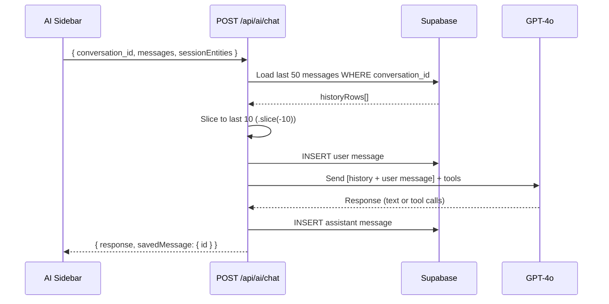
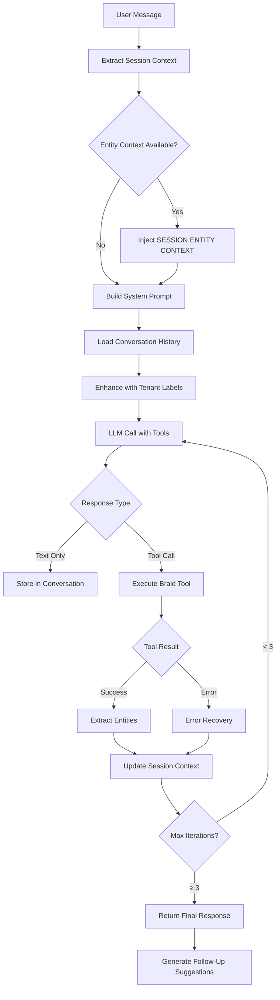
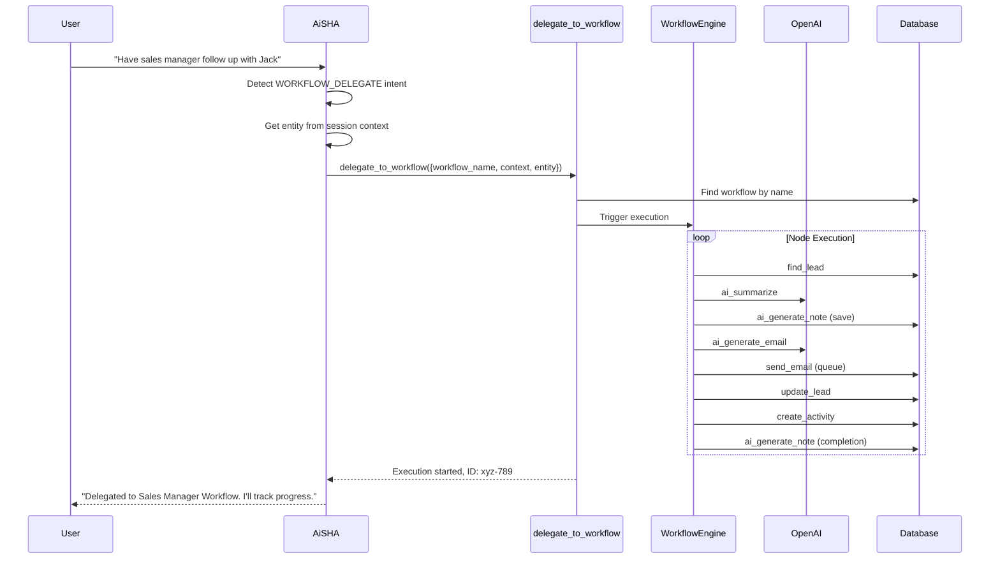

# AiSHA AI Architecture

**Version:** 1.3  
**Last Updated:** January 2, 2025  
**Status:** Production  
**Purpose:** Customer-facing AI Executive Assistant for Aisha CRM

---

## What's New in v1.3

- **Agent Workflow Orchestration:** AiSHA can now delegate multi-step tasks to named agent workflows (Sales Manager, Customer Service Manager)
- **AI-Powered Workflow Nodes:** New `ai_summarize`, `ai_generate_note`, and `ai_generate_email` nodes with real OpenAI integration
- **Workflow Delegation Tools:** 4 new Braid tools for triggering and monitoring agent workflows
- **Progress Tracking:** Workflows log AI-generated notes at each step for full visibility

---

## Overview

AiSHA (AI Sales & Help Assistant) is the primary user-facing AI agent for Aisha CRM, designed to assist users with CRM operations through natural language conversation.

**Key Characteristics:**

- **Access Level:** All authenticated users (tenant-scoped)
- **Model:** Multi-provider with failover (OpenAI GPT-4o → Anthropic Claude → Groq Llama)
- **Execution Environment:** Backend API with Braid SDK integration
- **Capabilities:** 27+ tools for CRM operations, RAG memory, autonomous actions
- **Interface:** Chat sidebar, realtime voice, API endpoints

---

## Data Persistence Layer

### 1. **Database Schema**

**Migration Source:** `backend/migrations/014_conversations.sql`

#### Conversations Table

```sql
CREATE TABLE conversations (
  id UUID PRIMARY KEY DEFAULT gen_random_uuid(),
  tenant_id UUID NOT NULL,                  -- FK to tenant(id)
  agent_name VARCHAR(255) DEFAULT 'crm_assistant',
  metadata JSONB DEFAULT '{}',
  created_date TIMESTAMP DEFAULT CURRENT_TIMESTAMP,
  updated_date TIMESTAMP DEFAULT CURRENT_TIMESTAMP,
  status VARCHAR(50) DEFAULT 'active',
  FOREIGN KEY (tenant_id) REFERENCES tenant(id) ON DELETE CASCADE
);
```

**Purpose:** Container for multi-turn chat sessions  
**Lifecycle:** Created on sidebar mount, reset, or first chat  
**RLS:** Tenant-isolated via `tenant_id`

#### Conversation Messages Table

```sql
CREATE TABLE conversation_messages (
  id UUID PRIMARY KEY DEFAULT gen_random_uuid(),
  conversation_id UUID NOT NULL,            -- FK to conversations(id)
  role VARCHAR(50) NOT NULL,                -- 'user', 'assistant', 'system'
  content TEXT NOT NULL,
  metadata JSONB DEFAULT '{}',
  created_date TIMESTAMP DEFAULT CURRENT_TIMESTAMP,
  FOREIGN KEY (conversation_id) REFERENCES conversations(id) ON DELETE CASCADE
);
```

**Purpose:** Persistent storage for all chat messages  
**Lifecycle:** Messages never deleted (accumulate indefinitely)  
**RLS:** Tenant-isolated via parent conversation  
**⚠️ CRITICAL:** NO `updated_date` column (common bug source - see v3.3.18 fix)

### 2. **Message Persistence Flow**



**Key Implementation Details:**

1. **User Message Persistence** (`backend/routes/ai.js`, lines 1868-1880)

   ```javascript
   await supabase.from('conversation_messages').insert({
     conversation_id: conversationId,
     role: 'user',
     content: lastUserMessage.content,
     created_date: new Date().toISOString(),
     // ⚠️ NO updated_date - column doesn't exist!
   });
   ```

2. **Assistant Message Persistence** (`backend/routes/ai.js`, lines 363-398)

   ```javascript
   const insertAssistantMessage = async (conversationId, content, metadata) => {
     const { data: inserted } = await supa
       .from('conversation_messages')
       .insert({ conversation_id: conversationId, role: 'assistant', content, metadata })
       .select()
       .single();

     // Update parent conversation timestamp
     await supa
       .from('conversations')
       .update({ updated_date: new Date().toISOString() })
       .eq('id', conversationId);

     return inserted;
   };
   ```

3. **History Loading** (`backend/routes/ai.js`, lines 1847-1865)

   ```javascript
   // Load last 50 messages (efficient DB query)
   const { data: historyRows } = await supabase
     .from('conversation_messages')
     .select('role, content, created_date')
     .eq('conversation_id', conversationId)
     .order('created_date', { ascending: true })
     .limit(50);

   // Limit to last 10 for LLM (token optimization)
   const recentHistory = historyRows.slice(-10);
   historicalMessages = recentHistory
     .filter((row) => row.role && row.content && row.role !== 'system')
     .map((row) => ({ role: row.role, content: row.content }));

   console.log(
     '[AI Chat] Loaded',
     historicalMessages.length,
     'historical messages (from',
     historyRows.length,
     'total)',
   );
   ```

### 3. **Conversation Lifecycle**

| Event                   | Action                           | Location                                |
| ----------------------- | -------------------------------- | --------------------------------------- |
| **Sidebar Mount**       | Create new conversation          | `useAiSidebarState.jsx` lines 137-155   |
| **Reset Thread**        | Create new conversation          | `useAiSidebarState.jsx` lines 267-289   |
| **Page Refresh**        | Create new conversation          | ⚠️ ISSUE: Orphans previous conversation |
| **Chat Message**        | INSERT user + assistant messages | `backend/routes/ai.js`                  |
| **Conversation Delete** | CASCADE deletes all messages     | Supabase ON DELETE CASCADE              |

### 4. **Token Budget Manager (v3.6.39)**

**Problem:** Sending all messages + tools + memory to LLM = expensive + slow  
**Solution:** Centralized budget enforcement with hard caps and smart drop-order

**Configuration:** `backend/lib/aiBudgetConfig.js` (single source of truth)

| Component         | Default Cap | Env Override            | Purpose                                      |
| ----------------- | ----------- | ----------------------- | -------------------------------------------- |
| **HARD_CEILING**  | 4000        | `AI_TOKEN_HARD_CEILING` | Total token budget (input + reserved output) |
| **SYSTEM_PROMPT** | 1200        | `AI_SYSTEM_PROMPT_CAP`  | Max tokens for system prompt                 |
| **TOOL_SCHEMA**   | 800         | `AI_TOOL_SCHEMA_CAP`    | Max tokens for tool JSON schemas             |
| **MEMORY**        | 250         | `AI_MEMORY_CAP`         | Max tokens for RAG memory context            |
| **TOOL_RESULT**   | 700         | `AI_TOOL_RESULT_CAP`    | Max tokens for tool result summaries         |
| **OUTPUT_MAX**    | 350         | `AI_OUTPUT_MAX_TOKENS`  | Reserved tokens for model output             |

**Drop Order (when over budget):**

```
1. Memory     → Trim/drop RAG context first (least critical)
2. Tools      → Reduce tool schemas (keep core + forced tools)
3. Messages   → Trim conversation history (keep system + last user)
4. System     → Hard-trim system prompt (last resort)
```

**Core Tools (never removed):**

- `fetch_tenant_snapshot`, `search_leads`, `search_contacts`
- `search_accounts`, `create_activity`, `suggest_next_actions`

**Token Savings (v3.6.39):**

- Before: ~11,000-12,000 tokens/request
- After: ~2,000-3,000 tokens/request
- **Savings: ~75% reduction**

**Budget Enforcement Flow:**

```javascript
// In ai.js - both flows
focusedTools = applyToolHardCap(tools, { maxTools: 12 });
focusedTools = enforceToolSchemaCap(focusedTools, { forcedTool });
const budgetResult = applyBudgetCaps({ systemPrompt, messages, tools, memoryText });
logBudgetSummary(budgetResult.report, budgetResult.actionsTaken);
// Use budgetResult.messages for API call
```

**Budget Log Output:**

```
[Budget] total=2847, system=423, tools=612, memory=0, history=1812
[Budget] total=3891, system=423, tools=612, memory=156, history=2700, actions=trimmed_messages_to_5
```

**Documentation:** See `backend/README-ai-budget.md` for full reference

### 5. **Known Issues & Cleanup Strategy**

#### Issue 1: Orphaned Conversations (CURRENT)

**Problem:** New conversation created on every page load/mount  
**Impact:** Database fills with abandoned conversations  
**Example:**

```
conversations:
  - id: abc-123 (Dec 25, 10:00 AM) → 45 messages (abandoned)
  - id: def-456 (Dec 25, 10:05 AM) → 30 messages (abandoned)
  - id: ghi-789 (Dec 25, 10:10 AM) → 12 messages (current)
```

**Proposed Fix:** Reuse conversation across sessions instead of creating new on mount

#### Issue 2: Unbounded Message Growth

**Problem:** Messages never deleted, accumulate indefinitely  
**Impact:** Database size + query performance degradation  
**Proposed Solutions:**

1. **Archive Strategy:** Move messages >30 days to `conversation_messages_archive`
2. **Conversation Limits:** Max 100 messages per conversation, auto-create new
3. **Retention Policy:** Delete conversations with no activity >90 days

#### Issue 3: Column Name Bug (FIXED in v3.3.18)

**Problem:** Code tried to INSERT `updated_date` into `conversation_messages`  
**Impact:** ALL message persistence silently failed since November 2025  
**Fix:** Removed invalid column from INSERT statement  
**Commit:** `8eaf149` (Dec 26, 2025)

### 6. **Debugging Message Persistence**

**Check if messages are being saved:**

```sql
-- Recent messages for a conversation
SELECT
  id,
  role,
  LEFT(content, 50) as preview,
  created_date
FROM conversation_messages
WHERE conversation_id = 'YOUR_CONVERSATION_ID'
ORDER BY created_date DESC
LIMIT 20;

-- Count messages per conversation
SELECT
  c.id,
  c.agent_name,
  COUNT(cm.id) as message_count,
  c.created_date,
  c.updated_date
FROM conversations c
LEFT JOIN conversation_messages cm ON c.id = cm.conversation_id
WHERE c.tenant_id = 'YOUR_TENANT_ID'
GROUP BY c.id
ORDER BY c.created_date DESC
LIMIT 10;
```

**Backend Logs:**

```
[AI Chat] Loaded 10 historical messages (from 50 total)
[AI Chat] Persisted user message to conversation
[AI Routes] insertAssistantMessage: { conversationId: "abc-123", contentLength: 245 }
```

---

## Conversation Flow Architecture

### 1. **Entry Points**

| Endpoint                 | Purpose                | Model Used                               |
| ------------------------ | ---------------------- | ---------------------------------------- |
| `POST /api/ai/chat`      | Primary chat interface | `chat_tools` capability (GPT-4o default) |
| `POST /api/ai/flow-chat` | Multi-step workflows   | `chat_tools` with flow routing           |
| `GET /api/ai/realtime`   | Voice/streaming chat   | `realtime_voice` capability              |
| `POST /api/ai/suggest`   | Contextual suggestions | `chat_light` (faster responses)          |

### 2. **Conversation Lifecycle**



### 3. **Session Entity Context Flow** (CRITICAL)

**Problem Solved:** Users shouldn't need to repeat entity IDs (e.g., "Jack Russel") in every message.

**Architecture:**

```javascript
// Frontend (useAiSidebarState.jsx)
1. Tool returns entity data → extractAndStoreEntities(data, type)
   - Stores: { "jack russel": { id: "uuid", type: "lead", name: "Jack Russel", data: {...} } }

2. User sends follow-up → buildSessionContextSummary()
   - Creates: [{ id: "uuid", type: "lead", name: "Jack Russel", aliases: ["jack", "jack russel"] }]

3. Sent in request:
   req.body = {
     messages: [...],
     sessionEntities: [{ id, type, name, aliases }]
   }

// Backend (backend/routes/ai.js)
4. Extract sessionEntities from req.body (line 1730)
   const { messages, model, temperature, sessionEntities = null } = req.body;

5. Inject into system prompt (lines 1851-1860):
   "**SESSION ENTITY CONTEXT (Background):**
   The user is currently discussing:
   - "Jack Russel" (lead, ID: abc-123) [also: jack, jack russel]

   When user asks 'what should I do next?', use suggest_next_actions with entity_id from this context."

6. AI now has entity_id → calls suggest_next_actions({ entity_type: "lead", entity_id: "abc-123" })
```

**Critical Files:**

- Frontend: `src/components/ai/useAiSidebarState.jsx` (lines 106-304)
- Backend: `backend/routes/ai.js` (lines 1730, 1851-1860)

### 4. **Tool Calling Flow**

**Braid SDK Integration:**

```
User: "Create an activity for Jack Russel"
↓
AiSHA AI:
1. Recognizes intent → Tool: create_activity
2. Resolves entity from session context → entity_id: "abc-123"
3. Calls: executeBraidTool("create_activity", {
     entity_type: "lead",
     entity_id: "abc-123",
     title: "Follow-up call",
     activity_type: "call"
   })
4. Tool executes → Creates activity record in DB
5. Returns result → "Activity created successfully"
6. AiSHA responds: "I've scheduled a follow-up call for Jack Russel."
7. Extracts entity → Adds to sessionEntityContext
```

**Tool Chain Example:**

```
User: "Show me warm leads and create activities for the top 3"
↓
Tool Chain:
1. search_leads({ status: "warm" }) → Returns 5 leads
2. For each of top 3:
   - create_activity({ entity_id, title: "Follow-up", type: "call" })
3. Final response with summary
```

### 5. **Follow-Up Suggestions Architecture** (CRITICAL)

**After Every Response, AiSHA MUST Provide Contextual Suggestions:**

| User Action           | AiSHA Suggestions                                                                    |
| --------------------- | ------------------------------------------------------------------------------------ |
| **Views lead**        | "Create activity", "Send email", "What should I do next?", "Show similar leads"      |
| **Creates account**   | "Add contact", "Create opportunity", "Set up follow-up", "Link to lead"              |
| **Asks about entity** | "Show full details", "View activities", "What's the next step?", "Create note"       |
| **Completes action**  | "What else can I help with?", "Create follow-up", "Mark as complete", "View related" |
| **Gets suggestions**  | "Create activity", "Send email now", "Schedule for later", "Show more options"       |

**Implementation:**

1. **Proactive Tool** - `suggest_next_actions` (v3.3.5+)
   - Triggered when user asks "what should I do next?" or similar
   - Analyzes entity state (notes, activities, stage, last contact)
   - Uses RAG memory for similar scenarios
   - Returns 2-3 specific actionable suggestions

2. **Context-Based Buttons** (Frontend)

   ```jsx
   // After AiSHA response
   <FollowUpSuggestions>
     {suggestions.map((s) => (
       <Button onClick={() => sendMessage(s.text)}>
         {s.icon} {s.text}
       </Button>
     ))}
   </FollowUpSuggestions>
   ```

3. **System Prompt Guidance** (backend/lib/braidIntegration-v2.js, lines 620+)
   ```
   **PROACTIVE NEXT ACTIONS (CRITICAL):**
   When users ask "what should I do next?", "what do you think?", "how should I proceed?":
   - NEVER respond with "I'm not sure what action you want to take"
   - ALWAYS use suggest_next_actions tool to analyze entity and provide intelligent recommendations
   - Include specific reasoning based on entity state (e.g., "callback pending from 3 days ago")
   ```

---

## System Prompt Structure

**Location:** `backend/lib/braidIntegration-v2.js` → `getBraidSystemPrompt()` (function for dynamic date)

**Enhancement:** `backend/lib/entityLabelInjector.js` → `enhanceSystemPromptWithFullContext()`

**Sections:**

1. **Date & Time Awareness** - ⚠️ NEW: Dynamic current date injection (prevents AI date confusion)
2. **Core Identity** - "You are AI-SHA, an executive assistant for Aisha CRM..."
3. **Capabilities Overview** - 27+ tools, autonomous actions, proactive suggestions
4. **Conversation Continuity & Context Awareness** - Handle implicit references, track discussion topics
5. **Tool Guidelines** - When to use each tool, parameter requirements
6. **Conversation Style** - Professional, concise, action-oriented
7. **Proactive Next Actions** - CRITICAL directive to suggest next steps
8. **Entity Labels** - Custom terminology per tenant (dynamically injected)
9. **Session Entity Context** - Currently discussed entities (injected per request)
10. **Recent Conversation Summary** - Last 3 message exchanges for context
11. **Safety Rules** - Never expose IDs in chat, validate before actions

**Dynamic Date Awareness:**
The system prompt is now generated by `getBraidSystemPrompt()` function, which injects the current date fresh on each request:

```javascript
// Called per-request for fresh date
const prompt = getBraidSystemPrompt();
// Includes: "The current date is: Thursday, January 9, 2026"
// Includes: "The current year is: 2026"
```

**Key Directives:**

```
- ⚠️ NEW: NEVER set due dates in the past - always use future dates
- ⚠️ NEW: Default to tomorrow at 9:00 AM if no date specified
- Maintain conversation continuity - track implicit references like "I think I only have 1"
- Refer to recent messages (last 3-5) to understand context
- NEVER respond "I'm not sure what action you want to take" - use conversation history
- Use session entity context for follow-up questions
- Call suggest_next_actions when user asks for guidance (mandatory for "next steps" questions)
- Provide 2-4 follow-up suggestions after every response
- Extract entities from tool results and track in session
- Confirm destructive actions before executing
- Use natural language, avoid technical jargon
```

**⚠️ v3.3.7+ RAG Improvements:**

- **Conversation History Awareness:** Last 6 messages (3 exchanges) injected into system prompt with 100-char preview
- **Implicit Reference Handling:** Examples added to system prompt showing how to interpret "I think I only have 1" in context
- **Strengthened suggest_next_actions Trigger:** Explicit mandate to call tool for ANY "next steps" question variation
- **"I'm Not Sure" Prevention:** System prompt explicitly forbids generic "I'm not sure" responses

---

## Available Tools (Braid SDK)

### **Search & Retrieval**

| Tool                   | Purpose                | Example                                   |
| ---------------------- | ---------------------- | ----------------------------------------- |
| `search_leads`         | Find leads by criteria | `{ status: "warm", limit: 10 }`           |
| `search_contacts`      | Find contacts          | `{ company: "ABC Corp" }`                 |
| `search_accounts`      | Find accounts          | `{ industry: "Construction" }`            |
| `search_opportunities` | Find deals             | `{ stage: "proposal", min_value: 10000 }` |
| `get_lead`             | Get full lead details  | `{ lead_id: "uuid" }`                     |
| `get_contact`          | Get contact details    | `{ contact_id: "uuid" }`                  |

### **Create & Update**

| Tool              | Purpose       | Example                                       |
| ----------------- | ------------- | --------------------------------------------- |
| `create_lead`     | New lead      | `{ first_name, last_name, email, company }`   |
| `create_contact`  | New contact   | `{ name, email, account_id }`                 |
| `create_account`  | New account   | `{ company_name, industry }`                  |
| `create_activity` | Schedule task | `{ entity_type, entity_id, title, due_date }` |
| `create_note`     | Add note      | `{ entity_type, entity_id, content }`         |
| `update_lead`     | Modify lead   | `{ lead_id, status: "converted" }`            |

### **Analysis & Intelligence**

| Tool                   | Purpose              | Example                                      |
| ---------------------- | -------------------- | -------------------------------------------- |
| `suggest_next_actions` | Recommend next steps | `{ entity_type: "lead", entity_id: "uuid" }` |
| `analyze_sentiment`    | Email/note sentiment | `{ text: "..." }`                            |
| `get_ai_memory`        | RAG memory search    | `{ query: "similar deals", limit: 5 }`       |

### **Workflows**

| Tool               | Purpose                | Example                         |
| ------------------ | ---------------------- | ------------------------------- |
| `send_email`       | Send via integration   | `{ to, subject, body }`         |
| `schedule_meeting` | Calendar integration   | `{ attendees, date, duration }` |
| `convert_lead`     | Lead → Account/Contact | `{ lead_id }`                   |

### **Workflow Delegation (Agent Orchestration)** (v3.7.0+)

| Tool                    | Purpose                               | Example                                                                                                               |
| ----------------------- | ------------------------------------- | --------------------------------------------------------------------------------------------------------------------- |
| `delegate_to_workflow`  | Delegate task to named agent workflow | `{ workflow_name: "Sales Manager Workflow", context: {...}, related_entity_type: "lead", related_entity_id: "uuid" }` |
| `get_workflow_progress` | Check execution status                | `{ execution_id: "uuid" }`                                                                                            |
| `list_active_workflows` | See running workflows                 | `{ limit: 10 }`                                                                                                       |
| `get_workflow_notes`    | Get progress notes from workflow      | `{ execution_id: "uuid" }`                                                                                            |

---

## Conversation Patterns

### **Pattern 1: Entity Inquiry**

```
User: "Tell me about Jack Russel"
↓
AiSHA:
1. search_leads({ name_contains: "Jack Russel" }) → Returns lead
2. Response: "Jack Russel is a warm lead from ABC Corp. Last contact: 3 days ago."
   Stores in sessionEntityContext: { "jack russel": { id, type: "lead", ... } }

Follow-Up Suggestions:
- "What should I do next?" [triggers suggest_next_actions]
- "Show activities for Jack"
- "Create a follow-up activity"
- "Send email to Jack"
```

### **Pattern 2: Proactive Next Actions** (v3.3.5+)

```
User: "What should I do next?" [about Jack Russel - in session context]
↓
AiSHA:
1. Detects "next step" intent
2. Reads SESSION ENTITY CONTEXT → Jack Russel (lead, ID: abc-123)
3. Calls suggest_next_actions({ entity_type: "lead", entity_id: "abc-123" })
4. Tool analyzes:
   - Notes: "Awaiting callback" (priority: 9)
   - Last contact: 3 days ago (priority: 7)
   - Stage: Warm (priority: 10)
5. Returns suggestions:
   [
     { action: "Follow-up call", reasoning: "Callback pending from conversation 3 days ago", priority: "Urgent" },
     { action: "Send email recap", reasoning: "Provide written summary of proposal", priority: "Normal" },
     { action: "Schedule discovery meeting", reasoning: "Warm lead ready to advance", priority: "High" }
   ]
6. Response: "Based on Jack's current state, I recommend:\n1. **Follow-up call (Urgent)** - Callback pending...\n2. ..."

Follow-Up Suggestions:
- "Create the follow-up activity now"
- "Draft the email recap"
- "Schedule the meeting"
- "Show Jack's full history"
```

### **Pattern 3: Bulk Operations**

```
User: "Show all warm leads and create activities for the top 3"
↓
AiSHA:
1. search_leads({ status: "warm", limit: 10 }) → 10 leads
2. For top 3:
   - create_activity({ entity_id: lead1.id, title: "Follow-up", type: "call", due_date: "tomorrow" })
   - create_activity({ entity_id: lead2.id, ... })
   - create_activity({ entity_id: lead3.id, ... })
3. Response: "Created follow-up activities for:\n- Lead 1\n- Lead 2\n- Lead 3"

Follow-Up Suggestions:
- "Show all pending activities"
- "What should I prioritize today?"
- "Create activities for remaining leads"
- "View activity calendar"
```

### **Pattern 4: Error Recovery**

```
User: "Create an activity for John" [no John in session context]
↓
AiSHA:
1. Attempts tool call → Needs entity_id
2. search_contacts({ name_contains: "John" }) → Multiple results
3. Response: "I found 3 contacts named John:\n1. John Doe (ABC Corp)\n2. John Smith (XYZ Inc)\n3. John Brown (Freelance)\n\nWhich one?"

Follow-Up Suggestions:
- "John Doe from ABC Corp"
- "John Smith from XYZ"
- "Show all Johns"
- "Never mind"
```

### **Pattern 5: Agent Workflow Delegation** (v3.7.0+)

```
User: "Have the sales manager follow up with this lead"
↓
AiSHA:
1. Detects WORKFLOW_DELEGATE intent
2. Reads SESSION ENTITY CONTEXT → Jack Russel (lead, ID: abc-123)
3. Calls delegate_to_workflow({
     workflow_name: "Sales Manager Workflow",
     context: { priority: "normal", source: "user_request" },
     related_entity_type: "lead",
     related_entity_id: "abc-123"
   })
4. Workflow executes autonomously:
   - find_lead → ai_summarize → ai_generate_note
   - ai_generate_email → send_email → update_lead
   - create_activity → ai_generate_note (completion)
5. Response: "I've delegated the follow-up to the Sales Manager Workflow.
   It will send a personalized email and schedule a follow-up task."

Follow-Up Suggestions:
- "Check the workflow progress"
- "What has the sales manager done?"
- "Show me the lead's notes"
- "Cancel the workflow"
```

---

## Agent Workflow Orchestration (v3.7.0+)

**Purpose:** Enable AiSHA to delegate complex, multi-step tasks to specialized agent workflows that execute autonomously.

### 1. **Architecture Overview**

```mermaid
graph TD
    A[User: "Delegate to sales manager"] --> B[AiSHA Detects Intent]
    B --> C{Intent Classification}
    C -->|WORKFLOW_DELEGATE| D[delegate_to_workflow Tool]
    D --> E[Find Workflow by Name]
    E --> F[Trigger Workflow Execution]
    F --> G[Workflow Engine]

    subgraph "Workflow Execution"
        G --> H[find_lead/contact]
        H --> I[ai_summarize]
        I --> J[ai_generate_note]
        J --> K[ai_generate_email]
        K --> L[send_email]
        L --> M[update_lead]
        M --> N[create_activity]
        N --> O[ai_generate_note - completion]
    end

    O --> P[Notes Logged to Record]
    P --> Q[AiSHA Reports Status]

    style D fill:#violet
    style G fill:#blue
    style I fill:#purple
    style J fill:#purple
    style K fill:#purple
```

### 2. **Named Agent Workflows**

Two pre-built agent workflows are available for delegation:

| Workflow                              | Purpose                                                 | Triggered By                                          |
| ------------------------------------- | ------------------------------------------------------- | ----------------------------------------------------- |
| **Sales Manager Workflow**            | Lead follow-ups, personalized outreach, sales nurturing | "delegate to sales manager", "have sales follow up"   |
| **Customer Service Manager Workflow** | Support inquiries, response generation, escalation      | "delegate to customer service", "have support handle" |

### 3. **AI-Powered Workflow Nodes**

The workflow engine includes specialized AI nodes that call OpenAI:

| Node Type           | Purpose                      | Configuration                                                          |
| ------------------- | ---------------------------- | ---------------------------------------------------------------------- |
| `ai_summarize`      | Generate context summaries   | `summary_type`: status_update, executive_summary, action_items, custom |
| `ai_generate_note`  | Create AI-generated notes    | `note_type`: progress_update, call_summary, meeting_prep, custom       |
| `ai_generate_email` | Generate personalized emails | `tone`: professional, friendly, formal, casual, urgent                 |

**Node Implementation:**

```javascript
// ai_summarize generates summaries stored in {{ai_summary}}
case 'ai_summarize': {
  const result = await generateChatCompletion({
    provider: 'openai',
    model: 'gpt-4o-mini',
    messages: [
      { role: 'system', content: `Generate ${summaryType} for CRM context` },
      { role: 'user', content: contextData }
    ]
  });
  context.variables.ai_summary = result.content;
}

// ai_generate_note creates notes and persists to database
case 'ai_generate_note': {
  const noteContent = await generateChatCompletion({...});
  await pgPool.query(`INSERT INTO notes (...) VALUES (...)`);
  context.variables.ai_note = savedNote;
}
```

### 4. **Delegation Flow**



### 5. **Intent Patterns for Delegation**

| Pattern                           | Intent Code         | Tool Called             |
| --------------------------------- | ------------------- | ----------------------- |
| "delegate to sales manager"       | `WORKFLOW_DELEGATE` | `delegate_to_workflow`  |
| "have customer service handle"    | `WORKFLOW_DELEGATE` | `delegate_to_workflow`  |
| "start the sales workflow"        | `WORKFLOW_DELEGATE` | `delegate_to_workflow`  |
| "what has the sales manager done" | `WORKFLOW_STATUS`   | `get_workflow_progress` |
| "check workflow progress"         | `WORKFLOW_STATUS`   | `get_workflow_progress` |

### 6. **Progress Tracking**

Workflows log progress via AI-generated notes:

```sql
-- Notes created by workflow execution
SELECT content, metadata->'ai_generated' as ai_generated
FROM notes
WHERE metadata->>'workflow_execution_id' = 'xyz-789'
ORDER BY created_at;

-- Results:
-- "Sales Manager Workflow starting. Lead Jack Russel status: warm, last contact: 3 days ago."
-- "Email sent to jack@example.com with personalized follow-up. Subject: Following up on our conversation"
-- "Sales Manager Workflow completed. Actions: email sent, lead status updated to 'contacted', follow-up task created."
```

### 7. **Workflow Templates**

**Location:** `src/data/workflowTemplates.js`

**Sales Manager Workflow:**

```javascript
{
  id: 'sales-manager-workflow',
  name: 'Sales Manager Workflow',
  category: 'Agent Workflows',
  nodes: [
    { type: 'webhook_trigger', ... },
    { type: 'find_lead', config: { search_field: 'id', search_value: '{{entity_id}}' } },
    { type: 'ai_summarize', config: { summary_type: 'status_update' } },
    { type: 'ai_generate_note', config: { note_type: 'progress_update' } },
    { type: 'condition', config: { field: 'found_lead.status', operator: 'equals', value: 'new' } },
    { type: 'ai_generate_email', config: { tone: 'professional', prompt: 'Write introductory email...' } },
    { type: 'send_email', config: { to: '{{found_lead.email}}', subject: '{{ai_email.subject}}' } },
    { type: 'update_lead', config: { field_mappings: [{ lead_field: 'status', webhook_field: 'contacted' }] } },
    { type: 'create_activity', config: { type: 'task', subject: 'Follow up with {{found_lead.first_name}}' } },
    { type: 'ai_generate_note', config: { note_type: 'progress_update', custom_prompt: 'Summarize completion...' } }
  ]
}
```

### 8. **Braid Tool Implementation**

**Location:** `braid-llm-kit/examples/assistant/workflow-delegation.braid`

```braid
// Trigger a named workflow by name with context
fn triggerWorkflowByName(
  tenant: String,
  workflow_name: String,
  context: Object,
  related_entity_type: String,
  related_entity_id: String
) -> Result<Object, CRMError> !net {
  // 1. Find workflow by name
  let searchResponse = http.get("/api/workflows", { params: { name: workflow_name } });

  // 2. Trigger execution with context
  let executeResponse = http.post("/api/workflows/execute", {
    params: { workflow_id: workflow.id },
    body: { trigger_source: "ai_delegation", entity_type, entity_id, context }
  });

  return Ok({ workflow_id, execution_id, status: "started" });
}
```

---

## RAG Memory Integration (Phase 7)

**Purpose:** Learn from past conversations and suggest actions based on similar scenarios

**Architecture:**

```sql
-- ai_memory_chunks table (pgvector)
id, tenant_id, chunk_text, embedding, metadata, entity_type, entity_id, created_at
```

### Memory Gating (v3.6.39)

**Problem:** RAG memory is expensive (embedding API + DB queries)  
**Solution:** Gate memory injection behind explicit trigger patterns

**Configuration:** `backend/lib/aiBudgetConfig.js`

| Setting         | Default | Env Override                | Purpose                           |
| --------------- | ------- | --------------------------- | --------------------------------- |
| `enabled`       | false   | `MEMORY_ENABLED=true`       | Master switch (must be true)      |
| `alwaysOn`      | false   | `AI_MEMORY_ALWAYS_ON=true`  | Bypass pattern matching (testing) |
| `alwaysOff`     | false   | `AI_MEMORY_ALWAYS_OFF=true` | Force off (overrides all)         |
| `topK`          | 3       | `MEMORY_TOP_K`              | Number of chunks to retrieve      |
| `maxChunkChars` | 300     | `MEMORY_MAX_CHUNK_CHARS`    | Max chars per chunk               |

**Gating Precedence:**

```
ALWAYS_OFF > MEMORY_ENABLED > ALWAYS_ON > patterns
```

**Trigger Patterns (memory only queried when matched):**

- "last time", "previously", "earlier", "before"
- "remind me", "what did we", "recap", "summary"
- "what happened", "follow up", "next steps"
- "discussed", "talked about", "mentioned"
- "remember when", "do you remember"

**Implementation:** `backend/lib/aiMemory/index.js`

```javascript
// Check if memory should be used
if (shouldUseMemory(userMessage)) {
  const memoryChunks = await queryMemory({ tenantId, query, topK: 3 });
  // Inject as system message with UNTRUSTED boundary
}

// Check if conversation summary should be injected
if (shouldInjectConversationSummary(userMessage, messageCount)) {
  const summary = await getConversationSummaryFromMemory({ conversationId, tenantId });
  // Inject as system message
}
```

### Memory Flow

```
1. User action generates memory chunk:
   "User asked about next steps for warm lead 'Jack Russel' (awaiting callback).
    AiSHA suggested: follow-up call, send email, schedule meeting."

2. Embedding generated (OpenAI text-embedding-3-small)

3. Stored with metadata:
   { entity_type: "lead", entity_id: "abc-123", action: "suggest_next_actions", outcome: "activity_created" }

4. Future similar query (ONLY if trigger pattern matches):
   "What did we discuss last time?" [warm lead, awaiting callback]

5. RAG search (75%+ similarity, limited to topK=3):
   SELECT * FROM ai_memory_chunks
   WHERE tenant_id = ? AND entity_type = ?
   ORDER BY embedding <=> query_embedding
   LIMIT 3

6. Relevant memories injected as UNTRUSTED context
```

**Integration Point:**

- `backend/lib/suggestNextActions.js` → `queryMemory()`
- `backend/routes/ai.js` → `shouldUseMemory()` + `shouldInjectConversationSummary()`
- Fallback to rule-based if RAG unavailable

---

## Multi-Provider LLM Failover

**Configuration:** `backend/lib/aiEngine/`

**Capabilities:**
| Capability | Primary | Fallback 1 | Fallback 2 |
|------------|---------|------------|------------|
| `chat_tools` | OpenAI gpt-4o | Anthropic claude-3-5-sonnet | Groq llama-3.3-70b |
| `chat_light` | OpenAI gpt-4o-mini | Anthropic claude-3-5-haiku | Groq llama-3.1-8b |
| `json_strict` | OpenAI gpt-4o (JSON mode) | - | - |
| `realtime_voice` | OpenAI gpt-4o-realtime | - | - |

**Automatic Failover:**

```javascript
// If OpenAI fails
try {
  response = await openai.chat.completions.create(...)
} catch (error) {
  console.warn('[AI Engine] OpenAI failed, trying Anthropic...')
  response = await anthropic.messages.create(...)
}
```

**Per-Tenant Override:**

```bash
# Force tenant to use Anthropic
LLM_PROVIDER__TENANT_abc123=anthropic
```

---

## Security & Privacy

### **Tenant Isolation**

- All queries filtered by `tenant_id` (UUID)
- RLS policies enforce data access
- Session context scoped to tenant

### **Data Redaction**

```javascript
// Before sending to LLM
const sanitized = filterSensitiveFields(data, ['password', 'api_key', 'ssn', 'credit_card']);
```

### **Audit Logging**

```sql
-- All tool calls logged
INSERT INTO audit_logs (user_id, action, details, severity)
VALUES (?, 'aisha.create_activity', '{"entity_id": "..."}', 'normal');
```

### **Rate Limiting**

- 100 requests/minute per user
- 500 requests/hour per tenant
- Enforced by `backend/lib/rateLimiter.js`

---

## Error Handling

### **Tool Execution Failure**

```javascript
{
  error: "Tool execution failed",
  tool: "create_activity",
  reason: "Missing required field: due_date",
  suggestion: "Please provide a due date for the activity"
}
```

**AiSHA Response:**

> "I need a due date to create the activity. When should it be scheduled?"

### **Entity Not Found**

```javascript
{
  error: "Entity not found",
  entity_type: "lead",
  entity_id: "invalid-uuid"
}
```

**AiSHA Response:**

> "I couldn't find that lead. Let me search for you..." [Fallback to search]

### **Permission Denied**

```javascript
{
  error: "Permission denied",
  reason: "User lacks module access: opportunities"
}
```

**AiSHA Response:**

> "You don't have access to opportunities. Contact your admin to enable this module."

---

## Performance Optimization

### **Caching Strategy**

- Tool results cached for 5 minutes (Redis)
- Entity lookups cached by ID
- Search queries NOT cached (data changes frequently)

### **Response Streaming**

```javascript
// For long responses
res.setHeader('Content-Type', 'text/event-stream');
for await (const chunk of llmStream) {
  res.write(`data: ${JSON.stringify(chunk)}\n\n`);
}
```

### **Batch Operations**

```javascript
// Instead of N tool calls
create_activity(lead1); create_activity(lead2); ...

// Single batch call
bulk_create_activities([lead1, lead2, ...]);
```

---

## Testing AiSHA

### **Developer AI Integration**

```
Developer AI → test_aisha({ message: "What should I do next about Jack Russel?" })
↓
Observes:
- Tool calls: [suggest_next_actions]
- Parameters: { entity_type: "lead", entity_id: "abc-123" }
- Response quality
- Follow-up suggestions
```

### **Unit Tests**

```javascript
// backend/__tests__/ai/aisha.test.js
test('suggests next actions with session context', async () => {
  const response = await aiChat({
    message: 'What should I do next?',
    sessionEntities: [{ id: 'abc-123', type: 'lead', name: 'Jack Russel' }],
  });

  expect(response.tool_calls).toContainEqual({
    function: { name: 'suggest_next_actions' },
  });
});
```

---

## Deployment & Versioning

**Version Tagging:**

- Features: v3.3.x (e.g., v3.3.5 - suggest_next_actions)
- Bugfixes: v3.3.x (e.g., v3.3.6 - sessionEntities fix)
- Breaking changes: v3.4.0+

**Deployment Flow:**

```
1. Git tag pushed → v3.3.6
2. GitHub Actions builds Docker image
3. VPS pulls new image
4. Container restarts with new code
5. AiSHA automatically uses new features
```

**NO AUTOMATED DEPLOYMENTS - REQUIRE EXPLICIT PERMISSION**

---

## Best Practices for Developers

### **When Adding New Tools**

1. **Define in Braid SDK** - `braid-llm-kit/tools/`
2. **Register in TOOL_DESCRIPTIONS** - `backend/lib/braidIntegration-v2.js`
3. **Update System Prompt** - Add usage guidance
4. **Test with Developer AI** - `test_aisha` tool
5. **Document in this file** - Add to Available Tools section
6. **Add Follow-Up Suggestions** - What should user do after using this tool?

### **When Debugging Conversation Flow**

1. **Check Session Context** - Is entity in `sessionEntityContext`?
2. **Verify Tool Registration** - Is tool in OpenAI function schema?
3. **Review Logs** - `docker logs aishacrm-backend | grep tool_calls`
4. **Test with Developer AI** - `test_aisha` shows exact tool sequences
5. **Validate System Prompt** - Is directive clear and specific?

### **When Modifying Follow-Up Logic**

1. **Update System Prompt** - `BRAID_SYSTEM_PROMPT` in braidIntegration-v2.js
2. **Enhance Tool Schemas** - Add "typical_followups" metadata
3. **Frontend Integration** - Update `useAiSidebarState.jsx`
4. **Test Conversation Flows** - Ensure suggestions remain relevant
5. **Document Patterns** - Add to this file

---

## RAG & Context Improvements (v3.3.7+)

### Problem Addressed

AiSHA AI was failing to maintain conversation continuity, resulting in poor user experience:

- **Issue 1:** Responding "I'm not sure what action you want to take" to vague statements like "I think I only have 1"
- **Issue 2:** Not calling `suggest_next_actions` when users asked "What should be my next steps?"
- **Issue 3:** Losing context of recently discussed entities

### Solution Components

#### 1. **Conversation History Injection**

**File:** `backend/routes/ai.js` (lines 1854-1879)

Added automatic injection of recent conversation context into system prompt:

```javascript
// Last 6 messages (3 exchanges) with 100-char preview
const recentMessages = messages.slice(-6);
const summaryItems = recentMessages
  .filter((m) => m.role === 'user' || m.role === 'assistant')
  .map((m) => {
    const preview = m.content?.slice(0, 100) || '';
    return `${m.role === 'user' ? 'User' : 'AiSHA'}: ${preview}`;
  })
  .join('\n');
```

**Effect:** AiSHA can now refer to what was just discussed to understand implicit references.

#### 2. **Enhanced System Prompt**

**File:** `backend/lib/braidIntegration-v2.js` (lines 618-665)

Added new section: **CONVERSATION CONTINUITY & CONTEXT AWARENESS**

Key improvements:

- Explicit examples of implicit references: "I think I only have 1" → understand from context
- Instruction to track recent discussion topics (last 3-5 messages)
- Mandate to use conversation history instead of responding "I'm not sure"
- Specific patterns for handling follow-up questions about entities

#### 3. **Strengthened suggest_next_actions Trigger**

**File:** `backend/lib/braidIntegration-v2.js` (lines 636-665)

- Added comprehensive list of trigger patterns
- Explicit **MANDATORY BEHAVIOR** directive
- Forbids "I'm not sure" responses for next steps questions
- Examples showing correct tool usage with session context

#### 4. **Improved Session Context Formatting**

**File:** `backend/routes/ai.js` (lines 1870-1880)

Enhanced session entity context injection:

```javascript
systemPrompt += `${conversationSummary}\n\n**SESSION ENTITY CONTEXT (Background - CRITICAL FOR NEXT ACTIONS):**
The user is currently discussing these entities:
${entityContext}

**MANDATORY TOOL USAGE:**
When user asks ANY of these questions:
- "What should I do next?"
- "What do you think?"
...
You MUST call suggest_next_actions tool with entity_id from the context above.
DO NOT respond with "I'm not sure what action you want to take" - ALWAYS use the tool to analyze and suggest intelligent actions based on entity state.`;
```

### Testing & Validation

**Test Suite:** `backend/__tests__/ai/conversationContext.test.js`

Coverage:

- ✅ System prompt includes conversation continuity section
- ✅ All suggest_next_actions trigger patterns present
- ✅ Implicit reference handling examples included
- ✅ Session entity format validation
- ✅ Conversation summary format validation
- ✅ "I'm not sure" prevention directives
- ✅ Mandatory suggest_next_actions usage

**Run tests:**

```bash
cd backend
CI_BACKEND_TESTS=true node --test __tests__/ai/conversationContext.test.js
```

### Expected Behavior After Fix

**Scenario from Problem Statement:**

| Before (v3.3.6)                                                                             | After (v3.3.7+)                                                                                                                                             |
| ------------------------------------------------------------------------------------------- | ----------------------------------------------------------------------------------------------------------------------------------------------------------- |
| User: "I think i only have 1"<br>AiSHA: "I'm not sure what action you want to take"         | User: "I think i only have 1"<br>AiSHA: "Yes, you have 1 warm lead: Jack Russel. Would you like to see the details?"                                        |
| User: "What should be my next steps?"<br>AiSHA: "I'm not sure what action you want to take" | User: "What should be my next steps?"<br>AiSHA: [Calls suggest_next_actions]<br>"Based on Jack's current state, I recommend: 1. Follow-up call (Urgent)..." |

### Performance Impact

- **Minimal:** +100-200 bytes to system prompt per request
- **Conversation summary:** ~600 bytes for 6 messages
- **No additional API calls:** Context built from existing message history
- **Latency:** <1ms overhead for context formatting

### Rollback Plan

If issues arise, revert commits:

- `5f260c3` - Enhanced system prompt
- Previous behavior: Session entities tracked but not referenced in conversation history

---

## Version History

| Version | Date       | Changes                                                                                             |
| ------- | ---------- | --------------------------------------------------------------------------------------------------- |
| 1.1     | 2025-12-26 | Added Data Persistence Layer section, documented conversation_messages bug fix (v3.3.18)            |
| 1.0     | 2025-12-25 | RAG & context improvements: conversation history, implicit references, suggest_next_actions mandate |

---

## References

- **Core Code:** `backend/routes/ai.js`
- **Braid Integration:** `backend/lib/braidIntegration-v2.js`
- **Session Context:** `src/components/ai/useAiSidebarState.jsx`
- **Next Actions:** `backend/lib/suggestNextActions.js`
- **AI Engine:** `backend/lib/aiEngine/`
- **Tool Schemas:** `braid-llm-kit/tools/`
- **Related:** [AI Architecture - Developer AI](./AI_ARCHITECTURE_DEVELOPER_AI.md)
