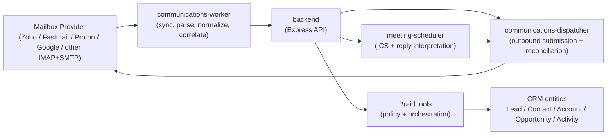

# Provider-Agnostic Communications Topology

> **Status:** Phase 1 architecture design
> **Updated:** 2026-03-13
> **Scope:** Provider-backed email ingestion, outbound email, thread storage, CRM linking, and meeting scheduling

## Purpose

This document defines the runtime topology for a provider-agnostic communications module that lets AiSHA CRM operate independently from Google Workspace while preserving multi-tenant isolation and the existing Braid execution model.

AiSHA is the mail intelligence layer, not the mail server.

## Existing Runtime Baseline

- `frontend` and `backend` remain the primary application surfaces
- `redis-memory` and `redis-cache` remain split by purpose
- Braid remains the only valid AI orchestration path
- all service writes ultimately land in Supabase/Postgres with tenant scoping

## Phase 1 Service Topology

## Control Boundary

Required write path:

1. provider adapter retrieves a message or accepts an outbound job
2. worker or dispatcher normalizes the payload
3. internal service calls authenticated backend endpoints
4. backend routes through existing middleware
5. backend invokes Braid-backed policy/tooling where orchestration is required
6. backend persists tenant-scoped records

Forbidden paths:

- direct LLM access to the database
- direct communications-worker or dispatcher writes into Supabase/Postgres
- provider-specific business logic embedded into CRM entity rules

## Tenant Isolation Model

- each mailbox connection maps to exactly one tenant
- each stored thread and message record carries `tenant_id`
- sync cursors and provider credentials are tenant-scoped
- cross-tenant thread merges are forbidden
- replay, retry, and dead-letter queues preserve tenant boundaries

## Provider Adapter Model

Required adapter capabilities:

- inbound mailbox sync or retrieval
- outbound SMTP-style submission
- normalized provider error mapping
- mailbox cursor or checkpoint handling
- provider metadata passthrough for audit and replay

## Rollout Sequence

1. standardize the Docker network contract
2. define provider adapter contract
3. add communications configuration schema
4. implement communications-worker and dispatcher
5. add email thread and message persistence
6. implement CRM linking and `Activity` mirroring
7. enable outbound send and delivery reconciliation
8. enable lead-capture review flow
9. enable meeting invite and reply handling
