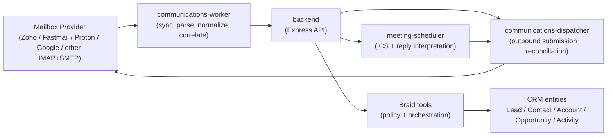

# Provider-Agnostic Communications Topology

> **Status:** Phase 1 architecture design
> **Updated:** 2026-03-14
> **Scope:** Provider-backed email ingestion, outbound email, thread storage, CRM linking, and meeting scheduling

> **Implementation note:** The provider-agnostic inbound polling loop is now implemented in the backend worker layer. The remaining gap is deeper thread/message persistence and richer CRM linking beyond the current accepted inbound orchestration path.

## Purpose

This document defines the runtime topology for a provider-agnostic communications module that lets AiSHA CRM operate independently from Google Workspace while preserving multi-tenant isolation and the existing Braid execution model.

AiSHA is the mail intelligence layer, not the mail server.

## Existing Runtime Baseline

- `frontend` and `backend` remain the primary application surfaces
- `redis-memory` and `redis-cache` remain split by purpose
- Braid remains the only valid AI orchestration path
- all service writes ultimately land in Supabase/Postgres with tenant scoping

## Phase 1 Service Topology

## Control Boundary

Required write path:

1. provider adapter retrieves a message or accepts an outbound job
2. worker or dispatcher normalizes the payload
3. internal service calls authenticated backend endpoints
4. backend routes through existing middleware
5. backend invokes Braid-backed policy/tooling where orchestration is required
6. backend persists tenant-scoped records

Forbidden paths:

- direct LLM access to the database
- direct communications-worker or dispatcher writes into Supabase/Postgres
- provider-specific business logic embedded into CRM entity rules

## Implemented Inbound Flow

The current inbound email path is now concrete:

1. `communications-worker` resolves the mailbox connection from `tenant_integrations`
2. the worker reads the stored mailbox cursor from `tenant_integrations.metadata.communications.sync.cursor`
3. the provider adapter fetches incremental IMAP messages from the configured folder using that cursor
4. the worker normalizes each message into the internal communications envelope
5. the worker posts each normalized payload to `/api/internal/communications/inbound` using an internal JWT
6. the backend validates auth, idempotency, and tenant scope before invoking service/Braid orchestration
7. only after successful ingestion does the worker acknowledge and persist the next cursor back to the same `tenant_integrations` row

This preserves the intended intelligence-layer model:

- the mailbox provider remains the system of record for transport and mailbox hosting
- AiSHA owns normalization, orchestration, and CRM-side intelligence
- no provider adapter writes directly to the database

## Tenant Isolation Model

- each mailbox connection maps to exactly one tenant
- each stored thread and message record carries `tenant_id`
- sync cursors and provider credentials are tenant-scoped
- cross-tenant thread merges are forbidden
- replay, retry, and dead-letter queues preserve tenant boundaries

## Provider Adapter Model

Required adapter capabilities:

- inbound mailbox sync or retrieval
- outbound SMTP-style submission
- normalized provider error mapping
- mailbox cursor or checkpoint handling
- provider metadata passthrough for audit and replay

Current implemented provider behavior:

- `imap_smtp` supports incremental inbound retrieval by UID cursor
- `imap_smtp` supports outbound SMTP delivery
- cursor acknowledgement is explicit in the adapter contract
- provider metadata is carried forward in normalized inbound payloads for replay and audit

## Rollout Sequence

1. standardize the Docker network contract
2. define provider adapter contract
3. add communications configuration schema
4. implement communications-worker and dispatcher
5. add email thread and message persistence
6. implement CRM linking and `Activity` mirroring
7. enable outbound send and delivery reconciliation
8. enable lead-capture review flow
9. enable meeting invite and reply handling
