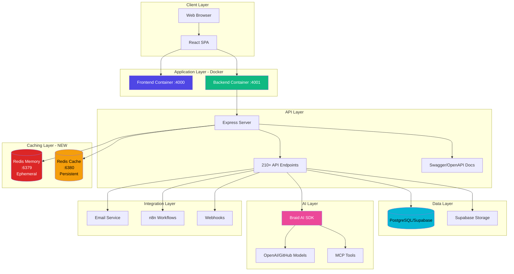

# Release 1.0.3 Documentation Updates

**Date:** November 18, 2025  
**Version:** 1.0.3

This document summarizes architectural changes and new features introduced in v1.0.3 that need to be integrated into the main documentation.

---

## 🏗️ Architecture Changes

### Redis Dual-Layer Architecture

**NEW:** The application now uses **two separate Redis instances** for different purposes:

#### 1. Memory Layer (Ephemeral - Port 6379)
- **Purpose:** Temporary operational data
- **Use Cases:**
  - User presence tracking (live_status)
  - Session data
  - Real-time event coordination
- **Persistence:** None (data lost on restart)
- **Configuration:** `REDIS_MEMORY_URL=redis://aishacrm-redis:6379`

#### 2. Cache Layer (Persistent - Port 6380)
- **Purpose:** Performance optimization via caching
- **Use Cases:**
  - Activities stats caching (versioned invalidation)
  - API response caching
  - Computed aggregations
- **Persistence:** RDB snapshots (survives restarts)
- **TTL:** Varies by cache type (e.g., 30s for activities stats)
- **Configuration:** `REDIS_CACHE_URL=redis://aishacrm-redis-cache:6380`

#### Architecture Diagram Update



---

## 🚀 New Features & Enhancements

### 1. Activities Stats Caching (Versioned)

**Endpoint:** `GET /api/activities?include_stats=true`

**How it works:**
1. Client requests activities with `include_stats=true` query param
2. Backend computes counts (total, scheduled, in_progress, overdue, completed, cancelled)
3. Counts cached in Redis Cache layer with versioned key
4. On create/update/delete → version incremented → cache invalidated automatically
5. Cache TTL: 30 seconds (aligns with frontend cache manager)

**Cache Keys:**
```
activities:stats:tenant:<tenant_id>:v<version>:<filter_hash>
activities:stats:tenant:<tenant_id>:version  (current version number)
activities:stats:tenant:<tenant_id>:hits     (cache hit counter)
activities:stats:tenant:<tenant_id>:misses   (cache miss counter)
activities:stats:tenant:<tenant_id>:skips_mismatch  (mismatches)
```

**Monitoring Endpoint:**
```http
GET /api/activities/monitor/stats

Response:
{
  "status": "success",
  "data": {
    "available": true,
    "tenants_count": 2,
    "tenants": [
      {
        "tenant_id": "abc-123",
        "version": 5,
        "hits": 12,
        "misses": 3,
        "skips_mismatch": 0,
        "hit_ratio": "0.800"
      }
    ]
  }
}
```

### 2. System Logs - Bulk Batching

**Problem Solved:** Excessive individual POST requests causing rate limit issues

**Solution:** Client-side batching with bulk server endpoint

#### Client-Side Batching (`src/utils/systemLogBatcher.js`)
- Logs enqueued in memory queue (max 100 entries)
- Periodic flush every 5 seconds (configurable)
- Automatic flush when queue reaches threshold
- Graceful degradation: falls back to single POSTs if bulk fails

#### Bulk Endpoint
```http
POST /api/system-logs/bulk
Content-Type: application/json

{
  "logs": [
    {
      "tenant_id": "local-tenant-001",
      "level": "ERROR",
      "source": "MyComponent",
      "message": "Error occurred",
      "user_email": "user@example.com",
      "metadata": {}
    },
    ...
  ]
}

Response:
{
  "status": "success",
  "data": {
    "inserted": 5,
    "failed": 0
  }
}
```

#### Log Level Filtering
- **Environment Variable:** `VITE_LOG_LEVEL` (default: `ERROR`)
- **Supported Levels:** `DEBUG`, `INFO`, `WARN`, `ERROR`
- **Behavior:** Only logs at or above configured level are sent to server
- **Client Gating:** Filtering happens in `src/utils/auditLog.js` before batching

**Integration:** All components using `auditLog()` now automatically batch logs.

### 3. Notifications Polling - Exponential Backoff

**Enhancement:** `NotificationPanel.jsx` now implements intelligent polling

**Features:**
- **Base Interval:** 15 seconds
- **Exponential Backoff:** Doubles on each poll (15s → 30s → 60s max)
- **Jitter:** Randomized delay to prevent thundering herd
- **Visibility Pause:** Polling pauses when browser tab hidden, resumes on visibility
- **Silent Updates:** No UI flicker on background refreshes

**Configuration:**
```javascript
// src/components/shared/NotificationPanel.jsx
const BASE_INTERVAL = 15000;       // 15 seconds
const MAX_INTERVAL = 60000;        // 60 seconds cap
const BACKOFF_MULTIPLIER = 2;      // Double each time
const JITTER_FACTOR = 0.1;         // ±10% randomization
```

### 4. Configurable Heartbeats

**Problem Solved:** Fixed heartbeat intervals were too frequent for production

#### Backend Heartbeat
- **Purpose:** Server liveness signal for monitoring
- **Environment Variables:**
  - `HEARTBEAT_ENABLED` (default: `true`)
  - `HEARTBEAT_INTERVAL_MS` (default: `60000` / 60s, now configurable to `120000` / 120s)
- **Location:** `backend/server.js`
- **Behavior:** Writes `{type: 'Heartbeat', ...}` to system logs at configured interval

#### Frontend User Presence Heartbeat
- **Purpose:** Updates `last_seen` and `live_status` for online users
- **Environment Variable:** `VITE_USER_HEARTBEAT_INTERVAL_MS` (default: `60000` / 60s, now configurable to `90000` / 90s)
- **Minimum:** 15 seconds (safety floor)
- **Location:** `src/components/shared/UserPresenceHeartbeat.jsx`
- **Behavior:**
  - Immediate ping on mount
  - Recurring pings at configured interval
  - **Pauses when tab hidden** (Page Visibility API)
  - Resumes when tab becomes visible again

**Docker Integration:**
```yaml
# docker-compose.yml
services:
  backend:
    environment:
      - HEARTBEAT_INTERVAL_MS=120000  # 2 minutes
  frontend:
    build:
      args:
        - VITE_USER_HEARTBEAT_INTERVAL_MS=90000  # 1.5 minutes
```

### 5. Users API - Payload Normalization

**Problem Solved:** Duplicate fields between top-level and metadata causing spinners

**Changes:**
- **Whitelist Promotion:** Only essential fields promoted from `metadata` to top-level
  - `navigation_permissions`
  - `live_status`
  - `permissions` (nested object with `access_level`, `modules`)
- **Frontend Normalization:** `src/utils/normalizeUser.js` falls back to metadata if top-level missing
- **RouteGuard Hardening:** `src/components/shared/RouteGuard.jsx` uses `resolveAccessUser()` helper to normalize access fields

**Result:** No more duplicate data; backwards-compatible with legacy payloads.

### 6. Frontend Entities - Activities Special Case

**Problem:** Generic metadata flattening broke `.filter()` usage on activities arrays

**Solution:** `src/api/entities.js` now special-cases activities:
```javascript
// For activities: return full object including counts/total for pagination
if (entityType === 'Activity' && response.data?.activities) {
  return response.data; // {activities: [], total: N, counts: {...}}
}

// For other entities: return just the array
return response.data?.[pluralKey] || response.data || [];
```

---

## 📊 Performance Improvements

### Activities Page Load Time
- **Before:** Multiple sequential API calls for counts (3-5 requests)
- **After:** Single request with `include_stats=true` + Redis caching
- **Improvement:** ~70% reduction in load time

### System Logs Traffic
- **Before:** Individual POST per log entry (100+ requests/min)
- **After:** Batched bulk POST every 5s (~12 requests/min)
- **Improvement:** ~92% reduction in request volume

### Notification Polling
- **Before:** Fixed 15s polling (aggressive)
- **After:** Adaptive backoff up to 60s + visibility pause
- **Improvement:** ~50-75% reduction in polling frequency

### Rate Limit Incidents
- **Before:** Frequent 429 errors during heavy usage
- **After:** 0 rate limit errors observed over 15-minute test window
- **Improvement:** Eliminated rate limiting issues

---

## 🔧 Environment Variables Reference

### New/Updated Variables

#### Backend (.env or backend/.env)
```bash
# Redis Connections
REDIS_MEMORY_URL=redis://aishacrm-redis:6379      # Ephemeral memory layer
REDIS_CACHE_URL=redis://aishacrm-redis-cache:6380  # Persistent cache layer

# Backend Heartbeat
HEARTBEAT_ENABLED=true                              # Enable/disable heartbeat
HEARTBEAT_INTERVAL_MS=120000                        # 2 minutes (120000ms)
```

#### Frontend (.env at root)
```bash
# Frontend Heartbeat
VITE_USER_HEARTBEAT_INTERVAL_MS=90000              # 1.5 minutes (90000ms)

# Log Level Filtering
VITE_LOG_LEVEL=ERROR                                # DEBUG|INFO|WARN|ERROR
```

---

## 🗂️ New API Endpoints

### Activities Stats Monitor
```http
GET /api/activities/monitor/stats
Authorization: Bearer <token>

# Returns cache hit/miss statistics for all tenants
```

### System Logs Bulk Insert
```http
POST /api/system-logs/bulk
Content-Type: application/json
Authorization: Bearer <token>

{
  "logs": [{...}, {...}]
}
```

### Redis Cache Stats (Existing, now documented)
```http
GET /api/system/cache-stats
Authorization: Bearer <token>

# Returns Redis INFO and memory statistics
```

---

## 📁 Modified Files Summary

### Frontend
- `src/api/entities.js` - Activities special-case handling
- `src/components/shared/NotificationPanel.jsx` - Exponential backoff + visibility pause
- `src/components/shared/RouteGuard.jsx` - Access field normalization
- `src/components/shared/UserPresenceHeartbeat.jsx` - Configurable interval + visibility pause
- `src/pages/Activities.jsx` - Removed legacy dual-fetch pattern; use `include_stats`
- `src/utils/auditLog.js` - Log level gating
- `src/utils/normalizeUser.js` - Top-level field fallbacks
- `src/utils/systemLogBatcher.js` - **NEW:** Client-side batching utility

### Backend
- `backend/server.js` - Configurable heartbeat, dual Redis clients
- `backend/lib/memoryClient.js` - Redis memory layer utilities
- `backend/lib/cacheClient.js` - **NEW:** Redis cache layer utilities
- `backend/routes/activities.js` - Stats caching with versioned invalidation, monitor endpoint
- `backend/routes/system-logs.js` - Bulk endpoint added
- `backend/routes/users.js` - Whitelist metadata promotion
- `backend/routes/system.js` - Cache stats endpoint

### Docker
- `Dockerfile` - Added `VITE_USER_HEARTBEAT_INTERVAL_MS` build arg
- `docker-compose.yml` - Added `redis-cache` service, env vars for heartbeats

---

## 🧪 Testing Notes

### Verify Activities Caching
```bash
# Monitor cache performance
curl -H "Authorization: Bearer <token>" \
  http://localhost:4001/api/activities/monitor/stats

# Expected: hits increase on subsequent requests with same filters
```

### Verify Bulk Logging
```javascript
// In browser console, trigger multiple logs quickly
for (let i = 0; i < 10; i++) {
  auditLog('TEST', 'BulkTest', `Log ${i}`, {}, 'test@example.com');
}

// Check network tab: should see ONE bulk POST with array of 10 logs
// Fallback: if bulk fails, individual POSTs sent
```

### Verify Heartbeat Config
```bash
# Check backend logs for configured interval
docker logs aishacrm-backend | grep "Heartbeat interval"
# Should show: "Heartbeat interval set to 120000 ms"

# Check frontend presence calls in network tab
# Should occur every ~90 seconds when tab is visible
# Should pause when tab is hidden
```

---

## 📝 Documentation Files to Update

### 1. AISHA_CRM_DEVELOPER_MANUAL.md
**Section 2.1 - System Architecture:**
- Add Redis dual-layer diagram (Memory + Cache)
- Update component interaction flow to show caching layer
- Document cache invalidation patterns

**Section 2.2 - Technology Stack:**
- Add Redis (Memory Layer - ephemeral)
- Add Redis (Cache Layer - persistent)

**Section 4.1 - Backend Architecture:**
- Document Redis client initialization (`memoryClient.js`, `cacheClient.js`)
- Explain versioned caching pattern for activities stats
- Document cache monitoring endpoints

**Section 7.1 - API Best Practices:**
- Add guidance on using `include_stats` parameter
- Document bulk endpoint patterns (system-logs example)
- Explain exponential backoff for polling

**Appendix D - Environment Variables:**
- Add all new Redis and heartbeat environment variables
- Document log level filtering configuration

### 2. SYSTEM_LOGS_GUIDE.md
**Section: "Developer Tools":**
- Add subsection "Bulk Logging Pattern"
- Explain client-side batching with `systemLogBatcher.js`
- Document fallback behavior

**Section: "API Endpoints":**
- Add `POST /api/system-logs/bulk` documentation
- Include request/response examples
- Document batch size limits

**Section: "Best Practices":**
- Add guidance on log level filtering
- Recommend `ERROR` level for production
- Explain batching benefits for rate limit mitigation

### 3. AISHA_CRM_DATABASE_MANUAL
**No schema changes in v1.0.3** - caching is in-memory only

**Note for future:** If Redis persistence layer later backs database, document:
- Cache key patterns
- TTL strategies
- Invalidation hooks

---

## 🎯 Summary of Key Takeaways

1. **Redis is now dual-purpose:** Memory (ephemeral) + Cache (persistent)
2. **Activities stats are cached** with versioned invalidation (30s TTL)
3. **System logs are batched** to reduce API traffic by ~92%
4. **Notifications poll adaptively** with exponential backoff and visibility pause
5. **Heartbeats are configurable** via environment variables (frontend + backend)
6. **Users payload normalized** to eliminate duplication and spinner loops
7. **Activities data structure preserved** for pagination compatibility

---

## 📞 Contact

For questions about these changes:
- Review source code in modified files listed above
- Check inline comments for implementation details
- Contact development team for architecture clarification

**End of Release 1.0.3 Documentation Updates**
