# Aisha CRM User Guide

**Version 2.0** | **Updated: November 2025**

---

## 📖 Table of Contents

### Chapter 1: Introduction
- [1.1 About Aisha CRM](#11-about-aisha-crm)
- [1.2 What Makes AI-SHA Special](#12-what-makes-ai-sha-special)
- [1.3 System Requirements](#13-system-requirements)
- [1.4 Document Conventions](#14-document-conventions)

### Chapter 2: Getting Started
- [2.1 First Login](#21-first-login)
- [2.2 Understanding the Interface](#22-understanding-the-interface)
- [2.3 Navigation Basics](#23-navigation-basics)
- [2.4 Your User Profile](#24-your-user-profile)

### Chapter 3: Core Features
- [3.1 Dashboard Overview](#31-dashboard-overview)
- [3.2 AI Executive Assistant](#32-ai-executive-assistant)
- [3.3 Calendar Management](#33-calendar-management)
- [3.4 Search and Filters](#34-search-and-filters)

### Chapter 4: Contact Management
- [4.1 Creating Contacts](#41-creating-contacts)
- [4.2 Managing Contact Information](#42-managing-contact-information)
- [4.3 Contact Activities](#43-contact-activities)
- [4.4 Bulk Operations](#44-bulk-operations)

### Chapter 5: Account Management
- [5.1 Creating Accounts](#51-creating-accounts)
- [5.2 Account Hierarchy](#52-account-hierarchy)
- [5.3 Account Dashboard](#53-account-dashboard)
- [5.4 Account Relationships](#54-account-relationships)

### Chapter 6: Lead Management
- [6.1 Creating Leads](#61-creating-leads)
- [6.2 Lead Qualification](#62-lead-qualification)
- [6.3 Converting Leads](#63-converting-leads)
- [6.4 Lead Source Tracking](#64-lead-source-tracking)

### Chapter 7: Opportunity Management
- [7.1 Creating Opportunities](#71-creating-opportunities)
- [7.2 Pipeline Stages](#72-pipeline-stages)
- [7.3 Revenue Forecasting](#73-revenue-forecasting)
- [7.4 Opportunity Tracking](#74-opportunity-tracking)

### Chapter 8: Activities and Tasks
- [8.1 Activity Types](#81-activity-types)
- [8.2 Creating Activities](#82-creating-activities)
- [8.3 Activity Management](#83-activity-management)
- [8.4 Activity Reports](#84-activity-reports)

### Chapter 9: AI Telephony and Call Management
- [9.1 How Call Tracking Works](#91-how-call-tracking-works)
- [9.2 Viewing Call History](#92-viewing-call-history)
- [9.3 AI-Generated Call Notes](#93-ai-generated-call-notes)
- [9.4 Automatic Follow-up Tasks](#94-automatic-follow-up-tasks)
- [9.5 Understanding Call Outcomes](#95-understanding-call-outcomes)

### Chapter 10: AI Campaigns
- [10.1 What Are AI Campaigns](#101-what-are-ai-campaigns)
- [10.2 Creating Your First Campaign](#102-creating-your-first-campaign)
- [10.3 Campaign Types](#103-campaign-types)
- [10.4 Managing Campaign Progress](#104-managing-campaign-progress)
- [10.5 Campaign Performance Metrics](#105-campaign-performance-metrics)

### Chapter 11: Reports and Analytics
- [11.1 Dashboard Reports](#111-dashboard-reports)
- [11.2 Custom Reports](#112-custom-reports)
- [11.3 Exporting Data](#113-exporting-data)
- [11.4 Data Visualization](#114-data-visualization)

### Chapter 12: Workflows and Automation
- [12.1 Understanding Workflows](#121-understanding-workflows)
- [12.2 Creating Workflows](#122-creating-workflows)
- [12.3 Workflow Triggers](#123-workflow-triggers)
- [12.4 Workflow Management](#124-workflow-management)

### Chapter 13: Advanced Features
- [13.1 Document Processing](#131-document-processing)
- [13.2 Email Integration](#132-email-integration)
- [13.3 Business Card Scanner](#133-business-card-scanner)
- [13.4 Duplicate Detection](#134-duplicate-detection)

### Chapter 14: Troubleshooting
- [14.1 Common Issues](#141-common-issues)
- [14.2 Error Messages](#142-error-messages)
- [14.3 Getting Help](#143-getting-help)

### Appendices
- [Appendix A: Keyboard Shortcuts](#appendix-a-keyboard-shortcuts)
- [Appendix B: Glossary](#appendix-b-glossary)
- [Appendix C: FAQ](#appendix-c-faq)

---

# Chapter 1: Introduction

## 1.1 About Aisha CRM

**Aisha CRM** (AI Super Hi-performing Assistant) is a comprehensive customer relationship management system powered by advanced AI technology. Unlike traditional CRMs with bolted-on AI features, Aisha CRM is built from the ground up as an **Executive Assistant** that manages your entire business workflow.

### Key Capabilities


## 1.2 What Makes AI-SHA Special

### 🤖 Executive Assistant, Not Just CRM

Aisha CRM goes beyond traditional CRM functionality:

| Feature | Traditional CRM | Aisha CRM |
|---------|----------------|-----------|
| **Data Entry** | Manual forms | Natural language + AI |
| **Task Management** | Static lists | AI-powered suggestions |
| **Calendar** | Basic scheduling | Conflict detection, smart suggestions |
| **Search** | Keyword only | Semantic search + context |
| **Insights** | Manual reports | Real-time AI analysis |
| **Learning Curve** | Steep | Conversational interface |

### 🚀 Powered by Braid SDK

```
┌─────────────────────────────────────────┐
│         Braid AI Framework              │
│  ┌───────────────────────────────────┐  │
│  │  Type-Safe Tool Calls             │  │
│  │  No Parameter Hallucination       │  │
│  └───────────────────────────────────┘  │
│  ┌───────────────────────────────────┐  │
│  │  Capability Enforcement           │  │
│  │  !net, !clock, !fs                │  │
│  └───────────────────────────────────┘  │
│  ┌───────────────────────────────────┐  │
│  │  Automatic Tenant Isolation       │  │
│  │  Data Security Built-in           │  │
│  └───────────────────────────────────┘  │
└─────────────────────────────────────────┘
```

**27 Production-Ready AI Tools** across 7 domains:
- **CRM Operations**: Create, update, search records
- **Calendar Management**: Schedule, detect conflicts
- **Note Taking**: Capture, search, organize
- **Sales Pipeline**: Track opportunities, forecast
- **Web Research**: Company lookup, data enrichment
- **Analytics**: Generate insights, reports
- **Automation**: Workflows, triggers

### ✨ Key Benefits

> **💡 HIGHLIGHT**
> 
> Aisha CRM reduces data entry time by up to 70% through natural language processing and intelligent defaults.

- **Natural Language Interface**: Talk to your CRM like you would to an assistant
- **Intelligent Automation**: Let AI handle routine tasks
- **Context-Aware**: System understands relationships between records
- **Secure by Default**: Enterprise-grade security and tenant isolation
- **Zero Vendor Lock-in**: Your data, your infrastructure

## 1.3 System Requirements

### Supported Browsers

| Browser | Minimum Version | Recommended |
|---------|----------------|-------------|
| Google Chrome | 90+ | Latest |
| Mozilla Firefox | 88+ | Latest |
| Microsoft Edge | 90+ | Latest |
| Safari | 14+ | Latest |

> **⚠️ WARNING**
> 
> Internet Explorer is **not supported**. Please use a modern browser for the best experience.

### Network Requirements

- **Bandwidth**: Minimum 1 Mbps, recommended 5+ Mbps
- **Latency**: Under 200ms for optimal performance
- **Ports**: HTTPS (443) must be accessible

### Screen Resolution

- **Minimum**: 1280 x 720 pixels
- **Recommended**: 1920 x 1080 pixels or higher
- **Mobile**: Responsive design supports tablets (768px+)

## 1.4 Document Conventions

Throughout this guide, we use the following conventions:

| Symbol | Meaning |
|--------|---------|
| 💡 | Helpful tip or best practice |
| ⚠️ | Important warning or caution |
| 🚨 | Critical information - must read |
| ✅ | Success indicator or completion step |
| ❌ | Error or incorrect action |
| 📝 | Note or additional information |
| 🔒 | Security-related information |

**Text Formatting:**
- `Code or commands` - Monospace text
- **Bold** - Important terms or UI elements
- *Italic* - Emphasis or field names
- [Links](#) - Clickable references

---

# Chapter 2: Getting Started

## 2.1 First Login

### Accessing the System

1. **Open your browser** and navigate to your Aisha CRM URL
2. **Enter your credentials**:
   - Email address
   - Password

```
┌───────────────────────────────┐
│    Welcome to Aisha CRM       │
│                               │
│  Email: ________________      │
│                               │
│  Password: ____________       │
│                               │
│  [X] Remember me              │
│                               │
│       [ Login ]               │
│                               │
│  Forgot password?             │
└───────────────────────────────┘
```

> **💡 TIP**
> 
> Enable "Remember me" on trusted devices to stay logged in for 30 days.

### First-Time Setup Wizard

Upon first login, you'll be guided through a setup wizard:

1. **Welcome Screen**
   - Brief introduction to Aisha CRM
   - Click "Get Started"

2. **Profile Setup**
   - Upload profile photo (optional)
   - Set display name
   - Choose time zone

3. **Tenant Configuration**
   - Company name
   - Industry
   - Company size

4. **Quick Tour**
   - Interactive walkthrough of main features
   - Skip anytime or complete for best experience

> **📝 NOTE**
> 
> The setup wizard only appears once. You can access these settings later from your profile.

## 2.2 Understanding the Interface

### Main Layout

```
┌─────────────────────────────────────────────────────────┐
│  [Logo] Dashboard  Contacts  Leads  Accounts  Reports   │  ← Top Navigation
├─────┬───────────────────────────────────────────────────┤
│     │                                                     │
│  S  │              Main Content Area                     │  
│  i  │                                                     │
│  d  │  ┌──────────────────────────────────────────┐     │
│  e  │  │                                           │     │
│  b  │  │         Dashboard Widgets                 │     │
│  a  │  │                                           │     │
│  r  │  │  [Quick Stats]  [Charts]  [Activities]   │     │
│     │  │                                           │     │
│     │  └──────────────────────────────────────────┘     │
│     │                                                     │
└─────┴───────────────────────────────────────────────────┘
         ↑
      Collapsible Sidebar
```

### Top Navigation Bar

| Element | Description |
|---------|-------------|
| **Logo** | Click to return to dashboard |
| **Dashboard** | Main overview page |
| **Contacts** | Contact management |
| **Leads** | Lead tracking |
| **Accounts** | Account management |
| **Opportunities** | Sales pipeline |
| **Reports** | Analytics and reporting |
| **More ▼** | Additional modules dropdown |

### Right Corner Menu

- **🔔 Notifications**: View system notifications and alerts
- **🤖 AI Assistant**: Open AI chat interface
- **👤 Profile**: Access user settings and logout

### Sidebar Features

The collapsible left sidebar provides quick access to:

- **Recent Items**: Last 5 viewed records
- **Favorites**: Starred contacts/accounts
- **Quick Create**: Fast entry forms
- **Saved Searches**: Frequently used filters

> **💡 TIP**
> 
> Click the hamburger menu (☰) to collapse/expand the sidebar for more screen space.

## 2.3 Navigation Basics

### Primary Navigation Methods

1. **Top Menu Navigation**
   - Click main menu items for primary modules
   - Hover for dropdown submenus

2. **Global Search** (Ctrl/Cmd + K)
   - Type keywords to find any record
   - Use filters: `type:contact john` or `account:acme`
   - Recent searches saved automatically

3. **Breadcrumb Trail**
   ```
   Dashboard > Contacts > John Doe > Activities
   ```
   Click any breadcrumb to navigate back

4. **Quick Actions**
   - Floating action button (bottom right)
   - Press `+` key for keyboard shortcut
   - Access: Create Contact, Create Lead, Create Account

### Navigation Patterns


## 2.4 Your User Profile

### Accessing Profile Settings

1. Click your profile icon (top right)
2. Select **Profile Settings**

### Profile Sections

#### Personal Information
- Full name
- Email address (read-only)
- Phone number
- Profile photo
- Time zone

#### Preferences
- **Language**: System display language
- **Date Format**: MM/DD/YYYY or DD/MM/YYYY
- **Time Format**: 12-hour or 24-hour
- **Currency**: Default currency symbol
- **Theme**: Light or Dark mode

#### Notifications
- Email notifications: On/Off
- Browser notifications: Enable/Disable
- Notification frequency: Real-time, Daily digest, Weekly summary

#### Security
- Change password
- Enable two-factor authentication (2FA)
- View active sessions
- Review login history

> **🔒 SECURITY TIP**
> 
> Enable two-factor authentication (2FA) to add an extra layer of security to your account.

---

# Chapter 3: Core Features

## 3.1 Dashboard Overview

The Dashboard is your command center, providing real-time insights and quick access to critical information.

### Dashboard Widgets

```
┌──────────────────┐  ┌──────────────────┐  ┌──────────────────┐
│  Quick Stats     │  │  Sales Pipeline  │  │  Recent Activity │
│                  │  │                  │  │                  │
│  Leads: 45       │  │  [Pipeline Chart]│  │  • Meeting with  │
│  Contacts: 234   │  │                  │  │    John at 2pm   │
│  Accounts: 67    │  │  $456K in play   │  │  • Call logged   │
│  Opps: 23        │  │                  │  │  • Email sent    │
└──────────────────┘  └──────────────────┘  └──────────────────┘

┌──────────────────────────────────────┐  ┌──────────────────┐
│  Revenue Forecast                    │  │  Top Accounts    │
│                                      │  │                  │
│  [Line Chart: Monthly Trend]         │  │  1. Acme Corp    │
│                                      │  │  2. TechStart    │
│  This Month: $125K                   │  │  3. Global Inc   │
│  Forecast: $180K                     │  │  4. Local LLC    │
└──────────────────────────────────────┘  └──────────────────┘
```

### Customizing Your Dashboard

1. Click **Customize** button (top right of dashboard)
2. **Add Widget**:
   - Drag from widget library
   - Drop in desired position
3. **Remove Widget**:
   - Click X on widget corner
   - Confirm removal
4. **Resize Widget**:
   - Drag corner handles
   - Snap to grid
5. **Rearrange**:
   - Drag widget header
   - Drop in new position

> **💡 TIP**
> 
> Create multiple dashboard layouts for different roles. Switch between them using the layout dropdown.

### Available Widgets

| Widget | Description | Size Options |
|--------|-------------|--------------|
| **Quick Stats** | Count of records by type | Small, Medium |
| **Sales Pipeline** | Opportunity funnel chart | Medium, Large |
| **Revenue Forecast** | Trend analysis | Large |
| **Recent Activities** | Latest actions | Small, Medium |
| **Top Accounts** | Ranked by revenue | Small, Medium |
| **Lead Sources** | Pie chart breakdown | Medium |
| **Team Performance** | Agent metrics | Medium, Large |
| **Calendar** | Upcoming events | Medium |

## 3.2 AI Executive Assistant

The AI Assistant is the heart of Aisha CRM, providing intelligent automation and natural language interaction.

### Opening the AI Assistant

**Methods to Access:**
1. Click the 🤖 icon (top right)
2. Press `Ctrl/Cmd + Shift + A`
3. Click "Ask AI" from any page

### AI Assistant Interface

```
┌─────────────────────────────────────────┐
│  AI Executive Assistant          [X]    │
├─────────────────────────────────────────┤
│                                         │
│  AI: Hello! How can I help you today?  │
│                                         │
│  You: Show me leads from last week     │
│                                         │
│  AI: I found 12 leads from last week.  │
│      [View Leads Button]                │
│                                         │
│  ┌─────────────────────────────────┐   │
│  │ Type your message...            │   │
│  └─────────────────────────────────┘   │
│                             [Send]      │
└─────────────────────────────────────────┘
```

### Capabilities

#### Natural Language Commands

**Examples:**
- "Create a new contact named Sarah Johnson"
- "Show me all opportunities closing this month"
- "Schedule a meeting with John tomorrow at 2pm"
- "Find duplicate contacts"
- "Generate a sales report for Q4"

#### Smart Suggestions

The AI learns from your patterns and suggests:
- Next best actions
- Missing information
- Follow-up tasks
- Related records

#### Context Awareness


The AI understands:
- What page you're on
- What record you're viewing
- Your recent actions
- Your role and permissions

### AI Tool Categories

| Category | Tools | Example Use |
|----------|-------|-------------|
| **CRM Ops** | Create, Update, Search | "Add John as a contact" |
| **Calendar** | Schedule, Find conflicts | "When can I meet Sarah?" |
| **Notes** | Capture, Search | "Note: discussed pricing" |
| **Sales** | Track, Forecast | "Revenue forecast for Q1" |
| **Research** | Company lookup | "Tell me about Acme Corp" |
| **Analytics** | Reports, Insights | "Show team performance" |
| **Automation** | Workflows | "Automate lead follow-up" |

> **💡 TIP**
> 
> Be conversational! The AI understands natural language better than rigid commands.

### AI Best Practices

✅ **DO:**
- Use natural language
- Provide context ("for account Acme")
- Ask follow-up questions
- Request clarification

❌ **DON'T:**
- Use overly technical syntax
- Expect perfect responses every time
- Share sensitive data in examples
- Rely solely on AI for critical decisions

> **⚠️ CAUTION**
> 
> While the AI is powerful, always review its suggestions before executing important actions like bulk updates or deletions.

## 3.3 Calendar Management

Aisha CRM includes an integrated calendar for managing meetings, tasks, and events.

### Calendar Views

**Available Views:**
- **Month**: Overview of entire month
- **Week**: Detailed weekly schedule
- **Day**: Hour-by-hour breakdown
- **Agenda**: List of upcoming events

```
┌─────────────────────────────────────────────────────┐
│  Calendar                    [Month ▼] [Today]      │
├─────────────────────────────────────────────────────┤
│  November 2025                                      │
│  ┌────┬────┬────┬────┬────┬────┬────┐             │
│  │ Su │ Mo │ Tu │ We │ Th │ Fr │ Sa │             │
│  ├────┼────┼────┼────┼────┼────┼────┤             │
│  │    │    │    │    │    │ 1  │ 2  │             │
│  ├────┼────┼────┼────┼────┼────┼────┤             │
│  │ 3  │ 4  │ 5• │ 6  │ 7  │ 8• │ 9  │  • = Event  │
│  └────┴────┴────┴────┴────┴────┴────┘             │
└─────────────────────────────────────────────────────┘
```

### Creating Calendar Events

**Quick Create:**
1. Click time slot on calendar
2. Enter event details:
   - Title
   - Start/end time
   - Location (optional)
   - Attendees (optional)
   - Related record (contact/account)
3. Click **Save**

**AI-Assisted Scheduling:**
- "Schedule a meeting with Sarah next Tuesday"
- AI suggests available times
- Checks for conflicts
- Sends invitations

### Conflict Detection


> **💡 TIP**
> 
> Enable calendar sync with Google Calendar or Outlook for unified scheduling.

### Event Types

| Type | Icon | Purpose |
|------|------|---------|
| **Meeting** | 👥 | Client/team meetings |
| **Call** | 📞 | Phone conversations |
| **Task** | ✓ | To-do items |
| **Deadline** | ⏰ | Important dates |
| **Follow-up** | 🔄 | Post-meeting actions |

## 3.4 Search and Filters

### Global Search

**Access:** Press `Ctrl/Cmd + K` or click search icon

```
┌──────────────────────────────────────────┐
│  🔍 Search everything...                 │
├──────────────────────────────────────────┤
│  Recent                                  │
│  • John Doe (Contact)                    │
│  • Acme Corporation (Account)            │
│  • Q4 Report                             │
│                                          │
│  Suggestions                             │
│  • type:lead status:new                  │
│  • account:acme                          │
└──────────────────────────────────────────┘
```

### Search Operators

| Operator | Example | Description |
|----------|---------|-------------|
| `type:` | `type:contact` | Filter by record type |
| `status:` | `status:active` | Filter by status |
| `owner:` | `owner:me` | Filter by owner |
| `created:` | `created:today` | Filter by date |
| `tag:` | `tag:vip` | Filter by tags |
| `account:` | `account:acme` | Related to account |

### Advanced Filters

**Creating Filter Sets:**
1. Navigate to any list view (Contacts, Leads, etc.)
2. Click **Filters** button
3. Add filter criteria:
   - Field
   - Operator (equals, contains, greater than, etc.)
   - Value
4. Click **Apply**
5. Save filter set for reuse

**Saved Filters:**
- Save frequently used filters
- Share with team members
- Set as default view

> **💡 TIP**
> 
> Combine multiple filters for precise results. Example: "Active contacts in California created this month"

---

# Chapter 4: Contact Management

## 4.1 Creating Contacts

### Manual Contact Creation

1. Click **+ New** or press `+` key
2. Select **Contact** from dropdown
3. Fill required fields:
   - **First Name*** (required)
   - **Last Name*** (required)
   - Email
   - Phone
   - Company/Account
   - Title/Position
4. Click **Save** or **Save & New**

### Contact Form Fields

```
┌─────────────────────────────────────┐
│  New Contact                   [X]  │
├─────────────────────────────────────┤
│                                     │
│  First Name: _______________  *     │
│  Last Name:  _______________  *     │
│                                     │
│  Email:      _______________        │
│  Phone:      _______________        │
│                                     │
│  Account:    [Search Accounts]      │
│  Title:      _______________        │
│                                     │
│  [Advanced Fields ▼]                │
│                                     │
│  [ Cancel ]  [ Save & New ] [Save]  │
└─────────────────────────────────────┘
```

### AI-Assisted Creation

Simply tell the AI:
- "Create a contact for Sarah Johnson at Acme Corp"
- "Add John Smith, email john@example.com"
- AI auto-fills fields based on context
- Suggests related accounts
- Checks for duplicates

> **⚠️ WARNING**
> 
> Always check for duplicate contacts before saving. The system will warn you if similar contacts exist.

### Bulk Import

**Import from CSV:**
1. Navigate to **Contacts**
2. Click **Import** button
3. Download template CSV
4. Fill template with your data
5. Upload completed file
6. Map columns to fields
7. Review and confirm

**Supported Import Sources:**
- CSV files
- Excel spreadsheets (.xlsx)
- Google Contacts export
- Outlook contacts export
- Business cards (via scanner)

> **📝 NOTE**
> 
> Import supports up to 10,000 contacts per file. For larger imports, split into multiple files.

## 4.2 Managing Contact Information

### Contact Detail View

```
┌──────────────────────────────────────────────────────┐
│  Sarah Johnson                         [Edit] [More] │
│  VP of Sales @ Acme Corporation              [⭐]    │
├──────────────────────────────────────────────────────┤
│  📧 sarah.j@acme.com    📞 555-0123                  │
│  🏢 Acme Corporation    📍 San Francisco, CA         │
├──────────────────────────────────────────────────────┤
│  [Activities] [Notes] [Opportunities] [Documents]    │
├──────────────────────────────────────────────────────┤
│  Recent Activities                                   │
│  • Meeting scheduled - Nov 15, 2pm                   │
│  • Email sent - Nov 10                               │
│  • Call logged - Nov 5                               │
└──────────────────────────────────────────────────────┘
```

### Contact Information Sections

#### Basic Information
- Name and title
- Contact details (email, phone, mobile)
- Social media profiles
- Preferred contact method

#### Company Information
- Associated account
- Department
- Job function
- Reports to (hierarchy)

#### Address Information
- Mailing address
- Billing address
- Shipping address

#### Additional Details
- Birthday/Anniversary
- Lead source
- Tags/Categories
- Custom fields

### Editing Contacts

**Quick Edit:**
- Click any field value inline
- Type new value
- Press Enter to save

**Full Edit Mode:**
- Click **Edit** button
- Modify multiple fields
- Click **Save Changes**

> **💡 TIP**
> 
> Use keyboard shortcut `E` while viewing a contact to enter edit mode quickly.

## 4.3 Contact Activities

### Activity Timeline

The activity timeline shows all interactions with a contact:

```
Timeline
│
├─ Today
│  └─ 📞 Call logged (15 min) - Discussed pricing
│
├─ Yesterday  
│  └─ 📧 Email sent - Follow-up proposal
│
├─ Nov 10
│  ├─ 👥 Meeting - Product demo (1 hour)
│  └─ 📝 Note added - Very interested in premium plan
│
└─ Nov 5
   └─ 📞 Call logged (30 min) - Initial outreach
```

### Logging Activities

**Quick Log:**
1. Click **Log Activity** button
2. Select activity type:
   - Call
   - Email
   - Meeting
   - Task
   - Note
3. Enter details
4. Click **Save**

**Activity Types:**

| Type | Use Case | Required Fields |
|------|----------|----------------|
| **Call** | Phone conversations | Duration, outcome |
| **Email** | Email correspondence | Subject, direction |
| **Meeting** | In-person/virtual meetings | Date/time, attendees |
| **Task** | To-do items | Due date, priority |
| **Note** | General observations | Description |

### Automated Activity Logging

The system automatically logs:
- ✅ Emails sent/received (with email integration)
- ✅ Meetings from calendar
- ✅ Form submissions
- ✅ Website visits (with tracking)
- ✅ Document downloads

## 4.4 Bulk Operations

### Selecting Multiple Contacts

**Methods:**
1. **Checkbox Selection**:
   - Check boxes next to contacts
   - Shift+Click for range selection
2. **Filter Selection**:
   - Apply filters
   - Click "Select all X contacts"
3. **Search Selection**:
   - Search for criteria
   - Select results

### Available Bulk Actions

```
┌────────────────────────────────────┐
│  15 contacts selected              │
├────────────────────────────────────┤
│  Bulk Actions:                     │
│  • Update field                    │
│  • Add tags                        │
│  • Assign owner                    │
│  • Delete                          │
│  • Export                          │
│  • Send email                      │
└────────────────────────────────────┘
```

> **🚨 CRITICAL**
> 
> **Bulk delete operations are permanent and cannot be undone!** Always double-check your selection before deleting.

### Bulk Update Examples

**Update Contact Owner:**
1. Select contacts
2. Click **Bulk Actions** > **Assign Owner**
3. Choose new owner
4. Click **Apply**

**Add Tags:**
1. Select contacts
2. Click **Bulk Actions** > **Add Tags**
3. Enter tags (comma-separated)
4. Click **Apply**

**Export to CSV:**
1. Select contacts (or use "Select All")
2. Click **Bulk Actions** > **Export**
3. Choose fields to include
4. Click **Download CSV**

---

*[Continue with Chapters 5-8...]*

---

# Chapter 9: AI Telephony and Call Management

## 9.1 How Call Tracking Works

### Overview

Aisha CRM automatically tracks all your phone calls through AI-powered telephony integration. When a call happens (inbound or outbound), the system:

1. **Identifies the Caller/Recipient** - Matches phone numbers to contacts or creates new leads
2. **Records Call Details** - Captures duration, timestamp, and phone numbers
3. **Analyzes Transcripts** - AI reads conversation transcripts to understand what was discussed
4. **Creates Smart Notes** - Generates formatted summaries with key points highlighted
5. **Auto-Creates Tasks** - Identifies action items and creates follow-up activities automatically
6. **Completes Tasks** - Detects when promises are fulfilled and closes completed activities

### Call Flow Diagram

```mermaid
graph LR
    A[📞 Phone Call] --> B{Known Contact?}
    B -->|Yes| C[Update Contact]
    B -->|No| D[Create Lead]
    
    C --> E[Log Call Activity]
    D --> E
    
    E --> F{Transcript Available?}
    F -->|Yes| G[🤖 AI Analysis]
    F -->|No| H[Basic Note]
    
    G --> I[📝 Smart Note]
    I --> J[🎯 Extract Action Items]
    J --> K[✅ Create Tasks]
    K --> L[🔄 Complete Fulfilled]
    
    style G fill:#10B981,color:#fff
    style I fill:#3B82F6,color:#fff
    style K fill:#F59E0B,color:#000
```



### Automatic Lead Creation

When someone calls who isn't already in your CRM:

✅ **System automatically creates a Lead**
- Uses AI to extract name from transcript
- Captures phone number
- Timestamps first contact
- Links call recording/transcript

**Example:**
```
📞 Unknown caller: +1-555-123-4567

AI detects: "Hi, this is Sarah Johnson from TechCorp..."

✅ New Lead Created:
   Name: Sarah Johnson
   Company: TechCorp
   Phone: +1-555-123-4567
   Source: Inbound Call
```

## 9.2 Viewing Call History

### Contact Timeline

All calls appear in the contact's activity timeline:

```
┌────────────────────────────────────────────────┐
│  John Doe - Contact Details                   │
├────────────────────────────────────────────────┤
│  📞 Activity Timeline                          │
│                                                │
│  ├─ 📞 Call logged - Nov 10, 2025 (12 min)    │
│  │  🤖 AI Summary: Discussed pricing options   │
│  │  🔴 High Priority: Send proposal by Friday  │
│  │  🟡 Follow-up: Schedule demo next week      │
│  │  ✅ Auto-created: 2 tasks                   │
│  │                                             │
│  ├─ ✉️ Email sent - Nov 8, 2025               │
│  │  Subject: Product Information Request       │
│  │                                             │
│  ├─ 📞 Call logged - Nov 5, 2025 (8 min)      │
│  │  🤖 AI Summary: Initial outreach            │
│  │  Customer interested in enterprise plan     │
│  └─ Lead created - Nov 3, 2025                │
└────────────────────────────────────────────────┘
```

### Call Activity Card

Each call shows detailed information:

**Basic Info:**
- 📞 Call type (Inbound/Outbound)
- ⏱️ Duration
- 📅 Date & time
- 📱 Phone number

**AI-Enhanced:**
- 📝 Conversation summary
- 😊 Sentiment analysis (Positive/Neutral/Negative)
- 🎯 Action items extracted
- ✅ Tasks created/completed

### Filtering Calls

**View all calls:**
1. Navigate to **Activities**
2. Click **Filter** > **Type: Call**
3. Sort by date, contact, or duration

**Quick filters:**
- "Show my calls today"
- "Calls requiring follow-up"
- "Unanswered calls"

## 9.3 AI-Generated Call Notes

### What Gets Analyzed

The AI assistant reads call transcripts and automatically extracts:

1. **Conversation Summary** - What was discussed in 2-3 sentences
2. **Customer Requests** - Things the customer asked for
3. **Commitments Made** - Promises you made during the call
4. **Action Items** - Tasks that need follow-up
5. **Sentiment** - Customer's overall mood/satisfaction
6. **Key Topics** - Main discussion points

### Note Format

**Example AI-Generated Note:**

```
📞 Call Summary
Duration: 12 minutes | Sentiment: 😊 Positive

Overview:
Customer inquired about enterprise pricing for 50 users. 
Discussed implementation timeline and training options. 
Very interested in proceeding with demo.

Customer Requests:
• Detailed pricing breakdown for enterprise tier
• Case studies from similar companies
• Demo scheduling for next week

Commitments Made:
• Will send pricing proposal by end of week
• Schedule demo with technical team
• Email case study examples

🔴 High Priority Actions:
• Send enterprise pricing proposal (Due: Nov 15)
• Schedule product demo (Due: Nov 17)

🟡 Medium Priority:
• Compile 3 relevant case studies
• Coordinate with technical team for demo

✅ Automatically Created:
2 follow-up tasks added to your task list
```

### Manual Notes

You can still add manual notes to calls:

1. Click on call activity
2. Click **Add Note**
3. Type your observations
4. Click **Save**

Manual notes appear alongside AI notes.

## 9.4 Automatic Follow-up Tasks

### How Auto-Creation Works

The AI identifies actionable items from conversations:

**Trigger Phrases:**
- "Send me..." → Creates **Email task**
- "Schedule..." → Creates **Meeting task**
- "Call me back..." → Creates **Call task**
- "I need..." → Creates **Task** with customer request

### Task Priority Levels

| Priority | Icon | When Created | Example |
|----------|------|--------------|---------|
| **High** | 🔴 | Time-sensitive commitments | "Send by Friday" |
| **Medium** | 🟡 | Standard follow-ups | "Email me details" |
| **Low** | 🟢 | General reminders | "Keep me updated" |

> **📝 NOTE:** Only High and Medium priority tasks are auto-created. Low priority items appear in notes but don't create tasks.

### Default Due Dates

| Task Type | Default Due Date |
|-----------|------------------|
| **Email** | 2 business days |
| **Call** | 3 business days |
| **Meeting** | 5 business days |
| **Task** | 3 business days |

You can change due dates after tasks are created.

### Viewing Auto-Created Tasks

**In Your Task List:**
```
┌────────────────────────────────────────────────┐
│  My Tasks                            [Filter]  │
├────────────────────────────────────────────────┤
│  🔴 High Priority (3)                          │
│  ├─ ✉️ Send pricing proposal to John Doe      │
│  │  Due: Nov 15 | 🤖 Auto-created from call    │
│  │                                             │
│  ├─ 📞 Follow up with Sarah Johnson           │
│  │  Due: Nov 14 | 🤖 Auto-created from call    │
│  └─ ...                                        │
│                                                │
│  🟡 Medium Priority (5)                        │
│  ├─ 📅 Schedule demo with TechCorp            │
│  │  Due: Nov 17 | 🤖 Auto-created from call    │
│  └─ ...                                        │
└────────────────────────────────────────────────┘
```

**Task Details Show:**
- 🤖 "Auto-created from call" badge
- Link to original call activity
- Extracted action item text
- Suggested due date

### Managing Auto-Tasks

**Edit Task:**
1. Click on the task
2. Modify subject, due date, or notes
3. Click **Save**

**Complete Task:**
1. Check the task checkbox ✅
2. System marks as complete
3. Logs completion on contact timeline

**Delete Task:**
1. Click task menu (⋮)
2. Select **Delete**
3. Confirm (won't affect call record)

## 9.5 Understanding Call Outcomes

### Automatic Task Completion

**Smart Detection:**
The AI listens for fulfillment phrases in later calls:

**Examples:**
- "I sent you the proposal yesterday" → ✅ Completes "Send proposal" task
- "We scheduled the demo for Tuesday" → ✅ Completes "Schedule demo" task
- "Following up with those case studies I emailed" → ✅ Completes "Send case studies" task

### Fulfillment Process

```mermaid
graph LR
    A[📞 Call #1] --> B[Create Task: Send Proposal]
    C[📞 Call #2] --> D{AI Detects: 'I sent...'}
    D -->|Match Found| E[Search Recent Tasks]
    E --> F{Found: Send Proposal?}
    F -->|Yes| G[✅ Auto-Complete Task]
    F -->|No| H[Add to Notes Only]
    
    G --> I[Link to Fulfilling Call]
    
    style D fill:#10B981,color:#fff
    style G fill:#10B981,color:#fff
```



### Completion Notifications

When a task is auto-completed:

```
┌────────────────────────────────────────────────┐
│  ✅ Task Completed                             │
├────────────────────────────────────────────────┤
│  "Send pricing proposal to John Doe"           │
│  was automatically marked complete             │
│                                                │
│  📞 Detected in call from Nov 12, 2025         │
│  AI found: "I emailed the pricing this morning"│
│                                                │
│  [ View Call ]  [ Reopen Task ]     [ Dismiss ]│
└────────────────────────────────────────────────┘
```

### Manual Completion

You can still complete tasks manually:

1. Find task in task list
2. Check the ✅ box
3. Optionally add completion note
4. Task moves to "Completed" section

### Task History

View all tasks (pending + completed) for a contact:

1. Open contact record
2. Click **Activities** tab
3. Filter by **Tasks**
4. Toggle **Show Completed** ✅

### Success Metrics

**Dashboard shows:**
- 📊 Task completion rate
- ⚡ Average response time
- 🎯 Auto-completed vs. manual
- 📈 Follow-through percentage

> **💡 TIP:**
> 
> High auto-completion rates mean you're following through on commitments - customers love that!

### Call Sentiment Tracking

**Why It Matters:**
- 😊 **Positive** - Customer satisfied, likely to convert
- 😐 **Neutral** - Professional but not enthusiastic
- 😟 **Negative** - Concerns or frustrations detected

**Sentiment appears:**
- In call activity cards
- In AI-generated notes
- In dashboard analytics
- In contact health scores

**Use sentiment to:**
- Prioritize follow-ups (negative sentiment = urgent)
- Celebrate wins (positive sentiment = opportunity)
- Adjust approach (neutral sentiment = needs engagement)

---

*[Continue with Chapters 10-11...]*

---

# Chapter 10: AI Campaigns

## 10.1 What Are AI Campaigns

### Overview

**AI Campaigns** are intelligent, automated outreach programs where Aisha's AI agent handles communication with your contacts on your behalf. Unlike traditional marketing campaigns that just send messages, AI Campaigns conduct actual conversations—answering questions, booking meetings, and following up intelligently.

### How They Work

```mermaid
graph LR
    A[👤 You Create Campaign] --> B[🎯 Select Target Contacts]
    B --> C[✍️ Define Campaign Goal]
    C --> D[🤖 AI Agent Executes]
    
    D --> E{Contact Responds?}
    E -->|Yes| F[AI Continues Conversation]
    E -->|No| G[AI Follows Up]
    
    F --> H[📊 Track Results]
    G --> H
    H --> I[✅ Campaign Completes]
    
    style D fill:#10B981,color:#fff
    style F fill:#3B82F6,color:#fff
    style H fill:#F59E0B,color:#000
```



### What AI Can Do

**During Email Campaigns:**
- ✉️ Send personalized emails
- 📧 Reply to responses
- 📅 Book meetings from replies
- 🔄 Send follow-ups at optimal times
- 📊 Track open/reply rates

**During Call Campaigns:**
- 📞 Make outbound calls
- 🗣️ Have natural conversations
- 📝 Take notes automatically
- 📆 Schedule appointments
- ✅ Complete action items

**Smart Behavior:**
- 🎯 Personalizes each interaction based on contact data
- 🧠 Remembers previous conversations
- ⏰ Respects time zones and business hours
- 🚫 Stops when goals are achieved
- 📈 Learns from responses

### Campaign vs. Manual Outreach

| Task | Manual | AI Campaign |
|------|--------|-------------|
| **Email 100 contacts** | 2-3 hours | 5 minutes |
| **Follow up non-responders** | Track manually | Automatic |
| **Book meetings** | Back-and-forth emails | AI handles scheduling |
| **Personalization** | Copy-paste templates | Truly personalized |
| **Optimal timing** | Guess | AI learns best times |
| **Response handling** | Check inbox constantly | AI replies instantly |

> **💡 TIP:**
> 
> AI Campaigns work 24/7. Set them up before bed and wake up to qualified leads and booked meetings!

## 10.2 Creating Your First Campaign

### Quick Start

1. Navigate to **AI Campaigns** from the main menu
2. Click **+ New Campaign**
3. Fill out the campaign form
4. Select target contacts
5. Click **Start Campaign**

### Campaign Creation Form

```
┌──────────────────────────────────────────────────┐
│  Create New AI Campaign                    [X]   │
├──────────────────────────────────────────────────┤
│                                                  │
│  Campaign Name: ___________________________  *   │
│                                                  │
│  Campaign Type: [Dropdown ▼]                    │
│  ☐ Email Campaign                               │
│  ☐ Call Campaign                                │
│  ☐ SMS Campaign                                 │
│  ☐ Multi-channel Campaign                       │
│                                                  │
│  Campaign Goal: ___________________________      │
│  (e.g., "Book 20 demos", "Gather feedback")    │
│                                                  │
│  Target Audience:                               │
│  [Search Contacts/Leads...]                     │
│  Selected: 47 contacts                          │
│                                                  │
│  Campaign Script/Message:                       │
│  ┌──────────────────────────────────────┐      │
│  │ Hi {first_name},                     │      │
│  │                                      │      │
│  │ I wanted to reach out about...      │      │
│  │                                      │      │
│  │ {ai_personalization}                 │      │
│  └──────────────────────────────────────┘      │
│                                                  │
│  Schedule:                                       │
│  ○ Start immediately                            │
│  ○ Schedule for: [Date & Time]                  │
│                                                  │
│  Advanced Options: [▼]                          │
│                                                  │
│  [ Cancel ]              [ Save Draft ] [Start] │
└──────────────────────────────────────────────────┘
```

### Required Fields

| Field | Description | Example |
|-------|-------------|---------|
| **Campaign Name*** | Internal identifier | "Q4 Product Demo Campaign" |
| **Type*** | Email, Call, SMS, or Multi-channel | Email Campaign |
| **Goal** | What you want to achieve | "Book 15 product demos" |
| **Target Contacts*** | Who to reach out to | Filtered contact list |
| **Script/Message** | Base template for AI | Initial message |

*Required fields

### Selecting Target Contacts

**Option 1: Filter & Select**
1. Click **Select Target Audience**
2. Apply filters:
   - Contact type (Lead, Contact, Opportunity)
   - Tags
   - Last interaction date
   - Status
   - Custom fields
3. Review list
4. Click **Add X Contacts**

**Option 2: Upload CSV**
1. Click **Import from CSV**
2. Map columns (name, email, phone)
3. Review and confirm

**Option 3: Use Saved Segments**
1. Choose from **Saved Audiences**
2. Common segments:
   - "Inactive Leads (30+ days)"
   - "Trial Users - Day 7"
   - "VIP Contacts"

### Writing Effective Campaign Scripts

**Email Campaign Script Example:**
```
Subject: Quick question about {company_name}'s {pain_point}

Hi {first_name},

I noticed {company_name} is in the {industry} space, and I wanted 
to reach out about something that could help with {pain_point}.

We've helped similar companies like {competitor_example} achieve 
{specific_result}.

Would you be open to a quick 15-minute call next week to explore 
if this could work for you?

Best,
{your_name}

---
AI will personalize based on contact data and handle responses.
```

**Call Campaign Script Example:**
```
Campaign Goal: Book product demos
Call Script Guidelines:

1. Greeting: "Hi {first_name}, this is {agent_name} from {company}"
2. Purpose: "I'm calling because you expressed interest in..."
3. Value Prop: Brief 30-second pitch
4. Ask: "Would you be open to a quick demo?"
5. Handle objections
6. Book meeting or schedule follow-up

AI will adapt based on responses and previous interactions.
```

### AI Personalization Variables

Use these in your scripts:

| Variable | What It Does | Example Output |
|----------|--------------|----------------|
| `{first_name}` | Contact's first name | "John" |
| `{last_name}` | Contact's last name | "Smith" |
| `{company_name}` | Company/Account name | "Acme Corp" |
| `{title}` | Job title | "VP of Sales" |
| `{industry}` | Industry | "SaaS" |
| `{ai_personalization}` | AI-generated personal touch | Custom sentence based on notes |
| `{last_interaction}` | Reference last contact | "Since we spoke in October..." |

## 10.3 Campaign Types

### Email Campaigns

**Best For:**
- Initial outreach to cold leads
- Re-engaging inactive contacts
- Event invitations
- Content distribution

**Features:**
- Personalized subject lines
- Optimal send times (AI learns)
- Automatic follow-ups
- Reply handling
- A/B testing support

**Email Campaign Flow:**


### Call Campaigns

**Best For:**
- High-value leads
- Complex products requiring explanation
- Appointment setting
- Feedback collection
- Customer retention

**Features:**
- Natural conversation handling
- Voicemail detection
- Call recording & transcription
- Automatic note-taking
- Calendar integration

**Call Outcomes AI Handles:**
- ✅ **Answered** - Has conversation, books meeting
- 📧 **Voicemail** - Leaves message, sends follow-up email
- ❌ **No Answer** - Schedules callback
- 🚫 **Busy** - Tries again later
- 📵 **Wrong Number** - Updates contact record

### SMS Campaigns

**Best For:**
- Event reminders
- Quick confirmations
- Time-sensitive offers
- Customer service follow-ups

**Features:**
- Short, conversational messages
- Two-way messaging
- Link tracking
- Opt-out handling
- Compliance (TCPA/GDPR)

**SMS Best Practices:**
- Keep under 160 characters
- Include clear call-to-action
- Respect business hours
- Always provide opt-out option

### Multi-Channel Campaigns

**Combines Multiple Channels:**
1. **Day 1:** Email outreach
2. **Day 3:** LinkedIn connection request (if no email response)
3. **Day 7:** Phone call
4. **Day 10:** SMS reminder
5. **Day 14:** Final email

**Smart Channel Selection:**
- AI chooses best channel per contact
- Based on past response patterns
- Respects contact preferences

## 10.4 Managing Campaign Progress

### Campaign Dashboard

```
┌───────────────────────────────────────────────────┐
│  Q4 Product Demo Campaign          [Running] 🟢   │
├───────────────────────────────────────────────────┤
│                                                   │
│  Progress: ████████████░░░░░  82% (41/50)        │
│                                                   │
│  📊 Key Metrics:                                  │
│  • Contacts Reached: 41 / 50                     │
│  • Response Rate: 34% (17 responses)             │
│  • Meetings Booked: 12                           │
│  • Goal Progress: 12 / 15 demos (80%)            │
│                                                   │
│  ⏱️ Timeline:                                     │
│  Started: Nov 10, 2025                           │
│  Est. Completion: Nov 18, 2025                   │
│  Days Running: 6 days                            │
│                                                   │
│  🎯 Recent Activity:                              │
│  ├─ 2:30 PM - Meeting booked with Sarah J.      │
│  ├─ 1:45 PM - Positive response from Mike T.    │
│  ├─ 11:20 AM - Follow-up sent to Jennifer L.    │
│  └─ 10:05 AM - Call completed with Robert K.    │
│                                                   │
│  [ View Details ] [ Pause ] [ Adjust Settings ]  │
└───────────────────────────────────────────────────┘
```

### Campaign Status Indicators

| Status | Icon | Meaning | Actions Available |
|--------|------|---------|-------------------|
| **Draft** | 📝 | Created but not started | Edit, Delete, Start |
| **Scheduled** | 🕐 | Scheduled for future | Edit, Start Now, Cancel |
| **Running** | 🟢 | Active execution | Pause, View Progress |
| **Paused** | ⏸️ | Temporarily stopped | Resume, Edit, Cancel |
| **Completed** | ✅ | Goal achieved or all contacted | View Results, Clone |
| **Cancelled** | ❌ | Manually stopped | View Results, Restart |

### Pausing & Resuming

**When to Pause:**
- Need to adjust messaging mid-campaign
- Reached capacity for booked meetings
- Want to review results before continuing
- Company event/holiday

**How to Pause:**
1. Open campaign
2. Click **Pause Campaign**
3. Confirm
4. AI stops all outreach immediately

**How to Resume:**
1. Click **Resume Campaign**
2. Choose:
   - Continue from where it left off
   - Restart with remaining contacts
3. Confirm

> **⚠️ WARNING:**
> 
> Pausing mid-conversation may leave some contacts without responses. AI will resume conversations when resumed.

### Adjusting Running Campaigns

**Can Edit While Running:**
- ✅ Target contact list (add more)
- ✅ Daily contact limit
- ✅ Messaging tone/style
- ✅ Follow-up timing

**Cannot Edit While Running:**
- ❌ Campaign type (email ↔ call)
- ❌ Core script (pause first)
- ❌ Campaign goal

### Manual Interventions

**Take Over a Conversation:**
1. View campaign progress
2. Click on specific contact
3. Click **Take Over**
4. You handle communication manually
5. AI marks as "Manually Handled"

**Remove Contact from Campaign:**
1. View campaign targets
2. Find contact
3. Click **Remove**
4. Reason: Already converted, not interested, etc.

## 10.5 Campaign Performance Metrics

### Key Performance Indicators (KPIs)

**Outreach Metrics:**
```
┌────────────────────────────────────┐
│  Outreach Performance              │
├────────────────────────────────────┤
│  Contacts Targeted:     200        │
│  Successfully Reached:  187 (94%)  │
│  Bounced/Invalid:        13 (6%)   │
│                                    │
│  Total Interactions:    412        │
│  Avg per Contact:       2.2        │
└────────────────────────────────────┘
```

**Engagement Metrics:**
```
┌────────────────────────────────────┐
│  Engagement Performance            │
├────────────────────────────────────┤
│  Response Rate:       42%          │
│  Positive Responses:  68 contacts  │
│  Neutral Responses:   15 contacts  │
│  Negative/Opt-out:     4 contacts  │
│                                    │
│  Avg Response Time:   4.2 hours    │
│  Conversation Length: 3.1 messages │
└────────────────────────────────────┘
```

**Conversion Metrics:**
```
┌────────────────────────────────────┐
│  Goal Performance                  │
├────────────────────────────────────┤
│  Goal: Book 20 Demos               │
│  Achieved: 23 demos (115%)    ✅   │
│                                    │
│  Conversion Rate:  12.3%           │
│  Time to Convert:  5.7 days avg   │
│  Cost per Convert: $8.45           │
└────────────────────────────────────┘
```

### Performance Reports

**Email Campaign Reports:**
- 📧 Open rate
- 👆 Click-through rate
- 💬 Reply rate
- 📊 A/B test results (subject lines)
- ⏰ Best send times discovered

**Call Campaign Reports:**
- ☎️ Connect rate
- ⏱️ Average call duration
- 📞 Calls to conversion ratio
- 🕐 Best calling hours
- 📝 Common objections detected

**ROI Metrics:**
- 💰 Cost per lead
- 💵 Cost per conversion
- 📈 Revenue generated
- ⏰ Time saved vs. manual outreach
- 🎯 Goal achievement rate

### Exporting Campaign Data

**Export Options:**
1. **CSV Export**
   - All contacts with results
   - Engagement data
   - Timestamps

2. **PDF Report**
   - Executive summary
   - Charts and graphs
   - Key insights

3. **CRM Integration**
   - Update contact records
   - Log activities
   - Create follow-up tasks

### Best Performing Campaigns

**Campaign Leaderboard:**
```
┌─────────────────────────────────────────────────┐
│  Top Campaigns (Last 90 Days)                   │
├─────────────────────────────────────────────────┤
│  1. 🏆 Enterprise Demo Push      - 89% response │
│     47 demos booked from 53 contacts            │
│                                                 │
│  2. 🥈 Q4 Re-engagement          - 67% response │
│     Reactivated 142 inactive leads              │
│                                                 │
│  3. 🥉 Product Launch Announce   - 61% response │
│     Generated 89 trial signups                  │
└─────────────────────────────────────────────────┘
```

### AI Learning Insights

After campaigns complete, AI shows what it learned:

```
🧠 AI Insights from This Campaign:

✅ Best Performance:
• Emails sent Tuesday 10 AM had 2.3x higher open rates
• Mentioning "{competitor}" increased responses by 47%
• Follow-up on Day 3 > Day 5 (38% vs 22% response)

📊 Audience Insights:
• Contacts with "VP" title 3x more likely to book
• Finance industry responded best to ROI messaging
• Shorter emails (< 150 words) performed better

🎯 Recommendations for Next Campaign:
• Use "Quick question" subject lines
• Target VP-level contacts first
• Send Tuesday-Thursday mornings
• Shorten message to 120 words
```

### Continuous Improvement

**Clone & Optimize:**
1. Find best-performing campaign
2. Click **Clone Campaign**
3. Apply AI recommendations
4. Test with new audience
5. Compare results

> **💡 TIP:**
> 
> Run small test campaigns (20-50 contacts) before scaling to your full list. This lets AI learn optimal approaches without burning through your audience.

---

*[Continue with Chapters 11-13...]*

---

# Chapter 14: Troubleshooting

## 13.1 Common Issues

### Login Problems

**Issue: Can't log in**

✅ **Solutions:**
1. Check email address is correct
2. Verify Caps Lock is off
3. Try password reset
4. Clear browser cache and cookies
5. Try different browser

**Issue: "Session expired" message**

✅ **Solution:**
- Simply log in again
- Enable "Remember me" for longer sessions

### Page Loading Issues

**Issue: Page won't load or shows spinner indefinitely**

✅ **Solutions:**
1. Refresh page (F5 or Ctrl+R)
2. Check internet connection
3. Clear browser cache
4. Check if system is under maintenance
5. Contact support if persists

### Data Not Saving

**Issue: Changes aren't being saved**

✅ **Solutions:**
1. Check for validation errors (red highlighted fields)
2. Ensure all required fields (*) are filled
3. Verify you have permission to edit
4. Check internet connection
5. Try saving again

> **💡 TIP**
> 
> If you see unsaved changes, the system will warn you before navigating away.

## 13.2 Error Messages

### Common Error Messages

| Error | Meaning | Solution |
|-------|---------|----------|
| **"Access Denied"** | No permission | Contact your administrator |
| **"Record Not Found"** | Deleted or moved | Refresh and try again |
| **"Duplicate Found"** | Similar record exists | Review duplicate, merge if needed |
| **"Connection Lost"** | Network issue | Check internet, retry |
| **"Session Timeout"** | Inactive too long | Log in again |

### System Status Indicators

```
🟢 All Systems Operational
🟡 Performance Degraded  
🔴 System Maintenance
```

Check current status at: [System Status Page]

## 13.3 Getting Help

### Help Resources

1. **In-App Help** (Press `F1`)
   - Contextual help for current page
   - Quick tips
   - Video tutorials

2. **Knowledge Base**
   - Searchable articles
   - How-to guides
   - Best practices

3. **AI Assistant**
   - Ask questions naturally
   - Get instant answers
   - Context-aware suggestions

4. **Support Team**
   - Email: support@aishacrm.com
   - Live chat (Mon-Fri, 9am-5pm)
   - Phone: +1-555-AISHA-1

### Reporting Issues

**When reporting an issue, include:**
- What you were trying to do
- Steps to reproduce
- Error message (screenshot if possible)
- Your browser and version
- Time the issue occurred

---

# Appendix A: Keyboard Shortcuts

## Global Shortcuts

| Shortcut | Action |
|----------|--------|
| `Ctrl/Cmd + K` | Global search |
| `Ctrl/Cmd + Shift + A` | Open AI assistant |
| `+` | Quick create |
| `F1` | Help |
| `Esc` | Close dialog/modal |

## Navigation Shortcuts

| Shortcut | Action |
|----------|--------|
| `G` then `D` | Go to Dashboard |
| `G` then `C` | Go to Contacts |
| `G` then `L` | Go to Leads |
| `G` then `A` | Go to Accounts |
| `G` then `O` | Go to Opportunities |

## Record Actions

| Shortcut | Action |
|----------|--------|
| `E` | Edit current record |
| `Delete` | Delete current record |
| `S` | Star/favorite |
| `N` | Add note |

## List View Shortcuts

| Shortcut | Action |
|----------|--------|
| `↑` / `↓` | Navigate records |
| `Enter` | Open selected record |
| `Ctrl/Cmd + A` | Select all |
| `Ctrl/Cmd + Click` | Multi-select |

---

# Appendix B: Glossary

**Account**: An organization or company you do business with

**Activity**: Any interaction or task related to a record (call, email, meeting, etc.)

**AI Assistant**: The intelligent chat interface powered by Braid SDK

**Braid SDK**: The AI framework powering Aisha CRM's intelligent features

**Contact**: An individual person in your CRM

**Dashboard**: The main overview page showing key metrics and activities

**Lead**: A potential customer or opportunity not yet qualified

**Opportunity**: A qualified potential sale in your sales pipeline

**Pipeline**: The sales process from lead to closed deal

**Tenant**: Your organization's isolated instance of the CRM

**Workflow**: An automated process that executes based on triggers and conditions

---

# Appendix C: FAQ

## General Questions

**Q: How do I reset my password?**
A: Click "Forgot password?" on the login page and follow the email instructions.

**Q: Can I access Aisha CRM on mobile?**
A: Yes! The interface is responsive and works on tablets (768px+). A native mobile app is coming soon.

**Q: How often is data backed up?**
A: Data is backed up continuously in real-time. Point-in-time recovery is available.

## Feature Questions

**Q: Can I customize fields?**
A: Yes! Administrators can add custom fields. Contact your admin for access.

**Q: How accurate is duplicate detection?**
A: The AI-powered duplicate detection is 95%+ accurate, checking names, emails, phones, and company info.

**Q: Can I integrate with other tools?**
A: Yes! Aisha CRM supports integrations with email, calendar, and other business tools.

## Data Questions

**Q: Who owns my data?**
A: You do! Your data is stored in your own infrastructure with zero vendor lock-in.

**Q: Is my data secure?**
A: Absolutely. Enterprise-grade security with encryption, tenant isolation, and audit logging.

**Q: Can I export my data?**
A: Yes, anytime. Export to CSV, Excel, or via API.

---

**End of User Guide**

For technical administration and development guides, see:
- [System Administrator Guide](AISHA_CRM_ADMIN_GUIDE.md)
- [Developer Technical Manual](AISHA_CRM_DEVELOPER_MANUAL.md)

---

*Document Version: 2.0*  
*Last Updated: November 15, 2025*  
*© 2025 Aisha CRM. All rights reserved.*
